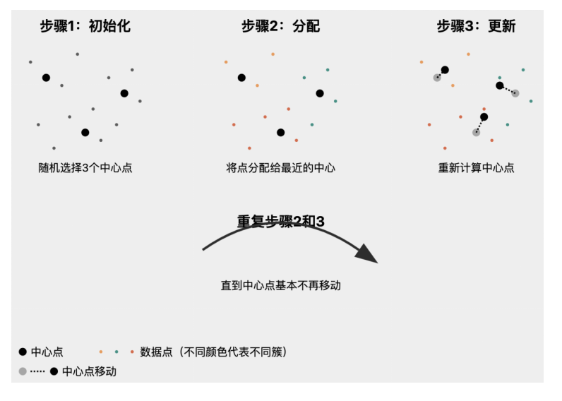

# 机器学习

!!! note "监督学习与无监督学习"

    - 监督学习(Supervised Learning)是一种通过**已标注的数据进行训练**的机器学习方法。模型在训练过程中学习输入数据与输出标签之间的映射关系，目标是能够对新数据进行准确预测。

    - 常见算法  

        1. 线性回归 (Linear Regression)  
        2. 逻辑回归 (Logistic Regression)  
        3. 支持向量机 (Support Vector Machine, SVM)  
        4. 决策树 (Decision Tree)  
        5. 随机森林 (Random Forest)  
        6. 神经网络 (Neural Networks)  

    ----

    - 无监督学习(Unsupervised Learning)是一种通过未标注的数据进行训练的机器学习方法。模型在训练过程中寻找数据的内在结构和模式，目标是发现数据的潜在分布和聚类。

    - 常见算法

        1. K均值聚类 (K-Means Clustering)  
        1. 层次聚类 (Hierarchical Clustering)  
        1. 主成分分析 (Principal Component Analysis, PCA)  
        1. 独立成分分析 (Independent Component Analysis, ICA)  
        1. 自组织映射 (Self-Organizing Maps, SOM)  
        1. 高斯混合模型 (Gaussian Mixture Model, GMM)  

-----

## 监督学习

- **带标签**的数据集，学习目标是**预测输出或者分类**

- 例如：图像分类，手写数字识别，房价预测，情感分析


----

## 无监督学习

- 无监督学习，旨在从**没有标签的数据**中识别**潜在的模式或结构**。

- 例如：异常检测，顾客分群

----

### 聚类


!!! info
    - 聚类和降维是机器学习中的两种重要技术，主要用于**数据预处理和探索性数据分析**。

- 聚类是一种无监督学习方法，其目标是将数据集中的样本分成若干个组（簇），使得**同一簇内的样本相似度较高**，而**不同簇**之间的样本**相似度较低**。

    - K-means：将数据集分成 K 个簇，最小化簇内样本到簇中心的距离平方和。  
    - 层次聚类：通过构建层次树状结构来进行聚类，可以是自底向上（凝聚层次聚类）或自顶向下（分裂层次聚类）。  
    - DBSCAN：基于密度的聚类方法，能够发现任意形状的簇，并能处理噪声数据。  


!!! tip "K-means"
    1. 随机初始化若干个中心点，周围散布着未分类的数据点  
    2. 将每个数据点分配给最近的中心，形成初步的簇  
    3. 重新计算每个簇的中心点  
    4. 重复步骤2和3直至中心点基本不再移动

    


??? tip "聚类案例--鸢尾花分析"
    ```py
    from sklearn.cluster import KMeans
    from sklearn import datasets
    from sklearn.preprocessing import StandardScaler
    import numpy as np
    import matplotlib.pyplot as plt

    iris = datasets.load_iris()
    X = iris.data
    y = iris.target

    scaler = StandardScaler()
    X_scaled = scaler.fit_transform(X)

    kmeans = KMeans(n_cluster=3, random_state=42)
    kmeans.fit(X_scaled)

    y_kmeans = kmeans.predict(X_scaled)

    plt.figure(figsize=(12,5))
    plt.subplot(121)
    plt.scatter(X[:,0],X[:,1],c=y,cmap='viridis')

    plt.subplot(122)
    plt.scatter(X[:,0],X[:,1],c=y_kmeans,cmap='viridis')
    plt.scatter(kmeans.cluster_centers_[:,0],kmeans.cluster_centers_[:,1],color='red',makrker="*",s=300,label="聚类中心")

    ```


---

### 降维


---

## 强化学习

- 强化学习（Reinforcement Learning, RL）是一种机器学习方法，通过与环境的交互来学习如何采取行动，以最大化累积的奖励。与监督学习和无监督学习不同，强化学习不依赖于预先标注的数据，而是通过**试错和反馈**来进行学习。


- 不同传统监督学习的**静态数据集**进行训练；强化学习是一个人**动态的、持续**的学习过程，这种交互性可以使得强化学习能够适应变化的环境，并在实时情况下做出决策。


