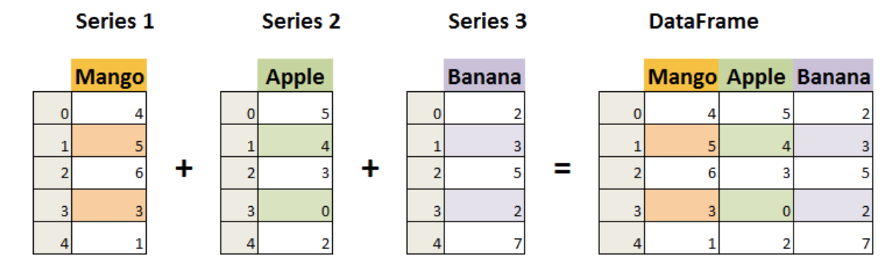

# 常用库

## Pandas

- Pandas 应用  
    - Pandas 可以从各种文件格式比如 CSV、JSON、SQL、Microsoft Excel 导入数据。

    - Pandas 可以对各种数据进行运算操作，比如归并、再成形、选择，还有数据清洗和数据加工特征。

    - Pandas 广泛应用在学术、金融、统计学等各个数据分析领域。

- 数据结构  
    - Pandas 的主要数据结构是 Series （一维数据）与 DataFrame（二维数据）。    
    - Series 是一种类似于一维数组的对象，它由一组数据（各种 Numpy 数据类型）以及一组与之相关的数据标签（即索引）组成。    
    - DataFrame 是一个表格型的数据结构，它含有一组有序的列，每列可以是不同的值类型（数值、字符串、布尔型值）。DataFrame 既有行索引也有列索引，它可以被看做由 Series 组成的字典（共同用一个索引）。  

### Series

- Series 特点：  
    - 一维数组：Series是**一维**的，这意味着它只有一个轴（或维度），类似于 Python 中的列表。

    - 索引： 每个 Series 都有一个索引，它可以是整数、字符串、日期等类型。如果不指定索引，Pandas 将默认创建一个从 0 开始的整数索引。

    - 数据类型： Series 可以容纳不同数据类型的元素，包括整数、浮点数、字符串、Python 对象等。

    - 大小不变性：Series 的大小在**创建后是不变的**，但可以通过某些操作（如 append 或 delete）来**改变**。

    - 操作：Series 支持各种操作，如**数学运算、统计分析、字符串处理**等。

    - 缺失数据：Series 可以包含缺失数据，Pandas 使用NaN（Not a Number）来表示缺失或无值。

#### 创建 Series

`pandas.Series(data=None, index=None, dtype=None, name=None, copy=False, fastpath=False)`

- data：Series 的**数据部分**，可以是列表、数组、字典、标量值等。如果不提供此参数，则创建一个空的 Series。  
- index：Series 的**索引部分**，用于对数据进行标记。可以是列表、数组、索引对象等。如果不提供此参数，则创建一个默认的整数索引。  
- dtype：指定 Series 的数据类型。可以是 **NumPy 的数据类型**，例如 np.int64、np.float64 等。如果不提供此参数，则根据数据自动推断数据类型。  
- name：Series 的名称，用于标识 Series 对象。如果提供了此参数，则创建的 Series 对象将具有指定的名称。  
- copy：是否复制数据。默认为 False，表示不复制数据。如果设置为 True，则复制输入的数据。  
- fastpath：是否启用快速路径。默认为 False。启用快速路径可能会在某些情况下提高性能。  

!!! note "简单的实例"
    === "单独data"
        ```python
        import pandas as pd
        a = [1, 2, 3]
        myvar = pd.Series(a)
        print(myvar)
        ```

        0    1  
        1    2  
        2    3  
        dtype: int64  

    
    === "添加索引"
        ```python
        import pandas as pd
        a = ["Google", "Runoob", "Wiki"]
        myvar = pd.Series(a, index = ["x", "y", "z"])
        print(myvar)
        ```

        x    Google  
        y    Runoob  
        z      Wiki  
        dtype: object  


        - 此时查找时也就变成了 `myvar["x"]`  
        - 如果我们的元数据是一个字典，那么默认索引就是key
    
    === "名称参数"
        ```python
        import pandas as pd
        sites = {1: "Google", 2: "Runoob", 3: "Wiki"}
        myvar = pd.Series(sites, index = [1, 2], name="RUNOOB-Series-TEST" )
        print(myvar)
        ```

        1    Google  
        2    Runoob  
        Name: RUNOOB-Series-TEST, dtype: object


??? info "更多操作说明"
    ```python title="使用列表、字典或数组创建一个默认索引的 Series"
    # 使用列表创建 Series
    s = pd.Series([1, 2, 3, 4])

    # 使用 NumPy 数组创建 Series
    s = pd.Series(np.array([1, 2, 3, 4]))

    # 使用字典创建 Series
    s = pd.Series({'a': 1, 'b': 2, 'c': 3, 'd': 4})
    ```

    ```python title="基本操作"
    # 指定索引创建 Series
    s = pd.Series([1, 2, 3, 4], index=['a', 'b', 'c', 'd'])

    # 获取值
    value = s[2]  # 获取索引为2的值
    print(s['a'])  # 返回索引标签 'a' 对应的元素

    # 获取多个值
    subset = s[1:4]  # 获取索引为1到3的值

    # 使用自定义索引
    value = s['b']  # 获取索引为'b'的值

    # 索引和值的对应关系
    for index, value in s.items():
        print(f"Index: {index}, Value: {value}")


    # 使用切片语法来访问 Series 的一部分
    print(s['a':'c'])  # 返回索引标签 'a' 到 'c' 之间的元素
    print(s[:3])  # 返回前三个元素

    # 为特定的索引标签赋值
    s['a'] = 10  # 将索引标签 'a' 对应的元素修改为 10

    # 通过赋值给新的索引标签来添加元素
    s['e'] = 5  # 在 Series 中添加一个新的元素，索引标签为 'e'

    # 使用 del 删除指定索引标签的元素。
    del s['a']  # 删除索引标签 'a' 对应的元素

    # 使用 drop 方法删除一个或多个索引标签，并返回一个新的 Series。
    s_dropped = s.drop(['b'])  # 返回一个删除了索引标签 'b' 的新 Series
    ```

    ```python title="基本运算"
    # 算术运算
    result = series * 2  # 所有元素乘以2

    # 过滤
    filtered_series = series[series > 2]  # 选择大于2的元素

    # 数学函数
    import numpy as np
    result = np.sqrt(series)  # 对每个元素取平方根

    print(s.sum())  # 输出 Series 的总和
    print(s.mean())  # 输出 Series 的平均值
    print(s.max())  # 输出 Series 的最大值
    print(s.min())  # 输出 Series 的最小值
    print(s.std())  # 输出 Series 的标准差
    ```

    ```python title="属性和方法"
    # 获取索引
    index = s.index

    # 获取值数组
    values = s.values

    # 获取描述统计信息
    stats = s.describe()

    # 获取最大值和最小值的索引
    max_index = s.idxmax()
    min_index = s.idxmin()

    # 其他属性和方法
    print(s.dtype)   # 数据类型
    print(s.shape)   # 形状
    print(s.size)    # 元素个数
    print(s.head())  # 前几个元素，默认是前 5 个
    print(s.tail())  # 后几个元素，默认是后 5 个
    print(s.sum())   # 求和
    print(s.mean())  # 平均值
    print(s.std())   # 标准差
    print(s.min())   # 最小值
    print(s.max())   # 最大值

    ```

-------

### DataFrame

- DataFrame 特点   

    - 二维结构： DataFrame 是一个二维表格，可以被看作是一个 Excel 电子表格或 SQL 表，具有行和列。可以将其视为多个 Series 对象组成的字典。
    
    - 列的数据类型： 不同的列可以包含不同的数据类型，例如整数、浮点数、字符串或 Python 对象等。
    
    - 索引：DataFrame 可以拥有行索引和列索引，类似于 Excel 中的行号和列标。
    
    - 大小可变：可以添加和删除列，类似于 Python 中的字典。
    
    - 自动对齐：在进行算术运算或数据对齐操作时，DataFrame 会自动对齐索引。
    
    - 处理缺失数据：DataFrame 可以包含缺失数据，Pandas 使用 NaN（Not a Number）来表示。
    
    - 数据操作：支持数据切片、索引、子集分割等操作。
    
    - 时间序列支持：DataFrame 对时间序列数据有特别的支持，可以轻松地进行时间数据的切片、索引和操作。
    
    - 丰富的数据访问功能：通过 .loc、.iloc 和 .query() 方法，可以灵活地访问和筛选数据。
    
    - 灵活的数据处理功能：包括数据合并、重塑、透视、分组和聚合等。
    
    - 数据可视化：虽然 DataFrame 本身不是可视化工具，但它可以与 Matplotlib 或 Seaborn 等可视化库结合使用，进行数据可视化。
    
    - 高效的数据输入输出：可以方便地读取和写入数据，支持多种格式，如 CSV、Excel、SQL 数据库和 HDF5 格式。
    
    - 描述性统计：提供了一系列方法来计算描述性统计数据，如 .describe()、.mean()、.sum() 等。
    
    - 灵活的数据对齐和集成：可以轻松地与其他 DataFrame 或 Series 对象进行合并、连接或更新操作。
    
    - 转换功能：可以对数据集中的值进行转换，例如使用 .apply() 方法应用自定义函数。

    - 滚动窗口和时间序列分析：支持对数据集进行滚动窗口统计和时间序列分析。



------

`pandas.DataFrame(data=None, index=None, columns=None, dtype=None, copy=False)
`

- data：DataFrame 的数据部分，可以是字典、二维数组、Series、DataFrame 或其他可转换为 DataFrame 的对象。如果不提供此参数，则创建一个空的 DataFrame。
- index：DataFrame 的行索引，用于标识每行数据。可以是列表、数组、索引对象等。如果不提供此参数，则创建一个默认的整数索引。
- columns：DataFrame 的列索引，用于标识每列数据。可以是列表、数组、索引对象等。如果不提供此参数，则创建一个默认的整数索引。
- dtype：指定 DataFrame 的数据类型。可以是 NumPy 的数据类型，例如 np.int64、np.float64 等。如果不提供此参数，则根据数据自动推断数据类型。
- copy：是否复制数据。默认为 False，表示不复制数据。如果设置为 True，则复制输入的数据。

#### 创建

```python title="使用列表创建"
import pandas as pd

data = [['Google', 10], ['Runoob', 12], ['Wiki', 13]]

# 创建DataFrame
df = pd.DataFrame(data, columns=['Site', 'Age'])

# 使用astype方法设置每列的数据类型
df['Site'] = df['Site'].astype(str)
df['Age'] = df['Age'].astype(float)

print(df)
```


```python title="使用字典创建"
import pandas as pd

data = {'Site':['Google', 'Runoob', 'Wiki'], 'Age':[10, 12, 13]}

df = pd.DataFrame(data)

print (df)

```


```python title="使用 ndarrays 创建"

import numpy as np
import pandas as pd

# 创建一个包含网站和年龄的二维ndarray
ndarray_data = np.array([
    ['Google', 10],
    ['Runoob', 12],
    ['Wiki', 13]
])

# 使用DataFrame构造函数创建数据帧
df = pd.DataFrame(ndarray_data, columns=['Site', 'Age'])

# 打印数据帧
print(df)

```


### 常用函数

#### 读取数据

|函数|说明|
|---|---|
|pd.read_csv(filename)|	读取 CSV 文件；|
|pd.read_excel(filename)|	读取 Excel 文件；|
|pd.read_sql(query, connection_object)|	从 SQL 数据库读取数据；|
|pd.read_json(json_string)	|从 JSON 字符串中读取数据；|
|pd.read_html(url)|	从 HTML 页面中读取数据。|

```python
import pandas as pd

# 从 CSV 文件中读取数据
df = pd.read_csv('data.csv')

# 从 Excel 文件中读取数据
df = pd.read_excel('data.xlsx')

# 从 SQL 数据库中读取数据
import sqlite3
conn = sqlite3.connect('database.db')
df = pd.read_sql('SELECT * FROM table_name', conn)

# 从 JSON 字符串中读取数据
json_string = '{"name": "John", "age": 30, "city": "New York"}'
df = pd.read_json(json_string)

# 从 HTML 页面中读取数据
url = 'https://www.runoob.com'
dfs = pd.read_html(url)
df = dfs[0] # 选择第一个数据框

```


#### 查看数据

|函数|说明|
|---|----|
|df.head(n)	|显示前 n 行数据；|
|df.tail(n)	|显示后 n 行数据；|
|df.info()	|显示数据的信息，包括列名、数据类型、缺失值等；|
|df.describe()|	显示数据的基本统计信息，包括均值、方差、最大值、最小值等；|
|df.shape|	显示数据的行数和列数。|

#### 数据清洗

|函数|说明|
|---|----|
|df.dropna()|	删除包含缺失值的行或列；|
|df.fillna(value)|	将缺失值替换为指定的值；|
|df.replace(old_value, new_value)|	将指定值替换为新值；|
|df.duplicated()|	检查是否有重复的数据；|
|df.drop_duplicates()|	删除重复的数据。|

#### 数据选择和切片

|函数|说明|
|---|----|
|df[column_name]	|选择指定的列；|
|df.loc[row_index, column_name]	|通过标签选择数据；|
|df.iloc[row_index, column_index]	|通过位置选择数据；|
|df.ix[row_index, column_name]|	通过标签或位置选择数据；|
|df.filter(items=[column_name1, column_name2])|	选择指定的列；|
|df.filter(regex='regex')	|选择列名匹配正则表达式的列；|
|df.sample(n)	|随机选择 n 行数据。|

#### 数据排列

|函数|说明|
|---|----|
|df.sort_values(column_name)	|按照指定列的值排序；|
|df.sort_values([column_name1, column_name2], ascending=[True, False])	|按照多个列的值排序；|
|df.sort_index()|	按照索引排序。|

#### 数据统计和描述

|函数|说明|
|---|----|
|df.describe()|	计算基本统计信息，如均值、标准差、最小值、最大值等。|
|df.mean()	|计算每列的平均值。|
|df.median()|	计算每列的中位数。|
|df.mode()	|计算每列的众数。|
|df.count()	|计算每列非缺失值的数量。|

#### 实例

??? note "筛选、排序、统计量的简单应用"
    ``` python title="题干"
    import pandas as pd
    data = {
        '产品': ['手机', '笔记本', '平板', '耳机', '智能手表', 
            '相机', '电视', '音响', '打印机', '路由器'],
        '销售量': [150, 80, 90, 200, 120, 
                60, 50, 130, 70, 40],
        '价格(元)': [3000, 6000, 2000, 800, 1500, 
                    5000, 4000, 1500, 1000, 600],
        '销售日期': pd.date_range(start='2023-01-01', periods=10, freq='D')
    }
    df = pd.DataFrame(data)
    print(df)
    ```
    
    - 筛选出销售量大于100的产品  
        - `filtered_df = df[df['销售量'] > 100]`    
        - 布尔索引：`df['销售量'] > 100` 生成一个布尔Series，表示每行的销售量是否大于100。  
        - 过滤DataFrame：df[df['销售量'] > 100] 使用布尔Series来过滤DataFrame，只保留满足条件的行。  

    - 按销售量从大到小排序  
        - `sorted_df = df.sort_values(by='销售量', ascending=False)`  
        - `by='销售量'` 指定按哪一列排序。  
        - `ascending=False` 指定降序排序（从大到小）。  

    - 计算所有产品的平均销售量    
        - `average_sales = df['销售量'].mean()`  
        - `df['销售量'].mean()` 方法计算 销售量 列的平均值  

    - 计算每种产品的总销售额，并添加总销售额为新列   
        - `df['总销售额(元)'] = df['销售量'] * df['价格(元)']`    
        - `df['销售量'] * df['价格(元)']` 计算每种产品的总销售额   
        - `df['总销售额(元)'] = ...` 将计算结果添加为新列   


## NumPy

### Ndarray 对象

- NumPy 最重要的一个特点是其 **N 维数组对象 ndarray**，它是一系列同类型数据的集合，以 0 下标为开始进行集合中元素的索引。

- ndarray 对象是用于存放**同类型元素**的多维数组。

- ndarray 中的每个元素在内存中都有**相同存储大小**的区域。

- ndarray 内部由以下内容组成：

    1. 数据指针：

        - 一个指向实际数据（存储在内存或内存映射文件中的一块数据）的指针。

    2. 数据类型（dtype）：

        - 描述数组中每个元素的数据类型。`dtype` 定义了数组中元素的类型和大小，例如整数、浮点数等。
    
    3. 数组形状（shape）：

        - 一个表示数组形状的元组，表示各维度大小的元组。例如，一个形状为 `(3, 4)` 的数组表示一个 **3 行 4 列**的二维数组。
    
    4. 跨度（stride）：

        - 一个跨度元组，其中的整数指的是为了前进到当前维度下一个元素需要“跨过”的字节数。跨度用于计算数组中元素的内存地址。

    ```python
    import numpy as np

    # 创建一个 2x3 的 ndarray
    arr = np.array([[1, 2, 3], [4, 5, 6]])

    # 查看数据指针
    print("数据指针:", arr.data)

    # 查看数据类型
    print("数据类型:", arr.dtype)

    # 查看数组形状
    print("数组形状:", arr.shape)

    # 查看跨度
    print("跨度:", arr.strides)

    数据指针: <memory at 0x7f8c8c0b0b80>
    数据类型: int64
    数组形状: (2, 3)
    跨度: (24, 8)
    ```

-----

`numpy.array(object, dtype = None, copy = True, order = None, subok = False, ndmin = 0)`

|名称|描述|
|----|----|
|object	|数组或嵌套的数列|
|dtype	|数组元素的数据类型，可选|
|copy	|对象是否需要复制，可选|
|order	|创建数组的样式，C为行方向，F为列方向，A为任意方向（默认）|
|subok	|默认返回一个与基类类型一致的数组|
|ndmin	|指定生成数组的最小维度|

??? note "实例"
    ```python title="多于一个维度"
    # 多于一个维度  
    import numpy as np 
    a = np.array([[1,  2],  [3,  4]])  
    print (a)

    [[1  2] 
    [3  4]]
    ```

    ```python title="最小维度的设置"
    # 最小维度  
    import numpy as np 
    a = np.array([1, 2, 3, 4, 5], ndmin =  2)  
    print (a)

    [[1 2 3 4 5]]
    ```

----


### 数据类型
- 下表列举了常用 NumPy 基本类型。

|名称|描述|
|---|---|
|bool_	|布尔型数据类型（True 或者 False）|
|int_	|默认的整数类型（类似于 C 语言中的 long，int32 或 int64）|
|intc	|与 C 的 int 类型一样，一般是 int32 或 int 64|
|intp	|用于索引的整数类型（类似于 C 的 ssize_t，一般情况下仍然是 int32 或 int64）|
|int8	|字节（-128 to 127）|
|int16	|整数（-32768 to 32767）|
|int32	|整数（-2147483648 to 2147483647）|
|int64	|整数（-9223372036854775808 to 9223372036854775807）|
|uint8|	无符号整数（0 to 255）|
|uint16|	无符号整数（0 to 65535）|
|uint32|	无符号整数（0 to 4294967295）|
|uint64|	无符号整数（0 to 18446744073709551615）|
|float_	|float64 类型的简写|
|float16|	半精度浮点数，包括：1 个符号位，5 个指数位，10 个尾数位|
|float32|	单精度浮点数，包括：1 个符号位，8 个指数位，23 个尾数位|
|float64	|双精度浮点数，包括：1 个符号位，11 个指数位，52 个尾数位|
|complex_	|complex128 类型的简写，即 128 位复数|
|complex64	|复数，表示双 32 位浮点数（实数部分和虚数部分）|
|complex128	|复数，表示双 64 位浮点数（实数部分和虚数部分）|

- 每个内建类型都有一个唯一定义它的字符代码，如下：

|字符|对应类型|
|---|------|
|b	|布尔型|
|i	|(有符号) 整型|
|u	|无符号整型 integer|
|f	|浮点型|
|c	|复数浮点型|
|m	|timedelta（时间间隔）|
|M	|datetime（日期时间）|
|O	|(Python) 对象|
|S, a|	(byte-)字符串|
|U	|Unicode|
|V	|原始数据 (void)|


#### 数据类型对象 (dtype)

`numpy.dtype(object, align, copy)`

- object : 要转换为的数据类型对象  
- align : 如果为 true，填充字段使其类似 C 的结构体。  
- copy : 复制 dtype 对象 ，如果为 false，则是对内置数据类型对象的引用  

```python
# 首先创建结构化数据类型
import numpy as np
dt = np.dtype([('age',np.int8)]) 
print(dt)

输出结果为:
[('age', 'i1')]

# 将数据类型应用于 ndarray 对象
import numpy as np
dt = np.dtype([('age',np.int8)]) 
a = np.array([(10,),(20,),(30,)], dtype = dt) 
print(a)

输出结果为:
[(10,) (20,) (30,)]

# 类型字段名可以用于存取实际的 age 列
import numpy as np
dt = np.dtype([('age',np.int8)]) 
a = np.array([(10,),(20,),(30,)], dtype = dt) 
print(a['age'])

输出结果为：
[10 20 30]

```

------


- 下面的示例定义一个结构化数据类型 student，包含字符串字段 name，整数字段 age，及浮点字段 marks，并将这个 dtype 应用到 ndarray 对象。
```python
import numpy as np
student = np.dtype([('name','S20'), ('age', 'i1'), ('marks', 'f4')]) 
print(student)

输出结果为：
[('name', 'S20'), ('age', 'i1'), ('marks', 'f4')]

import numpy as np
student = np.dtype([('name','S20'), ('age', 'i1'), ('marks', 'f4')]) 
a = np.array([('abc', 21, 50),('xyz', 18, 75)], dtype = student) 
print(a)

输出结果为：
[('abc', 21, 50.0), ('xyz', 18, 75.0)]

```


### 排序、条件筛选函数

=== "numpy.sort()"
    `numpy.sort(a, axis, kind, order)`
      
    - a: 要排序的数组  
    - axis: 沿着它排序数组的轴，如果没有数组会被展开，沿着最后的轴排序， axis=0 按列排序，axis=1 按行排序  
    - kind: 默认为'quicksort'（快速排序）    
    - order: 如果数组包含字段，则是要排序的字段  


