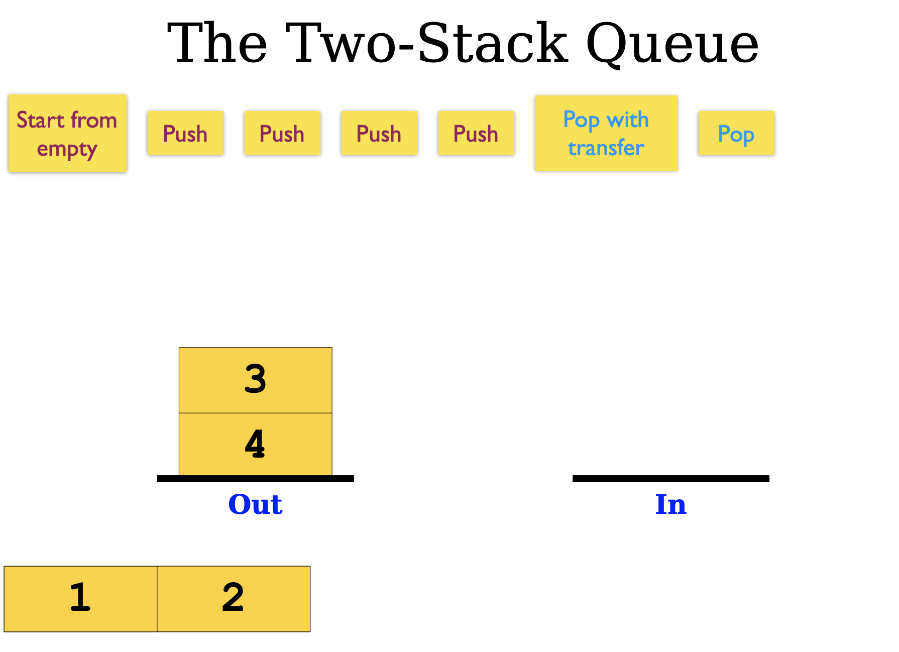
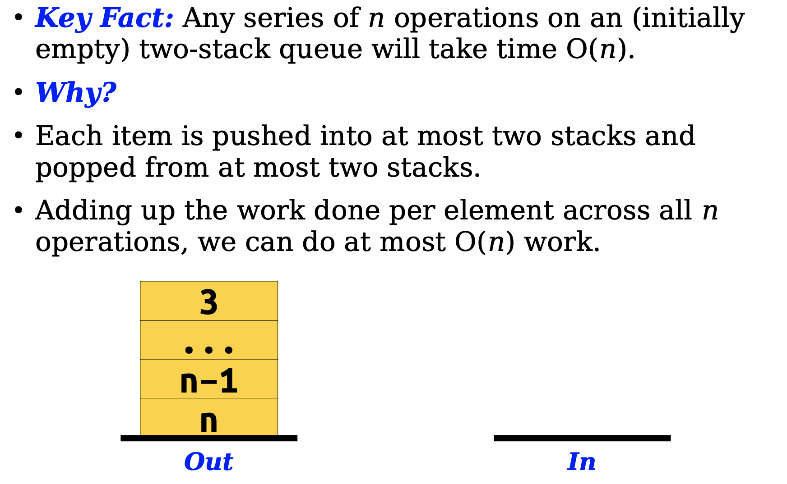
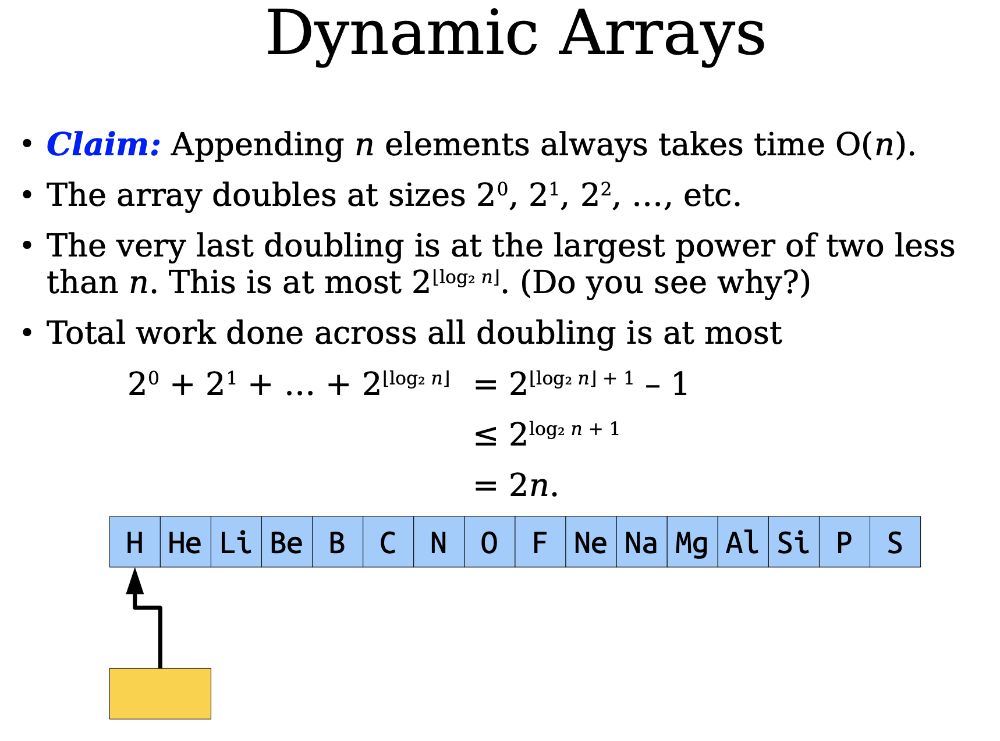

## Amortized analysis

- 研究连续的M个操作，总的复杂度不错但是单看一次操作就有好有坏  
- 从空的数据结构开始  

### Aggregate Method

=== "Example-Two Stack Queue"
    - 对于一个初始空白的两个栈，每个元素只会经历push、transfer、pop三个操作  
    - 那么一系列的n个操作，复杂度就会是$O(n)$，那么摊还复杂度就是$O(1)$  
    
    

=== "Example-Dynamic Arrays"
    - 有那么一个数组，每当数组填满，就**扩容一倍**  
    - 那么共有两个操作，一个是插入、另一个是扩容  
    

=== "Example-Stack with Multipop"
    - 新增一个操作`Multipop`，连续`pop` K个元素或者清空栈  
    - 这个操作是$O(n)$的，看似n个连续的操作（包括`push`、`pop`、`Multipop`）复杂度是$O(n^2)$  
    - 但实际上，由于这个数据结构的局限，`pop`的操作不会多于`push`  
    - 那么实际上总的复杂度还是$O(n)$，摊还复杂度还是**常数**  

-----

### Accounting Method

> For this method, we think about amortized cost as being a “charge” that we assign to each operation.  
> Each time we encounter an operation, we try to pay for it using this “charge”.  
> If the operation actually costs less than our “charge”, we stash the change in a bank account. If the operation actually costs more than our “charge”, we can dip into our bank account to cover the cost.  
> The idea is that we want to save enough money during our “cheaper” operations to pay for any “expensive” operations we might encounter later on.  

- 对于此方法，我们将**摊销cost**视为分配给每个操作的 “费用”。  
- 每次我们进行一次操作时，都视作在进行付费  
- 如果这次操作的实际cost比摊还cost小，那么我们就把多余的钱**存起来**；如果实际cost大于摊还cost，那么我们就可以用**存款**来额外支付  
- 这样子，代价大的操作就会匀到代价小的操作上，最后呈现出**摊还**  

### Potential Method

- 势能分析是一种非常重要的复杂度分析方法，它和其他的一些分析方法可以认为是本质相同的。尤其是面对一些简单问题的时候，我们可能会感觉它们没什么差别。但是当遇到复杂的情形的时候，累加法、借款贷款法就不是那么方便和直观了。它可以帮我们理性分析一些经常被感性理解的复杂度，或者是帮我们证明一些算法即便在某些情况下很耗时但是均摊上依然很优秀。

- 现在我们有一种操作$P$，它第$i$步的消耗（这里的消耗是广义的消耗，可以是空间、时间等）我们记为$a(i)$。假设这个操作进行了$n$步，那么最终的消耗将会是：$\sum_1^na(i)$。现在我们考虑一个**势能函数**$\phi(S_i)$，这里$S_i$表示的是第$i$步后整个局面的状态。所以我们的势能函数是针对“局面”或者说状态的，**和具体的操作没关系只和操作之后的状态有关**，这也是它被称为势能函数的原因：势能是保守力对应的能量，它和作用路径无关只和状态有关。

- 现在我们考虑这样一件事：如果$\phi(S_n) \ge \phi(S_0)$那么我们有$\sum_1^na(i) + \phi(S_n) - \phi(S_0)\ge\sum_1^na(i)$。这说明如果我们用$\sum_1^na(i) + \phi(S_n) - \phi(S_0)$这个式子来代替真正的计算次数$\sum_1^na(i)$只会让算出来的数字变得更大，所以用来求上界是非常合适的，**前者的上界必然是后者的上界**。  
- 而我们显然有：$\phi(S_n) - \phi(S_0) = \sum_1^n\phi(S_i)-\phi(S_{i-1})$，进而有：  

$$
\sum_1^n\Big(a(i)\Big) + \phi(S_n) - \phi(S_0) = \sum_1^n\Big(a(i)+\phi(S_i)-\phi(S_{i-1})\Big)
$$

- 于是我们得到了势能分析的关键式子：我们把每一步的代价看成是：$a(i)+\phi(S_i)-\phi(S_{i-1})$。

!!! note "为什么这么做？这么做为什么对？"
    - 想要理解势能的意义，我们只需要一个口诀即可：**让消耗大的那一步操作势能大大的降！**这个口诀可以帮助我们理解势能的意义。  
    - 我们把每一步的代码看成了：**原本的代价+势能的变化**。所以如果原本的代价很大我们让势能大下降，这样就把原本的代价**抵消**了，也就是所谓的摊还。  
    - 当然这样做当然不是无止境的，不能每一步都让势能下降，毕竟最终我们要求**终点的势能是要大于起点的势能**的。所以到时候让**代价小**的操作的**势能上升**就可以实现把代价大的操作的代价**摊到**代价小的操作上了。  
    - 那么这样的正确性是很显然的啦，我们不要去想每一步亏了多少赚了多少，我们只需要知道我们最开始的那个式子：**最终势能相较于一开始是上升的，所以我们这样做只会让总体的代价变大，对于分析上界不会带来问题。**

