## AVL Trees

!!! info "height-balanced"
    - 这是一个递归定义  
    - 一个空的树是height-balanced
    - 一个非空的树，并且有左右子树$T_L$,$T_R$，那么满足height-balanced当且仅当
        - $T_L$,$T_R$是height-balanced
        - $|h_R-h_L| <= 1$，左右子树的高度差小于等于1

!!! info "balance factor"
    - *BF*(node) = $h_L-h_R$
    - 在AVL树中，节点的BF为**-1,0,1**


### Rotation

- 四种rotation（实际就是对称的两种）

=== "RR"
    - 问题的造成者（新插入的节点），位于问题发现者（**BF异常**的节点）的**右子树的右子树**  
    - 让**trouble finder**的右子树作为**前者的根节点**，前者顺位到左子树  
    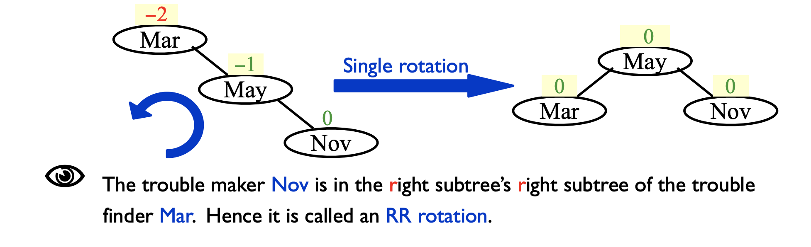
    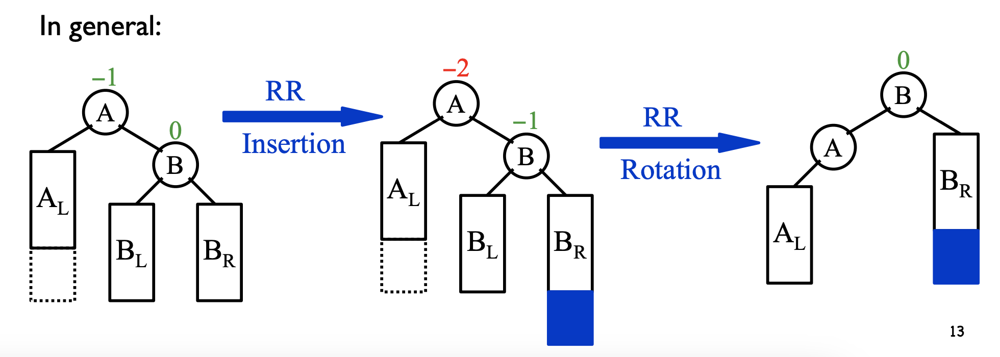

=== "LL"
    - 问题的造成者（新插入的节点），位于问题发现者（**BF异常**的节点）的**左子树的左子树**  
    - 让**trouble finder**的左子树作为**前者的根节点**，前者顺位到右子树  
    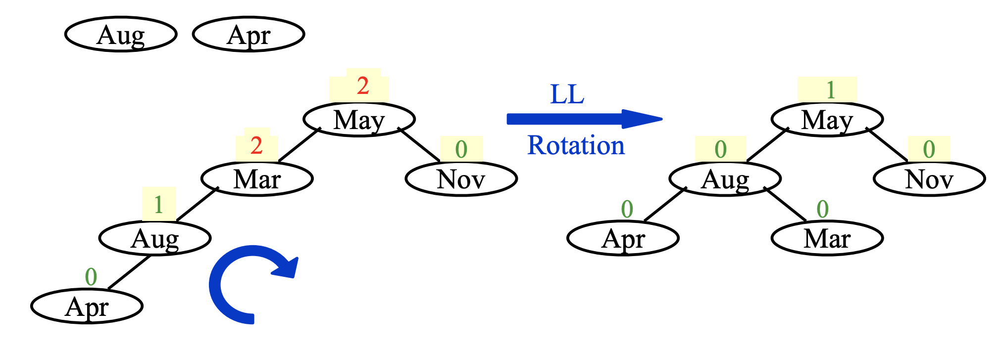
    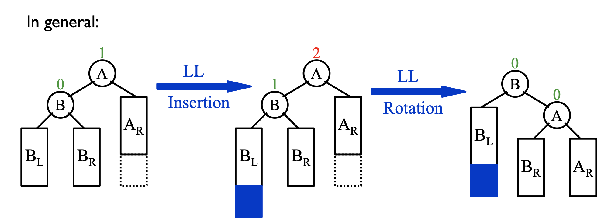


=== "LR"
    - 问题的造成者（新插入的节点），位于问题发现者（**BF异常**的节点）的**左子树的右子树**  
    - 让新插入的节点**左旋一下右旋一下**  
    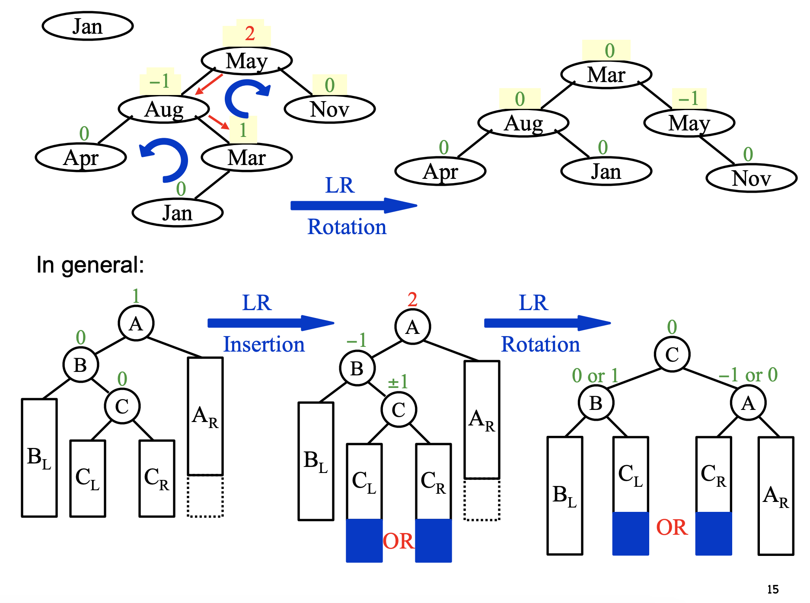

=== "RL"
    - 问题的造成者（新插入的节点），位于问题发现者（**BF异常**的节点）的**右子树的左子树**    
    - 让新插入的节点**右旋一下左旋一下**  
    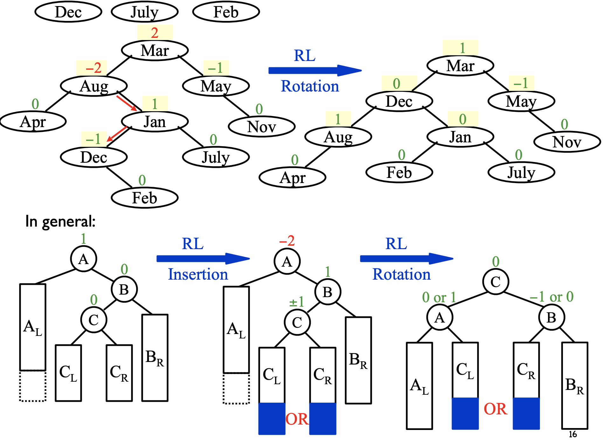

-------------

### Analysis

!!! note "最坏的情况"
    - 最坏的情况其实就是左右子树的**高度相差1**  
    - 那么显然有一个递推公式 $n_h = n_{h-1}+n_{h-2}+1$  
    - 最后得出通项式，可以证明 h = O(lnn)
    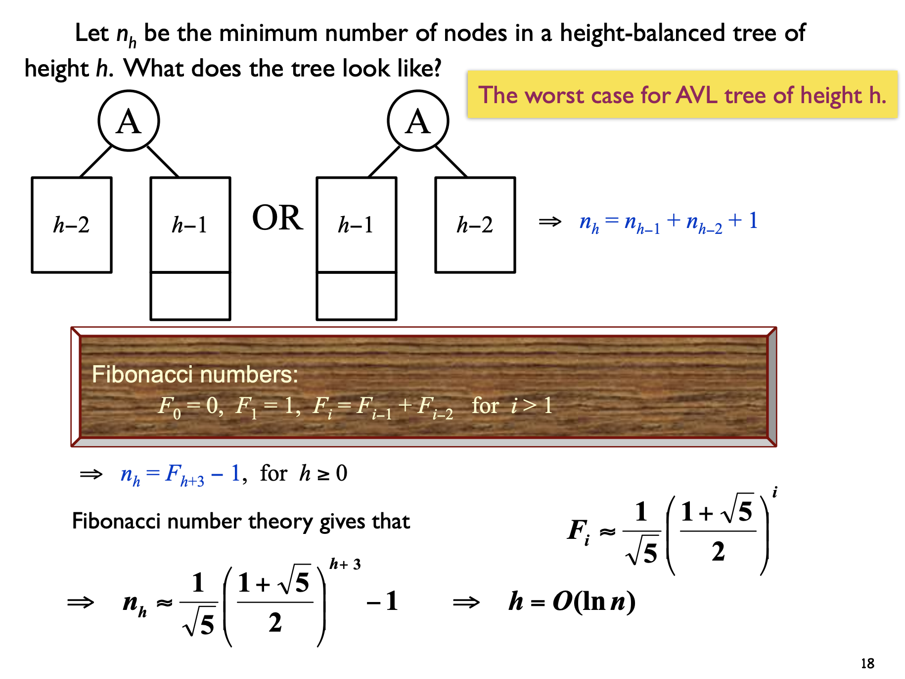    

### Implementation

- 引入`Height`来时刻表示每个节点的高度情况，便于维持Height-balanced  
- 定义`Height`函数，来确保空节点时的高度情况
- `Insert`函数是一个递归函数，会不断二分搜索到合适的位置，同时不断**更新**每个节点的`Height`


=== "节点声明"
    ```c
    struct AvlNode;
    typedef struct AvlNode *Position;
    typedef struct AvlNode *AvlTree;

    int Height(AvlTree T);
    Position Find(ElementType X, AvlTree T);
    Position FindMax(AvlTree T);
    AvlTree Insert(ElementType X, AvlTree T);
    AvlTree Delete(ElementType X, AvlTree T);

    struct AvlNode{
        ElementType Element;
        AvlTree Left;
        AvlTree Right;
        int Height;
    };
    ```

=== "Height"
    ```c
    int Height(AvlTree){
        if (T == NULL)
            return -1
        else
            return T->Height;
    }

    ```


=== "Insert"
    ```c
    AvlTree Insert(ElementType X, AvlTree T){
        if (T == NULL){
            T = (AvlTree)malloc(sizeof(struct AvlNode));
            T->Element = X;
            T->Left = T->Right = NULL;
            T->Height = 0;
        }
        else if(X < T->Element){
            T->Left = Insert(X, T->Left);
            if (Height(T->Left) - Height(T->Right) == 2){
                if (X < T->Left->Elment)
                    T = LLrotation(T);
                else
                    T = LRrotation(T);
            }
        }
        else if(X > T->Element){
            T->Right = Insert(X, T->Right);
            if (Height(T->Right) - Height(T->Left) == 2){
                if (X > T->Right->Element)
                    T = RRrotation(T);
                else
                    T = RLrotation(T);
            }
        }
        T->Height = Max(Height(T->Left), Height(T->Right)) + 1;
        return T;
    }
    ```


=== "LLrotation"
    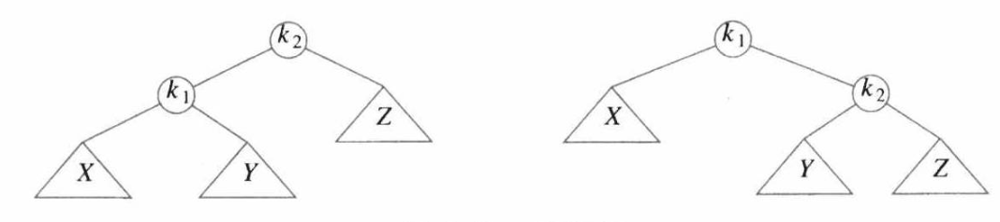
    ```c
    AvlTree LLrotation(AvlTree K2){
        Position K1;

        K1 = K2->Left;
        K2->Left = K1->Right;
        K1->Right = K2;

        K2->Height = Max(Height(K2->Left), Height(K2->Right)) + 1; // update Height
        K1->Height = Max(Height(K1->Left), Height(K1->Right)) + 1;
        return K1; // return the new root
    }

    ```


=== "LRrotation"
    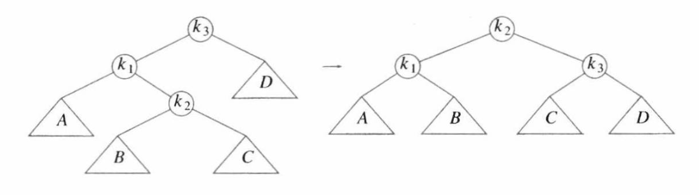
    ```c
    AvlTree LRrotation(AvlTree K3){
        K3->Left = RRrotation(K3->Left);
        
        return LLrotation(K3);
    }

    ```

---------


## Splay Trees 

- 伸展树：每次**访问的节点**都自动成为**根节点**  
- 同时旋转不再是一个一个地挪位，而是**尽量3个节点的整体**进行旋转  
- 记访问节点为$X$，它的父节点为$P$，祖父节点为$G$  
- 共有三种情况：  
    - P为根节点  
    - P不为根节点，GPX呈**zig-zag**  
    - P不为根节点，GPX呈**zig-zig**  

=== "zig(P为根节点)"
    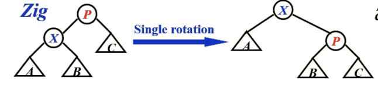
    - 直接调换X和P即可  
    - 正常的**SingleRotation**


=== "zig-zag"
    - 采用DoubleRotation  
    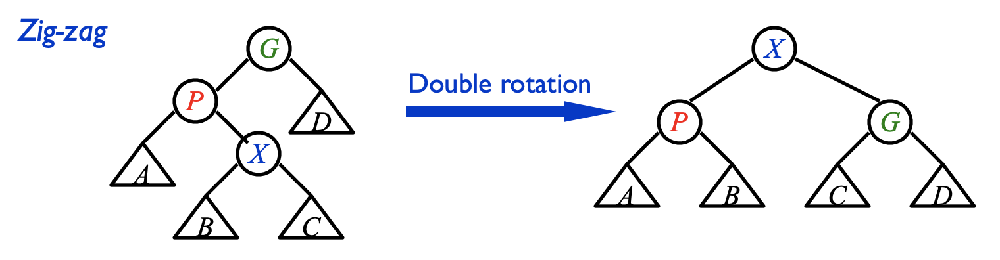


=== "zig-zig"
    - **DoubleRotation不行**：X的**右子树的位置**被往下压  
    - 把$GPX$看作整体，**X一步到root**：X右子树会上抬，同时把其他节点成为X的右子树  
    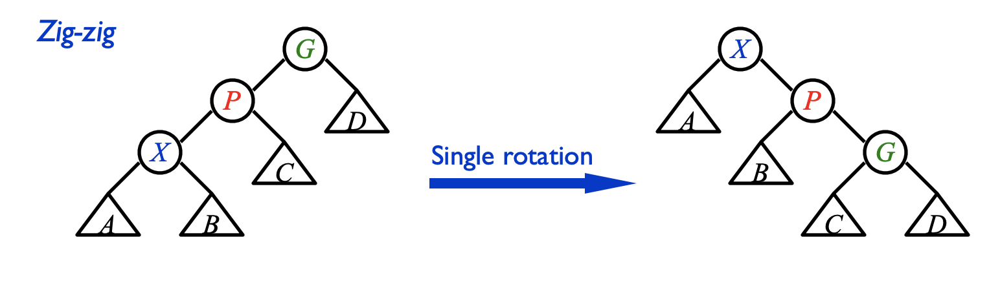

---------

!!! note "Example"
    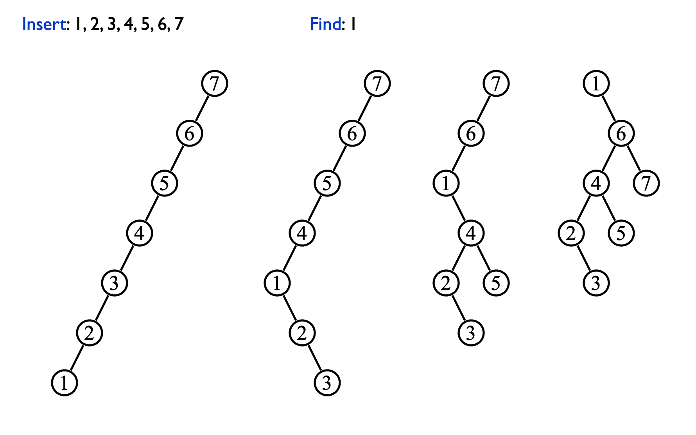


### 摊还分析

- 说实话过于巧妙，这里简要介绍思路

- 定义了一个势能函数$\Phi(T)=\Sigma \text{log}Size(des)=\Sigma Rank(des)$

- $Rank(des)$其实就是就是一颗树所有子节点的数量总和，再取对数

$$
\begin{align}
T_{\text{rotate x to root}} &= T_{\text{zig}} + \Sigma T_{\text{zig-zag}} + \Sigma T_{\text{zig-zig}} \\
\hat{c}_{\text{rotate x to root}} &= \hat{c}_{\text{zig}} + \Sigma \hat{c}_{\text{zig-zag}} + \Sigma \hat{c}_{\text{zig-zig}}
\end{align}
$$

- 然后一通巧妙的分析放缩

$$
\begin{align}
\hat{c}_{\text{zig}} &\leq 1 + Rank_i(X) - Rank_{i-1}(X) \\
\hat{c}_{\text{zig-zag}} &\leq 2 ( Rank_i(X) - Rank_{i-1}(X)) \\
\hat{c}_{\text{zig-zig}} &\leq 3 ( Rank_i(X) - Rank_{i-1}(X)) \\
\end{align}
$$

- 最终得到均摊上界

$$
\begin{align}
\hat{c}_{\text{rotate x to root}} &= \hat{c}_{\text{zig}} + \Sigma \hat{c}_{\text{zig-zag}} + \Sigma \hat{c}_{\text{zig-zig}}\\
&=O(1) + 3(Rank_i(X)-Rank_{i-1}(X))
&=O(\text{log}N)
\end{align}
$$