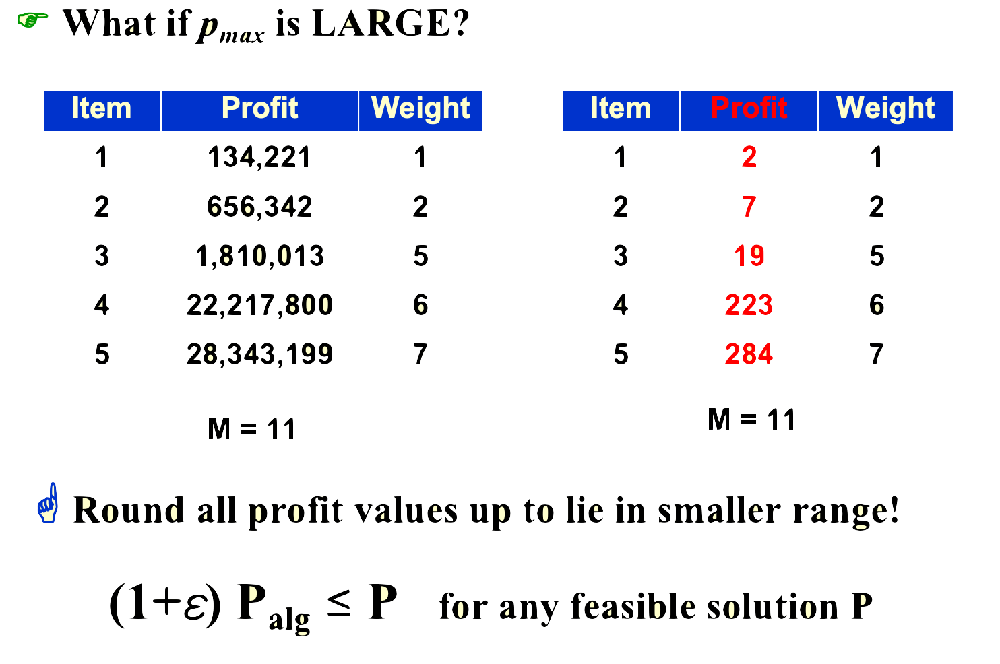
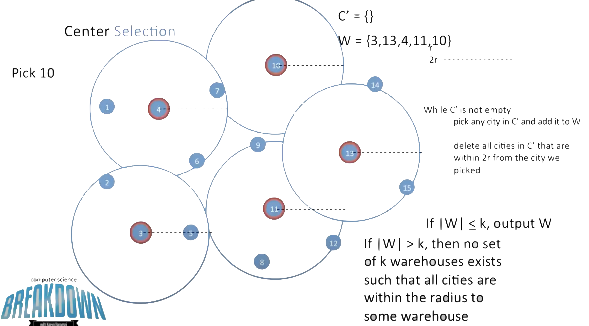
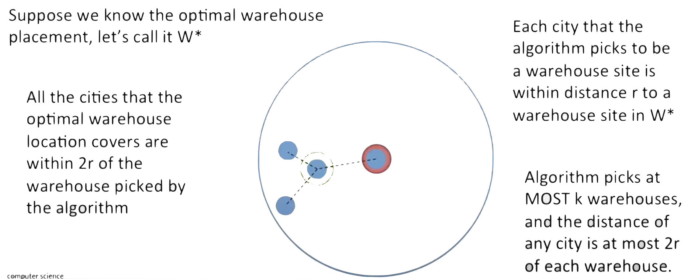

# Approximation

- 在上一章中我们介绍了 P/NP 问题，而大家普遍认为 P ≠ NP，这就意味着对于某些问题，我们无法使用多项式时间解决，而在问题规模变大时，越发不可接受。

- 因此，我们考虑能否退而求其次，在多项式时间内求一个比较优的解。更具体的来说，我们尝试寻找一种多项式算法，使得其结果始终在关于准确解的可接受偏差范围内，对于这种算法，我们称之为近似算法(**approximation algorithm**)。

## 近似算法

$$
\text{max}(\frac{C}{C^*},\frac{C^*}{C})\leq \rho(n)
$$

- $C^*$是最优解，$C$则是近似解

- 显然$\rho(n)$是一个>=1的数，当$\rho(n)$越接近1时说明近似的效果越好，同时直觉上来说$\rho(n)$应该是与$n$成正比的（即当问题规模越来越大时，近似的效果就会越来越差）

- 如果一个算法实现了$\rho(n)$的近似比，那么就把这个算法叫做**$\rho(n)$-approximation algorithm**

### 近似范式

- 如果一族相同模式的近似算法的近似比始终 <= (1+$\epsilon$)，那么我们就把这个算法叫做**$(1+\epsilon)$-approximation algorithm**

- 而此时，这一族的算法的复杂度可以表示为$O(f(n,\epsilon))$，如$O(n^{2/\epsilon})$,$O((\frac{1}{\epsilon})^2n^3)$。当$f(n,\epsilon)$关于$n$时**多项式**时，我们称其为**多项式时间近似范式(polynomial-time approximation scheme,PTAS)**；当$f(n,\epsilon)$关于$n,\epsilon$**都是多项式**时，我们称其为**完全多项式时间近似范式(fully polynomial-time approximation scheme, FPTAS)**。

## 例：Approximate Bin Packing

- 装箱问题：给定$N$个item，每个item的size都是$S_i\in (0,1]$，一个bin的大小恰为1，尝试寻找出能装所有item，bin的**最少个数**

!!! tip "Example"
    - $N=7, S_1=0.2,S_2=0.5,S_3=0.7,S_4=0.4,S_5=0.3,S_6=0.1,S_7=0.8$

    易观察出最优解为：

    - bin1 = 0.2+0.8

    - bin2 = 0.1+0.5+0.4

    - bin3 = 0.3+0.7

- 这个问题看似简单，实际上是一个**NPC**问题，于是我们引入三种近似算法。

### Next Fit

```c
void Next Fit(){
    read item1;
    while(read item2){
        if(item2 can be placed in the last bin)
            place(item2);
        else
            create a new bin;
        item1 = item2;
    }
}
```

- NF策略总是**选择当前最后一个bin**，如果能容纳，就把item放进去；否则就新开一个bin

- 时间复杂度：$T=O(N)$

- 这个近似算法总是使用不超过$2M-1$个bin，其中$M$是最优解的bin个数

??? tip "证明"
    - 现在我们假设这个近似算法一共用到了$2M-1$个bin，那么我们有一个易发现的性质就是**相邻的两个bin的item体积之和一定大于1**（不然怎么会有两个bin），即$S(B_i)+S(B_{i+1})>1$

    - 然后进行一个两两配对的求和，$B_1+B_2,B_3+B_4...$，就得到这些bin里的item的体积至少是$M$，也就是最优解就是$M$

### First Fit
```c
void First Fit(){
    while(read item){
        if(find a first bin to place item)
            place(item);
        else
            create a new bin;
    }
}
```

- FF策略对于每一个item，总是去所有bin里尝试找到**第一个可以fit的bin**；如果没有就新开bin

- 最优时间复杂度：$T(N)=O(N\text{log}N)$（直觉上是$O(N^2)$，但实际优化后可以来到$O(N\text{log}N)$）

- 这个近似算法使用不超过$\lfloor 1.7M\rfloor$个bin

### Best Fit

- BF策略就是在FF上改良一下，不是去无脑选择第一个能塞下的bin，而是去找到装的最**tightest**（剩的空间最小）的bin；如果没有则新开

- 时间复杂度：$T(N)=O(N\text{log}N)$

- 这个近似算法使用不超过$\lfloor 1.7M\rfloor$个bin

> 这个近似算法和上一个的近似比一样，难道说效果就一样吗？其实并不是，我们在研究近似比时都是在讨论worst case，但是很显然这个近似算法在average case下能比上一个算法更优

!!! abstract "theorem--on-line approximation"
    - 对于装箱问题来说，我们使用在线算法是无法找到一个近似比小于$\frac{5}{3}$（at least $\frac{5}{3}$）的算法的

---

### First Fit Decreasing

- FFD策略是一个离线算法，一个贪心的思路，我们先去处理large item，再去处理小的；

- 于是先将item按照size进行排序，然后使用FF/BF就行

??? tip "Example"
    给定 7 个 item（同之前的例子），经过排序后，它们的 size 分别为 $0.8, 0.7, 0.5, 0.4, 0.3, 0.2, 0.1$，则最少需要 3 个 bin（准确解）：

    - bin1: 0.8+0.2

    - bin2: 0.7+0.3

    - bin3:0.5+0.4+0.1

- FFD策略总是使用不超过$\frac{11}{9}M+\frac{6}{9}$个bin


## 引：在线算法和离线算法

### on-line

- 在线算法：每读取到一个数据，立刻就对它进行处理，并且之后不会更改这一操作(NOT CHANGE)

??? tip "Example"
    

    - 这就是在线算法比较“短视”的典例

### off-line

- 离线算法：看遍了所有的数据之后，再做出决定（“大局观”）


## 例：背包问题

- 一个与装箱问题很像的问题是背包问题。其大致描述如下：给定一个容量为$M$的背包，以及$N$个item，重量是$w_i$,利润是$p_i$。要求在不超过背包容量的前提下，使得背包中的利润最大化。

!!! warning
    - 或许在学习 dp 的时候已经接触过背包问题了，但是请注意，我们这里讨论的背包问题有一个非常重要的特点就是，容量和利润都是**实数**，更直白的来说，**没办法通过将容量或利润作为状态来 dp 求准确解**。

- 而根据每一个物品能否自由拆分，背包问题分为 fractional version 和 0-1 version 两类。

### Fractional Version

- 现在每个item都变得连续可分，我们可以取出一个item的partition $x_i\in[0,1]$，自然重量就是$\sum_i^N w_ix_i\leq M$，求利润$\sum_i^N p_ix_i$的最大值

??? tip "Example"
    假设现在$M=20.0,N=3$

    - item1:$w_1 = 18, p_1=25$
    
    - item2:$w_2 = 15, p_2=24$

    - item3:$w_3 = 10, p_3=15$

    则最优解为$x_1=0,x_2=1,x_3=1/2$，此时$\sum p_ix_i=31.5$

- 非常朴素的一个想法就是，尽可能多地选择“性价比”高的物品。也就是说，我们可以按照$p_i\w_i$(性价比 profit density)降序排序，选择性价比高的物品来放。

- 不过该做法已经是**准确解**了，所以我们不对它进行关于近似算法的讨论。

### 0-1 Version

- 0-1背包问题其实就是，**物品不可拆分**，要么选这个物品、要么不选；这是一个经典的 NPC 问题，我们尝试使用近似算法来求较优解。

---

- 现在我们用贪心的思路，构造一个0-1背包的近似算法；我们马上会有两个naive的想法：

    1. 选择利润最大的（maximum profit）

    2. 选择性价比最高的（profit density)

- 但是，我们都能轻易地举出反例干碎这两个近似算法；不过，冥冥之中我们能感觉到，这两个算法之间有点“互补”的关系

- 所以，最终的贪心算法是：**两种都跑一遍，然后选择结果最优的**

- 然后这两个近似算法的近似比都是$\rho=2$

??? tip "证明"
    $p_{\text{max}}$:表示所有item里的最大价值

    $P_{\text{opt}}$表示0-1背包问题中的最优解
    
    $P_{\text{frac}}$表示fractional背包问题中的最优解（即贪心解）
    
    $P_{\text{greedy}}$表示上面这个贪心的近似算法的解

    - 首先我们会有两个显然的不等式（fractional版本肯定利润不会少于01版本）：

    $$\begin{align}
    p_{\text{max}}\leq P_{\text{opt}} \leq P_{\text{frac}} \\
    p_{\text{max}}\leq P_{\text{greedy}}
    \end{align}
    $$

    - 然后最关键的一点，在fractional版本中，我们**只可能划分1个item**：如果有2个item被划分了，那我不如直接不划分性价比最高的那一个！这也就等价于划分的那个item肯定是决定放入背包的items里性价比最低的，前面**比它性价比高的都没有被划分的完整的**

    - 那么我们观察我们的0-1贪心解，也是先选完整的性价比高的item，**只是选择的最后的一个item 和 fractional版本的最后一个划分的item有差异**；我们用$p_{\text{max}}$肯定可以补齐这部分差异，所以肯定有$P_{\text{greedy}}+p_{\text{max}}\geq P_{\text{frac}} \geq P_{\text{opt}}$

    $$\begin{align}
    P_{\text{opt}} \leq P_{\text{greedy}} + p_{\text{max}}  \\
    \rho \leq 1 + \frac{p_{\text{max}}}{P_{\text{greedy}}} \leq 2
    \end{align}
    $$

---

#### DP做法

- ppt上使用$i,p$作为状态，$w$是值，得到状态转移方程：

$$
W_{i,p} = \left\{
\begin{aligned}
    &amp;\infty &amp;&amp; i = 0 \\
    &amp;W_{i-1, p} &amp;&amp; p_i &gt; p \\
    &amp;\min\{W_{i-1, p}, w_i + W_{i-1, p-p_i}\} &amp;&amp; otherwise        
\end{aligned}
\right.\\
$$

$$
\begin{aligned}
&i = 1, ..., n; p = 1, ..., n\cdot p_\text{max} \\
&T(n)=O(n^2p_\text{max})
\end{aligned}
$$

- 这个算法并不是多项式规模，而是**伪多项式**时间；因为这个复杂度还与数值的大小（N是问题的规模）有关

- 于是我们就想到，当$p_max$很大的时候，我们可以**近似取整**，减小数值规模；但这会使得数据失真，也就造成了**近似**



---

## 例：The K-center Problem

- （二维）K中心问题：就是一个平面上有一堆点，现在我要在上面找 $k$ 个中心去画圆，使得这 $k$ 个圆能覆盖所有的点。现在要求**最大的那个圆的半径最小能多小**。

### Naive greedy

- 对于一堆点，如果k=1时，选择重心就好了；于是一种naive的想法就是利用“重心”，每次都选择最可能成为重心的那个点

- 这个做法的 bug 比较大，假设我们的点是聚类非常明显的两个点云，那么第一个点就会落在两个点云之间，这很蠢，所以我们不浪费过多时间在这个方法上。


### 2r-Greedy

- 现在给出这么一个贪心算法：假设我限定好一个$r$，我每次就取随机选择待定点来作为圆心

    1. $C$是所有点的集合，$W$是圆心的集合

    2. 每次从$C$里面随机选一个点作为圆心，把这个点从$C$移除，添加到$W$li；然后对于这个点周围距离**within 2r**的点都从$C$移除

    3. 重复上述步骤，直至$C$为空

    4. 比较$|W|$和$k$，如果$|W|leq k$，则说明这个$r$有效，继续缩小这个$r$；如果$|W|>k$，则说明这个r无效，继续扩大$r$




---

!!! tip "**为什么这个算法有效？**"
    

    - 图中绿色的点是最优解的位置，周围三个蓝点是绿点$r$范围内包揽的点；红色点是我贪心解的位置，也是绿点聚类的点；$r$就是绿红之间的距离；那么我们会发现，贪心解以$2r$作为半径的圆，一定可以覆盖绿色聚类里的所有点（因为绿色聚类里两个点之间的距离最远就是2r）

    - 那么能workout的贪心解，一定就$r>=2r^*$

    - 近似比$\rho=2$

- 这个算法结合上**二分**，就可以步步紧逼到一个很好的近似解

---

### Smarter Greedy

- 我们关注到，上面那个做法总是**随机**的选取新的圆心；但是这样会使得圆之间不免得有大量的覆盖；于是一个聪明的方法就是，总是选择**距离已有的 center 最远**的点

- 由于这个做法实际上只是优化了一下启发式的策略，并没有改变内核，所以其近似比仍然是$\rho=2$ 
