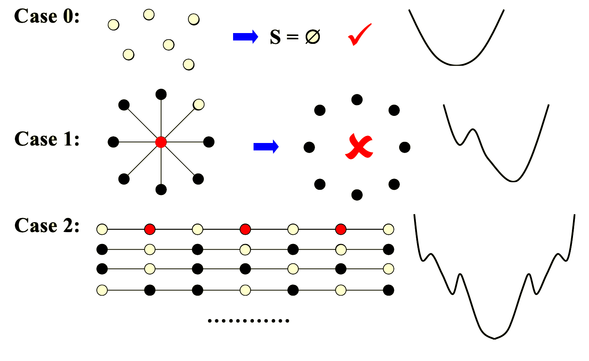

# Local Search

## 例：Vertex Cover Problem

- 给定一个无向图$G=(V,E)$和一个整数$K$，找到一个最小的顶点集$S\subset V$，使得每条边$(u,v)$都至少有一个端点在$S$中（即$u\in S$或$v\in S$）

- 这个问题的可行解为$S=V$，其目标函数为$cost(S)=|S|$。然后我们尝试用local search 来降低$|S|$

```cpp
SolutionType Metropolis()
{
    Define constants k and T;
    Start from a feasible solution S;
    MinCost = cost(S);
    while(1){
        S' = the best chosen from N(S);
        if(CurrentCost < MinCost){
            MinCost = CurrentCost;
            S = S'
        }
        else{
            break;
        }
    }
}
```

- 下面有几个案例，说明局部搜索得到的大多数情况下只是局部最优解



---

- 我们会发现，local search在case 1中跳进错误的局部极值点后就出不来了，于是我们设想能不能增加一个回溯的方式，这样更便于我们找寻全局最优解

### The Metropolis Algorithm

```cpp
SolutionType Metropolis()
{
    Define constants k and T;
    Start from a feasible solution S;
    MinCost = cost(S);
    while(1){
        S' = Randomly chosen from N(S);
        if(CurrentCost < MinCost){
            MinCost = CurrentCost;
            S = S'
        }
        else{
            With a probability exp{△cost/kT}, let S = S';
            else break;
        }
    }
}
```

- 相较于原算法，差异就在于下一个点的选择不再是使得cost变得更小的更优点，而是随机的一个点，然后用概率$e^{-\Delta cost/kT}$来决定是否跳转（$\Delta cost$就是S和S'之间代价的差值，kT是超参数）

### 模拟退火

- 模拟退火（Simulated Annealing, SA）是一种用于全局优化问题的随机搜索算法，灵感来自于物理学中的退火过程。退火是指将材料加热到高温，然后缓慢冷却以达到最低能量状态的过程。模拟退火算法通过模拟这一过程来寻找问题的最优解。

```cpp
Initialize: S = initial solution, T = initial temperature
while (termination condition not met) {
    S' = Randomly chosen from N(S);
    if (Cost(S') < Cost(S)) {
        S = S';
    } else {
        With a probability exp(-Δcost / kT), let S = S';
    }
    T = decrease(T); // Reduce the temperature
}
```

---

## 例：Hopfield Neural Networks

- 给定一个带有边权重$w$的图$G=(V,E)$，$e=(u,v)，$如果$w_e<0$，那么我们称u和v有**相同的state**；反之，$w_e>0$，则u和e有**不同的state**；

!!! tip "定义和问题描述"
    - 在一个configuration $S$中，如果$w_es_us_v < 0$则称这条边是**good**；反之**bad**

    - 在一个configuration $S$中，如果一个顶点$u$的good边的权重和大于bad边的权重和，则称这个顶点是**satisfied**；这等价于：

    $$
    \sum w_es_us_v \leq 0
    $$

    - 如果$S$中所有的顶点都是**satisfied**，那么称这个configuration是**stable**

    - 所以我们的问题其实是一个判定问题：找到一个stable的configuration $S$，但是我们会把它变成一个优化问题

```cpp
ConfigType State_flipping(){
    Start from an arbitrary configuration S;
    while (!isStable(S)){
        u = GetUnsatisfied(S);
        su = -su;
    }
    return S;
}
```

!!! tip "Claim"
    上面这个`State_flipping`算法一定会在经过**最多**$W=\sum|w_e|$次迭代后得到stable configuration

    ??? note "Proof"
        - 我们定义一个目标函数：$\Phi(S)=\sum_{e~is~good}|w_e|$

        - 之所以这么定义，是因为这个值越大就代表我的好边越多，上限就是所有好边的权重和的绝对值

        - 然后我们分析这个算法，思考一下当翻转一个not satisfied的点的state时，与它相邻的good->bad，bad->good；那么边的权重和一定会从正变为负，$\Phi(S)$肯定是**只增不减**的

- 时间复杂度：$T = O(\sum|w_e|\cdot e)$，并非多项式时间复杂度，而是伪多项式


## 例：The Maximum Cut Problem

- 给定一个无向图$G=(V,E)$，每条边有正权重$w_e$，现在把所有点分为$(A,B)$两类，使得所有跨越cut的边（一端是A类点，一端是B类点）权重和最大

$$
w(A,B):=\sum_{u\in A, v \in B}w_{uv}
$$

---

- 我们会发现，这个其实就是Hopfield Neural Networks的一个特殊情况（所有边权重都是正数），点的状态还是两种；所以我们还是改变unsatisfied的点的状态，就可以对目标函数$\Phi(S)=\sum_{e~is~good}|w_e|$进行优化

- 但是上一个问题是判定问题，所以一定可以找到一个可行解，但是最大割问题是一个优化问题，我们希望找到全局最优解，下面我们分析这个local search算法能否找到**全局最优**

- 答案是并非全局最优，得到的是一个局部最优的近似解，不过近似比很好为$\rho = 2$

??? note "Proof"
    - 我们通过local search找到了一个局部最优解，那么对于任意一个node $u\in A$，会有不等式

    $$\begin{aligned}
    &\sum_{v\in A} w_{uv} \leq \sum_{v \in B} w_{uv} \\
    &把所有u求和\\
    2\sum_{u,v \in A}w_{uv}=&\sum_{u\in A}\sum_{v\in A} w_{uv} \leq \sum_{u \in A}\sum_{v \in B} w_{uv} = w(A,B)\\
    &2\sum_{u,v \in B}w_{uv} \leq \sum_{u \in A}\sum_{v \in B} w_{uv} = w(A,B)\\
    w(A*,B*)\leq &\sum_{u,v \in A}w_{uv} + \sum_{u,v \in B}w_{uv} + w(A,B) \leq 2w(A,B)
    \end{aligned}
    $$

    