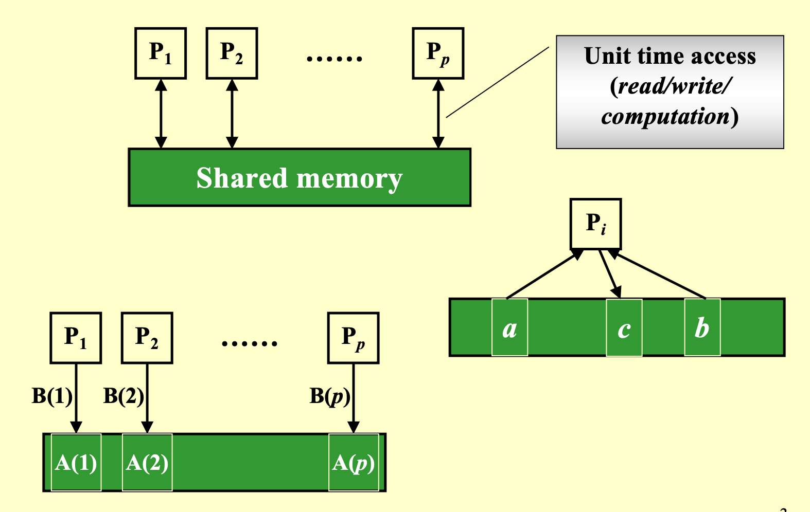
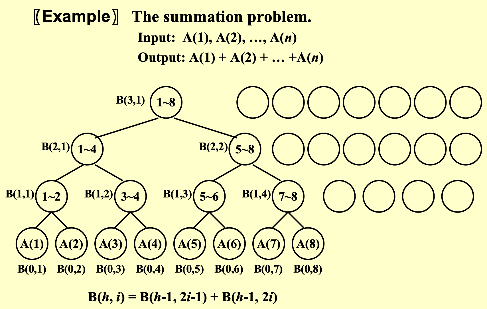
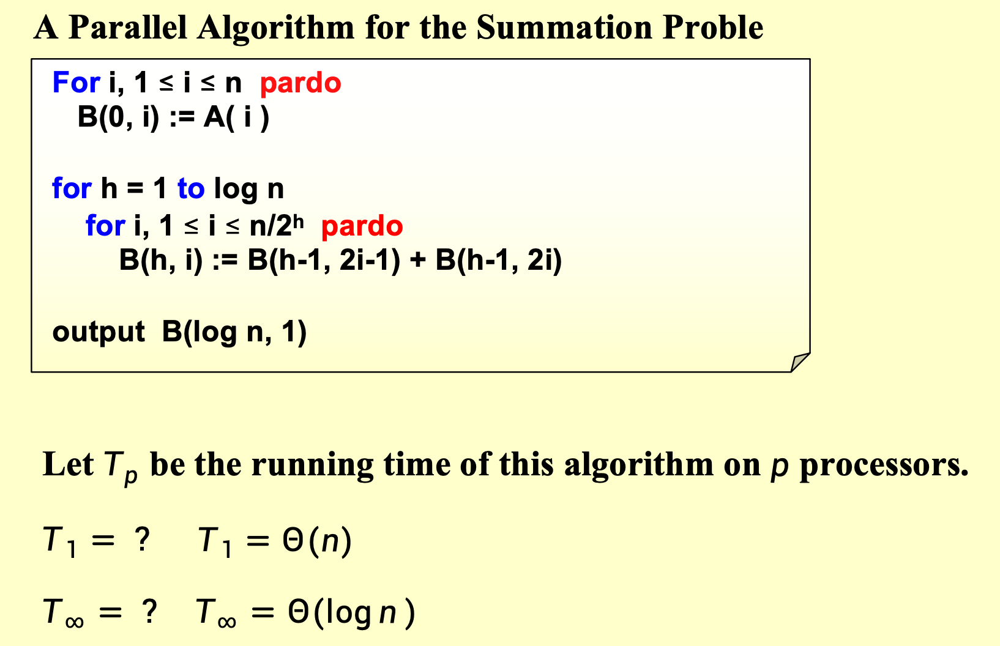
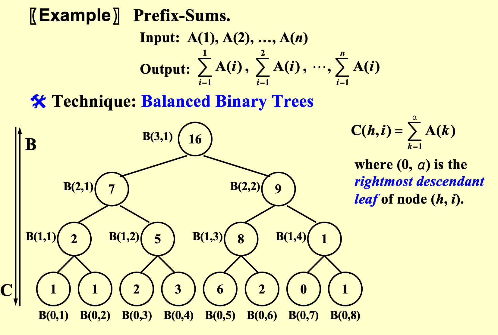
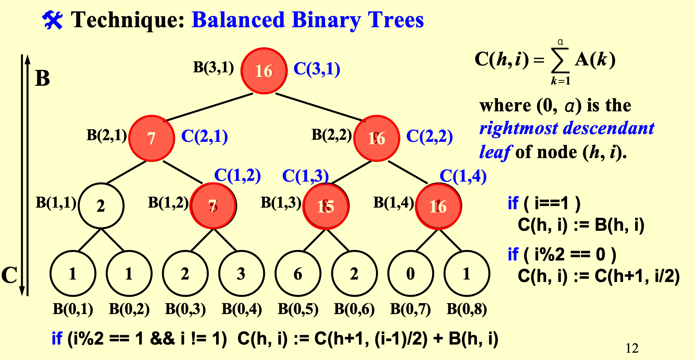
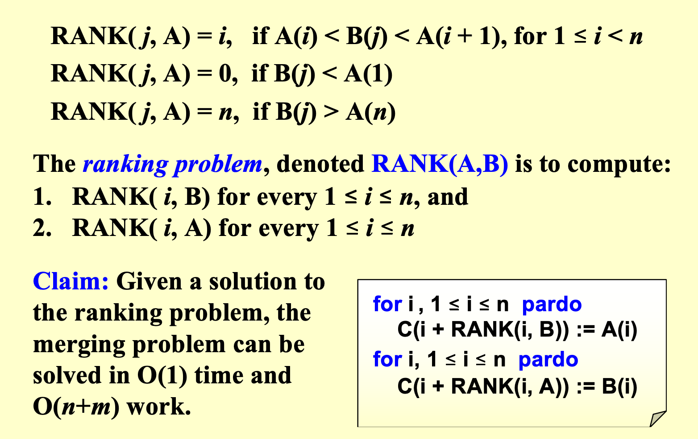
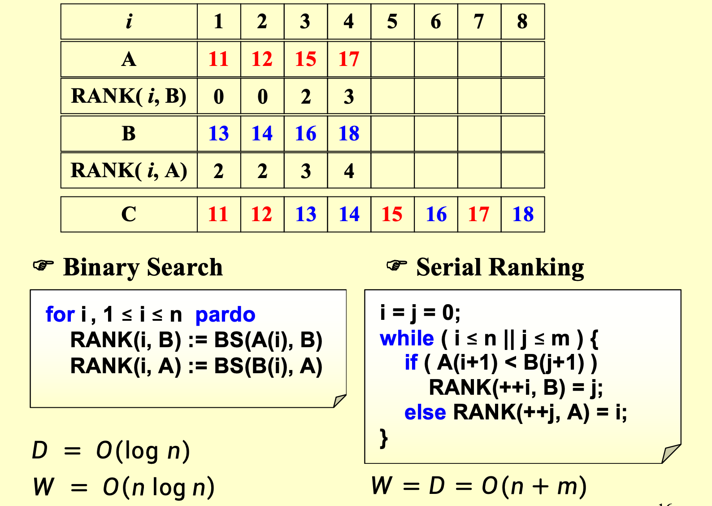
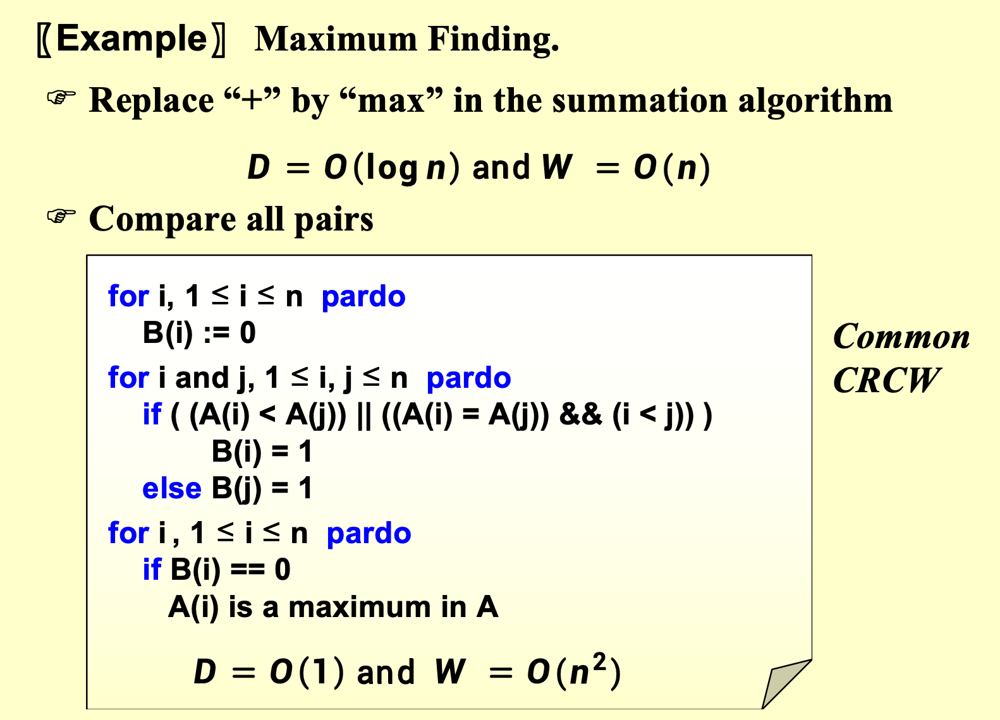
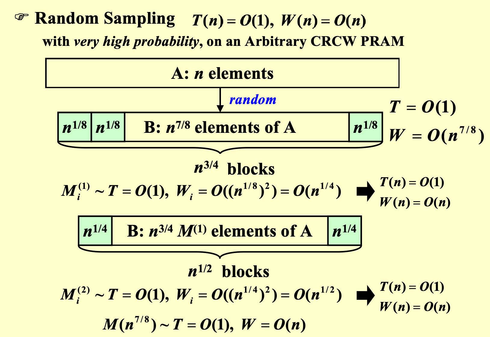
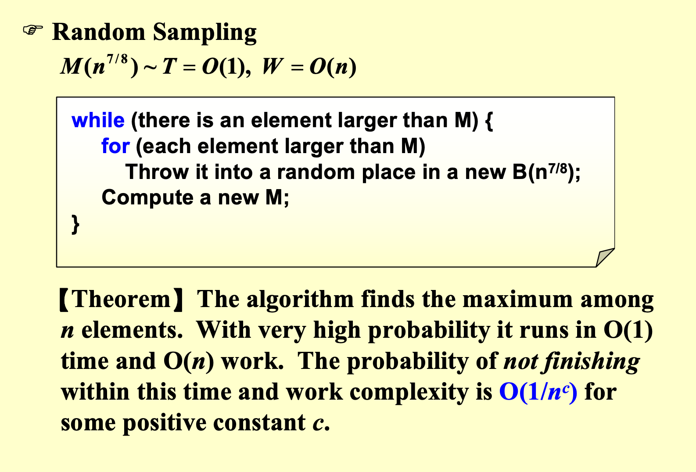

# Parallel Algorithm

- 一个问题能否被拆分成多个子问题

## Parallel Random Access Machine(PRAM)

- 并行随机存取机器（PRAM） 是一种理论上的并行计算模型，用于研究并行算法的设计和分析。PRAM 模型假设有多个处理器可以同时访问共享内存，并且每个处理器可以在一个时间步内完成基本操作（如读取、写入和计算）。

## 例：The summation problem

- 求$n$个数的和

- pardo的部分，和处理器的数量有关，是可以并行的部分

## Work and Depth

- **Work** 是指并行算法在所有处理器上执行的**总操作数**。它表示如果只有一个处理器执行该算法所需的时间。

$$
W = T_1
$$

- **Depth** 是指并行算法的最长依赖路径上的操作数。它表示并行算法的临界路径长度，即最少需要多少个时间步才能完成所有操作。

$$
D = T_\infty
$$

---

- 通过work和depth可以得到$T_p$的上下界

$$
\frac{W}{p} \leq T_p \leq \frac{W}{p}+D
$$

## 例：Prefix-Sums

- 给定$N$个数，计算前缀和（前$k$个数的和）

- 我们的工具是：**balanced binary tree**

- 先用summation相同的方式，并行地构建出这么一棵平衡二叉树，然后从上往下走，得到各个位置的前缀和

- 引入一个新的量$C(h,i)$，表示的是$(h,i)$位置这个点，的最右分支的那个数，往前的所有前缀和，然后我们就可以按照$i$是**奇数**还是**偶数**进行一个倒的递推

## 例：Merge Arrays

- 给定两个递增的数组A和B，merge得到数组C

- 串行的思路就是：...

- 这个思路显然不能用于并行，所以我们提出一种新的思路来实现并行的merge

- Merging -> Ranking，引入新的量**rank**：就是自己在对方序列里位于哪个位置，一旦我知道了所有数的rank，我就可以瞬间把整个序列排好

--

## 例：Maximum Finding

!!! abstract "有5个复杂度需要记住"
    1. 使用和summation一样的方法：$D=T(n)=O(\text{log}n),W(n)=O(n)$

    2. 使用两两比对的并行方法：$D=T(n)=O(1), W(n)=O(n^2)$

    3. 采用$\sqrt{n}$划分：$T(n)=O(\text{loglog}n), W(n)=O(n\text{loglogn})$

    4. 采用$\text{loglog}n$划分：$T(n)=O(n\text{loglog}n),W(n)=O(n)$

    5. 采用**Random Sampling**：$T(n)=O(1),W(n)=n$

- 找到一堆数里面的最大数，本质和summation是一样的，只是把 ＋ 换成了 *max*

- 所以方法一就是同summation algorithm

- 方法二，则是增加work量，来提高并行效率

### Doubly-logarithmic Paradigm

!!! abstract
    - partitioned by $\sqrt{n}$：$T(n)=O(\text{loglog}n), W(n)=O(n\text{loglogn})$

    - partitioned by $\text{loglogn}$：$T(n)=O(n\text{loglog}n),W(n)=O(n)$

### Random Sampling 随机采样

$$
T(n)=O(1), W(n)=O(n)
$$

- **with very high probability, on an Arbitrary CRCW PRAM**

