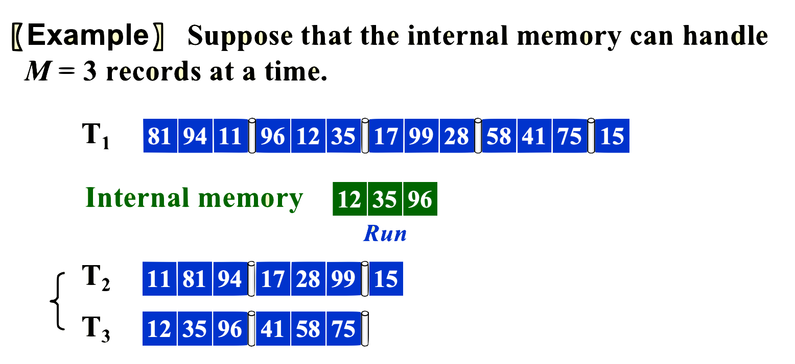

# External Sorting

!!! info 
    - 外部排序（External Sorting） 是一种用于处理**无法完全加载到内存**中的大规模数据集的排序算法。外部排序通过将数据分块处理，每次只加载一部分数据到内存中进行排序，然后将排序后的数据块合并，最终得到排序后的完整数据集。

## Implementation 

- 外部排序通常采用 **归并排序（Merge Sort）** 的思想，分为两个主要步骤：

1. **分块**排序（Run Generation）：

    - 将大数据集分成多个可以**加载到内存的小块**。
    
    - 对每个**小块在内存中进行排序**，并将排序后的数据块写回磁盘。

2. **多路**归并（Multi-way Merge）：

    - 将多个**已排序的数据块逐步合并**，直到得到一个完整的排序数据集。

    - 使用**优先队列（最小堆）**来高效地进行多路归并。

    
-----

!!! tip "Example"

- 先引入三个概念：1.**block**：我们把大的数据集划分成小block；2.**run**：我们把大的数据集划分成小块，小块在内存中排序好的结果叫做run；3.**pass**：我们在**磁盘**中进行的**划分**和**归并**算作一次pass

- $Pass = 1+\lceil\text{log}_2(N/M)\rceil$（初始的划分算一次pass，后面归并会使得每次数据减半，因而是开log，然后取上整）

=== "Step 1--划分"
    

    - 内存大小为$3$，所以我们每3个数据划分为一个小块，然后在内存中internal sort得到一个run

=== "Step 2--归并"  
    

    - 我们把每个run，交错地放在两个tape中；81,94,11在T2，96,12,35在T3

=== "Step 3--归并"
    

    - 把T2，T3归并后的结果放在T1，T4中；11,81,94,12,35,96在T1，17,28,99,41,58,75在T4

=== "Step 4--归并+计算Pass"
    

----

## Optimize

- 影响这个算法性能的因素主要有4个：

1. Seek time —— $O(number of passes)$

2. Time to read or write one block

3. Time to internally sort

4. Time to merge 

- 所以，我们的目标是：

1. 减少pass次数

2. 加速run之间合并的速度

3. run的generation能快速一点

4. 

---

### 减少pass次数

- 我们来看pass的公式：$Pass = 1+\lceil\text{log}_2(N/M)\rceil$，其中N、M、1都动不了，我们能动的只有log的底数$2$；然后这个底数，其实就是每次merge序列的数量

- 所以，我们采用**k-way merge**；然后用**最小堆**来加速多路归并

- 此时，$Pass = 1 + \lceil\text{log}_k(N/M)\rceil$

- 但代价就是需要**更多的tapes**，$tapes = 2k$

!!! tip "3-way merge with 最小堆"

=== "Step 1--MinHeap"
    

    - 可以看到3-way merge，我们就把run交错地放在3个tapes上；然后merge的时候维护一个最小堆，就能很高效的归并

=== "Step 2"
    
    
    - 这样子采取3-way merge，我们就可以一次性合并3个run；大大减少了pass的次数

---

#### Polyphase Merge

- 上面那种均匀地划分，会使用到2k个tapes；空间成本大

- 于是想到了一种不均匀的划分方式，其中我们聪明地把每次要merge数拆成两个**相邻的斐波那契数**$F_{N-1},F_{N-2}$

- 这种划分方式来merge，会稍微多一点pass，但是只需要$k+1$个tapes

### 使用IO和CPU并行来提高读写buffer效率

- 把output buffer进行划分，使得能一边IO操作，一边进行存储比较得到的结果

- 把input buffer也进行划分，这样如果其中一个序列读完了，可以让下一个接着来，别闲着（让输入的IO也和CPU处理并行）

### generate longer run

- 原来我们是认为每个run的大小是和内存大小相同

- 但假如我们使用最小堆维护内存里的数据，那么每次DeleteMin之后，内存就会空出一个位置，可以让我们读进来新的数据，于是就能generate longer run

!!! tip "Example--generate longer run"

=== "Step 1"
    

    - 可以看到，我们把Deletemin 11 之后，马上读进来了96

=== "Step 2--run stop"
    

    - 但是不是说我们就无敌了，可以看到如果读进来的数 **大于** 刚吐出去的数；那么这时候第一个run就只能截止在96这里了；

    - 对于12这种不属于第一个run的数，我们把它**标红**，并且不参与最小堆的性质维护；直至第一个run结束，我们开始维护第二个run

=== "Step 3--end"
    

    

=== "另外一种情况"
    - 如果说我们在读入12（标红）之后，下一个元素是99（大于吐出的元素），那么我们还是让99正常参与到最小堆的维护，它属于第一个run

---

### Minimize the merge time

- 例：给定4个runs，长度分别是：2,4,5,15；如何安排合并的顺序，可以使得merge时间最短；（merge的时间就是参与合并的两个序列的长度和，比如第一次选择2和4，时间就是2+4；第二次选择5和6，时间就是5+6）

- 那么很明显，我们每次都选择长度最短的两个序列来合并就好了，合并的序列长度再放回去；这就是**Huffman algorithm**，我们由此构建出一棵Huffman Tree

