## 红黑树

!!! info "2-3-4 树"
    - 先来看看`M-Ary`多叉树  

    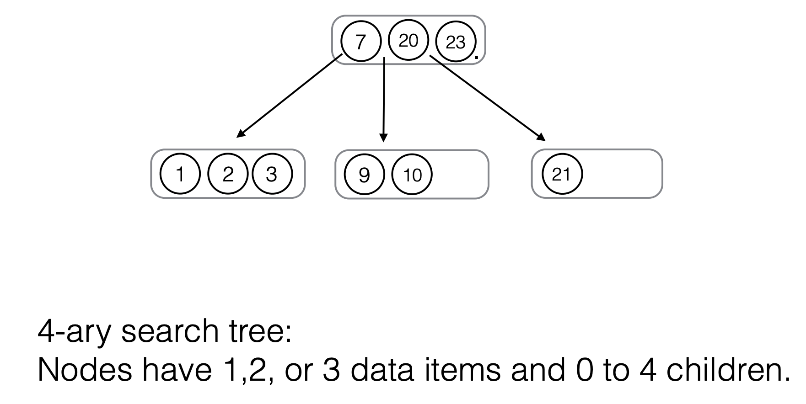

    ----

    - 于是我们有了2-3-4树  
    - 所有叶节点必须有**相同的depth**，即每个`internal node`的Children必须**完备**  

    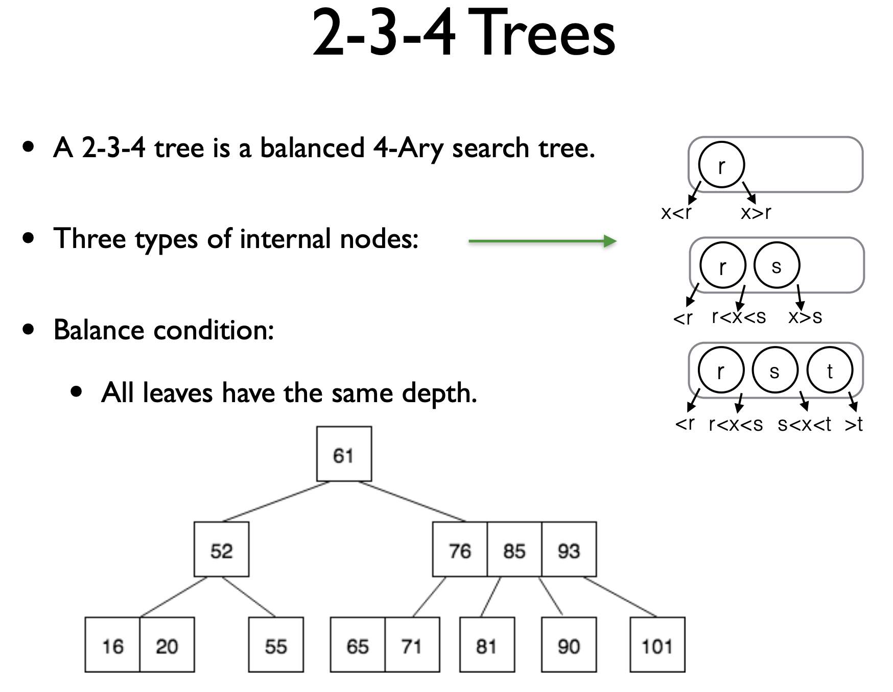

    === "Search"
        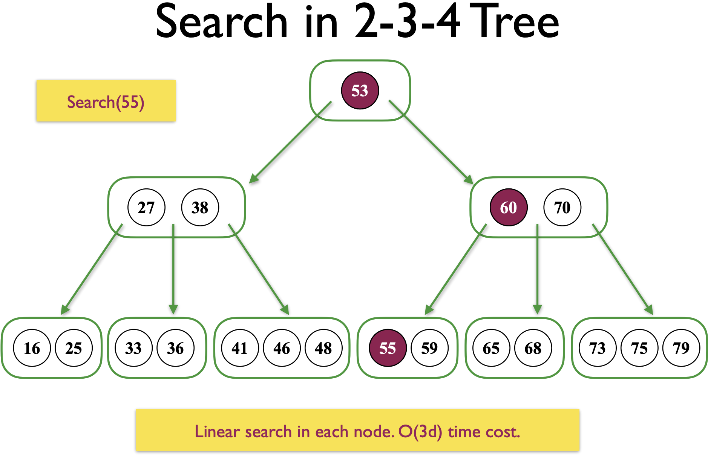

    === "Insert"
        - 插入操作时，我们总是优先考虑插在**叶子节点**（即使internal node可以插入）  
        - 第一种情况：叶节点未满，直接插入  
        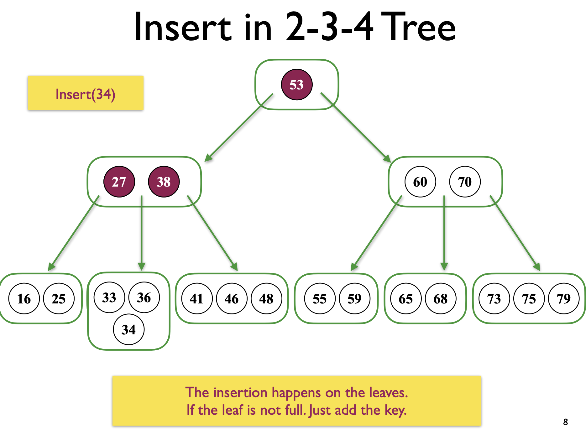

        ----

        - 第二种情况：叶节点已满，但上方的父节点未满  
        - 那么我们选取叶节点里**中间值**的那个key，将它作为父节点的一部分，然后由于我们选的是**中间值**，那么之前的左与右完美地成为两部分**children**  
        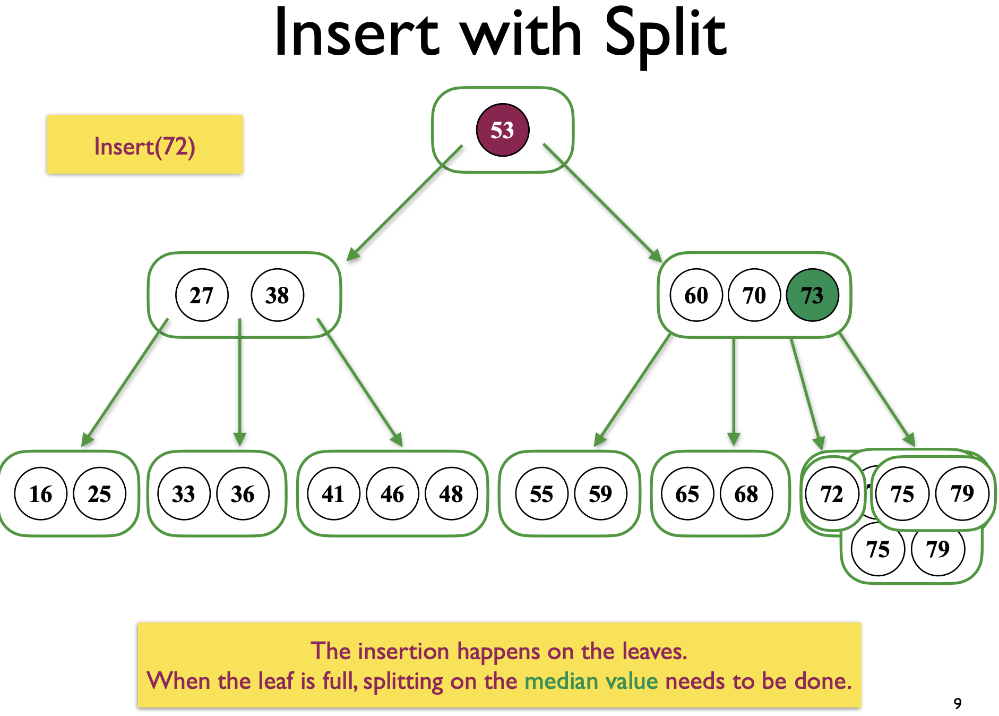

        -----

        - 第三种情况：叶节点已满，且上方的父节点也满了  
        - 那么我们照样向上**'分裂'**，然后父节点进行同样的**'分裂'**，直到有一处满足或者是根节点满了（那么整棵树层高加1）  
        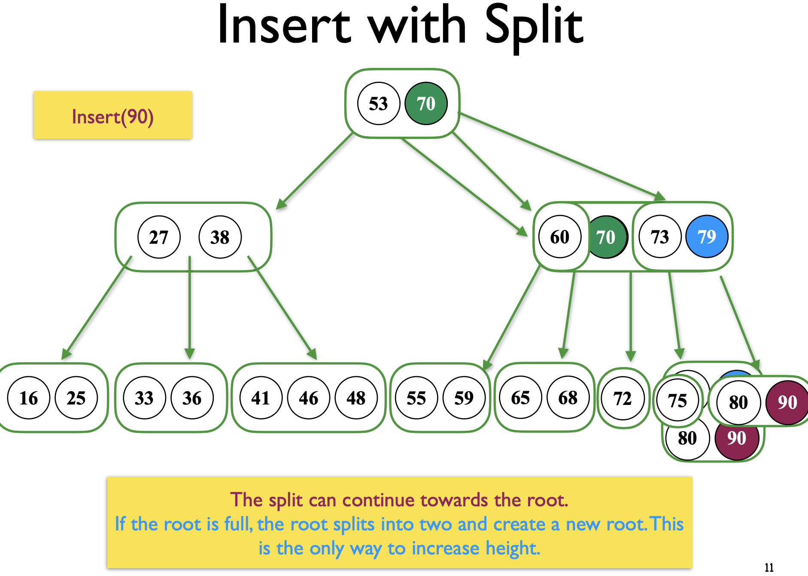
    
    === "Delete"
        - 第一种情况：最简单的情况，在**叶节点**且叶节点上**不止一个节点**  
        - 直接删就好了  
        

        ------

        - 第二种情况：如果删的是根节点中的一个，那么我们去选左（右）子树中的最大（小）值去替代根节点  
        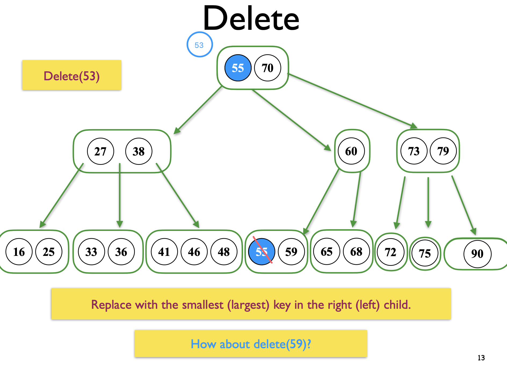

        -----

        - 第三种情况：删除孤立的叶节点，且sibling冗余  
        - 那么我们把父节点拿下来，把sibling拿上去  
        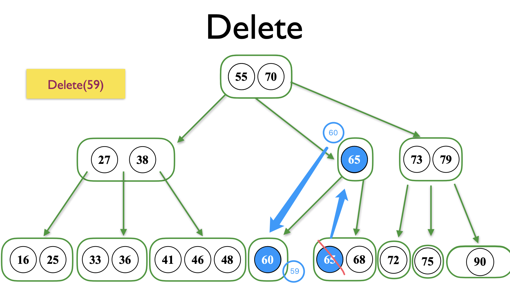

        -------

        - 第四种情况：删除孤立的叶节点，且无冗余的sibling  
        - 那么我们merge，**减少分支**  
        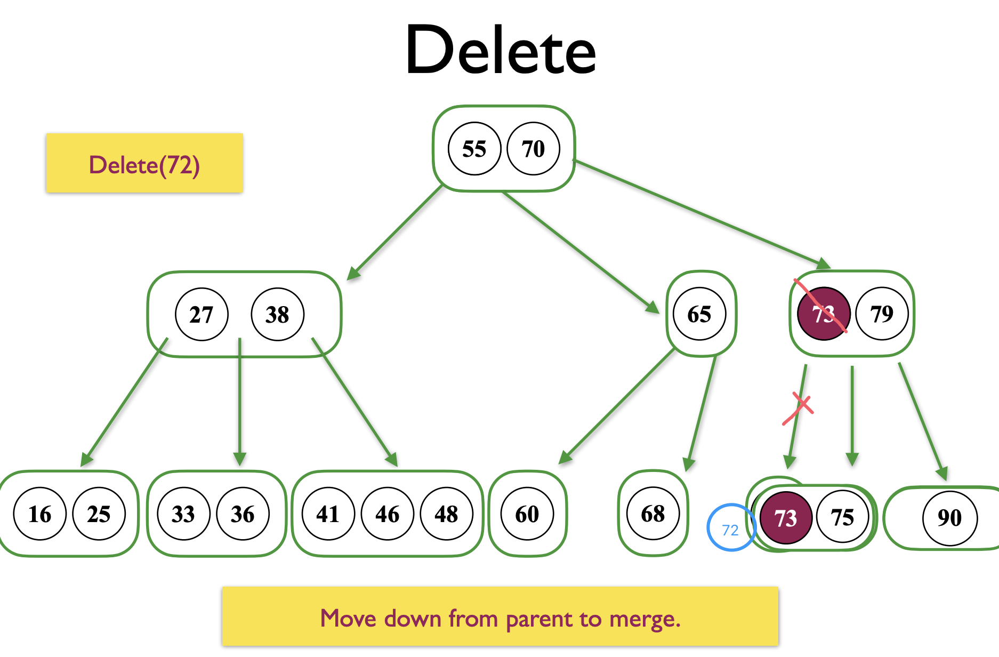
    
---------

- 然后我们把2-3-4树，转换成二叉树，得到了红黑节点，红是黑的**附属**  
- 黑节点才是关键!!!
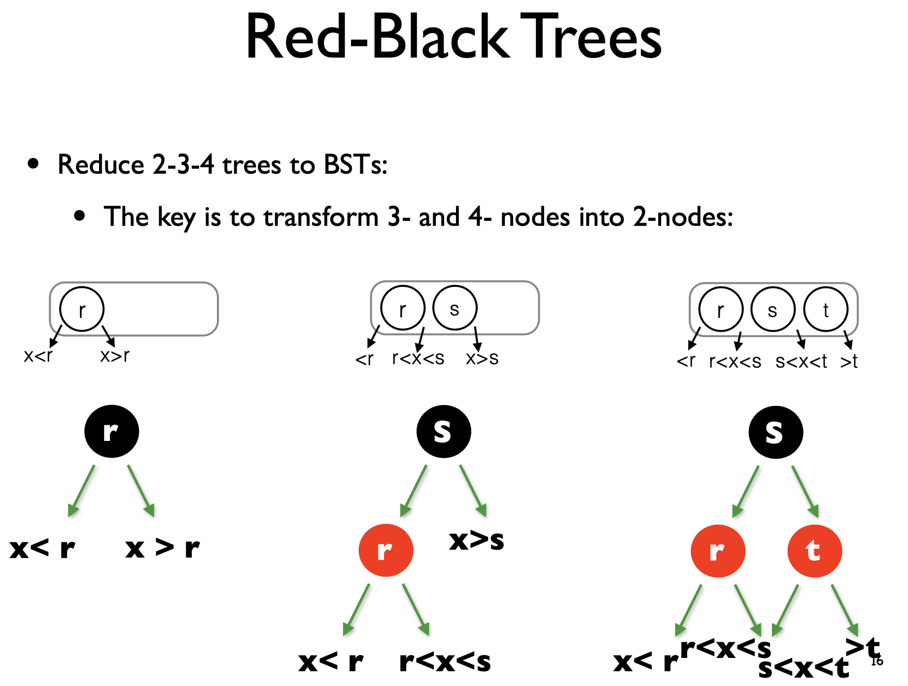

### 概念

- 红黑树(Red Black Tree)就是一种节点分类为红黑两色的，比较平衡的二叉搜索树。只不过不同于 AVL 树，红黑树的“平衡”性质是通过**黑高(black height)**来定义的。接下来依次给出红黑树的定义和黑高的定义。  
1. 每个节点要么是红要么是黑  
2. 根节点一定是**黑**的  
3. `NIL` 节点（空叶子节点）为**黑**；  
4. **红**色节点两个孩子都一定是**黑**色（另一种说法，**红**节点**不会连着**）（因为有孩的红节点其实是父节点，孩即分支）  
5. 从根节点到 `NIL` 节点的每条路径上，包含**相同数量**的**黑色**节点（转换成2-3-4树好理解，因为叶节点同层高）  

!!! warning "叶节点"
    - 在红黑树中叶节点被定义为了`NIL`空节点，而不是可见的末端节点

-----

!!! info "Definition: black-height"
    - 节点`x`的`black-height` 记作 `bh(x)`，表示从x到叶节点的简单路径上**（不包括x）**的**黑色节点**数  
    - 引理：  
        - 一颗$N$节点的红黑树的高度最多为 $2log_2(N+1)$  
    ??? tip "证明"
        1. 首先我们显然有 $N\geq 2^{bh}-1$，也就是$bh \leq log_2(N+1)$  
        2. 然后显然有 $2bh(Tree)\geq h(Tree)$  

!!! note "辨析"
    === "T1"
        === "题目"
            下面的红黑树合法吗  

            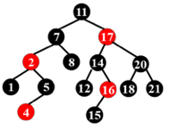

        === "答案"
            - 不合法。

            - 16 号节点的右儿子是一个黑叶子，而这个叶子到根的路径上只有 3 个黑节点，而其他叶子到根都有 4 个黑节点。

            - 所以我们需要警惕**只有一个非叶儿子的红色节点**

    === "T2"
        === "题目"
            下面的红黑树合法吗  

            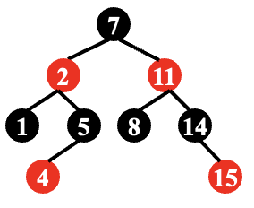
        
        === "答案"
            - 合法
    
    -----

    - 根据 T1 的解析，我们得到这样一个结论：

    - **合法红黑树不存在只有一个非叶子节点的红色节点！**

    or

    - **合法红黑树的红色节点的两个子节点一定都是叶子或都不是叶子！**

### 操作

- **类比2-3-4树**  
- 红黑树的操作是两侧对称了，下面只讨论一侧  
- 但是实际可能更得死记硬背:-(  

#### Insertion

- 我们知道，对**黑高**有贡献的只有黑色节点，因此 `NIL` 节点被一个**红色**节点置换并不会改变一颗红黑树的黑高，因为红色节点还会有一层 `NIL` 子节点；然而对于红色节点，却有着红色结点互不相邻的限制。

- 因此，“插入”操作的主要思路就是，先将整个红黑树当作一个普通的二叉搜索树，将目标数据插入到树的末端（也就是置换一个 `NIL` 节点），并将它染为红色，再调整使之在保证**黑高不变**的情况下，满足**红色节点不能相邻**的要求。

- 现在，我们记这个被插入的节点为 `x`，任意一个节点 `node` 的家长节点为 `node.p`，则：

1. 如果 `x.p` 是黑色的，那么我们不需要做任何调整；
2. 如果 `x.p` 是红色的，那么我们需要进行调整；
    - 此时因为原来的树符合红黑性质，`x.p.p` 必定存在（红 `x.p` 不能是根）且必定是黑色的；

- 根据这些讨论，我们就能列举出来一个红色的点被插入后，在 `2.` 的情况下所有的**初始情况**，即下面第一张图。
- 由于红黑树的操作中，有一部分需要进行**递归转移**，而其中**中间步骤**出现了很多同构的结构，所以为了简化说明，我们对其进行统一，所有情况都被归纳为第二张图。
- 而第二张图中提到的橙色结点，也就是标为“被插入的红色节点”的结点，实际过程中并不一定指的是被「插入」的那个点，也可能是在 case 1 向上递归时，简化的原来那颗子树。换句话来说，这里的“被插入的红色节点及其子树”，实际上可能是指**「导致红黑性质被破坏的红根子树」**。

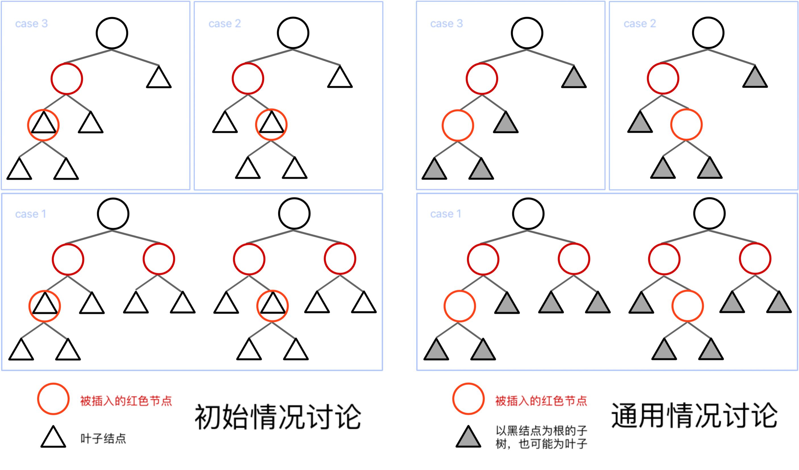

-----

- 下面从case 3->case 1由简到难进行处理

!!! note "case 3"
    - 对于case3，只需要一次变色和旋转即可  
    - 实际就是x,p,g都是父节点，但是相对大小关系没和颜色对应上，把中间者p放在黑位即可  
    
    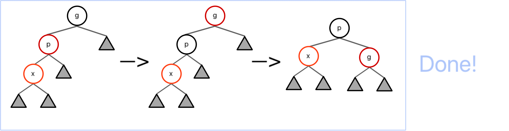
    

!!! note "case 2"
    - 对于case2，只需要一次rotation就可以得到case3  
    - 这里相当于插入的x是中间值，于是我们拿上去作为黑节点  
    - case2，3其实都像Avl树中的Single和DoubleRotation  

    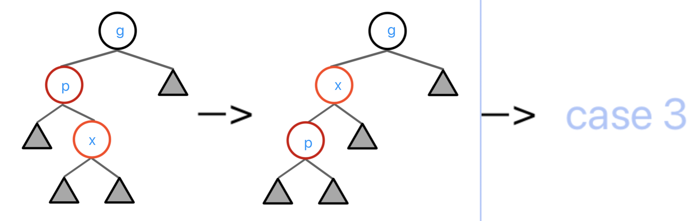

!!! note "case 1"
    - 对于case1，其实就对应父节点中装**4**个**爆了**  
    - 那么我们就采取把原中间值的父**上移**，然后剩余的3个节点就自然分成**两部分**成为其子  
    - 在红黑树中就表现为原来三个父的**变色**  
    - 然后变色（上移）后就开始分类讨论即可，最后一种情况就是遇到了根节点；这就是插入操作的**递归处理**
    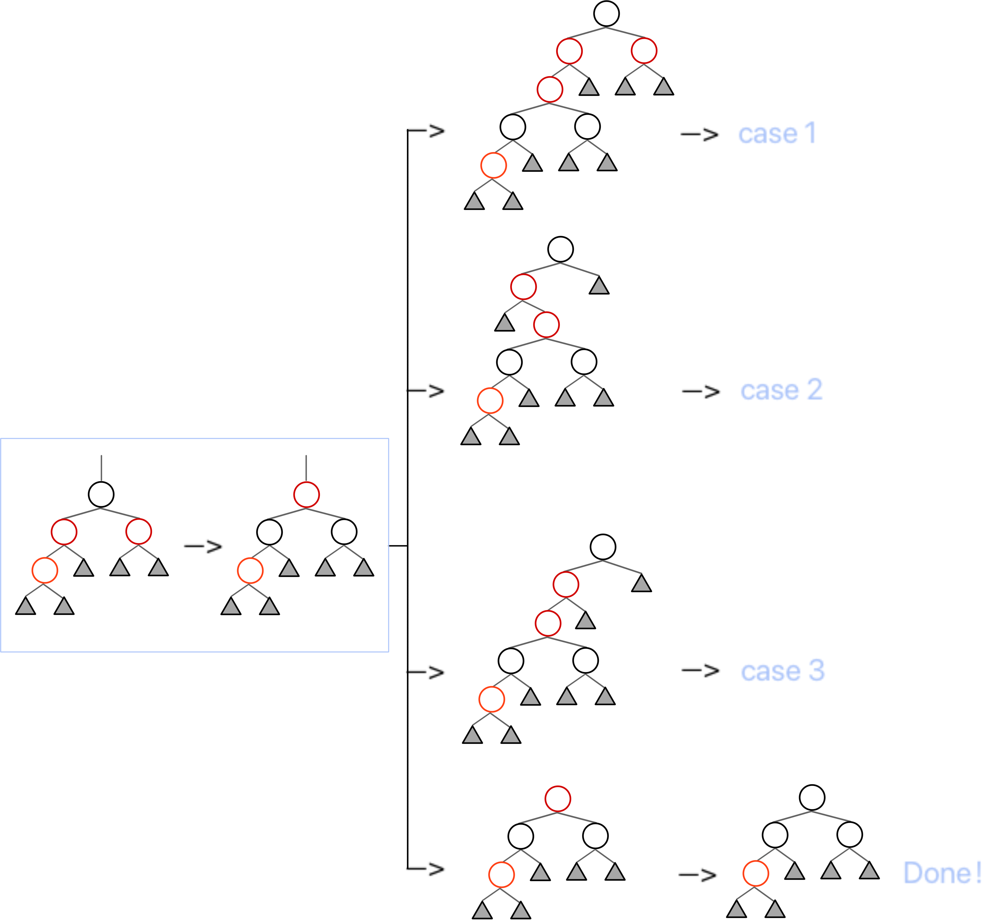

- 最终整个插入操作就三种case，表示为一个状态机即为
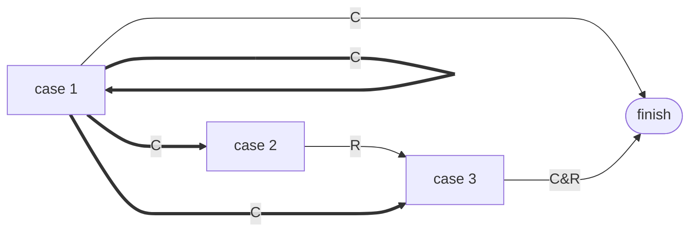
```mermaid
graph LR;
A["case 1"]
B["case 2"]
C["case 3"]
D(["finish"])

A ===>|"C"| B --->|"R"| C
A ===>|"C"| A --->|"C"| D
A ===>|"C"| C --->|"C&R"| D
```

-----

#### Delete

- 要删除某个节点 x，我们首先要找到它，在 BST 中找到某个 x 的开销为 $O(logN)$。接下来我们要删除这个任意位置的节点，这势必让红黑树的结构发生变化。此外，红黑性质的维护也是一个让人头疼的问题，因此，我们对这些情况做分类讨论：

|没有非`NIL`子节点|有一个非`NIL`子节点|有两个非`NIL`子节点|
|----------------|----------------|-----------------|
|直接用NIL节点代替|直接删除，用子节点替代|将值与左子树最大值或右子树最小值交换，颜色不换，然后删除目标点|

- 其中，每一项操作都会导致一个点的消失（毕竟是删除），而如果消失的是红色节点，那么将不会影响黑高；而如果消失的是黑色节点，那么将会导致黑高减少一，此时我们需要做进一步操作。

- 我们将情况分为四种

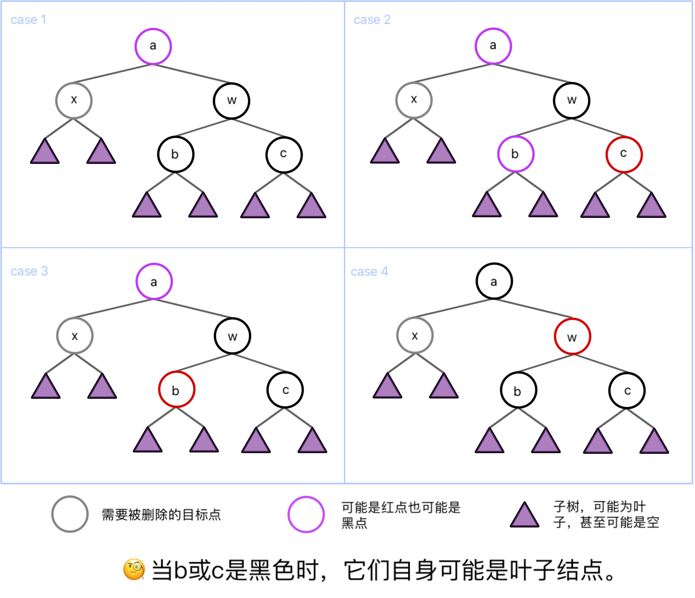

!!! note "case1"
    - 把它按照 a 节点的红黑，分为两种情况。  
    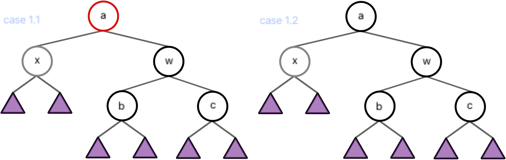

    === "case1.1"
        - 当 a 为红根时，由于 x 贡献了（相对于原红黑树）-1 的黑高，为了**保证整个子树贡献的黑高不变**，我们考虑把 w 的**黑高“上放”**到 a 上，也就是从下面“吸纳”上来。  
        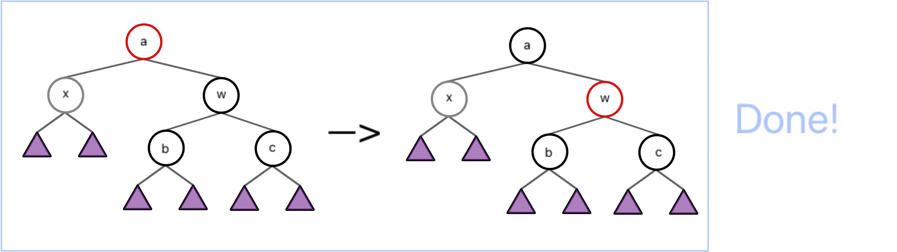

    === "case1.2"
        - 当 a 为黑根时，我们没有空余的位置来“吸纳” w 的黑高，但是**左子树和右子树的不平衡是必须解决的**，同时不能寄希望于“在不知道有没有红色节点的 b 和 c 的子树中去寻找红色节点”这个想法。  
        - 所以我们可以仿照「Insertion / case 3」，将整个树标记为灰色——「**由于删除结点，黑高 -1 的子树**」，然后进一步根据其家长节点的情况递归到其他 case。其中，当我们递归到 a 是整个树的根时可以退出，因为这相当于整个树的黑高 -1，不影响红黑性质。

        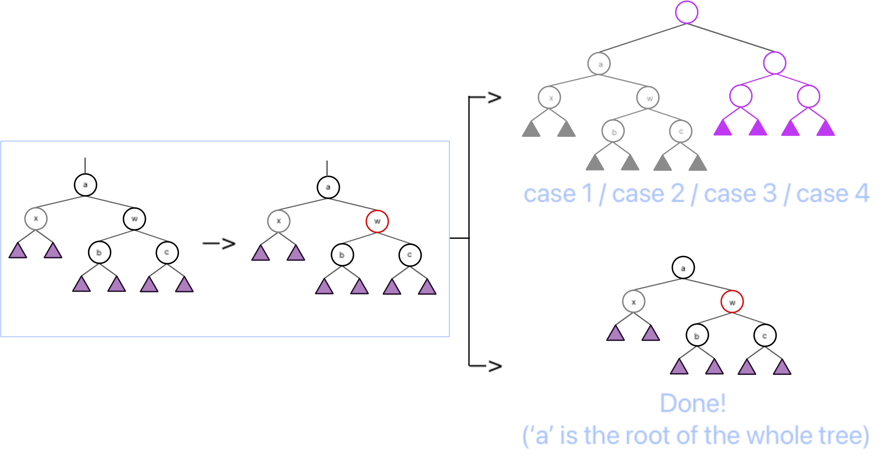

!!! note "case2"
    1. 将 w 染为 a 的颜色，再将 a 和 c 染成黑色；  
    2. 将 a 左旋，使 w 成为这个子树新的根，a 成为 w 的左儿子，b 成为 a 的右儿子；  
    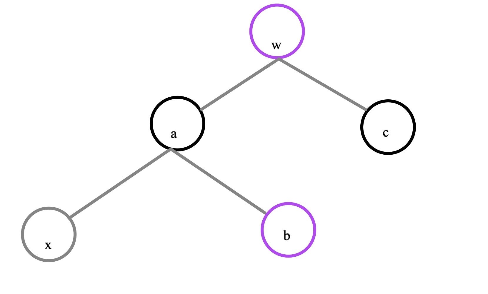

!!! note "case3"
    1. 交换 b 和 w 的颜色；  
    2. 将 w 右旋，使 b 成为 a 的右儿子，w 成为 b 的右儿子，b 的右儿子成为 w 的左儿子；  
    3. 此时情况转化为 case 2；  
    - 其实这就是把b这个中间者上提，进行了一个DoubleRotation  
    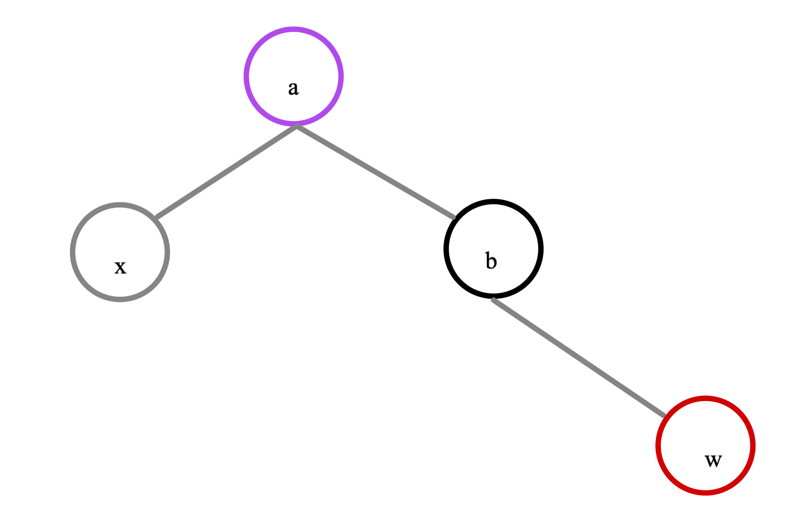

!!! note "case4"
    1. 交换 a 和 w 的颜色；  
    2. 将 a 左旋，使 w 成为这个子树新的根，a 成为 w 的左儿子，b 成为 a 的右儿子；  
    3. 此时根据子树 a 的情况，转化为 case 1.1 / case 2 / case 3；  

## B+树
- B+ 树是一种用树状形式维护有序数列比较信息的数据结构，其增改操作拥相对于二叉树结构更加稳定的对数时间复杂度，通常用于数据库和操作系统的文件系统中。  

- 上面所说的**2-3树和2-3-4树都是B树**，但是ADS这本课**只讲B+树**  
- 所以作业与考试中的2-3树、2-3-4树**都视作B+树**！！！  
??? info "B树"
    - m称为B树的阶(order)    
    - 树中每一个节点最多有m棵**子树**，也就是**最多有m-1个key**。  
    - 如果根节点不是末端节点，那么**根节点至少有两棵子树**。  
    - 除了根节点之外所有的非叶节点至少有$\left \lceil \frac{m}{2}\right \rceil$棵子树。（符号表示向上取整），也就是至少含有$\left \lceil \frac{m}{2}\right \rceil-1$个keys。  

### 概念

- 如下图就是一颗 $M=4$ 的 B+ 树，可以对照着这个例子来理解性质。  

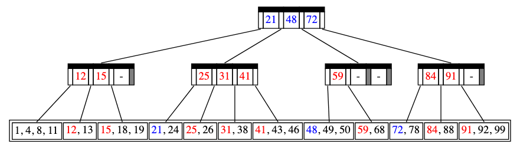

!!! note "性质"  
    1. 如果根节点不是末端节点，那么**根节点至少有2棵子树**  
    2. 除了根节点之外所有的非叶节点至少有$\left \lceil \frac{m}{2}\right \rceil$棵子树。（符号表示向上取整），也就是至少含有$\left \lceil \frac{m}{2}\right \rceil-1$个keys。  
    3. 叶节点必须都在**同一层**  

- 所有真实的数据都被存储在**叶子节点**中，形成一个有序的数列。而**非叶子结点中第 $i$ 个键值等于其第 $i+1$ 棵子树的最小值**（在上图中表现为颜色相同的一对上下结点），因此非叶结点最多存 $M-1$个值  
- 于是我们发现这样一个性质：在存储数值不重复的情况下，非叶结点存储的键值都不相同。  
- 我们称这样的树为一个 M 阶(order) B+ 树。对于常见的 M，比如一棵 4 阶 B+ 树，我们也称之为一棵 2-3-4 树，一般 M 的选择为 3 或 4。  
- 特别说明，对于 B+ 树，将它的叶子结点拼接起来，实际上就是一个有序数列。

!!! abstract
    - 抽象地来说就是，我们把一个数列相对均匀的**分为 $m$ 块**，然后**把分界的数拿出来**。当我们去**查找或插入**时，只需要和这些**边界数**进行**比较**，就知道它应该放在哪一块里。再不断细化粒度，用**类似于“m 分”的思想**来找到目标位置。  
    - 这个定义非常清晰，就是将整个序列按照不同粒度划分，然后由大到小进行逼近。  

### 操作

    -   to be continued
    -   

####  查找

- 与二叉树的查找类似，比较然后分支  

!!! note "Find(43)"
    === "Step 1"
        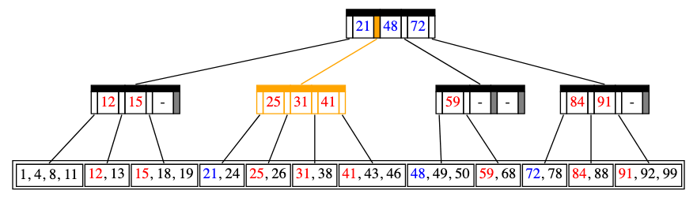

    === "Step 2"
        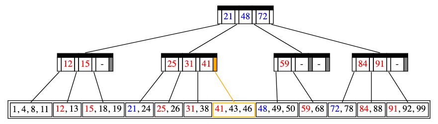

    === "Step 3"
        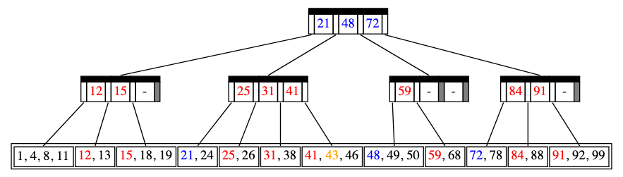

#### 插入

- 插入的方法也相对朴素简单，就是找到该插入的地方以后插入即可。

- 只不过需要注意一件事，当这个插入，导致了 B+ 树的性质不再成立时，即导致其家长节点的**子节点数量为 $M+1$ 时**，我们需要将这个结点**平均分裂成两个**，此时显然有两个子树的节点数量都不大于 $⌈M+1⌉$。但这还不够，分裂导致家长节点的家长节点的子节点变多，所以我们还得向上递归。

!!! note "Insert(44) with split"
    === "Step 1"
        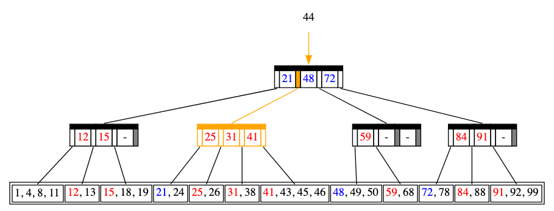

    === "Step 2"
        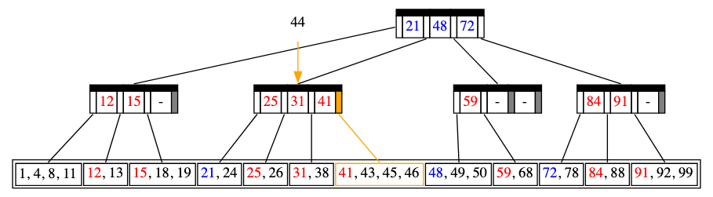

    === "Step 3"
        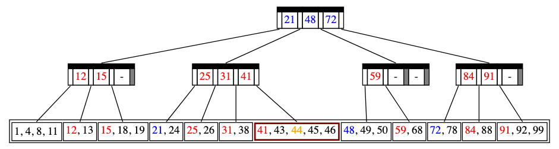
        找到位置了，发现要插入的地方是 45 的前面，插入以后发现一共 5 个数，而$M=4$，需要分裂！
    
    === "Step 4"
        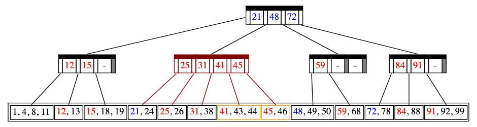
        向上递归，我们悲痛地发现，这个节点在分裂后有了 5 个子节点，不得不再次分裂。

    === "Step 5"
        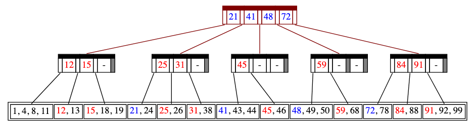
        继续向上递归，结果还要分裂，而且是根部分裂
    
    === "Step 6"
        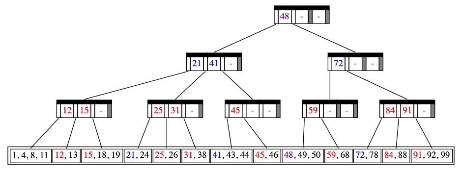
        不建议使用对应网站的 B+ 树模拟，它那里的 B+ 树的定义似乎和 ads 有所不同（采用的可能是数据库的定义）。

#### 删除
