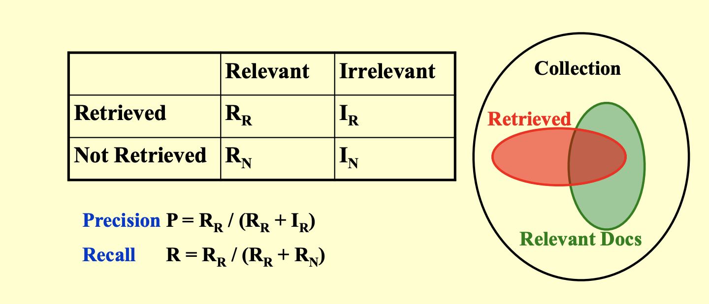

# Inverted File Index

## 倒排索引

- 倒排索引（inverted file index）是一种常见的文本检索技术，用于快速查找包含特定单词或短语的文档。它通过将单词或短语作为关键字，并将它们出现在文档中的位置记录在一个索引中，从而支持快速的文本检索。在搜索过程中，系统可以快速地定位包含指定单词或短语的文档，并返回它们的相关信息。倒排索引广泛应用于搜索引擎、数据库系统和信息检索等领域。

- 搜索引擎是一个非常常见的，倒排索引的应用案例，我们通过输入我们关注的词语，来索引包含这个词的所有文档。

## Implementation

- 我们可以用一个字典来描述一类关系，其主键为单词，键值为这个单词出现的所有位置。

- 最朴素的版本就是让**键值为单词出现过的文档的序号序列**，而如果我们还需要知道词汇出现的位置，则可以让键值是一个**二元组的序列**，其中第一个元素是**文档的序号**，第二个元素是单词在**文档中出现的位置**。

!!! note "Example"
    !!! note "文档集"

        |Docs|Text|
        |---|-----|
        |1	|Gold silver truck|
        |2	|Shipment of gold damaged in a fire|
        |3	|Delivery of silver arrived in a silver truck|
        |4	|Shipment of gold arrived in a truck|

    !!! note "倒排索引"

        |No.|Term|Times;(Doc ID: laces)|
        |----|----|---------------------|
        |1	|a	|{3; (2;6),(3;6),(4;6)}|
        |2	|arrived	|{2; (3;4),(4;4)}|
        |3	|damaged	|{1; (2;4)}|
        |4	|delivery	|{1; (3;1)}|
        |5	|fire|	{1; (2;7)}|
        |6	|gold|	{3; (1;1),(2;3),(4;3)}|
        |7	|of	|{3; (2;2),(3;2),(4;2)}|
        |8	|in	|{3; (2;5),(3;5),(4;5)}|
        |9	|shipment	|{2; (2;1),(4;1)}|
        |10|	silver	|{2; (1;2),(3;3,7)}|
        |11|	truck	|{3; (1;3),(3;8),(4;7)}|

## Improvement

- 将所有词都存到倒排索引中，那么我们的倒排索引就会变得非常大，其中必然有很多冗余信息存在，所以我们需要对倒排索引进行一些改进。

### stop words

- 我们观察到，我们存下来的这些内容中，有一些东西频繁地出现在所有文档中，在特定情况下，这些词可能并不会成为一个索引，例如正常的英文文章中的 `a`，`the` 等。所以，对于这一类词——我们称之为**停用词(stop words)**，对于停用词，我们就不需要将他们存下了。

!!! tip "哪些词会成为停用词？"
    一般一个词成为停用词，是因为它无法成为一个有效的检索关键字，它可能是在大量资料中大量出现，导致我们无法利用它找出我们想要的资料。换句话来说，一个共通点是它们通常都**有着相当高的出现频率**。

### 词干分析

- **词干分析(word stemming)**是一种将单词转换为其词干的技术。例如，词干分析可以将单词 `trouble`，`troubled`，`troubles`，`troubling` 都转换为 `trouble`（甚至是 `troubl`，核心目的是让它们变成**同一个单词**）。

- 相同词干的词有着类似的含义，在检索 `troubled` 的时候，当然也可能想找到包含 `trouble` 的文档。这种技术也可以**让多个单词共享同一条索引记录**，在存和找的过程中都能优化效果。

## 分布式索引

- **分布式索引（Distributed Indexing）**是一种在多个**节点**或**服务器**上分布存储和处理索引数据的技术。它通常用于处理大规模数据集，以提高索引和查询的效率、可扩展性和容错性。分布式索引在搜索引擎和大数据处理系统中非常常见。

- 而这里有两种分布式的策略，其一是根据单词的字典序进行分布式(term-partitioned)，其二是根据文档进行分布式(document-partitioned)。

    - 显然根据单词的内容进行分布式，能够提高索引效率，但是这样的话，我们就需要将所有形式接近的单词都存储在一个地方，这样就会造成单点故障，容灾能力很差，所以这种方式并不是很好。

    - 而第二种办法则有较强的容灾性能。即使一台机器无法工作，也不会剧烈影响到整个系统的工作。

## 评估

- `precision`和`recall`是两个矛盾的量，

    - **精确率(precision)**是指在检索结果中，**相关文档**所占的比例。它衡量的是检索结果的准确性。

    - 如果检索系统返回的文档数量较少，并且这些文档大部分是相关的，那么精确率会很高。但是，由于返回的文档数量少，很多相关文档可能没有被检索到，导致召回率低。

    - **召回率(recall)**是指在**所有相关文档中**，**被检索到的**比例。它衡量的是检索系统的覆盖能力。

    - 如果检索系统返回的文档数量很多，尽可能多地覆盖所有相关文档，那么召回率会很高。但是，由于返回的文档数量多，很多不相关的文档也被包含在内，导致精确率低。

