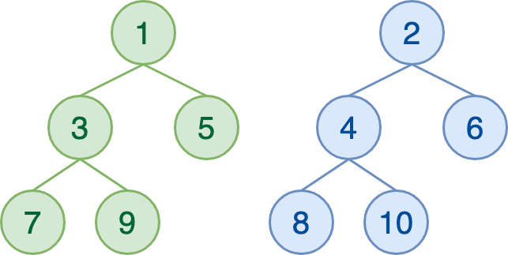
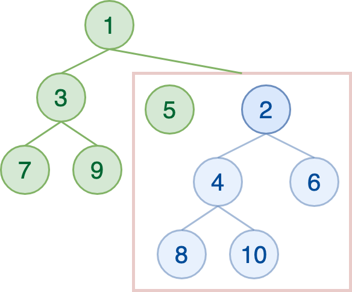
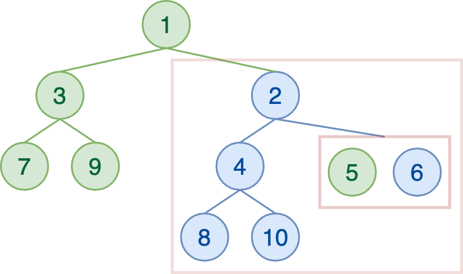
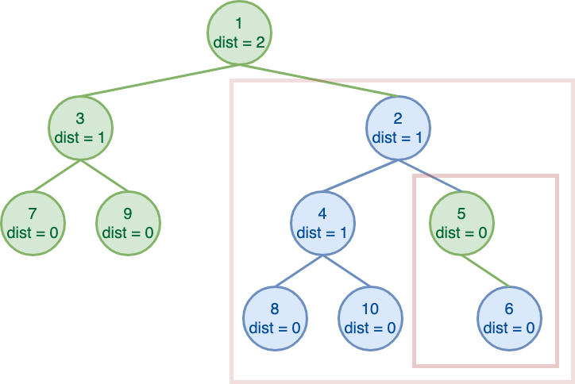
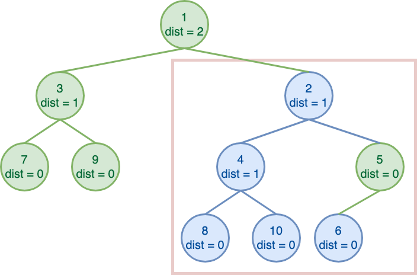
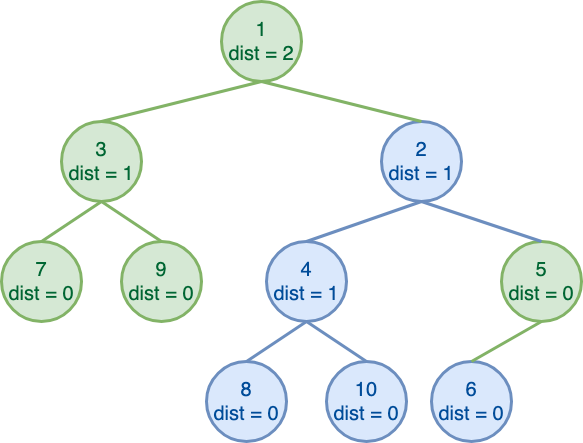
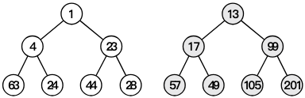
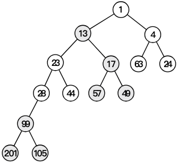

# lec4|Leftist Heaps & Skew Heaps

## Leftist Heaps

- 左斜堆，或者说左偏堆(Leftist Heap)，它相比于普通的堆，更好的一点在于它**支持快速的堆合并操作**。“左偏”，并不断将新的东西往右侧合并，来实现每次都是往相对小的那一侧塞进东西，进而相对保证了这个

- 由于左偏堆不再是一个完全二叉树，所以我们不能再像维护大根堆小跟堆那样用数组来维护它了。

- 一个左偏堆的节点维护了左右子堆的地址、自身的键值、和一个“距离(NPL)”。

```c
struct LeftistHeapNode {
    ElementType Element;
    int Npl;
    LeftistHeapNode * Left, * Right;
};

```

!!! note "Null Path Length"
    - NPL就是到**没有两个child的节点**的**最短距离**

    - **NULL**节点的Npl是**-1**

    - 如果一个节点的左孩子或右孩子为空节点，则该节点的 Npl 为 0，这种节点被称为外节点；
    
    - 如果一个节点的左孩子和右孩子都不为空，则该节点的 Npl 为 $Npl = \text{min}(Npl_{\text{left child}},Npl_{\text{right child}})+1$

- 左偏堆首先满足即堆的性质（最大堆或最小堆），其次满足「左偏」性质——节点的**左孩子的 Npl 不小于右孩子的 Npl**。

!!! note "Properties"
    1. 节点的 $Npl = Npl_{\text{right child}}+1$

    2. 如果 $Npl_i = N$，那么以`i`为根的子树至少是一个$N+1$的完美二叉树，至少有$2^{N+1}-1$个节点

    - 左偏堆通过维护整个堆“左偏”，并不断往右侧合并，来实现每次都是往 `Npl` 相对小的那一侧塞进东西，进而保证了这个堆的相对平衡性。

### Merge

- 作为左偏堆的核心操作，合并操作自然就是要在**满足性质的条件下**，合并两个左偏堆。大致思路就是**先维护堆的性质**，在**回溯时维护左偏性质**，所以实际上它是一个先自上而下再自下而上的过程。

```cpp
struct LeftistHeapNode {
    ElementType val;
    int Npl;
    LeftistHeapNode * Left, * Right;
};
```

----

递归式

- 递归式先**比较**当前两个待合并子树的根结点的**键值**，选择**较小（较大）**的那个作为根结点，其左子树依然为左子树，**右子树更新**为「右子树和另一个待合并子树的合并结果」。


```cpp
LeftistHeapNode* merge(LeftistHeapNode *x, LeftistHeapNode *y){
    // merge时一方为NULL，则说明仅剩下对方，然后递归停止
    if(x == NULL) return y;
    if(y == NULL) return x;

    // 选取 较小 的作为主根
    if(x->val > y->val)
        swap(x,y);

    // 更新的右子树就是 原右子树和对方 merge后的结果
    x->Right = merge(x->Right, y);

    // 如果左子树为空 或者 Npl小于右子树 就swap
    if(x->Left = NULL || x->Left->Npl < x->Right->Npl)
        swap(x->Left, x->Right);

    // 更新 Npl
    x->Npl = x->Right->Npl + 1;

    // x是主根，所以return x
    return x;
}
```

=== "Step 0"
    

=== "Step 1"
    
    - `1`比`2`小，因此作为主根，然后右子树拿去merge

    

=== "Step 2"

    

=== "Step 3"

    

=== "Step 4"

    - 维护左偏的性质，交换了`5`的左右子树
    
    

=== "Step 5"

    - 最后往回一步步检查是否**左偏**：
    
    - `2`的左右子树满足便不管；`1`的左右子树也满足便不管

    


## Skew Heaps

- 左偏堆的一个简单版本

- 先交换左右子树，然后在**左子树上递归merge**，直到**最后**的节点Npl为0 -> 不交换，停止

!!! note "Example"
    === "Frame 0"
        
    
    === "Frame 1"
        

---

### 摊还分析

!!! info "heavy node & light node"
    - 对于一个子堆H来说，如果 size(H.right_descendant) >= $\frac{1}{2}$size(H), 则H是 **heavy node**，否则是light node

    - 即至少一半的子节点都在右支，则为重节点

- 下面是神奇的势能函数定义

$$
\Phi(Heap)=\text{number of heavy node in} Heap
$$

- 然后我们就会发现一些性质   
    1. 如果一个节点是 heavy node，并且在其右子树发生了合并（包括翻转），那么它**一定**变为一个 light node；

    2. 如果一个节点是 light node，并且在其右子树发生了合并（包括翻转），那么它**可能**变为一个 heavy node；

    3. 合并过程中，如果一个节点的 heavy/light属性 发生变化，那么**它原先一定在堆的最右侧路径上**；


