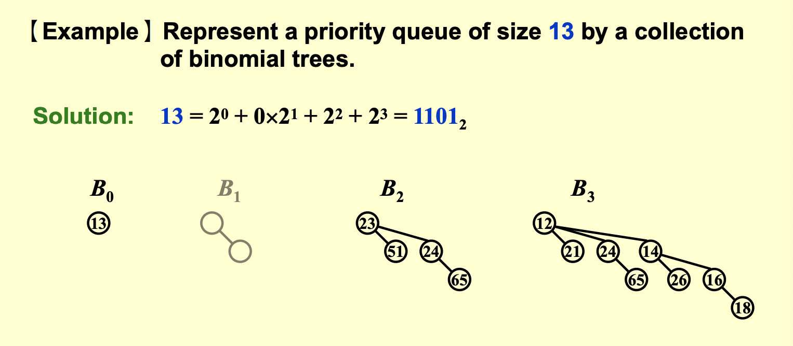
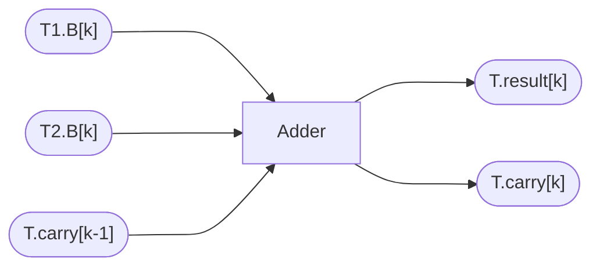
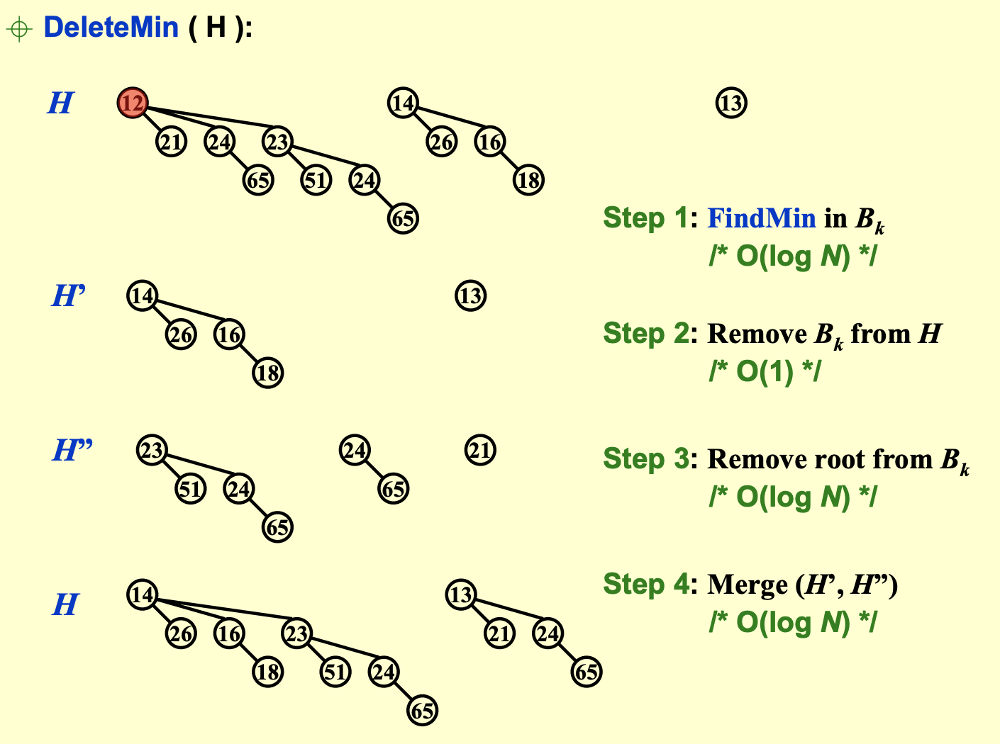
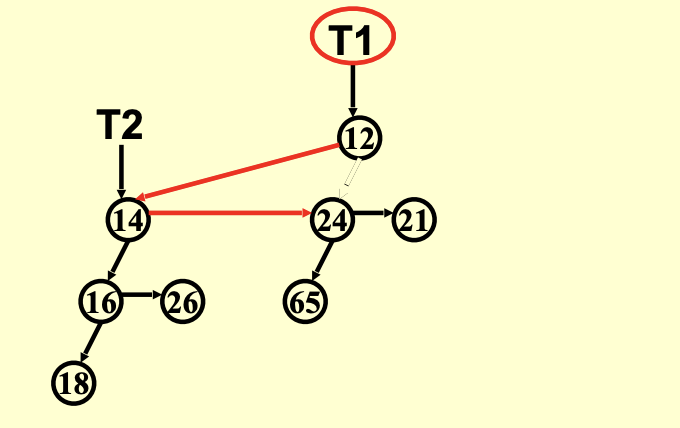

# lec5|Binomial Queue

## Binomial Queue

!!! abstract "相较于常规的优先队列，二项队列的优点" 
    - 高效的合并操作：

        - 二项队列：两个二项队列可以在 $O(log n)$ 时间内合并，其中 $n$ 是两个队列中元素的总数。这是因为二项队列由一系列二项树组成，而二项树的**合并操作类似于二进制数的加法**。
        
        - 常规优先队列（如二叉堆）：合并两个二叉堆通常需要 $O(n)$ 时间，因为需要将两个堆的元素**重新排列**成一个合法的堆。

- 一个二项队列并非一个堆排列规则的树，而是一系列堆排列规则的树的**集合**，里面的每棵树都是二项树(Binomial Tree)

!!! info "Binomial Tree"
    - 二项树满足堆的性质，即父节点的value小于（大于）子节点的value

    - 然后$k$阶二项树是**同构**的，是由两个$k-1$阶二项树**合并**而得

    

    - 关注**每一层的数量**和**总数量**，我们能够发现，这个二项树其实是一个**二项式**的具体实例;

    - 比如说：B3，其实就是一个$(1+x)^3$，分别得到每层为$C_3^0,C_3^1,C_3^2,C_3^3$

    - 即 $B_k$的第$d$层一共有$C_k^d$个节点

    - 同时，这无形间还证明了一个定理：$C_k^d=C_{k-1}^d + C_{k-1}^{d-1}$

---

- 于是，对于二项队列的理解，有个伟大的思想就是，看作是**二进制**

- 那么一个二项队列中，$k$阶二项树一定是**完整**的，而且数量为**0个或1个**；`merge`操作也就是**二进制的加法**



---

### 合并

- 合并两个二项队列，其实就是二进制数的相加，而且是一个**全加器**

- 然后当有**"carry-in"**时，合并是会有多种情况的，一共$2^3=8$种可能



!!! note "Example"
    
    
    $1011 + 1001 = 10100$
    
    最后结果一定是$B_4$和$B_2$

    我们从LSB开始，依次往前加

    === "Step 1"
        
    
    === "Step 2"

        
    
    === "Step 3"

        
    
---

### Find_Min

- 二项队列的队首，也就是整个队列的最小值（最大值），就是这若干个 $O(logN)$ 个二项树的根中最小（最大）的那个。所以其时间复杂度为 $O(logN)$ 

- 不过有时候我们也会额外**维护一个指针**，指向当前最小的那个根，此时其复杂度为$O(1)$。

### Delete_Min

分为四步

1. 在$B_k$中找到最小的root;FindMin in $B_k$ -> $O(logN)$

2. 暂时把$B_k$树从二项队列中拿走; $O(1)$

3. 将root从$B_k$中拿走，这棵二项树就分裂成**若干个小的二项树**，得到一个新的二项队列;$O(logN)$

4. 最后**merge**这两个二项队列;$O(logN)$

??? note "demo"
    

### Implementation

=== "定义与声明"

    ```c title="Definition"
    typedef struct BinNode *Position;
    typedef struct Coleection *BinQueue;
    typedef struct BinNode *BinTree;

    struct BinNode{
        ElementType Element;
        Position LeftChild;
        Position NextSibling; //二项树不是一个二叉树，所以是Leftchild + Sibling 结构
    };

    struct Collection{
        int CurrentSize; // 节点总个数
        BinTree TheTrees[MaxTrees]; //二项树的集合 
    };

    ```

=== "合并两棵二项树"

    ```c title="CombineTrees"
    BinTree CombineTrees(BinTree T1,BinTree T2){
        if(T1->Element > T2->Element){
            return CombineTrees(T2,T1);
        }

        // 把T2挪成T1的第一个孩子，这样就不用遍历第二层的NextSibling，简化了操作
        T2->NextSibling = T1->LeftChild;
        T1->LeftChild = T2;
        return T1;
    }

    ```

    

    - 不用遍历NextSibling，于是复杂度来到了$O(1)$


=== "合并"

    - 在 C 语言中，`4*!!Carry + 2*!!T2 + !!T1` 是一种常见的技巧，用于将多个布尔值组合成一个唯一的整数值。具体来说，这段代码将三个布尔值 `Carry`、`T2` 和 `T1` 组合成一个 0 到 7 之间的整数。


    ```c title="Merge"
    BinQueue Merge(BinQueue H1, BinQueueH2){
        BinTree T1,T2,Carry=NULL;
        int i,j;

        if(H1->CurrentSize + H2->CurrentSize > Capacity) ErrorMessage() //超出最大上限了

        H1->CurrentSize += H2->CurrentSize;
        for (i=0,j=1; j <= H1->CurrentSize; i++, j*=2){ //遍历每个bit，j是遍历过的总节点数；
            T1 = H1->TheTrees[i]; T2 = H2->TheTrees[i]; //从两边取出 B_i 树
            switch(4*!!Carry + 2*!!T2 + !!T1){ //相当于一个真值表
                case 0:/*000*/ 
                case 1:/*001*/ break;
                case 2:/*010*/ H1->TheTrees[i] = T2; H2->TheTrees[i]=NULL;break //最后我们return的是H1，所以把结果都挪到H1上
                case 3:/*011*/ Carry=CombineTrees(T1,T2);H1->TheTrees[i]=H2->TheTrees[i]=NULL;break;
                case 4:/*100*/ H1->TheTrees[i]=Carry;Carry=NULL;break;
                case 5:/*101*/ Carry=CombineTrees(Carry,T1);H1->TheTrees[i]=NULL;break;
                case 6:/*110*/ Carry=CombineTrees(Carry,T2);H2->TheTrees[i]=NULL;break;
                case 7:/*111*/ H1->TheTrees[i]=Carry;Carry=CombineTrees(T1,T2);H2->TheTrees[i]=NULL;break;
            }
        }
        return H1;
    }

    ```

---