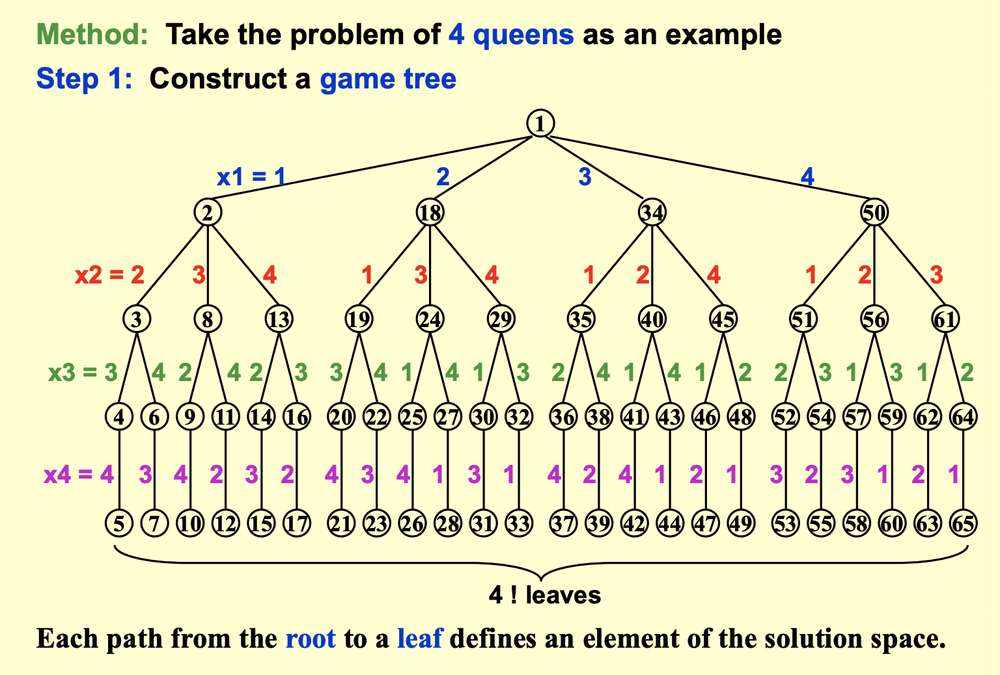
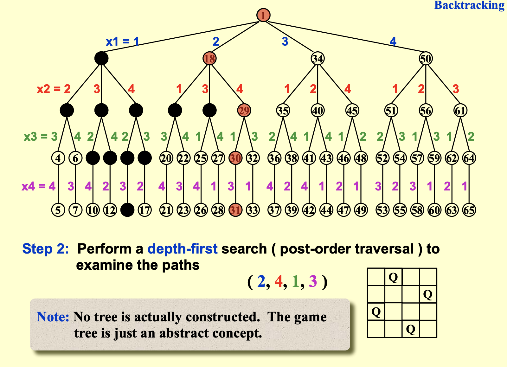
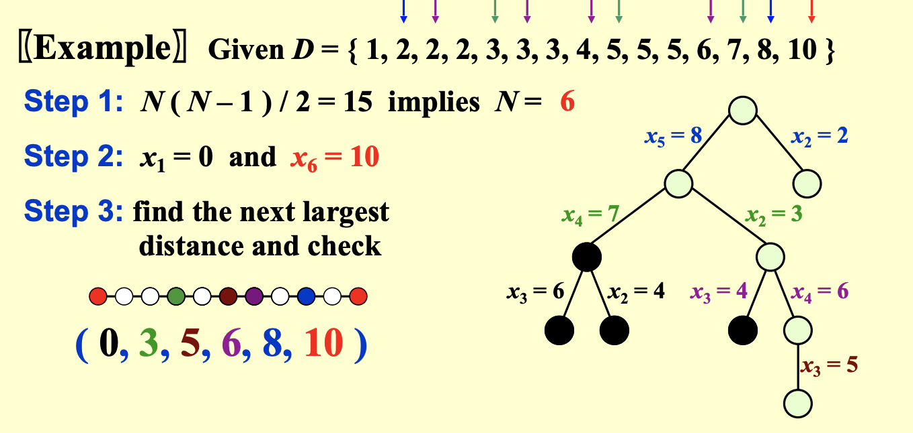
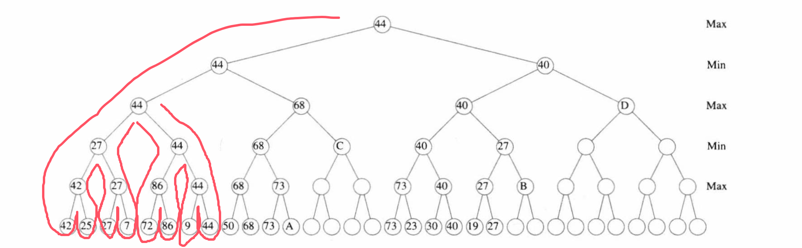
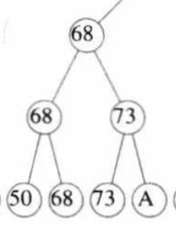

# lec6|Search & Backtracing

## BFS & DFS

=== "BFS"
    - 完整性：yes
    
    - 最优性(optimality)：如果所有边cost相等，则能找到

    - $T(b,d) = O(b^d)$

    - $S(b,d) = O(b^d)$ 

=== "DFS"

    - 完整性：no；DFS 不保证找到所有解，特别是在存在环的图中可能会陷入无限循环。
    
    - 最优性(optimality)：no

    - $T(b,d) = O(b^d)$

    - $S(b,d) = O(bd)$ 
 

## Backtracing

- 回溯算法是一种系统地**搜索问题解空间**的算法设计范式。如果发现当前**候选解不满足问题的约束条件**，则**回溯**到上一步并尝试其他候选解。

- 剪枝(pruning) 就是优化解空间，排除掉不必要的计算，减少搜索量

## 例：八皇后
    
- 八皇后是一个用回溯算法来解决的经典问题

- 我们通过约束条件剪枝，可以把复杂度从$n^n$降到$n!$

- 下面以四皇后为例来找到可行解





- 在进行DFS的同时，判断是否满足四皇后的条件，就不用遍历到`leaf`了


---

## 例：收费站重建问题
    
- 在$x$轴上给定$N$个点，并且它们的坐标满足$x_1 < x_2 <...< x_N$，假设$x_1=0$，那么两两点之间共有$\frac{N(N-1)}{2}$个距离值

- 给定距离的集合$D$

- 我们一定能确定$x_1$和$x_N$的坐标，然后下面就是通过剩余的距离值，来确定剩下的$N-2$个点，保证他们之间能满足$D$集合

- 然后我们可以构建一个树来求解，每个节点的子节点一定是当前剩余的**最近的点**和**最远的点**



```cpp title="Reconstruct"
bool Reconstruct(DistType X[], DistSet D, int N, int left, int right){
// D是dist中剩余可用的距离
// 这是x[1]~x[left-1] 和x[right]~x[N]都已经解出来的情况下
    
    bool Found = false;
    if(Is_Empty(D))
        return true;
    D_max = Find_Max(D)
    // 选择一：X[right]=D_max
    // 检查一下这种选择下，dist是不是合理
    OK = Check(D_max, N, left, right);
    if(OK){ // 添加x[right] 并且更新 D
        X[right] = D_max;
        for (i=1;i<left;i++) Delete(X[right]-X[i],D);
        for (i=right+1;i<=N;i++) Delete(X[i]-X[right],D);
        Found = Reconstruct(X,D,N,left,right-1);
        // 看看是不是正确的路
        // 如果不是那就回溯（撤销）
        if(!Found){
        for (i=1;i<left;i++) Insert(X[right]-X[i],D);
        for (i=right+1;i<=N;i++) Insert(X[i]-X[right],D);     
        }
    }
    // 当选择1没有走成功时
    // 走选择2：x[left]=x[N]-D_max
    if(!Found){
        X[left] = X[N] - D_max;
        for (i=1;i<left;i++) Delete(X[left]-X[i],D);
        for (i=right+1;i<=N;i++) Delete(X[i]-X[left],D);
        Found = Reconstruct(X,D,N,left+1,right);
        if(!Found){
        for (i=1;i<left;i++) Insert(X[right]-X[i],D);
        for (i=right+1;i<=N;i++) Insert(X[i]-X[right],D);    
        }
    }
    return Found;
}
```

## 博弈

- 下面以井字棋（tic-tac-toe）为例，来分析一个博弈模型

!!! info "什么是博弈"
    - 像下棋这种，我一步对方一步的对峙方式，就是博弈

    - 每一步博弈都必然会有很多不同的下一步分支

    - 而我们把每一步的局面评估一个分数，再结合所有的分支就可以构筑一棵博弈树


!!! info "MinMax 与 MaxMin"
    - MinMax和MaxMin其实就是两个非常聪明的人，在决策时总会选择对自己最有利的方式

    - 假设一方丢分一方得分

    - 那么想要得分的人一定会选择局面中**分最大**的选择，而丢分的人会紧接着选出在上一个选择下**分最小**的分支

- 我们在搜索最终局面时，是从上往下搜索的，那么整棵博弈树其实是**从下往上构筑**的；因为只有知道了孩子的情况，父节点才能得出自己相应的最优解；

- 博弈树的`root`，其实就是**起手**的这个人（在双方都最聪明的情况下）所能拿到的最优解（最高分或者最低分）


### α&β剪枝

!!! info "Reference"
    [从minimax到alpha-beta剪枝算法(中)：alpha-beta剪枝原理详解](https://www.bilibili.com/video/BV1yG411o7uH?spm_id_from=333.788.player.switch&vd_source=09de771bb3c2015589e30290692baf80)


- 于是我们会发现，一棵包含所有情况的博弈树实在是太大了

- 但是又会发现，在构筑也就是**回溯过程**中，实际上对于一个MinMax(MaxMin)的两个人来说，有些**路径**最后是绝对**不会影响**`root`值的；

---


- 构筑过程其实就是按**红线**的顺序来**回溯**搜索

- 我们引入一个思想，对于`min`的节点来说默认值是$\infty$，它只要搜到一个子节点比自己小就会改变自身；对于`max`节点来说默认值是$-\infty$，他只要搜到一个子节点比自己大就会改变自身

- 那么看下面的案例，我们就会理解为什么有点节点会被“嫌弃”，即没有搜索的必要而被剪枝

!!! note "A号被剪枝的原因"
    

    - 我们关注回溯过程，会发现这个子树先从`50`开搜，然后是`68`，因而上面的`max`父节点变成了`68`，随之上面的`min`父节点也变成了`68`

    - 继续搜右边，先搜到`73`，然后`max`父节点随之变为`73`；此时它的父节点也就是现在的`68`，它肯定不想再继续搜了，因为继续搜A只会使得`73`变成一个更大的数或者不变，这对`68`来说没有意义，它反正最终也还会是`68`