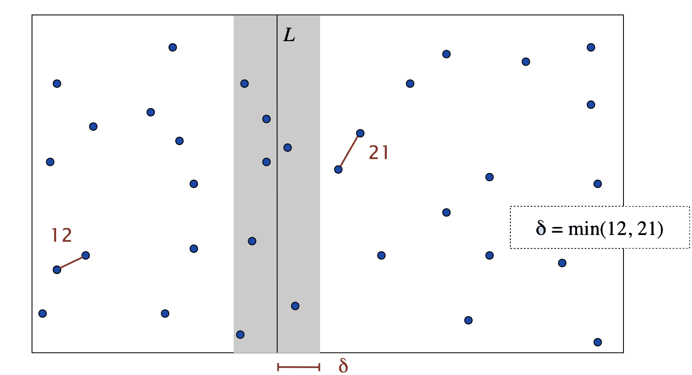
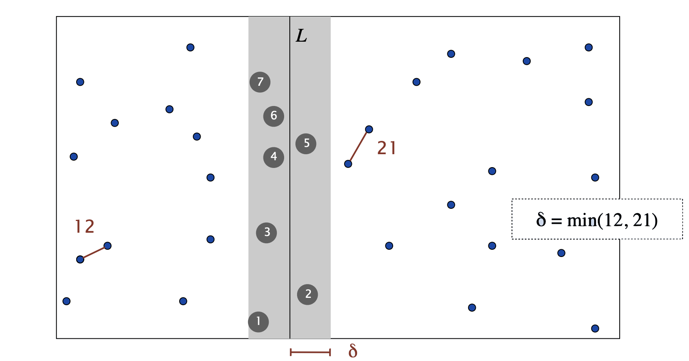
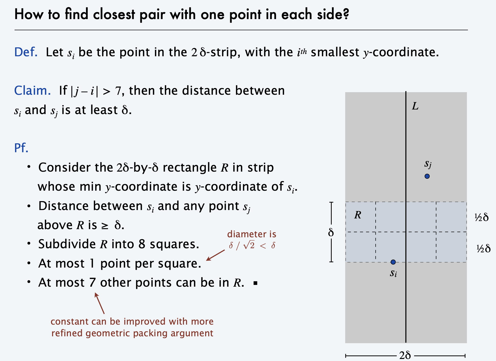
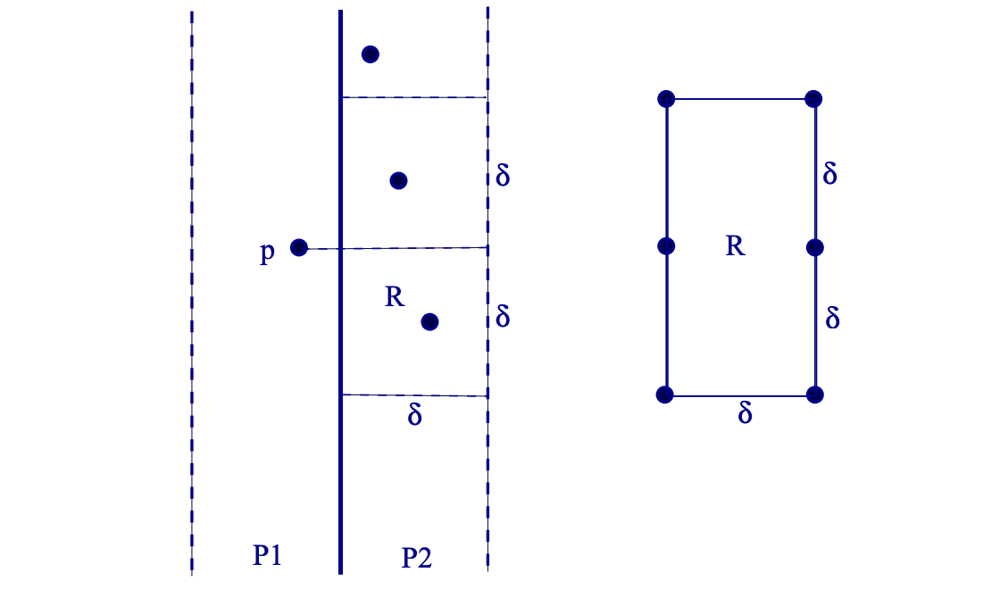
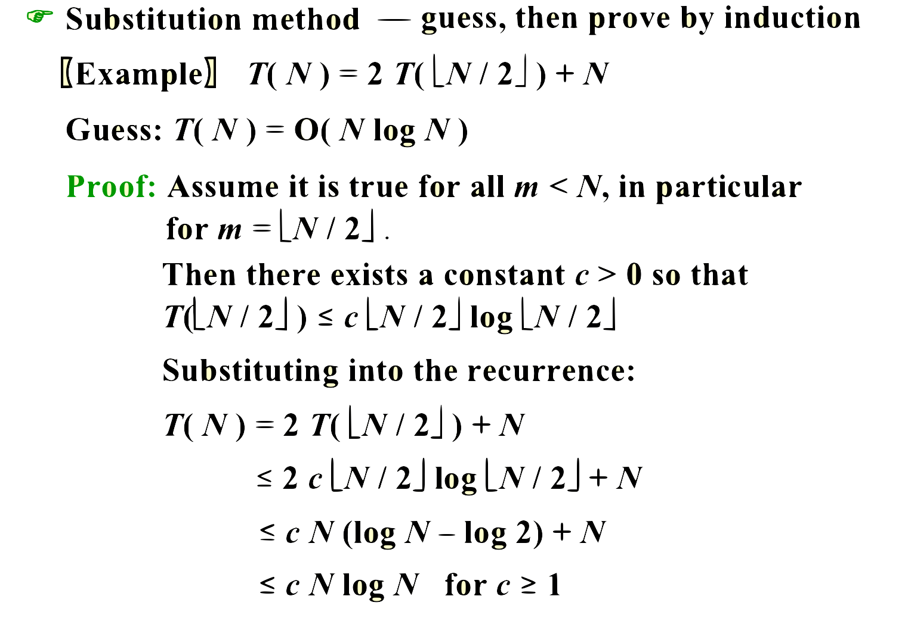
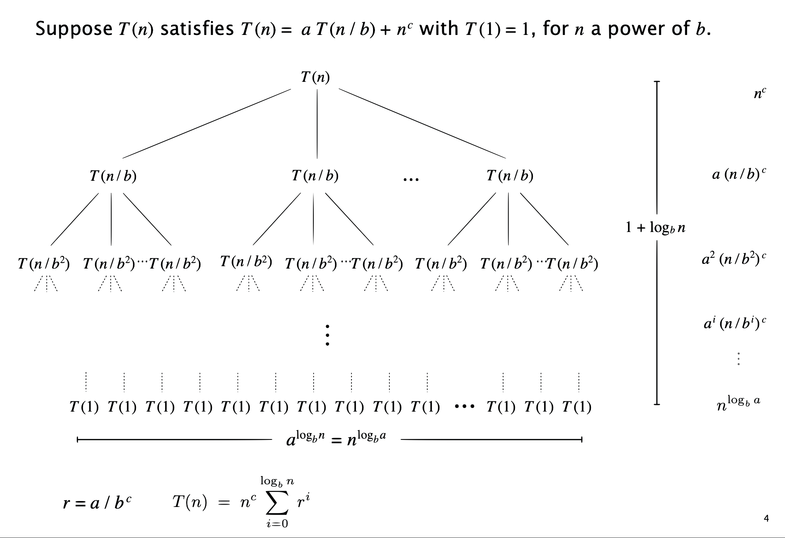
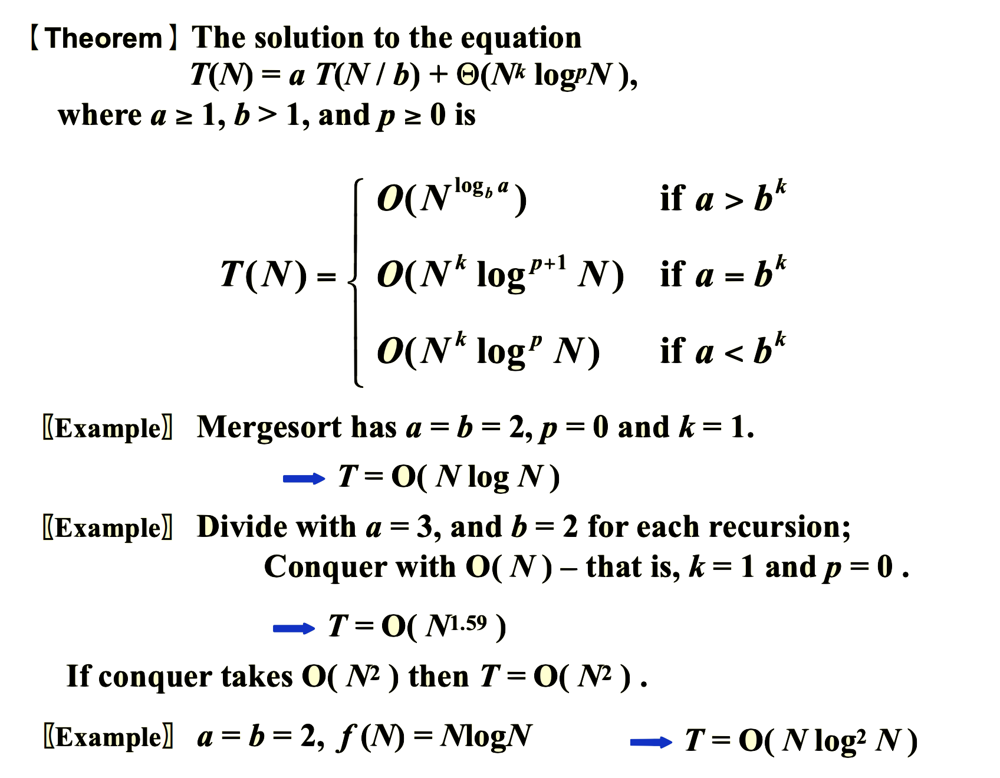
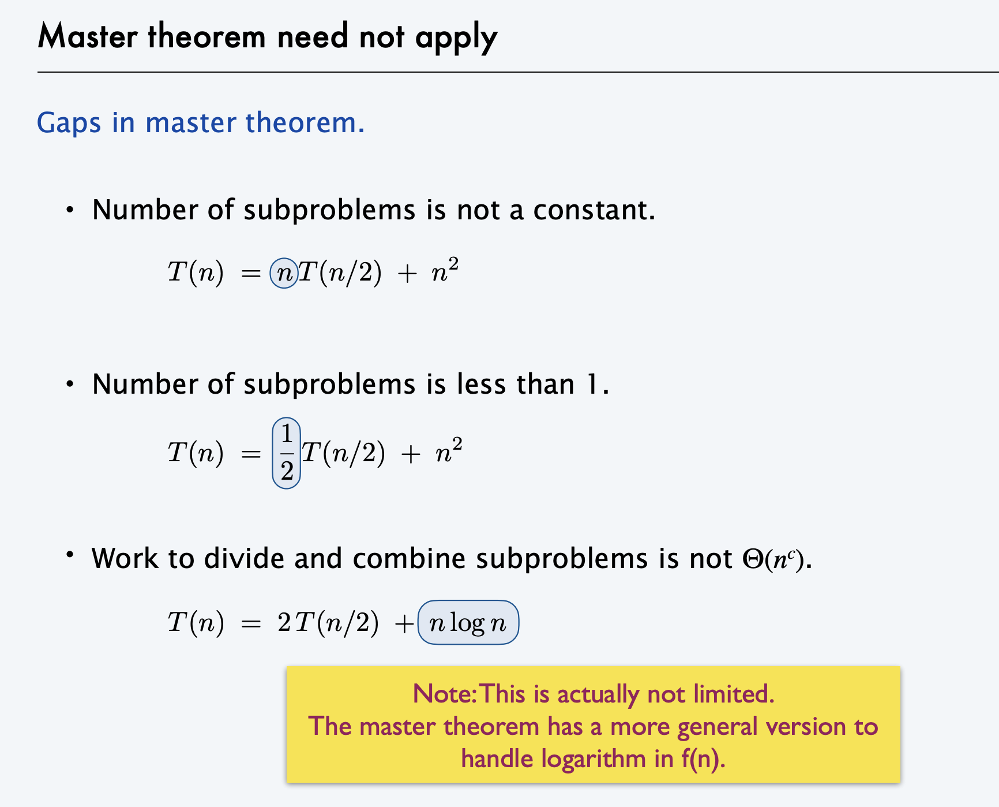

# lec7|Divide & Conquer

!!! abstract "ADS课中的重点"
    - 本节的重点实际上并不是聚焦于分治本身，而是其**复杂度分析**

---

## Closet Points Problem

- 二维最近点问题(Closet Points Problem)，指的是给定平面上的 n 个点，找出其中距离最近的两个点。

- 最朴素的方法肯定是枚举，也就是$C_N^2 = \frac{N(N-1)}{2}$的可能性，复杂度为$O(N^2)$

### 分治法

- 我们来类比**最大子序列和问题**中我们的分治做法

??? tip "最大子序列和的分治做法"
    1. 将序列分为左右两部分，分别求解它们的最大子序列和
    
    2. 求解跨越了**中点**的最大子序列和

    3. 最后取三者的最大值

- 类似的，我们将平面分为两部分，并分别求解它们的**最近点距离**

- 以下图为例，假设我们已经求出来了两侧最近点距离，分别为12和21

- 那么类似的，我们来到下一步：求解中间部分的最近距离点

- 由于有上一步作铺垫，我们实际上可以省去一些功夫，只需要考虑在$X$方向上左右各$\delta=\text{min}\{12,21\}$大小的区域即可

??? tip "为什么只考虑$\delta$区域"
    - 因为我们想要找的有意义的点，那必定是距离小于$\delta$的点

    - 那么在**中线的一侧**的$\delta$区域内的点，距离一定>=12（毕竟单侧的点对距离最小就是12）

    - 那么只有可能是在灰色区域内的，**一左一右**的点形成的点对，才可能比$\delta$这个暂时的最小距离更小

---

- 下面对于这个灰色区域最近点对的求解很有**技巧性**，此处的复杂度并非$O(n^2)$，而是$O(n)$

- 我们将这些点按$Y$方向的坐标进行排序，得到序列$s_1...s_i...s_j...$

- 对于这个序列中的点，我们取出一个特殊的$\delta \times 2\delta$的矩阵

- 我们将**一个点**的周围划分为**8个格子**

- 如果最坏最坏的情况下，所有的点之间都维持了至少$\delta$距离这一“属性”，那么这八个格子中**最多只能装六个点**

- 那么对于每个单独的点只需要和临近的6个点比较就好了，一共是$6n/2$；得到$O(N)的复杂度$

## 复杂度分析

$$
T(N)=aT(\frac{N}{b})+f(N)~~a,b \in Z^+
$$

- 分治的时间复杂度往往满足这样的公式；我们的任务就是求解形如这样的递推公式

---

### 代换法

- **代换法**(substitution method)的思路非常直白，首先我们通过“某些手段”来得到一个预设的结果，接下来通过代入、**归纳**的方法来证明这个结果。

- 注意假定的常数**c**必须是**全程不变的同一个常数**

### 递归树法

- **递归树法**(recursion-tree method)的思路是，我们通过**画出递归树**来分析算法的时间复杂度，实际上和直接数学推理的区别不是很大，主要就是通过观察递归过程中数据增长的模式来进行分析。

??? tip "数学上的工具"
    
    $$
    a^{log_bN} = exp^{\frac{lnN}{lnb}lna}=exp^{\frac{lna}{lnb}lnN}=N^{log_ba}
    $$

### 主方法

- 公式法！

- 还是用递归树来理解主方法最好；对于这个公式$T(n)=aT(\frac{n}{b})+f(n)$，可以画出这样的树

---

!!! tip "master theorem"
    
    

    - 证明就不补了，很复杂

    !!! warning "不能应用的情况"
        

---

!!! note "一道作业题"
    - Which one of the following is the lowest upper bound of $T(n)$ for the following recursion $T(n) = 2T(\sqrt{n})+\text{log}n$

    A.$O(lognloglogn)$, B.$O(log^2n)$, C.$O(nlogn)$, D.$O(n^2)$

    ??? tip "答案"
        - 这个不能用主定理，就只能慢慢拆到最后的常数

        - 由于这里是一直对n开根，开到最后不能是1，所以我们随意选取一个大于1的整数，比如说2

        - 那么一项一项推就会得到：$T(n)=2^kT(n^{\frac{1}{2^k}})+klogn$

        - $n^{\frac{1}{2^k}}=2$，解得$k=O(loglogn)$

        - 因此$T(n)=O(logn+logn\cdot loglogn)=O(logn\cdot loglogn)$

