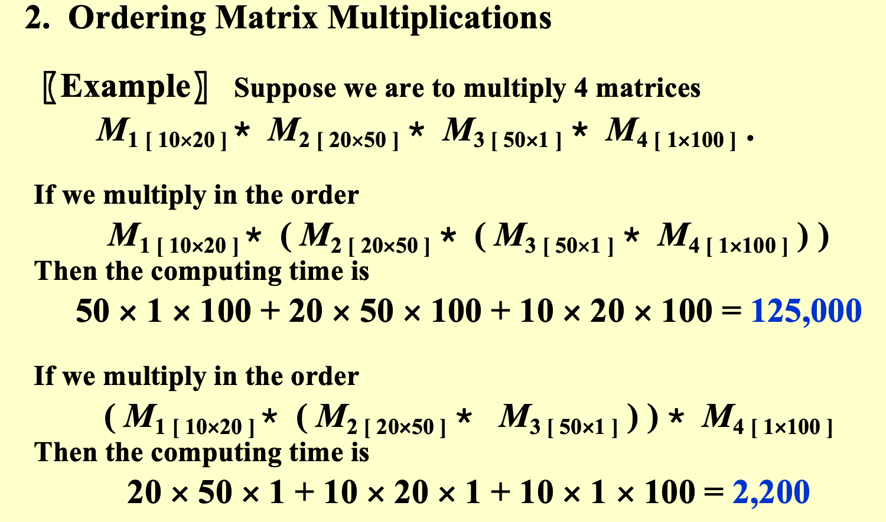
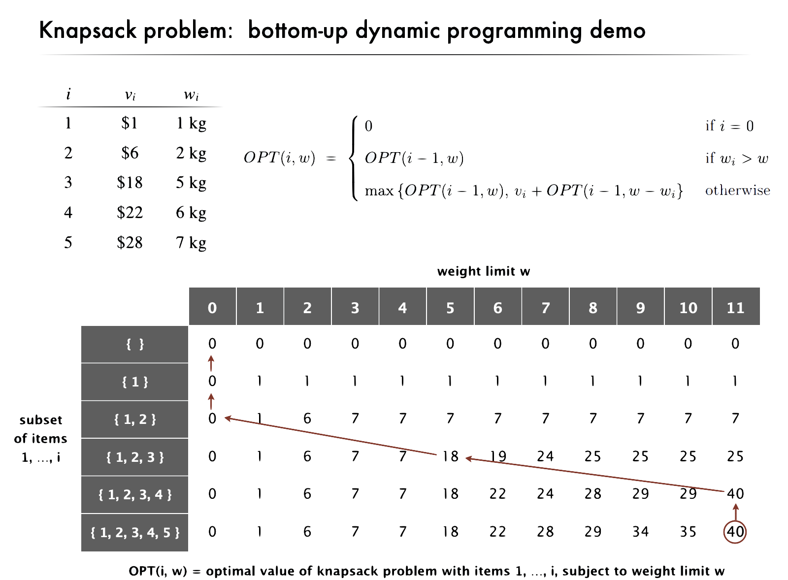

# lec8|Dynamic Programming

> "Those who cannot remember the past are condemned to repeat it."

- 拆分为子问题，然后将子问题的结果存入一个table

- 前面的**最优解**可以作用于后面的最优解


## 例：斐波那契数列

```c title="递归"
int Fib(int N){
    if(N<=1)
        return 1;
    else
        return Fib(N-1) + Fib(N-2);
}
```

```c title="优解"
int Fib(int N){
    int i, Last, NextToLast, Answer;
    if(N<=1) return 1;
    Last = NextToLast = 1;
    for (i = 2; i <= N; i++){
        Answer = Last + NextToLast;
        NextToLast = Last; Last = Answer;
    }
    return Answer
}
```

----

## 例：最优矩阵乘法顺序

- 给定好几个矩阵相乘的式子，不同顺序的矩阵先后运算会极大影响矩阵乘法的**计算量**



---

- 为了解决这个问题，我们先来研究$N$个矩阵之间，到底有多少种相乘的方式；这其实就变成了一个**打括号**的问题，我们着眼于最后一个括号怎么打，它一定是在$M_1$左侧，$M_n$右侧；也就是$(M_1,M_2...M_n)$

- 那么它的子问题，可以划分成，在中间再打上两个括号，比如$(M_1,M_2)(M_3...M_n)$

- 所以，我们引入一个量$b_n$表示$N$个矩阵相乘的运算方式数量；由上面的推导可以得知：$b_n=\sum_{i=1}^{n-1}b_i\cdot b_{n-i}$

??? tip "结论：卡特兰数"
    $$
    b_n = O(\frac{4^n}{n\sqrt{n}})
    $$

- 很好，我们现在知道了矩阵乘法的划分方式，其实按照同样思路就可以构造出**计算量**的dp方程

$$
dp[i][j]=min_{i\leq l < j}\{dp[i][l]+dp[l+1][j]+w_{最后这两个矩阵相乘的计算量}\}
$$


## 例：最优二叉搜索树

??? note "概念"
    - 最优二叉搜索树(Optimal Binary Search Tree)是仅用于**静态搜索**的最佳的二叉搜索树（它不能insert和delete）

- 给定$N$个按字典序排列的词$w_1< w_2<...< w_n $，然后访问某个词的概率是$p_i$，现在我们要把这些词安放在二叉搜索树中，使得查找某个词所花的期望时间最小

- **expected total access time**：$T(N)\sum p_i(1+d_i)$，和这个词的深度有关

- 现在我们开始尝试构造最优的树，ppt上给了两个例子分别是用greedy的方法和avl的方法，但都不是最优解

- 我们尝试用dp的方式：这个dp方程怎么构造，可以思考一下最后状态的转移，就是转移到**左右子树**上，谁作**根**又是一个待定，于是就可以想出这么一个方程

$$
dp[i][j] = min_{i\leq l < j}\{dp[i][l-1]+dp[l+1][j] + w_{ij}  \}, w_{ij}=\sum_{i}^j p_i
$$

---

## 例：All-Pairs 最短路径

- 以前我们学过**dijkstra**算法，是解决给定起点的最短路径问题；现在我们欲计算**所有节点间**的最短距离，那么naive的思路就是用n次dijkstra，这不是这次的重点，我们采用dp的思想来解决，也就是**Floyd**算法

- 我们试图沿用之前的思路，在两个节点间找一个中间节点作为跳板，得到状态方程：

$$
dp[i][j] = min_{i\leq l < j}\{dp[i][l]+dp[l][j]\}
$$

- 但是很可惜，这个算法是**错误**的，因为我们并没有把问题规模划分为更小的子问题；我在计算这个状态时，可能需要的上个状态根本没有计算出来！！！

- 问题就出在，作为中间跳台的节点个数是不定的，两两之间皆是如此，问题规模不定，并没有随着转移而变小；所以我们限定好作为中间跳台的节点，添加一维状态量$k$，表示使用的节点都是$v_l, l\leq k$

$$
dp[k][i][j] = 
$$

## 例：背包问题

??? tip "概念"
    - 背包问题，就是“抢劫问题”（

    - 在有限的空间内，装下最值钱的东西

小聪明之拆分成 $OPT(i,w)= \text{optimal value of knapsack problem with items} 1, …, i\text{subject to weight limit} w.$




？？？为什么$O(nW)$是伪多项式时间

---


## 例：Rod-cutting Problem

- 给定一根长度为 $N$ 的杆和一个价格表$P_L,L=1,2,...,M$，其中价格表 $P_i$ 表示长度为$i$的杆的价格。目标是将这根杆切割成若干段，使得这些段的总价格$R_N$最大化。

- 例如下面这个价格表：如果我们要卖一根长为8的杆，最佳的切法是分成长为2和6的部分；如果我们要卖一根长为3的杆，最好的办法就是不切割

|Length $L$|1|2|3|4|5|6|7|8|
|---|---|---|---|---|---|---|---|---|
|Price $P_L$|1|5|8|9|10|17|17|20|

!!! tip "状态转移方程"
    当$N\leq M$，$R_N=\text{max}\{P_N,\text{max}_{1\leq i \leq N}\{R_i+R_{N-i}\}\}$

    当$N > M$，$R_N=\text{max}_{1\leq i \leq N}\{R_i+R_{N-i}\}$

- 这个算法的时间复杂度为$O(N^2)$，因为有两个嵌套的循环，每层循环范围是$N$