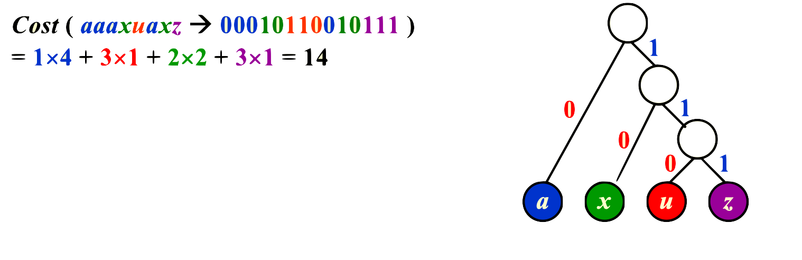

# lec9|Greedy Algorithm

## 例：Activity Selection Problem

> 每一个贪心背后都有一个动态规划

- 这个问题我们还是先用DP来看

- 我们先把所有课程按照**最早的结束时间**来进行一个**排序**，得到序列$a_1,a_2...a_n$

=== "DP1"
    - 第一种方法：我们定义状态为$f(i,j)$表示$a_i,a_j$之间能选到的最多的课程数；于是我们可以把这个状态转移到子结构上，于是我们就考虑选中中间的一节课$a_k$

    

    ---

    - 然后我们来思考这个方法的问题所在，假设有三门课我是必选中的，记作$a_i,a_k,a_j$，那么在计算dp的过程中，我们可能是先考虑$i,j$范围的时候碰见了$a_k$，也可能是在比$i,k$更大的范围中计算时碰到了$a_j$，那么这样的计算就是冗余的！

    - 之所以产生这样的冗余，是因为这个问题是找一个最优的**集合**，但是我们在计算dp的过程中却是按照某种顺序，找到了一个最优的**序列**；自然就会有冗余的产生

    - 处理方法就是要强行给查找安排一个从大到小（从小到大）的查找顺序，这样就能把**序列**扭转成**集合**

    - 但这还不是最优的方法，见**DP2**

=== "DP2"
    - 第二种方法：$f(n)$表示从$a_1$到$a_n$的最优选择；那么我们构造转移方程的时候，关注最后一个选出的dp

    - 也就是$f(n)$有两种情况，选择它或者不选它，$f(n)=\text{max}\{f(k)+1,f(n-1)\}$，$a_k$是在$a_n$前离它最近的一门课（显然是必须是相容的两者）

    - 这样看似很完美的dp，还是会有冗余

    ??? tip "为什么还有冗余"
        - 举个例子：假设只有$a_1,a_2,a_3$，其中$a_1,a_2$不相容，$a_3$和两者都相容，最优解一定含有$a_3$

        - 那么$f(3)$就来自于$f(2)$，而$f(2)$来自$f(1)$，也就是说$f(1)$->$f(2)$->$f(3)$，但是我们可以发现明明可以一步从$f(1)$->$f(3)$


---

## 贪心法的证明

1. 证明首个贪心的元素，一定包含在最优解里面（一般就去看，如果存在最优解，那么能不能用首个贪心元素替换）

2. 然后再递归地对于子结构进行类似的替换

## 例：Huffman Codes 

- **霍夫曼编码（Huffman Coding）**是一种用于**数据压缩**的无损编码算法。它通过使用**变长编码**来表示字符，使得出现频率较高的字符使用较短的编码，出现频率较低的字符使用较长的编码，从而减少整体编码长度。


- 给定一个文本，其中含有$a,u,x,z$四种字符，其中他们出现的频率由大到小为$a,x,u,z$，现在我们来考虑用二进制的编码和huffman编码，比较它们的cost




- Huffman code巧妙在不同字符之间在编码树中不是父子关系，因而是唯一编码的

### Huffman's Algorithm

- 要实现这种编码方式，会用到Huffman's Algorithm，一种**贪心算法**

```cpp
void Huffman (PriorityQueue heap[], int C){
    consider C characters as C nodes, 
    and initialize them into a min heap;
    for (int i = 1; i < C; i++){
        create a new node;
        deleteMin and attach it to the left_child;
        deleteMin and attach it to the right_child;
        weight of node = sum of weights of its children;
        insert node into min heap;
    }
}
```

- 解释：我们每次都取频率最低的两个字符，然后合二为一，放回去；如此重复，一棵树就能构建出来


=== "Step 1"
    

=== "Step 2"
    

=== "Step 3"
    

=== "Step 4"
    

=== "Step 5"
    

----------

