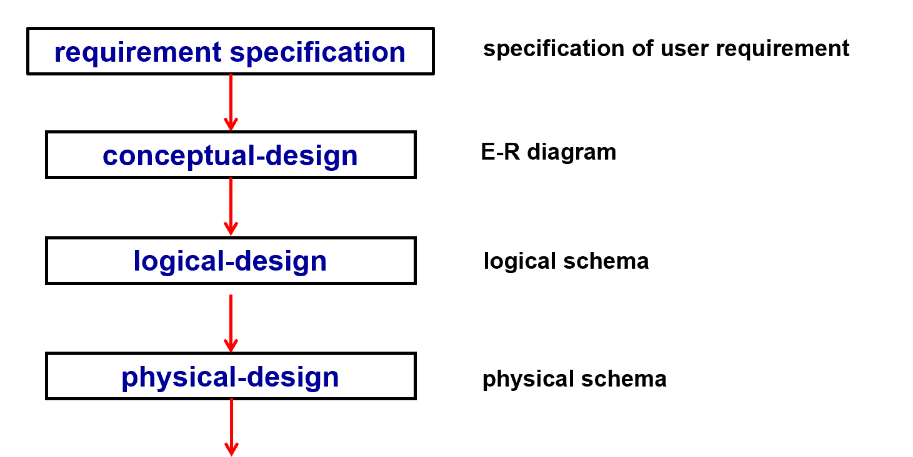
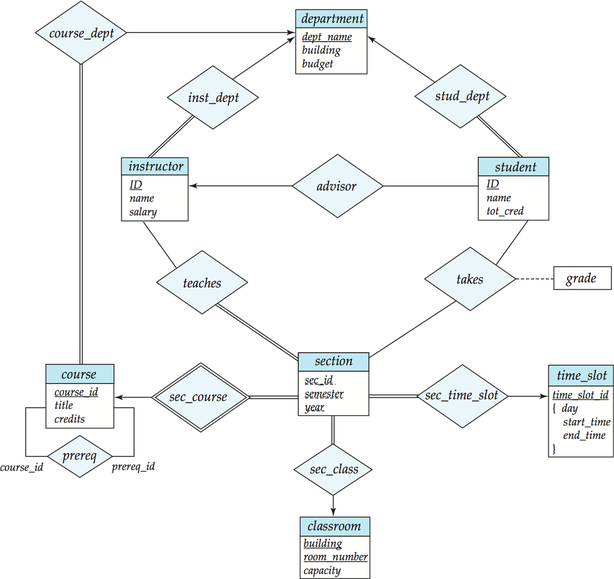
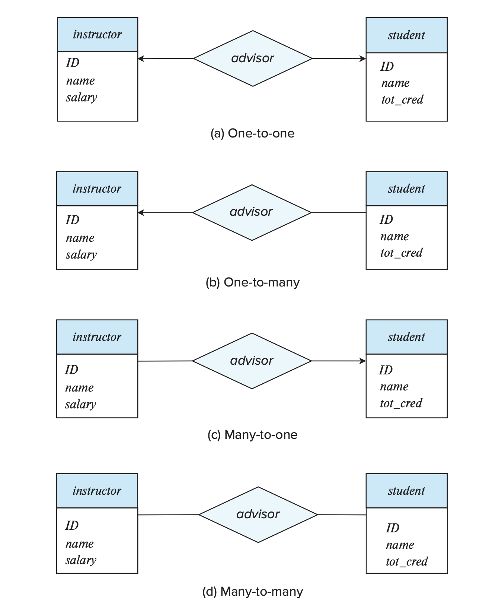
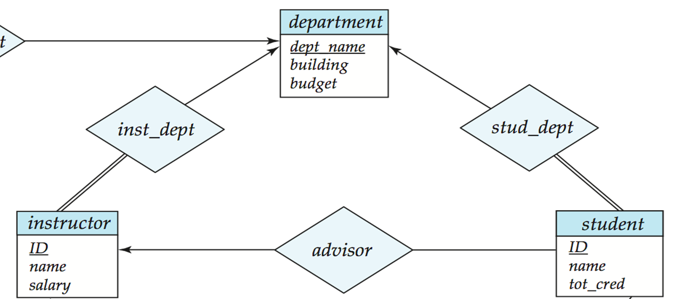
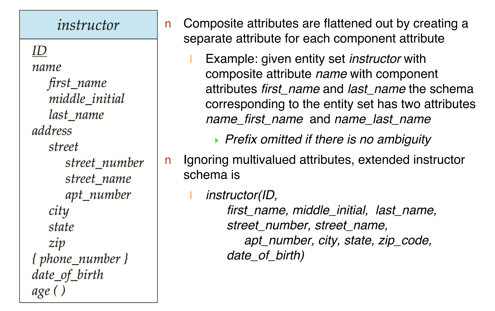
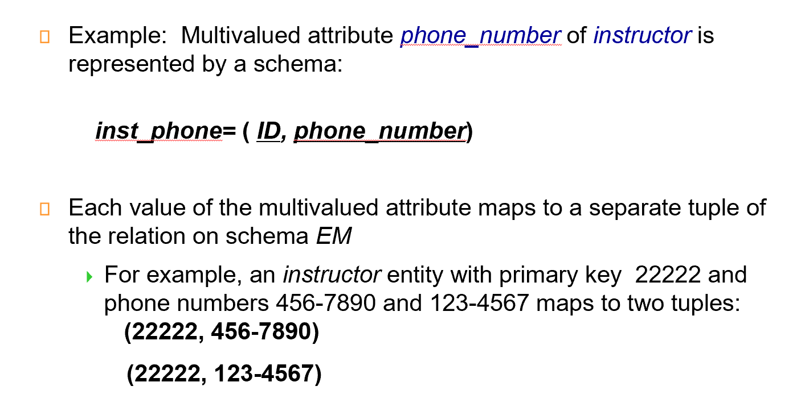
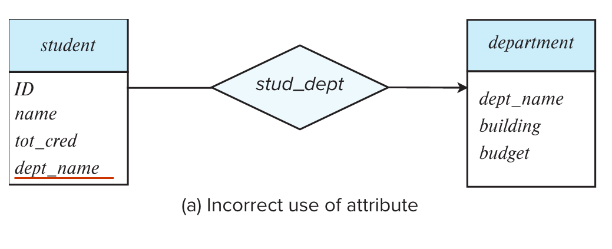
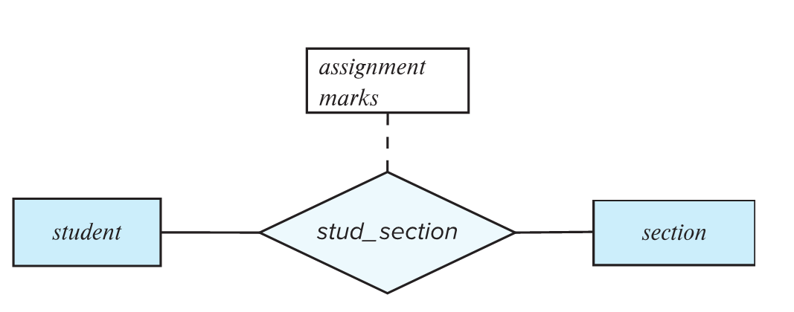
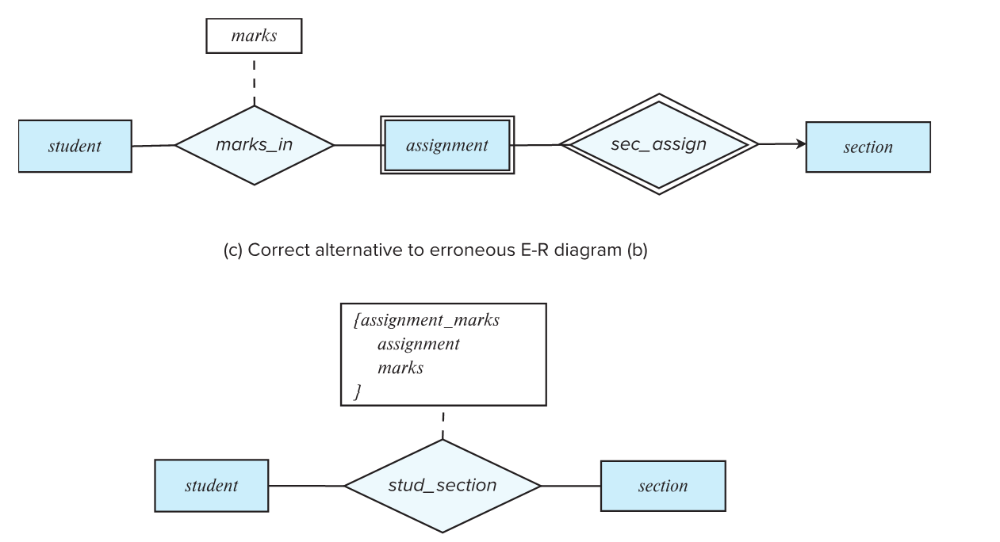

# Entity-Relationship Model

## E-R Diagram Example





### 图例解读

- 一个方形框就是一个**实体的集合(entity set)**，下面列出其属性。

- 实体与实体之间有关系，一个菱形框表示**关系(relationship)**。

    - 一对一是双箭头($\leftrightarrow$)，一对多/多对一为单箭头($\leftarrow,\rightarrow$)。箭头的**来源**是primary key

- 单横线与双横线：

    - 双横线表示每个对象都必须参与关系，而单横线则表示对象可以不参与关系。如 `inst_dept` 中如果 `department-inst_dep` 为双横线，则表示每一个系都要有老师。


- `section` 不足以唯一确定元组，称为弱实体，依赖于另一个实体（如 OOP、DB 都可以有同样年份学期的 1 班）。因为课程号 `course_id` 放在 `section` 会有冗余，因此没有这个属性，导致形成了一个弱实体。 `sec_course` 表示联系的是弱实体（双框），`section` 不能离开 `course` 存在。

- `relationship` 上也可以带属性，如 `takes` 上的 `grade`.

- 关系双方可以是相同的实体集合，`course` 这里的 `prereq` 是多对多，表示一门课可以有多门预修课，一门课也可以是多门课的预修课。`{}` 里面是多个值，表示复合属性。这里表示 `time_slot_id` 实际上可以由这三个属性复合而成。

---

### 总结




## ER图转换成Schema

- “强实体集”（可以独立存在的实体，拥有自己的主键），那么在转换成关系模式时，它会变成一个 表格 (schema)，这个表格的 列 (attributes) 就是这个实体集在 ER 图中拥有的属性。

- “弱实体集”（依赖于另一个“强实体集”而存在，没有自己的主键），那么在转换成关系模式时，它也会变成一个表格。这个表格会包含以下内容：

    - 识别它的强实体集的主键 (**Primary Key of the Identifying Strong Entity Set**): 因为弱实体依赖于强实体，所以需要通过强实体的主键来关联它们。

    - 弱实体集的分辨符 (Discriminator of the Weak Entity Set): 弱实体集自身可能有一些属性，这些属性在同一个强实体的上下文中可以唯一标识一个弱实体实例。这些属性被称为“分辨符”。

    - 表格的主键 (Primary Key of the Table): 这个表格的主键是由 **弱实体集的分辨符** 和 **识别它的强实体集的主键** 组合而成的。

- “多对多关系集”（两个实体集中的每个实体可以与另一个实体集中的多个实体相关联），那么在转换成关系模式时，这个关系集会变成一个新的表格。这个表格会包含以下内容：

    - 参与关系的**两个**实体集的主键 (Primary Keys of the Two Participating Entity Sets): 这两个主键用来表示哪些实体之间存在这种关系。

    - 关系集的**描述性属性** (Descriptive Attributes of the Relationship Set): 有些关系本身可能也有一些属性，例如，学生选修课程的关系，可能有一个属性是“成绩”。这些属性也会成为新表格的列。

- “多对一”可以直接在“多”的那个表加上“一”的主键，也可以单独建表

    

    - `inst_dept` 本质就是将 `instructor` 和 `department` 合并，在 `instrutor` 的属性上添加 `dept_name`.

    ```sql
    department(dept_name, building, budget)
    instructor(ID,name,salary)
    inst_dept(ID, dept_name)
    // 转换后（即合并）
    department(dept_name, building, budget)
    instructor(ID, name, salary, dept_name)
    ```

    - 各有利弊，第一种写法表可能会太多，第二种写法合在一起表可能太大，不利于管理。


---

### Composite属性

- 就像在 C 语言里定义一个结构。但是关系数据库里每个属性都必须是简单数据类型，就必须把这些复合属性铺平。




--- 

### Multivalued属性

- 所有的Multivalued属性，我们都需要为它单独建表，就比如一个人有好几个电话号码，那么就需要单独建表`inst_phone = (ID, phone_number)`



## 设计时的注意点

### ER图的常见错误

- 信息冗余：
    

    - student 的 dept_name 应该去掉

---

- 关系属性使用不当：

    

    - 这里一门课可能有很多次作业，不能只用一个实体。正确的应该是：  

    


---


