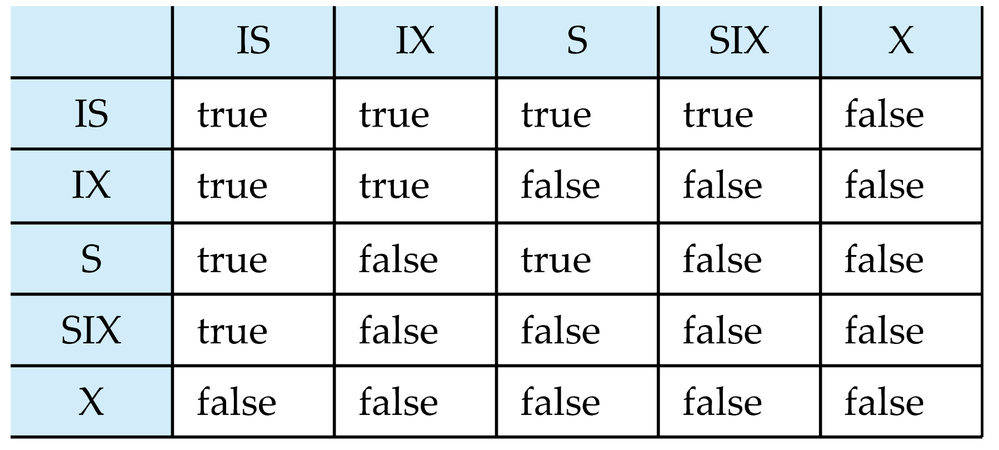

# 并发控制

## 事务

###  定义

- a unit of execution，要么全做，要么全部做；**原子性**

- 是数据恢复和并发控制的基本单位

```sql
BEGIN TRANSACTION;
    SQL;
COMMIT;

-- exception
BEGIN TRANSACTION;
    SQL;
ROLLBACK;

```

## ACID

1. 原子性(**Atomicity**)

- 全有或全无

- 由数据库恢复功能保证

2. 一致性(**Consistency**) 

- 事务执行前后数据都是一致性状态，（*e.g.* 执行前a,b读数据都是1，执行后a,b读数据都是2）

- 如果出现了不一致，原因可能是某些事务未完成执行就被迫中断

3. 隔离性(**Isolation**)

- 一个事务的执行不能被**其他事务干扰**，一个事物内部使用的**数据**对其他并发事务是**隔离的**，并发执行的各个事务不能相互干扰

4. 持久性(**Durability**)

- 数据库里数据的**改变是永久性的**

## 并发中的数据不一致

### 丢失修改

- 典例：两个事务T1和T2读入统一数据并修改，T2的提交结果破坏了T1提交的结果（比如并发买机票）

|T1|T2|
|---|---|
|R(A)=16||
||R(A)=16|
|W(A)=15||
||W(A)=15|


### 不可重复读

1. T1第二次读的结果和T1第一次读的结果不一致

|T1|T2|
|---|---|
|R(B)=100||
||R(B)=100, W(B)=200|
|R(B)=200，验算不对||

2. T1第二次读时，发现**数据消失**了

3. T1第一次按照一些**条件查询**记录，第二次按照相同条件，发现**多了一些记录**

- 后两种也称为幻影(**phantom**)

### 读“脏”数据

- 读“脏”数据，就是读到了不正确的数据；这里的不正确通常是指由于**撤销**等原因造成的**不该存在、不该被读到**的值

*e.g.*

1. T1修改某数据，写回数据库

2. T2读取该数据，但T1被撤销了

3. T2读到的数据就是“脏”数据

## Lock

- 封锁就是T对数据进行读写时，先向**系统请求**，**对其加锁**；在T释放它的锁前，其他事务不能更新这个数据

### 锁的类型

1. 排它锁(**Exclusive Lock**)，X锁

    - **写锁**，T对数据A加上X锁，就只允许T读写A，其他事务不能对A读写或者加锁

2. 共享锁(**Share Locks**)，S锁

    - **读锁**，T对数据A加上S锁，T可以读A但**不能修改**，其他事务也**只能读或者加S锁**

## 封锁协议

### 一级封锁协议

- 一级封锁协议是指T在修改数据R之前，必须加X锁，直至**事务结束**才释放；事务结束包括**正常结束（COMMIT）、非正常结束（ROLLBACK）**

作用：

1. 可以防止丢失修改，并且保证了T可恢复

2. 在一级封锁协议中，如果只是读，是没有加锁的；所以不能保证可重复读和读脏数据

### 二级封锁协议

- 二级封锁协议是在一级的基础上，事务T在读取数据R前必须**先加S锁**，**读完即可释放**

作用：

1. 可以防止丢失修改和读脏数据

2. 但是读完就释放锁，所以不能保证可重复读

### 三级封锁协议

- 三级封锁协议是在一级的基础上，事务T在读取数据R前必须**先加S锁**，**直到事务结束才释放**

## 死锁

- 解决死锁的方法，主要有两个角度预测，诊断与解除

- 预测上解除主要是：一次封锁法和顺序封锁法，但是在OS上适用的这一套在数据库不是很好用，所以我们重点采用诊断与解除

### 死锁的诊断与解除

- 死锁诊断的方法主要有超时法和等待图法

1. 超时法：简单粗暴，如果事务的等待时间超过了规定时间，就认为死锁了（缺点就是容易误判，或者另一种极端，不能及时发现）

2. 等待图（**procedure graph**）法：环路就死锁

- 解锁死锁的方法是选择一个处理死锁代价最小的事务，将它撤销，释放所有持有的锁

## 并发调度的可串行性

- **可串行化调度**：多个事务并发执行是正确的，当且仅当其结果与某一次串行执行这些事务的结果相同

??? tip "Example"
    - 现在有两个事务：

    T1: R(B), A=B+1, W(A)
    T2: R(A), B=A+1, W(B)

    - 串行执行时，有两种情况：T1->T2, T2->T1

    - 我们假设A、B初始值都为2，T1->T2执行顺序下得到A=3，B=4；T2->T1执行顺序下得到A=4，B=3；那么这两个都是正确的答案，只要我们的并行调度得到的最终结果是其中之一，我们就认为这个是可串行化调度

    错误的策略：
    |T1|T2|
    |---|---|
    |Slock B||
    |Y=R(B)=2||
    ||Slock A|
    ||X=R(A)=2|
    |Unlock B||
    ||Unlock A|
    |Xlock A||
    |A=Y+1=3||
    |W(A)||
    ||Xlock B|
    ||B=X+1=3|
    ||W(B)|
    |Unlock A||
    ||Unlock B|

    正确的策略：
    |T1|T2|
    |---|---|
    |Slock B||
    |Y=R(B)=2||
    |Unlock B||
    |Xlock A||
    ||Slock A|
    |A=Y+1=3|等待|
    |W(A)|等待|
    |Unlock A|等待|
    ||X=R(A)=3|
    ||Unlock A|
    ||Xlock B|
    ||B=X+1=4|
    ||W(B)|
    ||Unlock B|

### 冲突可串行化调度

- **冲突操作**：不同事务对同一数据的**读写**操作和**写写**操作

!!! warning "注意点"

    1. 除了对同一数据的读写和写写操作，其他的操作都不是冲突操作

    2. 不同事务的**冲突操作**或**同一**事务的**两个操作**是**不能交换**的

        - $R_i(X)$与$W_i(X)$不可交换顺序

        - $W_i(X)$与$W_j(X)$不可交换顺序

- 一个调度$S_c$在保证冲突操作的次序不变的情况下，通过**交换**两个事务**不冲突操作**的次序得到另一个调度$S_c'$，如果$S_c'$是串行的（形如T1->T2->T3），称$S_c$是冲突可串行化的调度

- 若一个调度是冲突可串行化，则一定是可串行化的调度

??? tip "Example"

    - $S_c1 = r_1(A)w_1(A)r_2(A)w_2(A)r_1(B)W_1(B)r_2(B)w_2(B)$

    - 把$w_2(A)$和$r_1(B)W_1(B)$交换，得到：

    - $r_1(A)w_1(A)r_2(A)r_1(B)W_1(B)w_2(A)r_2(B)w_2(B)$

    - 再把$r_2(A)$和$r_1(B)W_1(B)$交换，得到：

    - $S_c2 = r_1(A)w_1(A)r_1(B)W_1(B)~~~r_2(A)w_2(A)r_2(B)w_2(B)$

    - 可以发现，Sc2就是等价于串行调度T1, T2，所以Sc1是冲突可串行化的调度

## 两段锁协议

- 两段锁协议：所有事务必须分为两个阶段

1. 第一阶段是获得封锁，也称为扩展阶段(**Growing Phase**)：

    - 事务可以获得任何数据项上的任何类型的锁，但是**不能释放任何锁**

2. 第二阶段是释放封锁，也称为收缩阶段(**Shrinking Phase**)：

    - 事务可以释放任何数据项上的任何类型的锁，但是**不能再申请任何锁**


|T1|T2|
|---|---|
|Slock A||
|R(A)=260||
||Slock C|
||R(C)=300|
|Xlock A||
|W(A)||
||Xlock C|
||W(C)=250|
||Slock A|
|Slock B|等待|
|R(B)=1000|等待|
|Xlock B|等待|
|W(B)=1100|等待|
|Unlock A|等待|
||R(A)=160|
||Xlock A|
|Unlock B|W(A)=210|
||Unlock C|
||Unlock A|

- 我们很容易地，可以将遵循两段锁协议的调度变换成串行调度

!!! abstract "结论"

    1. 若并发事务遵守两段锁协议，则对这些事务的任何并发调度策略都是**可串行化**的

    2. 若并发实物的一个调度是可串行化的，不一定所有事务都符合两段锁协议

    3. 两段锁协议是可串行化调度的**充分条件**，不是必要条件

!!! tip "**两段锁协议**和防止死锁的**一次封锁法**的异同"

    1. 一次封锁法要求每个事务必须一次将所有要用的数据上锁，因此**一次封锁法遵循两段锁协议**

    2. 两段锁协议并不要求事务必须**一次**上好锁，因此可能会发生**死锁**

## 锁的粒度

- 封锁对象的大小称为**封锁粒度(Granularity)**

- 封锁的对象：逻辑单元，物理单元

    - **逻辑单元**：属性值、属性值的集合、tuple、relation、index、db

    - **物理单元**：page、物理记录

!!! note

    1. 封锁粒度与系统的并发度和并发控制的开销密切相关

    2. 锁的粒度越大，数据库能够封锁的数据单元就越少，并发度越小，开销越小

    3. 锁的粒度越小，并发度越高，但系统开销越大

### 多粒度封锁

- 多粒度封锁是指在一个系统中同时支持多种封锁粒度供不同的事务选择

- 选择封锁粒度时考虑开销和并发度：

    1. 处理多个关系的大量元组的事务：以数据库为封锁单位

    2. 处理大量元组的事务：以relation为封锁单位

    3. 只处理少量元组的事务：以tuple为封锁单位

### 多粒度封锁协议

??? info "多粒度树"

    - 以树状结构来表示多级封锁粒度，根节点是整个数据库，叶节点是最小的封锁粒度

- **多粒度封锁协议**：允许多粒度树种的**每个节点**被单独地加锁，对一个节点加锁意味着对它和其**子节点**都加了同样类型的锁

- 在多粒度封锁中一个数据对象可能以两种方式封锁：

    1. 显示封锁：直接加到数据对象上的封锁

    2. 隐式封锁：该数据对象没有独立加锁，是由于父节点加锁而使这个数据对象加了锁

- 因此，我们在对某个数据对象加锁时，需要检查：

    1. **该数据对象**：有无显示封锁与之冲突

    2. **所有父节点**：检查本事务的显示封锁，会不会和之前加的隐式封锁（也就是祖先节点加的封锁）造成冲突

    3. **所有子节点**：看后代节点上的显示封锁，会不会和本事务加的隐式封锁冲突

### 意向锁

- 目的：提高对某个数据对象加锁时**系统检查的效率**

- 意向锁：如果对一个节点加意向锁，则说明该节点的子节点正在被加锁；对任一节点加基本锁，必须先对它的祖先节点加意向锁

---

常用意向锁：意向共享锁（IS），意向排它锁（IX），共享意向排它锁（SIX）

1. IS：如果对一个数据对象加IS锁，表示它的子节点加S锁

2. IX：如果对一个数据对象加IX锁，表示它的子节点加X锁

3. SIX：如果对一个数据对象加SIX锁，表示对它加S锁，再加IX锁 SIX = S + IX



### 具有意向锁的多粒度封锁方法

- 任何事务T要对一个数据对象加锁，申请封锁时应该按**自上而下**的次序进行，释放封锁时应该**自下而上**

!!! tip "Example"

    - 事务T1要对关系R1加S锁：

    1. 对数据库加IS锁

    2. 检查数据库和R1是否已经加了冲突的锁（X或IX）

    3. 不要需要搜索和检查R1中的元组是否加了不相容的锁（X锁）