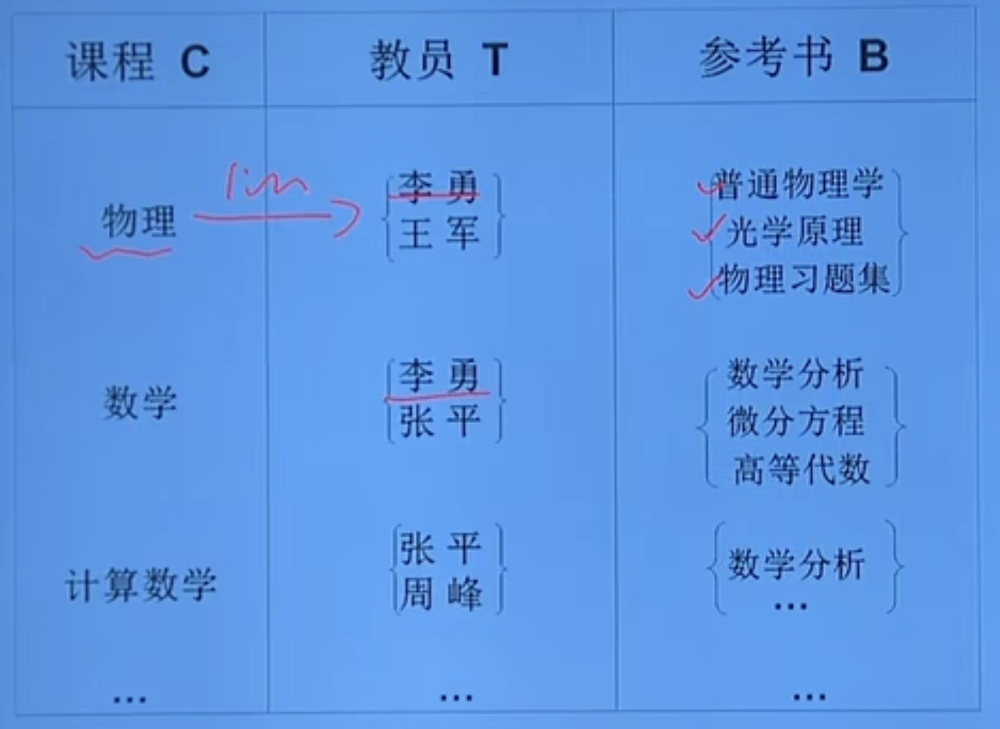
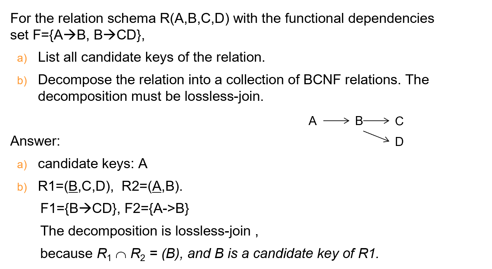

# Relational Database Design

## 为什么要设计好的数据库模式？

- 来看一个不好的数据库模式：`takes(sno, cno, s_dept, m_name, grade)`

- 在这个模式中，有三个依赖：学号决定了学生的系，学生的系决定了系主任名字，学号和课程号共同决定了课程成绩；`F={sno->s_dept, s_dept->m_name, (sno, cno)->grade}`

- 于是就有以下几个问题：

    1. **数据冗余**：系主任的名字会随成绩记录大量重复的出现！
    
    2. **插入异常**：如果说某个新建系没有学生，根本无法插入

    3. **更新异常**：如果系主任更新，那么会造成大量的修改代价，必须修改每一项否则数据不一致

    4. **删除异常**：如果某个系的学生都毕业了，那么这个系的信息都会被删除

## 函数依赖

- 函数依赖可以说就是用标准点的数学语言描述了super key, candiate key, primary key这种关系

- 一个函数依赖通常写作 `A → B`，其中 A 和 B 是关系（表格）中的属性集合。它的意思是说：属性集合 A 的值唯一决定了属性集合 B 的值。

    - 部门名称 → 建筑: 这表示对于一个给定的部门名称，只有一个对应的建筑。（例如，如果 部门名称 是“计算机科学”，那么 建筑 总是相同的）。请注意，部门名称 本身可能在整个表格中不是唯一的（多个教师可能在同一个部门），所以它不是一个超键。

    - ID → 姓名, 工资, 部门名称, 建筑, 预算: 这暗示了 ID 很可能是主键（或者至少是一个超键），因为知道 ID 就能唯一确定一个教师的所有其他属性。

- X->Y, 但是Y不是X的子集，则称X->Y是**非平凡的(nontrivial)函数依赖**

- X->Y, 但是Y是X的子集，则称X->Y是**平凡的(trivial)函数依赖**

- 如果X->Y，并且X的真子集X'，都推不出X'->Y，那么**Y对X完全函数依赖(full funcitional dependency)**，也就是X这个属性组里面每一个**缺一不可**；反之则是部分函数依赖

### 主属性与非主属性

- **主属性(prime attribute)**：包含在任何一个**候选码里的属性**

- **非主属性(Nonprime attribute)**：不包含在候选码里

### 多值依赖

- **多值依赖(multivalued dependency)**，先来看一个典例：

- 在这个Teaching表(C,T,B)中，(C,T,B)构成了候选码，但是我们眼尖会发现，其实给定C，我就能知道对应的B，只不过**不是一一对应**，和T没有关系

- 对于C中的每一个值，不论B取何值，T都有一组值与之对应。因此T多值依赖于C，即**C->->T**

### 属性集闭包

**ArmStrong's Axiom**，常用的几个性质：

1. if $\beta\subseteq \alpha$ then $\alpha \rightarrow \beta$(**reflexivity**, 自反律)

2. if $\alpha\rightarrow \beta$ then $\gamma \alpha \rightarrow \gamma \beta$(**augmentation**, 增补律)

3. if $\alpha\rightarrow \beta$ and $\beta \rightarrow \gamma$ then  $\alpha \rightarrow \gamma$(**transitivity**, 传递律)

4. if $\alpha\rightarrow \beta$ and $\alpha\rightarrow \gamma$, then $\alpha\rightarrow \beta\gamma$(**union**, 合并)

5. if $\alpha\rightarrow \beta\gamma$, then $\alpha\rightarrow \beta$ and $\alpha\rightarrow \gamma$(**decomposition**, 分解)

6. if $\alpha\rightarrow \beta$ and $\gamma \beta\rightarrow \delta$, then $\alpha\gamma\rightarrow \delta$(pseudotransitivity，伪传递)

---

- 求属性集依赖($X^+$)的过程，其实就是一个迭代，一开始$X^{(0)} = X$，然后一点点汲取函数依赖右侧的其他属性

#### 推论：使用闭包来找到候选码

- 我们已经知道了，如果一个属性集的闭包是所有属性，那这个属性集一定是候选码；但问题就在于**属性集太多了**，一个一个去求出所有属性集的闭包太繁琐，所以利用下面的准则来快速**缩小可能是候选码的属性集范围**

三条准则：

1. 如果一个attribute**只**出现在函数依赖的**左边**，那么它一定**是**候选码的**一部分**

2. 如果一个attribute**只**出现在函数依赖的**右边**，那么它一定**不是**候选码的**一部分**

3. 如果一个attribute**没有**出现在函数依赖里，那么它一定**是**候选码的**一部分**

!!! tip "Example"
    1. R = {A, B, C, D, E}, F = {AB->C, B->D, AD->E}

        - 可以发现A和B只出现在函数依赖的左侧，所以一定是候选码的一部分；而C和E只出现在右侧，一定不是候选码的一部分；至于D就未知，需要枚举尝试

        - 于是，很轻易地就能发现候选码就是AB

    2. R = {A, B, C, D, E}, F = {AC->BD, B->A}

        - E不存在，所以一定是候选码的一部分；D只在右侧，所以不是；C只在左侧，所以一定是；然后再枚举A和B

        - 尝试后会发现ACE, BCE都是候选码

### 函数依赖集的闭包

- *e.g.* $F=\{A\rightarrow B,B\rightarrow C\}$, $F^+=\{A\rightarrow B, B\rightarrow C, A\rightarrow C, AB\rightarrow B, AB\rightarrow C,\ldots\}$，**函数依赖集的闭包**就是包含了所有可以由F推出的函数依赖

- 一个实际问题：直接计算并列出 F⁺ 的所有成员通常是**不现实的**，因为由增广律可以推导出无穷多个函数依赖。例如，从 A → B 可以推导出 AC → BC, AD → BD, ACD → BCD 等等。

- 因此，我们通常不关心 F⁺ 的所有成员，而是关心两个更实际的问题：

    1. **判断某个函数依赖是否被 F 所蕴含**？

        - 即判断 X → Y 是否属于 F⁺？

    2. **判断两个函数依赖集 F 和 G 是否等价**？

        - 即判断 F⁺ 是否等于 G⁺？

- 如何解决这些问题？—— 使用属性集闭包！

- 这正是“**属性集闭包**”大显身手的地方。我们可以利用上一节讨论的属性集闭包的计算算法来高效地解决这些问题，而**无需真的去计算 F⁺**。

### 正则覆盖/最小覆盖

- 目的：有了正则覆盖，我们才可以**去伪存真**，找到最核心的依赖关系

!!! tip "Minimal Cover，Canonical Cover"
- **最小依赖**：
    1. $F_c$中任意函数依赖的**右部仅含有一个属性**

    2. $F_c$中每个函数依赖**都不能是多余**的，缺一就推不回$F$

- **正则依赖**：
    
    - 正则覆盖是在最小依赖集的基础上进一步操作得到的。在得到最小依赖集之后，需要**合并具有相同左侧的函数依赖**。这意味着正则覆盖中的函数依赖**右侧可能包含多个属性**，而**最小依赖集中的函数依赖右侧只有单一属性**。

- 其实就是把函数依赖集去除掉冗余的部分，剩下的都不是互相传递所得到的

- 想要得到一个最小覆盖集，有三个步骤

1. 将RHS中的属性拆成单个的
    
    - *e.g.* AB->CD 拆分成 AB->C, AB->D

2. 检查LHS中是否也是可拆的

    - *e.g.* 检查CB->A，就去试试看通过其他函数依赖，$B^+$或$C^+$是不是包含了A，如果是前者则说明C多余，如果是后者则说明B多余

3. 去除可能的依赖冗余项

    - 对于1、2步中得到的FDs，我们一项一项去试：如果去除了一个函数依赖，那么根据剩余的函数依赖推出的 $X^+$ 是否满足刚刚的去除的依赖

    - *e.g.* F = {A->B, CB->A, CB->D, D->A, D->B}；我们检查A->B时，可以发现，如果去除了A->B，那么A+ = {A}，所以A->B并不是冗余的；当我们检查CB->A时，可以发现，如果去除了CB->A，那么CB+ = ABCD，所以CB->A是冗余的，我们去除它之后，再作为现有集合去检查接下来的

!!! tip "Quiz"
    
    R={A,B,C,D,E}; F={A->B,CB->AD, D->AB}

    1. find all candiate keys

    2. find Fc

    3. what kind of normal form R is?

    4. if R is not in BCNF, decomposr it into BCNF, is this dependency preserving?

    ??? note "答案"

        **第一题**：根据定理，能发现CE一定是候选码的一部分，A、B、D都暂定；然后一个一个去试，会发现它们都可以，所以candiate keys = {ACE, BCE, CDE}

        **第二题**：

        1. 将RHS拆分：得到F' = {A->B, CB->A, CB->D, D->A, D->B}

        2. 检查LHS是否可拆分：Check CB->A:

            - Is C extraneous? Check if B->A is implied by F'. B+ (using F') = {B}. No. C is not extraneous.

            - Is B extraneous? Check if C->A is implied by F'. C+ (using F') = {C}. No. B is not extraneous.

            - Check CB->D:

            - Is C extraneous? Check if B->D is implied by F'. B+ (using F') = {B}. No. C is not extraneous.

            - Is B extraneous? Check if C->D is implied by F'. C+ (using F') = {C}. No. B is not extraneous.

            - The other FDs (A->B, D->A, D->B) have single attributes on LHS, so no extraneous attributes there.

            - F' remains {A->B, CB->A, CB->D, D->A, D->B}.
        
        3. 去除依赖冗余项：

            - Check A->B: Is A->B implied by F' - {A->B} = {CB->A, CB->D, D->A, D->B}? Compute A+ using this set: A+ = {A}. No. A->B is not redundant.

            - Check CB->A: Is CB->A implied by F' - {CB->A} = {A->B, CB->D, D->A, D->B}? Compute CB+ using this set: {C, B} -> Add D (from CB->D) -> {C, B, D} -> Add A (from D->A) -> {A, B, C, D}. Yes, A is determined. CB->A is redundant. Remove it.

            - Current set F'': {A->B, CB->D, D->A, D->B}.

            - Check CB->D: Is CB->D implied by F'' - {CB->D} = {A->B, D->A, D->B}? Compute CB+ using this set: {C, B}. No. CB->D is not redundant.

            - Check D->A: Is D->A implied by F'' - {D->A} = {A->B, CB->D, D->B}? Compute D+ using this set: {D} -> Add B (from D->B) -> {D, B}. No. D->A is not redundant.

            - Check D->B: Is D->B implied by F'' - {D->B} = {A->B, CB->D, D->A}? Compute D+ using this set: {D} -> Add A (from D->A) -> {D, A} -> Add B (from A->B) -> {A, B, D}. Yes, B is determined. D->B is redundant. Remove it.

            - Final set: {A->B, CB->D, D->A}. Recheck redundancy within this final set. None are redundant.
        
        **第三题**：

        - 我们主要关注3NF和BCNF，对于Fc = {A->B, CB->D, D->A}

        - 根据之前得到的candiate keys，可以发现所有attribute都是主属性，所以一定是3NF

        - 但不是BCNF，因为左侧都不是candiate keys

        **第四题**：

        - Fc里的三个依赖都违背了BCNF，所以一个一个来

        - 

## 范式

### 1NF

- 所有的属性都是**不可再分的，atomic**；就是不能有一个复合属性，比如价格(数量，单价)

### 2NF

- 满足1NF的同时，所有的**非主属性**都必须**完全函数依赖**于一个**候选码**

- 如果一个模式不满足2NF，也就是说非主属性可能部分依赖于候选码，会有以下问题：

    1. 插入异常，如果候选码里的属性只能给到一部分，就根本插入不进去

    2. 删除异常，如果把某个tuple里的候选码里的某个属性删除了，整个tuple就被删除了，信息丢失得很严重

    3. 修改复杂，因为如果是部分依赖的话，是会有非主属性的重复冗余的

### 3NF

- 3NF的**核心**：

> **消除非主属性**对候选键的**传递依赖**，即：所有非主属性（不属于任何候选键的属性）必须直接依赖于候选键，不能通过其他非主属性间接依赖到候选码。

---

快速判断法（两步走）：

1. 找非主属性间的依赖：是否存在非主属性A → B，其中A和B都是非主属性。

2. 判断是否传递依赖：

    - 如果不存在非主属性间的依赖 → 符合3NF。

    - 如果存在 → 需要分解表。

---

- 例子：一个订单详情表，存储「订单-产品-产品类别」信息；主键是复合主键 (订单ID, 产品ID)；非主属性：产品名称、产品类别

|订单ID	|产品ID	|产品名称	|产品类别|
|---|---|----|----|
|1001	|P001	|苹果	|水果|
|1001	|P002	|牛奶	|乳制品|

- 依赖关系：

    - **产品ID** → **产品名称**（产品ID决定名称）

    - **产品名称** → **产品类别**（名称决定类别）

- 问题：

    - 非主属性 **产品类别** 通过 **产品名称** 间接依赖主键 → 传递依赖，违反3NF！

- 解决方案：分解为两个表

    - 表1：订单ID + 产品ID + 产品名称（保留直接依赖）
    
    - 表2：产品名称 + 产品类别（消除传递依赖）

### BCNF

- 一个关系（表格）满足 BCNF，当且仅当对于关系中每一个**非平凡的函数依赖** `X → Y`，`X` 都必须是该关系的一个**候选码**。

#### BCNF分解

!!! info "**无损连接(Lossless-join Decomposition)**"

    - 如果R被分解成R1和R2，想要实现无损连接，需要满足两个条件：

    1. $R_1 \cup R_2 = R$

    2. $R_1 \cap R_2 \rightarrow R_1 或 R_1 \cap R_2 \rightarrow R_2$，交集必须是个候选码

decompose $R$ into $(\alpha \cup \beta)$ and $(R-(\beta-\alpha))$

**五步骤**：

1. 确定候选码

2. 检查**违反BCNF**的依赖

3. 分解关系

    - 分解规则：选择一个**违反** BCNF 的 FD X → Y，将原关系分解为：

    - **R1(X, Y)**：保留该 FD 的属性和依赖。

    - **R2(X, 其他属性)**：保留原关系中除 Y 之外的属性（注意：若 Y 包含非主属性，需调整）。

4. 递归分解子关系，在检查子模式时，要找到适用于子模式的函数依赖，这个时候往往是需要用到**传递依赖**的，转换转换子模式对应的函数依赖集

5. 验证依赖保留和无损连接

!!! tip "Example"
    

#### 依赖保持

- 判断一个分解是否**保持依赖(dependency preserving)**：$(F_1\cup F_2 \cup... \cup F_n)^+ = F^+$

---

!!! tip "BCNF的记忆"

    BCNF的核心：

    > 所有决定因素（左侧的属性）必须是**候选键**（Candidate Key）即：如果一个属性集能决定其他属性，那这个属性集本身必须是候选键。

    ---

    快速判断法（两步走）：

    1. 找依赖关系：找到所有形如 X → Y 的函数依赖（X决定Y）。

    2. 检查X是否是候选键：

        - 如果所有依赖的X都是候选键 → 符合BCNF。

        - 如果存在某个X不是候选键 → 需要分解表。

    ---

    例子：一个表存储「教授-课程-教材」关系，假设：每位教授（Professor）只教一门课程（Course），每门课程有固定教材（Book）

    依赖关系：

    - Professor → Course（教授决定课程）

    - Course → Book（课程决定教材）

    问题：

    - Course → Book 中，Course 不是候选键（候选键是Professor）→ 违反BCNF！

    解决方案：分解为两个表

    - 表1：Professor → Course

    - 表2：Course → Book

