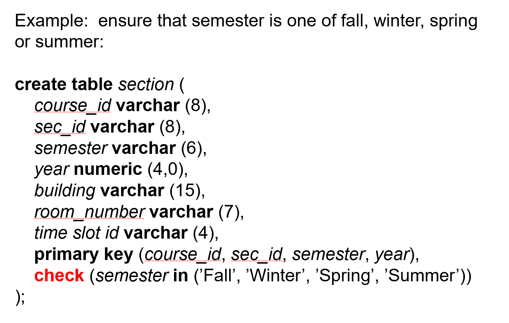
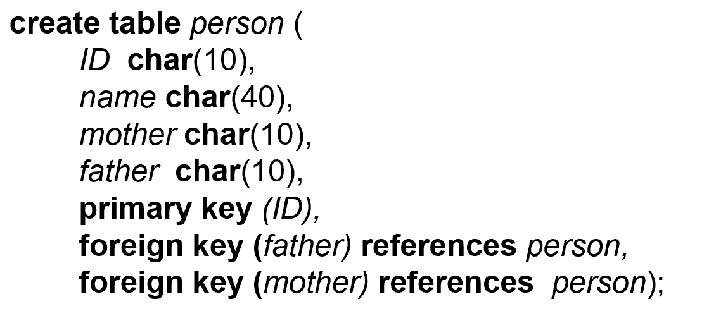
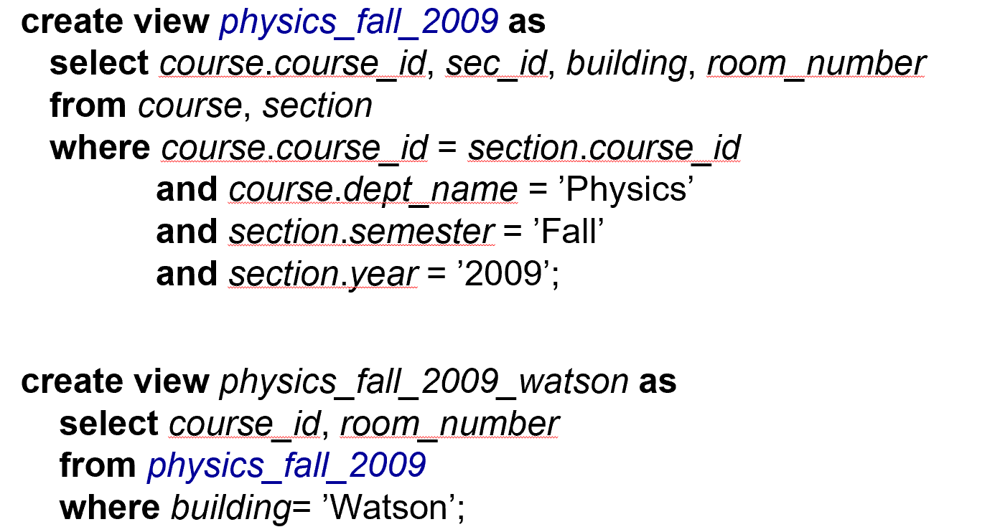

# Intermediate SQL

## SQL Data Types and Schemas

### User-Defined Types

- 在 SQL 中，`CREATE TYPE` 语句用于定义用户自定义类型（User-Defined Types，UDTs）。用户自定义类型允许你创建自定义的数据类型，以便在数据库表中使用。这些类型可以是简单的别名类型，也可以是复杂的结构化类型。

```sql
CREATE TYPE PhoneNumber AS VARCHAR(15);

CREATE TYPE Address AS (
    Street VARCHAR(100),
    City VARCHAR(50),
    State CHAR(2),
    ZipCode CHAR(5)
);

CREATE TABLE Employees (
    EmployeeID INT PRIMARY KEY,
    Name VARCHAR(100),
    Phone PhoneNumber,
    HomeAddress Address
);
```

### Domains

- 在 SQL 中，`CREATE DOMAIN` 语句用于定义一个域（Domain），它是一个**用户自定义**的数据类型，可以**包含约束条件**。域允许你为列定义更具体的数据类型和约束，从而提高数据的完整性和一致性。

```sql
CREATE DOMAIN PositiveInteger AS INT
CHECK (VALUE > 0);

CREATE DOMAIN EmailAddress AS VARCHAR(255)
CHECK (VALUE LIKE '%_@__%.__%');
```

### Large-Object Types

- 在 SQL 中，BLOB（Binary Large Object）和 CLOB（Character Large Object）是用于存储大数据对象的两种数据类型。它们通常用于存储**大量的二进制数据或文本数据**。

- BLOB（Binary Large Object）

    - 定义：BLOB 是一种用于存储二进制数据的大对象类型。它可以存储图像、音频、视频、文档等各种类型的二进制数据。

    - 用途：BLOB 通常用于存储需要以二进制格式保存的大文件，例如图像文件、音频文件、视频文件等。

    ```sql
    CREATE TABLE Images (
    ImageID INT PRIMARY KEY,
    ImageData BLOB
    );
    ```

- CLOB（Character Large Object）

    - 定义：CLOB 是一种用于存储大文本数据的大对象类型。它可以存储大量的字符数据，例如文本文件、HTML 文档、XML 数据等。

    - 用途：CLOB 通常用于存储需要以字符格式保存的大文本数据，例如文章内容、日志文件、文档等。

    ```sql
    CREATE TABLE Documents (
    DocumentID INT PRIMARY KEY,
    DocumentText CLOB
    );
    ```

----

## Integrity Constraints

- `not null`

- `primary key`

- `unique`

- unique(A1, A2, ..., Am) 

    - 单列唯一性：确保某一列中的所有**值都是唯一**的。
    
    - 多列唯一性：确保某些列的**组合值是唯一**的，即这些列的组合形成一个**超键（super key）**。

- 比如学生个人信息，我们知道 ID 是主键，但实际上邮箱、电话号码等也不能相同的，所以我们要通过语句告诉数据库，数据库会为我们维护这些约束条件。

### check

- check (P), where P is a predicate

    - `CHECK` 约束用于确保列中的数据**满足特定的条件或谓词**。

!!! tip "Example--check"
    


!!! tip "Integrity Constraint Violation During Transactions"

    

    - 在一个人的父母还没插入的时候，无法插入这个人，依次类推。
    
    - 可以规定，在这个事务结束时再检查完整性约束条件，中间状态可以不满足。

----

### assertion

- 有的时候某些attribute并不是foreign key，但是有foreign reference

- 我们就设想check可以有复杂的语句，但可以很多数据库不支持；比如说 `check(time_slot_id in (select time_slot_id from time_slot))`

- 所以有另一种方法：`assertion`

- create assertion <assertion-name> check <predicate>;

```sql
create assertion credits_earned_constraint check
(not exist
    (select ID
    from student
    where tot_cred <> (
        select sum(credits)
        from takes natural join course
        where student.ID = takes.ID
            and grade is not null
            and grade <> 'F'
    )))

```

- 但使用 assert 后，每个元组的每次状态更新时都要进行检查，**开销过大**，数据库一般不支持。

----


## Transaction

- 在 SQL 中，事务（Transaction）是一组作为单个逻辑工作单元执行的操作。这些操作要么全部成功，要么全部失败。事务确保数据库的完整性和一致性，即使在出现错误或系统故障的情况下。

事务控制语句：

- SET AUTOCOMMIT=0;：禁用自动提交，允许手动控制事务的提交和回滚。

- UPDATE：执行更新操作。

- COMMIT：提交当前事务，使其所有更改永久生效。

- ROLLBACK（未在示例中使用）：回滚当前事务，撤销其所有更改。

```sql
SET AUTOCOMMIT=0

UPDATE account SET balance=balance-100 WHERE ano=‘1001’;
UPDATE account SETbalance=balance+100 WHERE ano=‘1002’;
COMMIT;

UPDATE account SET balance=balance -200 WHERE ano=‘1003’;
UPDATE account SET balance=balance+200 WHERE ano=‘1004’;      COMMIT;

UPDATE account SET balance=balance+balance*2.5%;
COMMIT;
```

### ACID

- 原子性（Atomicity）：确保事务中的所有操作要么全部完成，要么全部不完成。

- 一致性（Consistency）：确保事务在完成时，数据库从一个一致状态转换到另一个一致状态。

- 隔离性（Isolation）：确保并发事务不会相互干扰，每个事务的中间状态对其他事务是不可见的。

- 持久性（Durability）：确保事务一旦提交，其结果将永久保存在数据库中。

## View

- 在 SQL 中，视图（View）是一种虚拟表，它是基于 SQL 查询结果集的。视图不存储数据本身，而是存储查询定义。当你查询视图时，数据库系统会动态地执行视图定义中的查询，并返回结果集。视图可以用于**简化复杂查询**、**提高安全性**和**数据抽象**。

- view 可以隐掉一些细节，或者加上一些统计数据。可以把 view 当作表进行查询。

    - 隐藏不必要的细节，简化用户视野

    - 方便查询书写

    - 有利于权限控制（如用户可以看到工资总和，但不能看到每个人的工资）

    - 有独立性，使得数据库应用具有较强的适应性。

- 可以基于视图再定义视图。



### Update of a View

- 对一个 view 进行修改，相当于通过这个窗口对原表继续修改。

- 如果视图中有统计的属性，那么是不可修改的。

- 涉及到单个表，只是选出了部分属性（去掉非主属性）的行列视图是可更新的。

### Materialized View

- 在 SQL 中，**物化视图**（**Materialized View**）是一种特殊类型的视图，它不仅存储视图定义，还**存储视图查询结果的数据**。与普通视图不同，物化视图将查询结果物化（即存储在磁盘上），以便在查询时可以直接访问存储的数据，而不需要每次都重新执行视图定义中的查询。这可以显著提高查询性能，特别是在处理复杂查询或大数据集时。

- 可以理解成从原表上便捷继承的新表

- 物化视图的特点

    - 数据存储：物化视图存储查询结果的数据，而普通视图只存储查询定义。
    
    - 性能提升：由于查询结果已经物化，查询物化视图时不需要重新执行查询定义，可以显著提高查询性能。
    
    - 数据同步：物化视图的数据需要与基础表的数据保持同步，这可以通过定期刷新（refresh）来实现。


## Index

- 在 SQL 中，**索引**（**Index**）是一种数据库对象，用于提高查询性能。索引类似于书籍的目录，通过索引可以快速定位数据，而不需要扫描整个表。索引可以显著提高数据检索的速度，特别是在处理大数据集时。

- Index 相当于在数据上建立了 B+ 树索引。（物理层面）

- Index的作用：
    
    - 提高查询性能：索引可以加速数据检索，减少查询时间。
    
    - 加速排序和分组操作：索引可以加速 ORDER BY 和 GROUP BY 操作。
    
    - 强制唯一性：唯一索引（Unique Index）可以确保列中的值是唯一的。

```sql
-- 创建基础表
CREATE TABLE Employees (
    EmployeeID INT PRIMARY KEY,
    FirstName VARCHAR(50),
    LastName VARCHAR(50),
    Email VARCHAR(100),
    DateOfBirth DATE
);

-- 插入示例数据
INSERT INTO Employees (EmployeeID, FirstName, LastName, Email, DateOfBirth)
VALUES (1, 'John', 'Doe', 'john.doe@example.com', '1980-01-01');

INSERT INTO Employees (EmployeeID, FirstName, LastName, Email, DateOfBirth)
VALUES (2, 'Jane', 'Smith', 'jane.smith@example.com', '1985-05-15');

-- 创建单列索引
CREATE INDEX idx_lastname ON Employees (LastName);

-- 创建多列索引
CREATE INDEX idx_name_dob ON Employees (FirstName, LastName, DateOfBirth);

-- 创建唯一索引
CREATE UNIQUE INDEX idx_email ON Employees (Email);

-- 查询数据
SELECT * FROM Employees WHERE LastName = 'Doe';

-- 删除索引
DROP INDEX idx_lastname;
```


## Authorization

- authorization包括授权和收回：`grant`,`revoke`

### grant

- `grant <privilege list> on <relation name or view name> to <user-list>`

- 可以grant *select/insert/update/deleta/all privilege* 给一个 *user-id/`public`/`role`*

```sql
-- 授予用户 alice 对表 Employees 的 SELECT 权限
GRANT SELECT ON Employees TO alice;

-- 授予角色 manager 对表 Employees 的 SELECT 和 UPDATE 权限
GRANT SELECT, UPDATE ON Employees TO manager;
```


### revoke

- `REVOKE` 语句用于撤销用户或角色的特定权限。

- `REVOKE privilege ON object FROM user_or_role;`

```sql
-- 撤销用户 alice 对表 Employees 的 SELECT 权限
REVOKE SELECT ON Employees FROM alice;

-- 撤销角色 manager 对表 Employees 的 SELECT 和 UPDATE 权限
REVOKE SELECT, UPDATE ON Employees FROM manager;
```

### role

- **role**可以理解为一组权限的集合，如学校的教务管理员、老师。

- `create role <role-name>` 创造角色，随后可以把权限授予给他。然后我们可以把**角色的权限授予给用户/其他角色**。

```sql
create role instructor;
grant select on takes to instructor;  // 授予权限给角色
grant instructor to Amit;   //将角色的权限授予给用户

create role teaching_assistant;
grant teaching_assistant to instructor;  // 可以将角色的权限授予给其他角色   
```

### 其他的授权操作

- `grant select on department to Amit with grant option;`

    - 加上 `with grant option` 后，用户可以把获得的权限传递下去。

- `revoke select on department from Amit, Satoshi cascade;`

    - `cascade` 把该用户及其授予的权限全部收回，级联反应。

- `revoke select on department from Amit, Satoshi restrict;`

    - `restrict` 只收回该用户的权限。

- `revoke grant option for select on department from Amit;`

    - 收回用户转授的权力。
