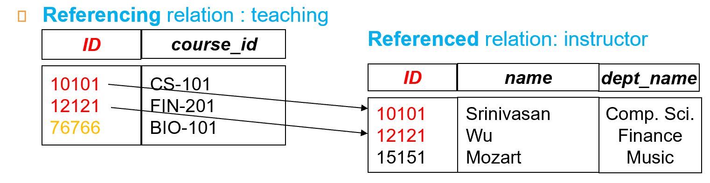

# Relational Model

!!! info "什么是relation"

    - **relation**是一个同种属性的一个集合，并非人际关系，物件关系那种**relationship**（这是另一个概念）

## 关系数据库的结构

### 概念

- $A_1, A_2, ..., A_n$ are **attributes**

- $R = (A_1,A_2, ..., A_n)$ is a **relation schema**

    - *e.g* instructor = (ID, name, dept_name, salary)

- 满足schema的一个表就是**instance** $r$

- 表中的column也叫**attribute**；row也叫**tuple**

### Attributes

- attribute values 应该是 **atomic**，即*不可再分*的

- 这是设计思路上的一种要求，遵循原子性可以让我们更好地进行query

    - *e.g.* attribute 姓名可以拆分成姓和名，但如果不需要查询单独的姓或名，就可以只把姓名作为attribute；但是对于一本书的所有信息就必须把它们分开，不能整体作为一个attribute

- 在任何domain中都有一个成员：特殊值 **null**，null意味着**未知**或者是**不存在**

    - *e.g.* domain of semester: Spring, Summer, Autumn, Winter, null; domain of grade: integer 0 to 100 and null

## Database Schema

- Database schema -- 数据库的一种逻辑结构

- Database instance -- schema生成的一种实例

- schema 是抽象的定义, instance 是具体的实例。

## Keys

- $K \subset R$

- **超键（superkey）**，指的是给定一个K，能够确定唯一的tuple

    - *e.g* {ID} or {ID, name}

- superkey可以有冗余的部分（比如上面的{ID, name}相较{ID}有冗余）；如果superkey是minimal，没有冗余的（但不意味着只有一个attribute），就是**候选键（candidate key）**

- 一个表中可以有多个candidate key，其中一个candidate key可以选作成为**主键（primary key）**；对于主键，我们通常选择**稳定的不会变的**candidate key

- **外键（foreign key）**用于维护表之间的参照完整性（Referential integrity），外键是一个表中的**一个或多个列**，这些列的值必须是**另一个表**中*主键*或*候选键*的值。通过外键，可以在两个表之间建立关联关系。

    ??? tip "Example--外键限制"
        

        - 左侧表的老师 ID 必须出现在右侧表中。

- **Referential integrity (参照完整性)**，类似于外键限制，但不局限于主键。

    ??? tip "Example--参照完整性"   
        

        - 这里*time-slot_id*并不是关系r2的**主键**，所以不是外键限制

!!! tip "Example--Schema Diagram for University Database"
    

    - course 指课程信息，无论是否开课，都会有其定义。

    - section 表示教学班，真正开课时就有相应的实例。（类比于高铁的列车号，和每天对应的班次）

    - teachers 具体教哪个教学班的老师

    - takes 表示学生注册课程

    - time_slot 表示一门课的具体上课时间段，如数据库在周一 3, 4, 5 节; 
    周一 7, 8 节。
    - 上图中红线表示引用完整性的约束；黑线表示外键约束。

## Relational Algebra

- Six basic operators：

    - select: $\sigma$

    - project: $\Pi$

    - rename: $\rho$

    - union: $\cup$

    - set difference: $-$

    - Cartesian product(笛卡尔积): $\times$

- 前三个用于单个relation，后三个用于多个relation

### Select

- $\sigma_p(r) = \{t|t\in r and p(t)\}$，$p$叫做 *selection predicate*，可以用$\land, \lor, \lnot$还有各类不等符号

- select的结果仍然是个表，从表$r$中找到满足条件$p$的**tuple/row**

??? tip "Example--select"
    

### Project

- 把n列并起来，并且进行**去重**；选出来的是column

??? tip "Example--project"
    

### Union

- 对象是两个relation $r和s$

- r和s必须有相同的arity(元数)（有相同数量的属性）

- attribute domain必须**compatible**，当属性有关联类型时，对于每个输入i, 两个输入关系的第i个属性的类型必须相同。    

??? tip "Example--Union"
    

    - 另一个例子：找到开设在Fall 2009 semester或者Spring 2010 semester的所有课程，$\Pi_{\text{course_id}}(\sigma_{\text{semester="Fall"}\land \text{year=2009}})\cup\Pi_{\text{course_id}}(\sigma_{\text{semester="Spring"}\land \text{year=2010}})$

### Set Difference

- 对象也是多个relaiton

- r-s 就是在r里面，但是不在s里面的

??? tip "Example--Set Difference"

    

### 笛卡尔积

- 对于2个表r和s，$r\times s$意味着，把r里的tuple和s里的tuple两两相乘合并

- 如果说左边有n个tuple，右边有m个tuple；最后就有$n\times m$个tuple

??? tip "Example--笛卡尔积"
    

#### join

- 笛卡尔积是无差别的交叉相乘后所得的结果，这会产生许多冗余，我们可以用join来添加一些过滤条件，比如：

    - $\sigma_{\text{instructor.id = teaches.id}}(\text{instructor} \times \text{teachs})$；这样就能得到要上课的老师信息和课程信息

- 用$\bowtie$符号，$r\bowtie_\theta s= \sigma_\theta ~r \times s$

### Rename

- 可以重命名relation和里面的column，通常我们用于对合并后的大表进行重命名

    - $\Pi_{\text{Instructor.ID}}(\sigma_{\text{instructor.salary > d.salary}}(\text{instructor} \times \rho_d(\sigma_{\text{department="physics"}}(\text{instructor}))))$；这个语句可以找出比物理系老师工资高（至少比一位高）的老师id，这里就需要对物理系的老师们的大表进行一个重命名$d$

### Additinal Operations

- Set-Intersection（交集）:$r\cap s = r-(r-s)$

- Natural join: $r\bowtie s$

- Assignment: <-

- Outer join: 

#### Set-Intersection

- 求交集，选的是两边都有的tuple

??? tip "Example--交集"
    

#### Natural-Join

- 和前面我们讲到的join操作类似，不过筛选条件变了，用于去掉**重复列**，以一个例子来看：

    - R = (A, B, C, D); S = (E, B, D)

    - $r\bowtie s$ = (A, B, C, D, E)

    - $r\bowtie s = \Pi_{\text{r.A,r.B,r.C,r.D,s.E}}(\sigma_{\text{r.B = s.B and r.D = s.D}}(r\times s))$

??? tip "Example--natural join"
    

#### Outer Join

- 外连接（Outer Join）是关系数据库中的一种连接操作，用于合并两个表的数据。与Natural Join不同，外连接**不仅返回两个表中满足连接条件**的行，还返回**不满足**连接条件的行，并在这些行中**填充空值**（NULL）。分为三类：

    - Left Outer Join: $r \rtimes s$，返回左表中的所有行，右表不匹配的就留null

    - Right Outer Join: $r\ltimes s$，返回右表中的所有行，左表不匹配的就留null

    - Full Outer Join: $r ⟗ s$，返回两个表中的所有行。如果某一表中没有匹配的行，则在另一表的列中填充空值。

??? tip "Example--outer join"
    
    

#### Assignment

- 把中间得到的临时表，把它复制给一个临时变量名；相当于把长难的sql语句，分解成很多条

    - $d$ <- = $\sigma_{\text{department=physics}}(\text{instructor})$

    - result = $\Pi_{\text{instructor.id}}(\sigma_{\text{instructor.salary > d.salary}}(\text{instructor}\times d))$ 

#### Division

- 假设有两个关系 ( R(A, B) ) 和 ( S(B) )，其中 ( R ) 包含两个属性 ( A ) 和 ( B )，而 ( S ) 仅包含属性 ( B )。除法操作 ( R $\div$ S ) 的结果是一个新的关系，它包含那些在 ( R ) 中与 ( S ) 中所有元素**相关联**的 ( A ) 的值。

??? tip "Example--division"
    
    

### Aggregate Functions and Operations

- *avg*, *min*, *max*, *sum*, *count*

??? tip "Example"
    