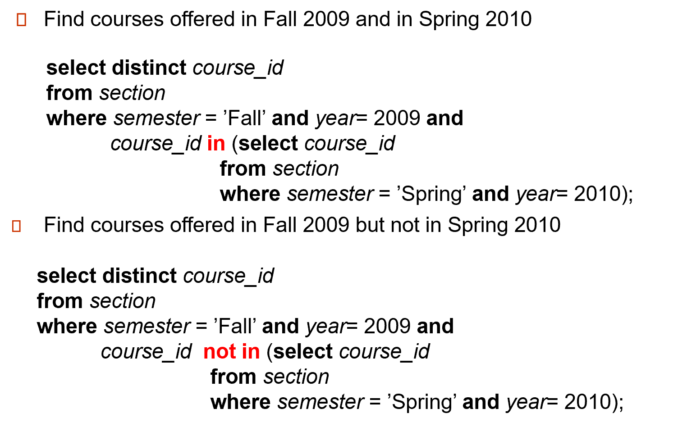

# Introduction to SQL

## 数据定义

### Domain Types

- `char(n)`： **fixed**，定长字符串

- `varchar(n)`：**variable**，变长字符串

- `int`

- `smallint`

- `numeric(p,d)`：**fixed** 小数，`p` 表示有效数字位数, `d` 表示小数点后多少位。*e.g.* number(3,1) allows 44.5 to be store exactly, but neither 444.5 or 0.32

- `real`, `double precision`：不常用

- `float(n)`

### Built-in Types

- `date`: Dates, containing a (4 digit) year, month and date
    
    - *e.g.* date ‘2005-7-27’

- `time`: Time of day, in hours, minutes and seconds. *e.g.* time ‘09:00:30’ time ‘09:00:30.75’


- `timestamp`: date plus time of day *e.g.* timestamp ‘2005-7-27 09:00:30.75’


## 创建表

```sql
create table r (A1 D1, A2 D2, ..., An Dn,           (integrity-constraint1),            
..,         
(integrity-constraintk))
```

### Integrity Constrain

- `not null`

- **primary key**($A_1, ..., A_n$)

    不能为空; 表内不能有相同的 keys. 否则这样的数据是插入不进去的。

- **foreign key**($A_m,..., A_n$) references r

    隐含：引用对应表的主键。

### Drop and Alter

- `drop table`：删除表和内容，表会直接消失

- `delete table`：只删除表的内容，但会保留表

- `alter table`：动态修改表的定义

    - `alter table r add A D`：可以给表新添一个attribute

    - *e.g.* `alter table student add resume varchar(256);`

    - `alter table r drop A`：删掉一个列

## 基础查询

### select

- SQL names are case insensitive；大小写不敏感。（属性名字、表的名字等）

    - `select`查询是会有duplicate的，如果想去重可以用`select distinct`：*e.g.* `select distinct dept_name from instructor`

    - `select`内容可以有表达式运算：*e.g.*`select ID, name, salary/12 from instructor`

### where

- `where`后跟筛选条件

    - `between`运算符用于筛选某个范围内的值。它可以用于数值、日期和文本数据类型。BETWEEN 运算符包括范围的边界值。 *e.g.* `select name from instructor where salary between 90000 and 100000`

    - 比较tuple时，会要求所有元素相等才行。元组相等等价于各个元素都相等。 *e.g.* `select name, course_id from instructor, teaches where (instructor.ID, dept_name) = (teaches.ID, ’Biology’);`


### from

- `from`就是选择要查的表，如果有多个表则会使用**笛卡尔积**

### Natural Join

- *e.g.* `select * from instructor natural join teaches;`

!!! warning "Natural Join误用"

    - `course(course_id,title, dept_name,credits), teaches(ID, course_id,sec_id,semester, year), instructor(ID, name, dept_name,salary)`，对于这些table，我们想要找到上课的老师name和course的title

    ```sql title="incorrect"
    select name, title
    from instructor 
    natural join teaches 
    natural join course
    ```

    - 上面这个sql查询是有误的，因为最后一步natural join会误将`instructor.dept_name = course.dept_name`，也就导致我们选出了教本系课程的老师的name和课程名

    ```sql title="correct"
    select name, title
    from instructor
    natural join teaches
    join course
    on instructor.ID = course.ID
    ```

### Rename

- SQL中重命名用`as`子句，有的时候连`as`都可以省略

- *e.g.* 比如我们想找到比计算机系老师工资高的老师名字

    ```sql
    select distinct T.name
    from instructor as T, instructor as S
    where T.salary > S.salary and S.dept_name = 'Comp.Sci.'
    ```

    - 这里用distinct可以避免一个老师如果比n个计算机学院老师工资高，那么他名字会出现n次，不过也会导致去除了重名的老师

### 字符串通配符

- SQL提供了一些字符串匹配的operator，我们会用`like`进行匹配，同时用`%`和`_`来描述patterns

- **%(percent)**，`%` 通配符表示零个或多个字符。它可以匹配任意长度的字符串，包括空字符串。如果就想找`%`，那么要用转义符`\%`

    - *e.g.* `select name from instructor where name like '%dar%'`

- **_(underscore)**，`_` 通配符表示**单个**字符。它可以匹配任意单个字符。

    - *e.g.* `SELECT * FROM employees WHERE name LIKE '_o%'`

### order by

- `order by A, B`，可以根据属性A，B进行排序，先按第一个排，再按第二个排

- `desc`和`asc`可以选择降序和升序，默认为`asc`

### limit

- 在 SQL 中，`LIMIT` 子句用于限制查询结果的行数。它通常用于分页查询或获取前几条记录。

- `LIMIT` 子句通常与 `OFFSET` 子句一起使用，以实现分页查询。

```sql
SELECT column1, column2, ...
FROM table_name
LIMIT number_of_rows OFFSET offset_value;
```


### set

- `union`, `intersect`, `except` 是严格的集合操作，会对结果**去重**.

- `union all`, `intersect all` and `except all`. 保持多重集。

!!! tip "Example"

    

### null and unknown

- `null`意味着未知值或者是根本不存在值

- 和`null`有关的计算，结果都是`null`

- `is null`可以用来检测`null`值，而不是用`=`符号；

    *e.g.*
    
    ```sql
    select name 
    from instructor 
    where salary is null
    ```

---

- 在 SQL 中，`UNKNOWN` 是一个特殊的逻辑值，用于表示布尔表达式的结果在某些情况下是**未知**的。通常，`UNKNOWN` 与 `NULL` 值相关联，因为在 SQL 中，任何与 `NULL` 相关的比较操作都会产生 `UNKNOWN` 结果。

- 如果最后条件判断返回`UNKNOWN`，那么会被evaluate为`false`

### Aggregate Function

- `max`, `min`, `avg`, `sum`, `count`

!!! tip "例子"
    
    - 找到spring 2010上课的老师的总数

    ```sql
    select count(distinct ID)
    from teaches
    where semester = 'Spring' and year = 2010
    ```

    - 注意：这里我们用**distinct ID**来进行去重，因为一个老师会上好几门课

    ----

    - 如果要数tuple的个数，就用`count(*)`

    ```sql
    select count(*)
    from course
    ```

#### group by

- 在 SQL 中，`GROUP BY` 子句用于将结果集按一个或多个列进行分组。它通常与聚合函数（如 COUNT、SUM、AVG、MAX、MIN）一起使用，以便对每个分组进行计算。

- `group by`可以视作返回的表就只有group by那一列，和aggregate函数的结果那一列，一共两列的一个table

#### having

- 在 SQL 中，`HAVING` 子句用于对 `GROUP BY` 子句返回的分组进行过滤。与 `WHERE` 子句不同，`HAVING` 子句可以使用聚合函数来过滤分组。

#### Null and Aggregate

- 在聚合函数中，`NULL` 值通常会被**忽略**。

- 例如，在 `SUM` 函数中，`NULL` 值不会影响总和的计算。

- 如果所有的值都是null，那么函数的结果就会是null

- 除了`count(*)`，都会忽略有null的tuple

### Nested Subqueries

- 子查询的操作都是集合操作，判断元素是否在集合中，比集合中的some/all元素进行比较，判断集合是否为空

#### in/not in

!!! tip "Example"
    

- 除了单个元素外，元组也可以使用 `in`, `not in`

#### some/all

- `some` 某些成员，`all` 所有成员

```sql title="工资大于生物系中的某些老师的老师"
select name
from instructor
where salary > some (select salary
                     from instructor
                     where dept_name = 'Biology');
```

#### 标量(scalar)子查询

- `scalar`（标量）在 SQL 和数据库管理系统中指的是**单个值**或单个数据项。标量值可以是任何基本数据类型，如整数、浮点数、字符串、日期等。


#### Test Empty

- `exists r` $\Leftrightarrow r \neq \emptyset$

- `not exists r` $\Leftrightarrow r = \emptyset$

!!! tip "Example--找到选所有生物课的学生"
    - SQL 语句往往需要逆向考虑，即找到这样的学生，不存在他没选过的生物系的课。

    ```sql 
    select distinct S.ID, S.name
    from student as S
    where not exists ( (select course_id
                            from course
                            where dept_name = ’Biology’)
                    except
                        (select T.course_id
                            from takes as T
                            where S.ID = T.ID));
    ```

#### Test Duplicate

- `unique`可以用来判断得到的是不是一个集合（也就是没有重复的tuple）

- 对于空集，也会返回`true`；`unique`是 <= 1 

!!! tip "Example"
    

### With

- `with`可以创建一个临时表

!!! tip "Example"
    - 比如我们想要找到一些系，这些系的总工资大于所有系的总工资的平均值

    - 这个问题就不好嵌套，因为我们反复要用到所有系的总工资，不如直接用with语句构造一个临时表来表示所有系的总工资

    ```sql
    with dept_total(dept_name, value) as
    (select dept_name, sum(salary)
    fromt instructor
    group by dept_name)
    select dept_name
    from dept_total
    where dept_total.value > (select avg(value) from dept_total)
    ```

### Join

- `inner join`, `left outer join`, `right outer join`, `full outer join`

- `join on` + 判断条件；`join using(attribute)`

```sql title="能够避免dept_name被join起来"
select name, title
from (student natural join takes) join course using(course_id)
```

---

## Modification

### Delete

- `delete from`后面只能跟**一张表**

- 如果条件涉及很多张表，那么就只能用嵌套子查询


### Insert

- 除了基本写法，我们还可以在 `insert` 后跟查询语句，把查询结果插入到表里去。

!!! tip "Example"
    

### Update

- 有的时候要注意`update`的执行顺序，可能会让工资多加

- `update`也可以用子查询，比如更新总学分

- 同时我们还可以用`case`语句

```sql
update instructor
set salary = case
            when salary <= 100000 then salary * 1.05
            else salary * 1.03
            end
```