# X86 汇编语言

## 读写

- 在 x86 汇编语言中，使用 `int 21h` 中断调用来执行 DOS 服务。不同的 `ah` 寄存器值指定不同的服务。以下是一些常用的与读取和输入相关的 int 21h 调用及其 ah 值：

|类型|ah|功能|
|---|---|---|
|读取字符（带回显）|ah=1|从标准输入读取一个字符，读取的字符在 `al` 寄存器中|
|显示字符|ah=2|将 `dl` 寄存器中的字符显示在stdout|
|读取字符串|ah=0Ah|从标准输入读取一个字符串到缓冲区`ds:[dx]`，直到遇到回车键（Enter）|


## Lec 2

### 标号
- 在汇编语言中，**标号（Label）**是指向代码或数据位置的标识符。标号允许程序员在汇编代码中引用**内存地址**，而不需要知道具体的地址值。这使得代码更易于编写、阅读和维护。
```asm
main:         
    mov eax, 0 
    mov ebx, 1
again:
    add eax, ebx
    add ebx, 1  
    cmp ebx, 100
    jbe again   
```

### wsprintf

- `wsprintf`是windows系统内部的函数，对应C标准库的`sprintf`  
- `sprintf`是C语言标准库中的一个函数，用于将**格式化的数据写入字符串**。它是`printf`函数的一个变体，`printf`将格式化的数据输出到标准输出（通常是**屏幕**），而`sprintf`则将格式化的数据输出到一个**字符串**中。
```c
char result[100], format[] = "%d";
sprintf(result,format,5050);
sprintf(&result[0],&format[0],5050);
```

!!! note "invoke, offset"
    - `invoke`是在某些汇编语言环境中用于简化函数或过程调用的指令。它的目的是使函数调用更加直观，类似于高级语言中的函数调用。invoke指令会自动处理参数的传递和调用约定，简化了传统汇编中手动压栈和设置寄存器的过程。  
    - `offset`是一个操作符，用于获取变量、标号或函数的内存地址。


### MessageboxA
- `MessageBoxA`是**Windows API**中的一个函数，用于显示一个模态对话框，该对话框包含一条消息和一些按钮（如“确定”和“取消”）

```asm
invoke MessageBoxA, 0, offset result, offset prompt, 0
```
```c
int MessageBoxA(
  HWND   hWnd,
  LPCSTR lpText,
  LPCSTR lpCaption,
  UINT   uType
);
```
- hWnd：父窗口的句柄。如果此参数为NULL，消息框没有父窗口。  
- lpText：消息框中显示的文本。  
- lpCaption：消息框标题栏的文本。  
- uType：定义消息框样式的选项，比如消息框中按钮的类型（如MB_OK、MB_OKCANCEL等）和图标（如MB_ICONWARNING、MB_ICONERROR等）  


### .data

- 在汇编语言中，`.data`段是用来声明**初始化**的数据或变量的区域。这些数据在程序开始执行前就已经被分配和初始化了。`.data`段通常包含的是程序中将要使用的**静态数据**，比如字符串、整数等。这些数据在程序的整个生命周期内都是可用的，并且它们的值可以在程序执行过程中被修改。  

```asm
.data
result db 100 dup(0); dup:duplicate重复
;char result[100]={0};
format db "%d",0; db:define byte字节类型
; char format[3]="%d";
prompt db "The result",0
```
!!! warning "注意"
    - 在定义数据的时候，把变量名放在最前面，然后跟数据类型，最后接赋值内容  
    - 其中注意**字符串**，要手动在最后加`\0`  

-----

### 打印

!!! note "Example-Hello World"
    === "输出Hello,world!"
        ```asm
        data segment
        hello db "Hello,world!", 0Dh, 0Ah, '$'
        data ends

        code segment
        assume cs:code, ds:data
        main:
            mov ax, data
            mov ds, ax
            mov ah, 9; ah = 9 用来指定要调用的子函数编号
            mov dx, offset hello
            int 21h; interrupt
            mov ah, 4Ch
            mov al, 0
            int 21h
        code ends
        end main

        ```

        - `0Dh`代表回车，`0Ah`代表换行，`$`在DOS中表示字符串结尾  
        - `int 21h`是在DOS操作系统及其编程环境中使用的一种**中断调用**，用于访问DOS提供的各种系统服务，`21h`指定了DOS中断处理程序的编号，其中有许多**子函数**  
        - `ah = 9` 用来指定要调用的**子函数**编号，此处代表*Write String to Standard Output*  
        - `ds`寄存器只能接受一个**变量**或者**寄存器**给它赋值，**不能接受一个常数**  
        - `data` 代表了`hello`的**段地址**，其中`mov ax, data`还可以写成`mov ax, seg hello`  
        - 最后末尾的`int 21h`相当于`exit(0)`，最后三条指令不能改成`ret`，否则会死机；也不能删除，否则cpu会继续执行后续代码导致死机  

    === "输出Hello$world"        
        - 不能像之前程序一样调用`9h`一口气输出，因为有`$`在中间  
        - 于是一个个取然后打印
        
        ```asm
        data segment
        a db "ABC"
        s db "Hello$world", 0Dh, 0Ah, 0
        data ends

        code segment
        assume cs:code, ds:data
        main:
            mov ax, seg s
            mov ds, ax
            mov bx, 0
        next:
            mov dl, s[bx]; 编译后会变成mov dl, ds:[3+bx]
                         ; 其中ds是s的段地址，3是s的偏移地址
            cmp dl, 0
            je exit
            mov ah, 2
            int 21h
            add bx, 1
            jmp next
        exit:
            mov ah, 4Ch
            mov al, 00
            int 21
        ```

        - 在`data segment`中定义了一个没有用的a变量，于是得出s在段地址中的偏移地址为3（a的字节数）  
        - 然后我们一个个读取字符并打印
    
        !!! info "标志寄存器"
            - **标志寄存器（Flag Register）**是CPU中的一个特殊寄存器，用于指示处理器的状态或者指令执行的结果。它包含了多个标志位（Flag Bits），每个标志位代表了不同的状态或条件。在执行指令后，这些标志位会根据指令的执行结果被设置（置1）或清除（置0）。  
                - 零标志（ZF, Zero Flag）：如果指令执行的结果为0，则设置此标志。  
                - 符号标志（SF, Sign Flag）：如果指令执行的结果为负，则设置此标志。  
                - 进位标志（CF, Carry Flag）：在执行算术运算时，如果最高位产生了进位或借位，则设置此标志。  
                - 溢出标志（OF, Overflow Flag）：在执行算术运算时，如果结果超出了目标数据类型的表示范围，则设置此标志。  
                - 奇偶校验标志（PF, Parity Flag）：如果指令执行的结果中1的数量为偶数，则设置此标志。  
            - 标志寄存器的内容会影响程序的流程控制指令，如**条件跳转指令**  
            - 因此，不同于`if`，在到达跳跃语句前，如果比较量发生了改变，`cmp`结果即标志寄存器仍然会**随之改变**  


## Lec 3

### td调试
- ++ctrl+g++可以查看输入地址的对象内容；  
- ++ctrl+o++可以返回将要执行的指令处  
- ++alt+f5++可以查看程序运行结果  

----


### gets

```asm
data segment
s db 100 dup(0)
data ends

code segment
assume cs:code, ds:data
main:
    mov ax, seg s
    mov ds, ax
    mov bx, 0
input:
    mov ah, 1
    int 21h
    cmp al, 0Dh
    je input_done
    mov s[bx], al
    add bx, 1
    jmp input
input_done:
    mov s[bx], 0 ; 字符串末尾'\0'
    mov bx, 0
    mov ah, 2
    mov dl, 0Ah
    int 21h
output:
    mov dl, s[bx]
    cmp dl, 0
    je output_done
    cmp dl, 'a'
    jl not_lower_case ; 小于a则不是小写字母
    cmp dl, 'z'
    jg not_lower_case 
is_lower_case:
    sub dl, ' '
not_lower_case:
    mov ah, 2
    int 21h
    add bx, 1
    jmp output
output done:
    mov ah, 4Ch
    mov al, 0
    int 21h
code ends
end main
```


## Lec 4

### 小端规则

- 先存放低8位，后存放高8位的规则

- x86架构和ARM架构（可以配置大端或小端）都是小端规则

- 优势  
    - 在小端系统中，数据的低位字节存储在低地址，这与**字节地址**对齐，有时可以简化某些类型的数据处理。例如，当处理多字节数据时，可以**直接访问低位字节而无需计算偏移量。**
!!! note "Example"
    `a dw 1234h`

    - 设a的地址是0x1000，则a的值在内存中的布局为

    |地址|值|
    |---|---|
    |1000|34h 低八位在前|
    |1001|12h 高八位在后|

### 汇编器指令

- `.386`:是一个汇编器指令，用于指定目标处理器是 80386 或更高版本的 x86 处理器。这意味着汇编代码可以使用 80386 处理器及其后续版本所支持的所有指令和特性。

- `use16`:是一个汇编器指令，用于指定代码段使用 16 位地址和操作数。这意味着在该代码段中，所有的地址和操作数默认都是 16 位的。采用`.386`后偏移地址就会变为32位，而DOS系统只支持16位


### 强制类型转换

- `byte/word/dword ptr`: 通常用于内存操作指令中，以明确指定操作数的大小，特别是在操作数大小不明确或可能存在歧义的情况下。

- 在汇编语言中，如果你将一个双字（dword，32 位）类型的值强行转换为字节（byte，8 位）类型，那么只会保留最低的 8 位，其余的高位部分会被丢弃。这种操作通常称为截断。

- 示例:假设你有一个 32 位的双字值 `0x12345678`，如果将其强行转换为 8 位的字节值，那么结果将是 `0x78`，因为 `0x78` 是 `0x12345678` 的最低 8 位。


### 数组

- 在汇编语言中，数组是一组连续的内存位置，每个位置存储一个相同类型的数据元素。数组可以存储在数据段或堆栈段中，并且可以通过基址加偏移量的方式访问数组中的元素。


## Lec 5

- 注意汇编中的常数没有宽度，需要在前面的变量**指定宽度**

```asm
add ds:[1000h], 1
× ↑

add byte ptr ds:[1000h], 1

```


```asm title="打印每一位十六进制数"
data segment use16
abc dw 12345678h
data ends

code segment use16
assume cs:code, ds:data
main:
    mov ax,seg abc
    mov ds,ax
    mov eax, abc;
    mov cx, 8
again:
    rol eax,4
    push eax ; 把eax = 23456781h当前值存入栈顶保存，方便下次pop出使用
    and eax,0Fh ; 这里eax = 0000001h
    cmp al, 10
    jl is_digit
is_alpha:
    sub al, 10
    add al, 'A'
    jmp finish_4bits
is_digit:
    add al, '0'
finish_4bits:
    mov ah,2
    mov dl, al
    int 21h
    pop eax
    sub cx,1
    cmp cx, 0
    jnz again
    mov ah, 4Ch
    int 21h
code ends
end main
```


## Lec 6

### 地址

```asm title="对数组元素、标号取地址（显式/隐式）"
.386
data segment
a db 1,2,3
b dw 1234h, 5678h
data ends

code segment
assume cs:code, ds:data ;编译后消失

main:
    mov ax, data
    mov ds, ax
begin:
    mov ax, b[2] ; 此处并非C语言中的数组索引，而是在b地址基础上加2的偏移地址，得到ax=5678h
    mov bx, offset b
    add bx, 2
    mov ax, [bx] ; ax=5678h
    mov si, offset main
    mov di, offset begin ; begin的偏移地址，取决于main前两句指令的机器码长度
    mov ah, 4Ch
    int 21h
code ends
end main
```

---

- 段地址的表示：将段起始地址（**以0结尾**）的LSB0去除，保留前四位

- 因而易得 $物理地址 = 段起始地址*10\text{h} + 偏移地址$

- 段长度：从0000h~FFFFh 即$10000\text{h}=64\text{K}$

- 如下图中，1234段和1235段是可以**有重叠的**


!!! warning "汇编中不能用物理地址去访问变量"
    - 汇编中**不能**用**物理地址**去访问变量，只能使用**逻辑地址**

    - 也不能将**常数**作为段地址来使用

    ```asm title="示例"
    mov al, [12398h] ;错误的写法，直接访问物理地址
    mov al, 1234h: [0058h]; 错误的写法，采用了常数的段地址

    mov ax, 1234h
    mov ds, ax
    mov al, ds:[0058h] ;正确的写法，段地址与偏移地址的组合
    ```

!!! tip "可以放在`[]`内的寄存器"
    - `bx`, `bp`, `si`, `di`只有这四个寄存器可以放在`[]`内引用变量

    - 他们相当于C语言中的指针变量

----

```asm title="将2个段的内存全部清0"
code segment
assume cs:code
main:
    mov ax, 1000h
    mov ds, ax
    mov si, 0
    mov dx, 2 ;这是外层循环次数
again:
    mov cx, 0 ;mov cx, 0 ;巧妙地将cx设为0，因为要循环10000h次
              ;但是10000h无法放在cx(16位)中
next:
    mov byte ptr ds:[si], 0
    add si, 1
    sub cx, 1 ;cx=FFFFh,FFFEh,FFFDh...0001h
    jnz next
    mov ax, ds
    add ax, 1000h
    mov ds, ax
    sub dx, 1 ;执行到这里时，si=0000h，所以对ds进行调整
    jnz again 
code ends
end main
```

----

=== "直接寻址"

    - 用常数来表示变量的偏移地址

    ```asm
    mov ax, 1000h
    mov ds, ax
    mov al, ds:[30h]

    mov al, byte ptr ds:[30h] ;这里相当于是char类型的指针
    ```

=== "间接寻址"

    - 用寄存器、寄存器+常数的形式来表示变量的偏移地址

    ```asm
    [bx] [bp] [si] [di]
    [bx+2] [bp-1] [si+1] [di+2]
    [bx+si] [bx+di] [bp+si] [bp+di]
    [bx+si-2] [bx+di-2] [bp+si+6] [bp+di-6]

    ;[bx-si] [bp-si]是错误写法

    ```

!!! warning "注意"
    - `b`开头的寄存器不能相加，`i`结尾的寄存器不能相加，所以实际上一共只有4种组合

    - 表示地址时，寄存器**不能相减**

----

### 寄存器

- 16位cpu中共有14个寄存器

|寄存器|功能|
|---|----|
|ax,bx,cx,dx|通用寄存器，常用于算术和逻辑运算|
|bx,bp,si,di|用于存放偏移地址|
|cs, ds, es, ss|段寄存器（都以s结尾）用来表示段地址|
|sp|`ss:sp` 指向堆栈顶端，其中sp是堆栈指针(stack pointer)|
|ip|`cs:ip` 指向当前将要执行的指令，其中ip是指令指针(instruction pointer)|
|fl|标志寄存器|

---

```asm title="sp指针的演示"
stk segment stack ;定义堆栈段
db 100h dup(0); 后100个byte为0
stk ends

code segment
assume cs:code
main:
    mov ax, 1234h
    mov bx, 5678h
    push ax ;默认sp=0100h，push ax后,sp=00FEh
    push bx ;sp=00FCh
    mov ax, 0
    mov bx, 0
    pop ax ;sp+=2
    pop bx ;sp+=2
    mov ah, 4Ch
    int 21h
code ends
end main

```

---

## Lec 7

### 显卡相关输出

- 计算机在启动时会实现`B800:0000`与跟显卡相应地址的映射

- 显卡有两种模式

    1. 文本模式：只能输出字符
    2. 图形模式：可以输出点


- 对于屏幕，我们可以看作是从(0,0)~(79,24)的坐标轴

- 然后对于上面的一点(x,y)，计算它对应的$显卡偏移地址=(y\cdot 80 + x)\cdot 2$

- 公式中之所以是`2`，是因为每2个byte控制一个元素，第一个byte用于控制显示的**字符**，第二个byte控制**颜色**

!!! tip "Example--文本模式"

    - 下面的例子在(0,0)和(0,1)初打印了红色的A和绿色的B

    ```asm title="在屏幕上打印红色的A和绿色的B"
    code segment
    assume cs:code
    main:
        mov ax, 0B800h ; 理解成显卡段地址
        mov ds, ax
        mov byte ptr ds:[0], 'A'
        mov byte ptr ds:[1], 74h ; 高四位是背景，第四位是前景，此处就是白色背景红色前景
        mov byte ptr ds:[2], 'B'
        mov byte ptr ds:[3], 72h
        mov ah, 4Ch
        int 21h
    code ends
    end main

    ```


---


```asm title="一个看似移动的'A'字符"
code segment
assume cs:code
main:
   mov ax, 0B800h
   mov ds, ax
   mov di, 0
   mov al, 'A'
   mov ah, 17h; 蓝色背景,白色前景
   mov cx, 2000
again:
   mov ds:[di], ax
   mov bx, 200h
wait_wait:
   mov dx, 0
wait_a_while:
   sub dx, 1
   jnz wait_a_while
   sub bx, 1
   jnz wait_wait

   mov word ptr ds:[di], 0020h
   add di, 2
   sub cx, 1
   jnz again
   mov ah, 1
   int 21h; 相当于AL=getchar();
   mov ah, 4Ch
   int 21h
code ends
end main

```

---

#### 图形模式编程

- 把显卡切换到图形模式：调用int 10h中断

- 例如,要切换到分辨率320*200,颜色为256色的图形模式:

    ```asm
    mov ax, 0A000h
    mov ds, ax
    mov ah, 0  	; 其中AH=0表示int 10h的子功能号为0
    mov al, 13h; 其中AL=13h代表图形模式编号
    int 10h     ; int 10h是与显示相关的bios中断
    ```

- 图形模式中，屏幕就是(0,0)~(319,199)的坐标轴

- **不同**于文本模式中，每一个坐标是一个**byte**，此处每个坐标是一个**pixel**

- 同理：图形模式下每个坐标(x,y)$显卡偏移地址=y\cdot 320 + x$

```asm title="一个方块"
code segment
assume cs:code; cs不需要赋值会自动等于code
main:
   jmp begin
i  dw 0
begin:
   mov ax, 0013h
   int 10h
   mov ax, 0A000h
   mov es, ax
   ;(320/2, 200/2)
   mov di, (100-20)*320+(160-20); (160-20,100-20)
   ;mov cx, 41; rows=41
   mov i, 41
next_row:
   ;push cx
   push di
   mov al, 4; color=red
   mov cx, 41; dots=41
next_dot:
   mov es:[di], al
   add di, 1
   sub cx, 1
   jnz next_dot
   pop di; 左上角(x,y)对应的地址
   ;pop cx; cx=41
   add di, 320; 下一行的起点的地址
   ;sub cx, 1; 行数-1
   sub i, 1
   jnz next_row
   mov ah,0
   int 16h;bios键盘输入,类似int 21h的01h功能
   mov ax, 0003h
   int 10h; 切换到80*25文本模式
   mov ah, 4Ch
   int 21h
code ends
end main

```

!!! tip "Example--描绘点阵汉字“我”"

    ```asm
    data segment
    hz  db 04h,80h,0Eh,0A0h,78h,90h,08h,90h
        db 08h,84h,0FFh,0FEh,08h,80h,08h,90h
        db 0Ah,90h,0Ch,60h,18h,40h,68h,0A0h
        db 09h,20h,0Ah,14h,28h,14h,10h,0Ch
    data ends
    code segment
    assume cs:code, ds:data
    main:
        mov ax, data
        mov ds, ax
        mov ax, 0A000h
        mov es, ax
        mov di, 0
        mov ax, 0013h
        int 10h
        mov dx, 16
        mov si, 0
    next_row:
        mov ah, hz[si]
        mov al, hz[si+1] ; AX=0480h=0000 0100 1000 0000
        add si, 2
        mov cx, 16
    check_next_dot:
        shl ax, 1; 刚移出的位会自动进入CF(进位标志)
        jnc no_dot; 若没有进位即CF=0则跳到no_dot
    is_dot:
        mov byte ptr es:[di], 0Ch
    no_dot:
        add di, 1
        sub cx, 1
        jnz check_next_dot
        sub di, 16
        add di, 320
        sub dx, 1
        jnz next_row
        mov ah, 1
        int 21h
        mov ax, 0003h
        int 10h
        mov ah, 4Ch
        int 21h
    code ends
    end main
    ```

---

### assume

- 帮助编译器建立**段寄存器与段的关联**, 当源程序中引用了某个段内的变量时，编译器会在编译出来的机器码中把**变量的段地址替换成关联的段寄存器**。

- 程序会从`main`开始，即首条指令的地址；`end`表示源程序的结束

- 所以`main`不一定要写在代码的最前面，写在后面也可以，程序也会从它开始执行

??? tip "并非一定main"
    - `main` procedure一定要需要叫`main`，只需要最后和`end`对应上名字就可以了；如

    ```asm
    master:
        mov ah, 4Ch
        int 21h
    end master
    ```

```asm title="example"
data segment
abc db 1,2,3,4
data ends

code segment
assume cs:code, es:data
;同一个段与多个段寄存器有关联时:ds > ss > es > cs
main:
   mov ax, data
   mov es, ax
   mov al, abc[1]; 编译后变成mov al, es:[0001]
   ;先替换成mov al, data:[0001]
   ;再替换成mov al, es:[0001]
   ;在替换时编译器并不检查es与data是否相等
   ;假定前面assume ds:data,则这句话就会替换成
   ;mov al, ds:[0001]并简化成mov al, [0001]
   ;因为[]中没有bp时，默认的段地址一定是ds且ds
   ;可以省略。

   mov al, abc[0]
   mov al, [abc]
   mov al, abc ; 上面这三句都是等价的，
               ; 编译器会统一处理成 mov ah, [abc]再编译
   mov ah, 4Ch
   int 21h
code ends
end main
```

---

### 远近指针

```c
char *q = (char *)0x1000;
char far *p = (char far*) 0xB8000000;
```

- 近指针`char *`的宽度只有16位，只能保存偏移地址；配套的**段地址**是`ds`

- 远指针`char far *`的宽度有32位，可以保存偏移地址和段地址；


## Lec 8

### 堆栈

```asm
data segment
abc dw 1234h, 5678h
data ends

stk segment stack   ;堆栈段是能定义一个
a db 200h dup('S')  ;初始值是多少都不重要，push时会覆盖掉
stk ends ; 程序开始时ss=stk, sp=200h
```

- 给定一条push指令`push abc[0]`;当CPU执行push指令时

    1. sp = sp - 2

    2. word str ss:[sp] = abc[0]

- 给定一条pop指令`pop abc[2]`;当CPU执行push指令时

    1. abc[2] = word ptr ss:[sp]
    2. sp = sp + 2


!!! warning "注意"
    - `push`和`pop`只能针对16位和32位的数据


??? tip "Data,Code,Stack三个段的关系"
    - `Data`,`Code`,`Stack`三个段是连续排布的

    - 而且他们要作为段首地址，还必须是**以0结尾的基址**才可以的

    - 同时栈外的内容，调试器或者其他进程都会覆盖，栈内的内容是稳定的

- 程序开始时，dos会对一下寄存器进行初始化：

    - ss:sp， ss=stk, sp=堆栈长度=200h

    - cs:ip， cs=code, ip=offset main

    - ds=psp

    - es=psp

??? tip "什么是PSP"
    - PSP（Program Segment Prefix）段址是指在 DOS 操作系统中，每个程序在内存中运行时，操作系统为其分配的一个特定内存区域的起始地址。PSP 是一个 256 字节（0x100 字节）长的数据结构，位于程序的段地址开头，用于存储与程序运行相关的信息。

    - 所以psp+10h = code段地址(忽略末尾0)

    - 在 PSP 的偏移地址 0x80 处，存储了程序启动时的命令行参数。

    - 偏移地址 `0x80`：这是一个字节，表示命令行参数的长度（不包括程序名）。

    - 偏移地址 `0x81` 及后续位置：这是一个字符串，包含实际的命令行参数。字符串以回车符（0x0D）结尾。

---

??? tip "如果我们没有定义stack segment"
    - `sp=0000h`,`ss=首段段地址`

    569D:0000 data ; len=10h

    569D:0010=569E:0000 code ; len=20h

    569D:0030=56A0:0000 后续段

    ...

    569D:FFFE <-ss:sp

    569D:FFFF

    ...

    9000:FFFF <-最远可用的内存，一共有640K（DOS会用掉一部分）

    - 当我们第一次执行`push ax`指令后，`ss=569Dh`,`sp=0-2=FFFE`

    - 只要栈顶指针不来到code段（中间是一个巨大的区域），就是安全的

    !!! note "保留的内存空间"
        A000:0000 ~ A000:FFFF  <- 显卡地址空间

        B000:0000 ~ B000:7FFF

        B800:0000 ~ B800:7FFF

        C000:0000 ~ F000:FFFF  <- ROM

---

## Lec 9

### FL标志寄存器

- `FL`共16位，但只用其中的9位，包括6个状态标志和3个控制标志

|15|14|13|12|11|10|9|8|7|6|5|4|3|2|1|0|
|:--:|:--:|:--:|:--:|:--:|:--:|:--:|:--:|:--:|:--:|:--:|:--:|:--:|:--:|:--:|:--:|
|0|0|0|0|OF|DF|IF|TF|SF|ZF|0|AF|0|PF|1|CF|

#### 进位标志 CF
- 当计算产生进位（**超过了目标寄存器的位宽**）（借位也是一种进位）时，会使CF置1

- 同时移位也会对`CF`产生影响，$CF=移出去的最后一位数$

- `mov`指令不会对`FL`中任何标志位产生影响

!!! tip "和CF有关的跳转指令"
    |指令|描述|
    |---|---|
    |`jc`|有进位则跳|
    |`jnc`|无进位则跳|
    |`adc`|带进位的加法，adc ax, bx; ax=ax+bx+CF|
    |`clc`|CF=0|
    |`stc`|CF=1|

#### 零标志 ZF

- 和`CF`类似，只不过`ZF`是零标志器，运算结果如果是0时置1

- 所以 `jz`===`je`, `jnz`===`jne`；前两条指令都是根据`ZF=1`进行跳转，后两条都是根据`ZF=0`来进行跳转

#### 符号标志 SF

- 符号标志(sign flag)`SF`，其实就是**运算结果的最高位**；这样子不管什么有符号数、无符号数，我们只在乎最高位

#### 溢出标志 OF

- 溢出标志(overflow flag)`OF`，这个重在**关注有符号数**

- 而`CF`可以理解成为无符号数的溢出

```asm
mov ah, 7Fh
add ah, 1 ; ah=80h 正+正=负 OF=1,CF=0,ZF=0,SF=1

mov ah, 80h
add ah, 0FFh ;ah=7Fh 负+负=正 OF=1

mov ah, 0FFh
add ah, 1 ; OF=0,CF=1
```

#### 奇偶校验标志 PF

- 奇偶标志（parity flag），`PF=1`表示有偶数个1，`PF=0`表示有奇数个1，同时`PF`只统计**低八位中1的个数**

#### 辅助进位标志 AF

- 辅助进位标志（Auxiliary flag），当第3位向第4位产生进位/借位时，`AF=1`

```asm
mov ah, 1Fh; 0001 1111
add ah, 01h; 0010 0000
           ; ah=20h, AF=1
```

- `AF`和BCD码有很大的关联，可以辅助十六进制数转成BCD码

- `daa`这条指令就会根据`AF==1 or (al & 0Fh)>9`来调整

```asm
mov al, 09h  ; AL = 09h
add al, 07h  ; AL = 10h, AF = 1
daa           ; 调整AL的值，使其成为有效的BCD值，AL = 16h

mov al, 0x45  ; AL = 45h
add al, 0x38  ; AL = 7Dh, AF = 0, CF = 0
daa           ; 调整AL的值，使其成为有效的BCD值，AL = 83h, CF = 1
```

#### 方向标志 DF

- 方向标志（Direction flag），控制字符串的操作方向

!!! warning "进行字符串操作时，方向是很重要的"
    - 我们看一个strcpy的例子，假设我们要把 1000~1004的内容copy到 1002~1006，由于有重叠的部分，我们就会发现很大的问题

    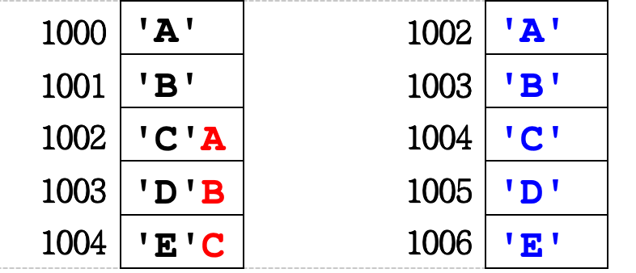

    - 在1002进行copy时，却因为之前的操作被覆盖成了 `A`，导致copy不是我们预期的结果

!!! abstract "结论"
    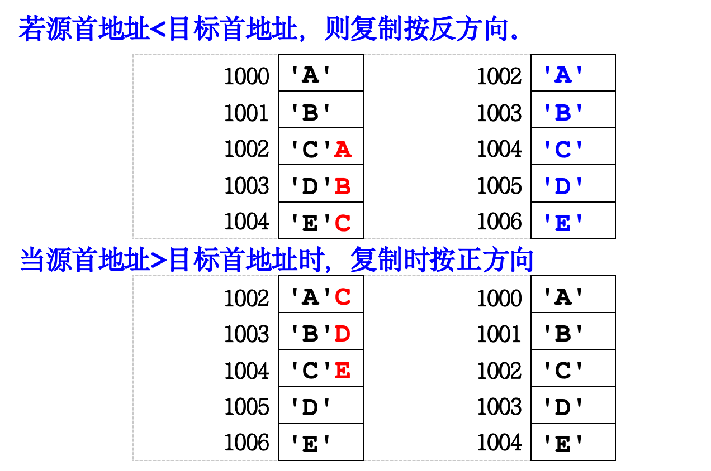

- `cld`使`DF=0`，字符串复制按正方向

- `std`使`DF=1`，字符串复制按反方向

```asm
          ;假定ds=2000h,si=1002h,es=2000h,di=1000h,cx=5
cld       ; DF=0 表示正方向
rep movsb ; 把ds:si指向的长度为cx字节的内存块复制到目标地址es:di
```

#### 中断标志 IF

- 中断标志（Interrupt flag），当`IF=1`时,允许中断;否则禁止中断

- `sti`指令使`IF=1`表示开/允许硬件中断

```asm
mov ax, 0
mov bx, 1
next:
add ax, bx
;此时若用户敲键,则CPU会在此处插入一条int 9h指令并执行它
;int 9h的功能是读键盘编码并保存到键盘缓冲区中
add bx, 1
cmp bx, 100
;若程序已运行了1/18秒,则cpu会在此处插入一条int 8h指令
jbe next
```
??? tip "int 9h"
    - int 9h的功能是读键盘编码并保存到键盘缓冲区中


??? tip "int 8h"
    - 在 x86 架构的计算机中，系统时钟中断（也称为时钟滴答中断）由硬件定时器（通常是可编程间隔定时器，PIT）每隔固定时间间隔触发一次。这个时间间隔通常是 18.2 次每秒（大约每 55 毫秒一次）。

    - `int 8h`的作用：更新系统时钟，每次时钟中断发生时，BIOS 会更新系统时钟计数器，以跟踪系统启动以来经过的时间。

```asm title="防止硬件中断"
;用cli和sti把一段代码包围起来可以达到该段代码在
;执行过程中不会被打断的效果
cli; clear interrupt禁止硬件中断
...; 重要代码
sti; set interrupt允许硬件中断
```

!!! abstract "软件中断和硬件中断区别"
    - 中断来源不同：软件中断一般是管理员所编程的某条指令，而硬件中断则来自于外部硬件设备事件触发(如键盘的int 9h；时钟的int 8h)

    - 显隐式：软件中断是可以清晰在调试时看见代码的，显式的（explicit）；而硬件中断则不可见，隐式的（implicit）

#### 陷阱标志 TF

- TF(Trap Flag)陷阱标志；当TF=1时，CPU会进入**单步模式**（single-step mode）

- 这时候，CPU会在每执行一条指令后，自动在该条指令和下条指令之间**插入**一条`int 1h`指令并执行它

??? tip "int 1h"
    - `int 1h` 是一个中断调用，在 x86 架构的计算机中用于处理单步调试（Single Step）和硬件断点（Hardware Breakpoint）。它是由 CPU 生成的中断，用于调试目的。

    - **调试器**可以捕获这个中断并暂停程序执行，以便检查当前的寄存器和内存状态。通过设置**中断向量表**，可以**自定义单步中断处理程序**，以实现特定的调试逻辑。

---

```asm title="如何设置TF=1"
    pushf   ; push FL
    pop ax  ; 我们把FL压栈然后又出栈，并赋值给AX，得到AX = FL
    ; 之所以不直接mov ax, fl 就是因为FL和IP比较特殊
    ; 他们不能直接以 “名字”的形式来访问，只能间接地用这种形式
    or ax, 100h ; 由于TF在FL的第8位，因此我们用这种特殊的or方式
    ; 间接地实现了让TF=1
    push ax
    popf; pop FL, FL=ax
```

```asm title="设置TF=0"
    pushf
    pop, ax
    and ax, 0FEFFh
    ; 或写成 and ax, not 100h
    push ax
    popf
```

---

- 下面将演示如何设计我们自己的`int 1h`函数

- 我们要知道`int 1h`函数的**地址**是存放在哪里的：

    - `0:4`~`0:5`这两个字节里存的是`int 1h`函数的偏移地址；`0:6~0:7`这两个字节里存放的是`int 1h`函数的段地址

    - 例如`0:4`->78h `0:5`->56h `0:6`->34h `0:7`->12h；那么`int 1h`函数首地址就是 1234h:5678h

    - 其实这个就是中断向量表，对于`int n`函数的指针就存在`0:n*4`的位置

```asm title="更改int 1h函数"
code segment
assume cs:code, ds:code
main:
   jmp begin
old1h dw 0, 0
prev_addr dw offset first, code;前条指令的地址
begin: 
   push cs
   pop ds; DS=CS
   xor ax, ax
   mov es, ax
   mov bx, 4
   push es:[bx]
   pop old1h[0]
   push es:[bx+2]
   pop old1h[2]
   mov word ptr es:[bx], offset int1h
   mov word ptr es:[bx+2], cs
   pushf; save old FL
   pushf
   pop ax
   or ax, 100h; 1 0000 0000
   push ax
   popf; TF=1
first:
   nop; 当某条指令执行前TF==1,则该条指令执行后会
      ; 自动执行int 01h单步中断
single_step_begin:
;first int 1h
   xor ax, ax
   mov cx, 3
next:
   add ax, cx
   nop
   loop next
   popf; restore old FL, TF=0
;last int 1h
   nop;
single_step_end:
   push old1h[0]
   pop es:[bx]
   push old1h[2]
   pop es:[bx+2]
   mov ah, 4Ch
   int 21h
int1h:
   push bp
   mov bp, sp
   push bx
   push es
   les bx, dword ptr cs:[prev_addr]
   inc byte ptr es:[bx]; 加密上一条指令
   les bx, dword ptr [bp+2]
   ;mov bx, [bp+2]
   ;mov es, [bp+4]; es:bx->下条指令的首字节

   dec byte ptr es:[bx]; 解密下一条指令
   mov cs:prev_addr[0], bx
   mov cs:prev_addr[2], es
   pop es
   pop bx
   pop bp
   iret
code ends
end main

```

## Lec 10

### 端口

- CPU$\leftrightarrow$端口$\leftrightarrow$I/O设备

- 端口是CPU与I/O设备之间的接口，用于传输数据和控制信号。端口可以是物理端口（如串行端口、并行端口、USB端口）或逻辑端口（通过I/O指令访问的地址）。

- 端口编号就是端口地址，共65536个端口，\[0000h,0FFFFh\]

---

- 对端口进行操作，要使用`in`,`out`指令

??? tip "Example--对键盘操作的相应"
    ```asm
        ;---------------------------------------
        ;PrtSc/SysRq: E0 2A E0 37 E0 B7 E0 AA  ;
        ;Pause/Break: E1 1D 45 E1 9D C5        ;
        ;---------------------------------------
        data segment
        old_9h dw 0, 0
        stop   db 0
        key    db 0; key=31h
        phead  dw 0
        key_extend  db 'KeyExtend=', 0
        key_up      db 'KeyUp=', 0
        key_down    db 'KeyDown=', 0
        key_code    db '00h ', 0
        hex_tbl     db '0123456789ABCDEF'
        cr          db  0Dh, 0Ah, 0
        data ends

        code segment
        assume cs:code, ds:data
        main:
            mov ax, data
            mov ds, ax
            xor ax, ax
            mov es, ax
            mov bx, 9*4
            push es:[bx]
            pop old_9h[0]
            push es:[bx+2]
            pop old_9h[2]    ; 保存int 9h的中断向量
            cli
            mov word ptr es:[bx], offset int_9h
            mov es:[bx+2], cs; 修改int 9h的中断向量
            sti
        again:
            cmp [stop], 1
            jne again        ; 主程序在此循环等待
            push old_9h[0]
            pop es:[bx]
            push old_9h[2]
            pop es:[bx+2]    ; 恢复int 9h的中断向量
            mov ah, 4Ch
            int 21h

        int_9h:
            push ax
            push bx
            push cx
            push ds
            mov ax, data
            mov ds, ax       ; 这里设置DS是因为被中断的不一定是我们自己的程序
            in al, 60h       ; AL=key code
            mov [key], al
            cmp al, 0E0h
            je  extend
            cmp al, 0E1h
            jne up_or_down
        extend:
            mov [phead], offset key_extend
            call output
            jmp check_esc
        up_or_down:
            test al, 80h     ; 最高位==1时表示key up
            jz down
        up:
            mov [phead], offset key_up
            call output
            mov bx, offset cr
            call display     ; 输出回车换行
            jmp check_esc
            down:
            mov [phead], offset key_down
            call output
            check_esc:   
            cmp [key], 81h   ; Esc键的key up码
            jne int_9h_iret
            mov [stop], 1
            int_9h_iret:
            mov al, 20h      ; 发EOI(End Of Interrupt)信号给中断控制器，
            out 20h, al      ; 表示我们已处理当前的硬件中断(硬件中断处理最后都要这2条指令)。
                                ; 因为我们没有跳转到的old_9h，所以必须自己发EOI信号。
                                ; 如果跳到old_9h的话，则old_9h里面有这2条指令，这里就不要写。
            pop ds
            pop cx
            pop bx
            pop ax
            iret             ; 中断返回指令。从堆栈中逐个弹出IP、CS、FL。

        output:
            push ax
            push bx
            push cx
            mov bx, offset hex_tbl
            mov cl, 4
            push ax   ; 设AL=31h=0011 0001
            shr al, cl; AL=03h
            xlat      ; AL = DS:[BX+AL] = '3'
            mov key_code[0], al
            pop ax
            and al, 0Fh; AL=01h
            xlat       ; AL='1'
            mov key_code[1], al
            mov bx, [phead]
            call display     ; 输出提示信息
            mov bx, offset key_code
            call display     ; 输出键码
            pop cx
            pop bx
            pop ax
            ret

        display:
            push ax
            push bx
            push si
            mov si, bx
            mov bx, 0007h    ; BL = color
            cld
        display_next:
            mov ah, 0Eh      ; AH=0Eh, BIOS int 10h的子功能，具体请查中断大全
            lodsb
            or al, al
            jz display_done
            int 10h          ; 每次输出一个字符
            jmp display_next
        display_done:
            pop si
            pop bx
            pop ax
            ret
        code ends
        end main
    ```

---

- 另外一个常用的外部设备就是cmos；CMOS（Complementary Metal-Oxide-Semiconductor）存储器用于保存系统的配置信息和实时时钟（RTC）数据。CMOS 存储器通过 I/O 端口 70h 和 71h 进行访问。

- CMOS中地址`[4],[2],[0]`分别保存了时钟中的时、分、秒，格式为BCD码

- 如果我们想要访问，就要借助两个端口：

    - 端口 `70h` 是 CMOS 地址寄存器。通过向这个端口写入一个值，可以选择 CMOS 存储器中的一个特定地址。

    - 端口 `71h` 是 CMOS 数据寄存器。通过从这个端口读写数据，可以访问 CMOS 存储器中由端口 70h 选择的地址。

### 再谈寻址方式

- 段地址的隐含：

    - 当`[]`内的寄存器为非`bp`的时候，默认的段地址就是`ds`

    - 当`[]`内的寄存器为`bp`的时候，默认的段地址是`ss`

    - 这是因为`sp`这个寄存器**不能**用在`[]`中，而我们如果想要访问**堆栈**，就需要借助于`bp`


### 寄存器交换指令

- `xchg`(exchange)指令用于交换两个寄存器的值；或者一个是寄存器、另一个是变量

```asm
mov ax, 1
mov bx, 2
xchg ax, bx
xchg ax, ds:[bx]
```

### 乘除法

!!! warning "`mul`和`div`指令都是无符号数的乘除法操作，`imul`,`idiv`用于有符号数的乘除法"

#### mul

- 乘法指令`mul`比较特殊，分为8位乘法、16位乘法、32位乘法

=== "8位乘法"

    - 后面只有**一个**操作数，必须是一个**8位寄存器**或者**8位变量**

    - 其中，被乘数一定是`al`，结果保存在`ax`中

    ```asm
    mov al, 12h
    mov bh, 10h
    mul bh ; ax = bh*al
    ```

=== "16位乘法"
    
    - 被乘数一定是`ax`，结果一定保存在`dx:ax`中（这里的冒号并非寻址，而是表示寄存器的连接，高低部分分别保存在两个寄存器里面）

    ```asm
    mov ax, 1234h
    mov bh, 100h
    mul bh ; 结果是 0012 3400h
    ; 其中dx=0012h, ax=3400h
    ```

=== "32位乘法"

    - 被乘数一定是`eax`，结果一定保存在`edx:eax`中（高低部分分别保存在两个寄存器里面）

---

#### div

- 和乘法类似，div同样也只有一个操作数；同时作为被除数和保存结果的寄存器与乘法可以说是"倒置"关系

=== "16位除法"

    - 被除数一定是`ax`，其中商保存在`al`，余数保存在`ah`

    ```asm
    mov ax, 123h
    mov bh, 10h
    div bh ; al=12h, ah=3h
    ```

=== "32位除法"

    - 被除数一定是`dx:ax`，其中商保存在`ax`，余数保存在`dx`

=== "64位除法"

    - 被除数一定是`edx:eax`，其中商保存在`eax`，余数保存在`edx`

---

#### 除法溢出

!!! abstract "除法溢出的两种情形"

    1.除以0

    ```asm
    mov ax, 1234h
    mov bh, 0
    div bh; 除以0显然发生溢出
    ```
    
    2.商无法保存在`AL`中（寄存器太小）

    ```asm
    mov ax, 123h
    mov bh, 1
    div bh ; 此时由于商无法保存到AL中，因此也会发生溢出
    ```

## Lec 11

### 地址传送指令

`LEA`,`LDS`,`LES`

#### lea

- `lea`(load effective address):就是取变量的偏移地址

    ```asm
    lea dx, ds:[1000h] 
    ;上面这一句等效于mov dx, 1000h
    ```

- 这里看似`lea`指令没有意义，直接mov就好了；但是只是常数的情况是这样的，其实`lea`有不可取代的地方

    ```asm
    lea dx, ds:[bx+si+3]; dx=bx+si+3
    ;而mov dx, bx+si+3是错误的，一条指令做不到
    mov dx, bx
    add dx, si
    add dx,3
    ```

    ```asm title="巧做运算"
    lea eax, [eax+eax*4]; EAX=EAX*5
    ;看似在取址，实际在乘法运算
    ```

---

#### 引：远近指针

- 远指针(far pointer)指的是段地址和偏移地址的组合，而近指针(near pointer)就是偏移地址；

- 16位汇编中，远指针是16位段地址:16位偏移地址，近指针是16位偏移地址；32位汇编中，远指针是16位段地址:32位偏移地址，近指针是32位偏移地址

- 当我们的程序中，**段地址**总是需要变化的时候，就可以使用远指针

!!! tip "远指针的内存布局"
    - 假定一个远指针$p$ `1234h:5678h`存放在地址`1000:0000h`中；

    - 在内存数据中肯定没有冒号，把段地址和偏移地址拼在一起，变成一个32位数->`12345678h`

    - 则内存布局如下：

        - 1000:0000 78h

        - 1000:0001 56h

        - 1000:0002 34h

        - 1000:0003 12h

    - 顺带一提，这个dword大小的值，究竟是远指针还是`long int`，我们光从内存布局是看不出来的

- 如果我们尝试从内存中读取远指针的值，可以发现用mov操作需要两次，例如：

```asm
;设ds=1000h, bx=0
mov di, ds:[bx]   ;di=5678h
mov es, ds:[bx+2] ;es=1234h
```

- 于是就引入了`les`和`lds`指令

---

#### les, lds

- `LES`（Load Pointer Using ES）指令用于将内存中的数据加载到指定的通用寄存器和 `ES`（附加段寄存器）中。

    - 例如，`les bx, [ptr]` 将内存地址 ptr （16 位偏移地址和 16 位段地址）加载到 `BX` 和 `ES` 中。

- `LDS`（Load Pointer Using DS）指令用于将内存中的数据加载到指定的通用寄存器和`DS`中

    - 例如，`lds bx, [ptr]` 将内存地址 ptr （16 位偏移地址和 16 位段地址）加载到 `BX` 和 `DS` 中。

```asm
les di, ds:[bx]; 高16位分配给es，低16位分配给di
lds si, ds:[bx]; 高16位分配给ds，低16位分配给si
```

---

```asm title="Example--远指针的定义和使用"
data segment
video_addr dw 0000h, 0B800h, 160, 0B800h
;上述定义也可以写成
;video_addr dw 0B8000000h, 0B80000A0h
;video_addr db 00, 00, 00, 0B8, A0, 00, 00, B8

;然后当使用dw定义的时候，需要进行强制类型转换，才能使用les
les di, dword ptr video_addr[bx]
```

```c title="C语言例子"
#include<stdio.h>
int main(){
    static char far *p;
    p = (char far *)0xB8000000;
    *p = 'A';
    *(p+1) = 0x17;
}
```

### 符号扩充指令

- 在 x86 汇编语言中，`CBW`、`CWD` 和 `CDQ` 是三条用于扩展符号位的指令。它们用于将较小的有符号数扩展为较大的有符号数，以便进行后续的算术运算。


- `CBW`(convert byte to word)指令用于将 `AL` 寄存器中的有符号字节扩展为 `AX` 寄存器中的有符号字。

- `CWD`(convert word to doubleword) 指令用于将 AX 寄存器中的有符号字扩展为 DX:AX 寄存器对中的有符号双字。

- `CDQ`(convert doubleword to quadword) 指令用于将 EAX 寄存器中的有符号双字扩展为 EDX:EAX 寄存器对中的有符号四字。

```asm
mov al, 0FEh
cbw; AX=0FFFEh

mov ax, 8000h
cwd; DX=0FFFFh AX=8000h

mov eax, 0ABCD1234h
cdq; EDX=0FFFFFFFFh EAX=0ABCD1234h
```

---

- 不过intel后面出了一个新指令`movsx`，完全可以淘汰上述的三个指令；因为上面三个指令的src和dest寄存器是限定死的；但是`movsx dest, src`可以很随意，只需要dest是**较大**的寄存器，src是**较小**的寄存器


### 零扩充指令

- `MOVZX`（Move with Zero-Extend）是 x86 汇编语言中的一条指令，用于将一个**较小**的源操作数（如 8 位或 16 位）移动到一个**较大**的目标寄存器（如 16 位或 32 位），并将**高位用零填充**。

```asm
movzx eax, al
movzx edx, al
;左边的源可以是任意的较大目标寄存器
```

### 换码指令（查表指令）

- `XLAT`（Translate）是 x86 汇编语言中的一条指令，用于根据**查找表**（通常是一个数组）将一个字节值转换为另一个字节值。`XLAT` 指令使用 `AL` 寄存器中的值作为索引，从查找表中获取相应的字节值，并将其存储在 `AL` 寄存器中。

- `xlat`在执行前，必须让`ds:bx`**指向查找表**，`al`赋值为数组的**下标**；执行`xlat`后，AL=ds:[bx+AL]

```asm
char t[]="0123456789ABCDEF";
char i;
i = 10;
i = t[i]; 最后i='A'

设ds=数组t的段地址
mov bx, offset t
mov al, 10
xlat; AL='A'
```

### 加法指令

`ADD`,`INC`,`ADC`

- `INC` 指令用于将操作数递增 1；同时`inc`指令不会影响`CF`标志位

- `ADC`（Add with Carry）指令用于将两个操作数相加，并加上进位标志（Carry Flag，CF）的值。它通常用于多字节或多字的加法运算。

```asm title="Example--计算12345678h + 5678FFFFh"
mov dx, 1234h
mov ax, 5678h
add ax, FFFFh ;CF=1
adc dx, 5678h ;DX=DX+5678h+CF
```

```asm title="高精度加法"
x db 100 dup(88h)
y db 100 dup(99h)
z db 101 dup(0)

main:
    mov cx, 100
    mov si, offset x
    mov di, offset y
    mov bx, offset z
    clc
next:
    mov al, [si]
    adc al, [di]
    mov [bx], al
    inc si
    inc di
    inc bx
    dec cx
    jnz next
    adc z[100], 0
```

### 减法指令

`SUB`,`DEC`,`NEG`,`SBB`,`CMP`

- `DEC` 指令用于将操作数递减 1；同时`dec`指令不会影响`CF`

- `NEG` 指令用于将操作数**求补**，就是求相反数，会影响`CF`,`ZF`,`SF`；

    ```asm
    mov ax, 1
    neg ax; AX=-1=0FFFFh
    ```

- `SBB`（Subtract with Borrow）指令用于将源操作数和进位标志（`CF`）从目标操作数中减去，并将结果存储在目标操作数中。它通常用于多字节或多字的减法运算。

    ```asm title="56781234h-1111FFFFh"
    mov ax, 1234h
    sub ax, 0FFFFh; CF=1
    mov dx, 5678h
    sbb dx, 1111h; DX=DX-1111-CF
    ```

- `CMP` 指令用于比较两个操作数。它**实际上是执行减法运算**，但不存储结果，**只更新标志寄存器**。

    ```asm
    mov ax, 3
    mov bx, 3
    cmp ax, bx;内部是做了减法ax-bx，但是抛弃了差，只影响标志寄存器
    je they_are_equal; 当ZF=1时则跳
    ```

### 跳转指令

|abbr.|define|
|-----|------|
|`ja`|jump if above|
|`jb`|jump if below|
|`jae`|jump if above or equal|
|`jbe`|jum if below or equal|
|`jg`|jump if greater|
|`jl`|jump if less|
|`jge`|jump if greater or equal|
|`jle`|jum if less or equal|

#### ja, jb, jae, jbe

!!! abstract 
    `ja`,`jb`,`jae`,`jbe`都是无符号数比较相关的跳转指令

- `ja`: **CF=0 && ZF=0**

- `jb`: **CF=1** ，所以`jb`===`jc`

#### jg, jl, jge, jle 

!!! abstract 
    `jg`,`jl`,`jge`,`jle`都是有符号数比较相关的跳转指令

- `jg`: **SF==OF**

- `jl`: **SF!=OF**

```asm
mov ax, 3
mov bx, 2
cmp ax, bx ;AX-BX=1, SF=0, OF=0 -> AX>BX

mov ah, 7Fh
mov bh, 80h
cmp ah, bh ;AH-BH=0FFh, SF=1, OF=1 -> AX>BX

mov ax, 2
mov bx, 3
cmp ax, bx ;AX-BH=-1=0FFFFh, SF=1, OF=0 -> AX<BX

mov ah, 80h
mov bh, 7Fh
cmp ax, bx ;AX-BH=1, SF=0, OF=1 ->AX<BX
```

#### 短跳、近跳、远跳

1. jmp short target

2. jmp near ptr target

3. jmp far ptr target

- 一般情况下，编译器会自动度量跳跃的距离，因此我们在写源程序的时候不需要加上short, near ptr, far ptr等类型修饰，可以简化成jmp target

=== "短跳"
    - jmp 偏移地址或标号

    - 以下条件跳转指令也属于短跳：jc, jnc, jo, jno, js, jns, jz, jnz, ja, jb, jae, jbe, jg, jge, jl, jle, jp, jnp

    **短跳指令的机器码**：
    
    - 短跳指令的机器码有2字节组成，第1个字节=**EB**
    
    - 第2个字节=△address=目标地址-下条指令的偏移地址

    - 跳的范围很小，只能从 80h~7Fh (-128~127)

    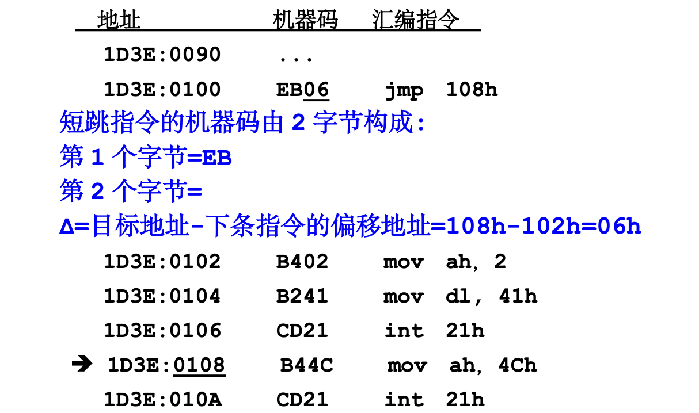

=== "近跳"
    **近跳指令的3种格式**：
    
    - jmp 偏移地址或标号; 如jmp 1000h

    - jmp 16位寄存器   ; 如jmp bx

    - jmp 16位变量     ; 如jmp word ptr [addr]

    - 注意是**小端**格式

    **近跳指令的机器码**：
    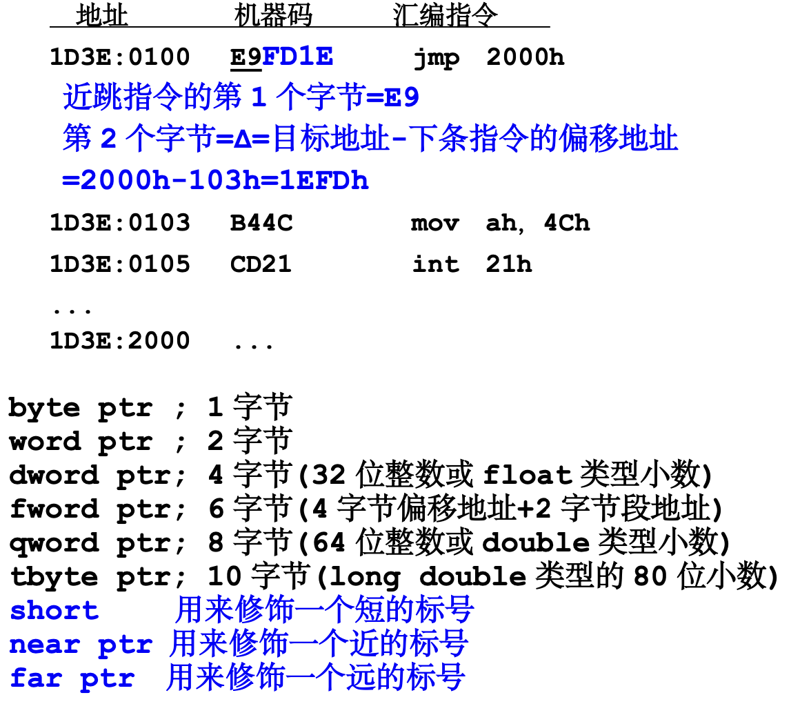

=== "远跳"
    **远跳指令的2种格式**：
    
    - jmp 段地址:偏移地址（直接定义**机器码**）
        
        ```asm
        main:
            db 0EAh
            dw 0
            dw 0FFFFh
        ;就会被翻译成机器码EA0000FFFF
        ```

    - jmp dword ptr 32位变量

    **远跳指令的机器码**：

    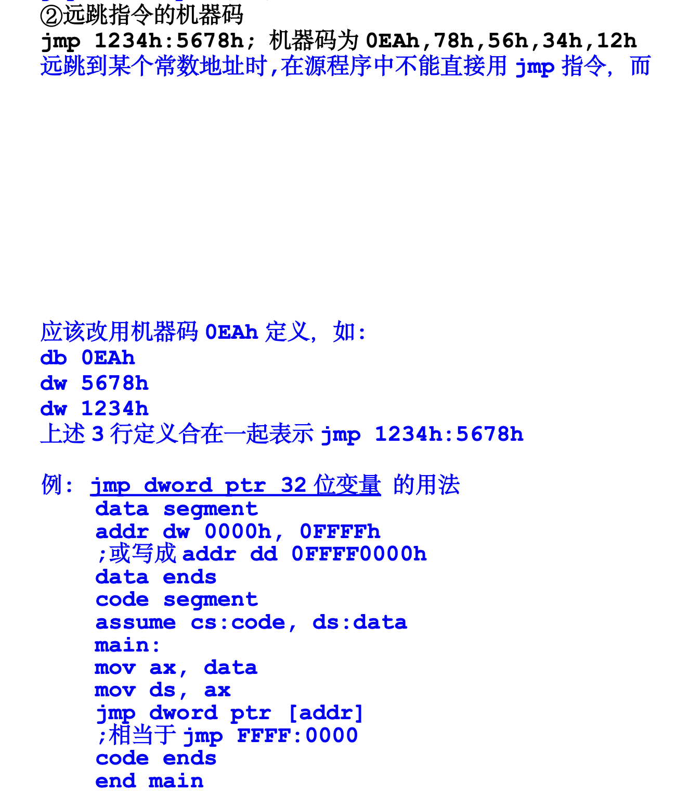


---

#### 循环指令：LOOP

- 在 x86 汇编语言中，loop 指令用于实现循环控制。它会减少 cx 寄存器的值，然后检查 cx 是否为零。如果 cx 不为零，则跳转到指定的标签继续执行；如果 cx 为零，则继续执行下一条指令。

```asm title="求1+2+3的和"
    mov ax, 0
    mov cx, 3
    jcxz done ;jump if cx zero，防止cx为0时，进入一个巨大的循环！
next:
    add ax, cx; ax +3 +2 +1
    loop nest ; cx=2, 1, 0
              ; dec cx
              ; jnz next
```

## Lec 12

### 浮点数运算

- `fadd`,`fsub`,`fmul`,`fdiv`就是浮点数的加减乘除运算指令

#### fld, fild, fst, fstp

!!! info "浮点寄存器"
    - 在过去x86时期，浮点运算由专门的浮点寄存器来负责（FPU）

    - 它包含了八个 **80 位**的浮点寄存器，通常标记为 `ST(0)` 到 `ST(7)`。（用括号来区分开浮点寄存器与数组）

    - 这些寄存器组成了一个堆栈结构，称为浮点堆栈。浮点堆栈的操作类似于普通的堆栈操作，使用 `fld`、`fild`、`fst` 和 `fstp` 等指令来加载和存储浮点数。

- `fld`(load) 指令用于将浮点数加载到浮点堆栈顶。

- `fild`(load **integer**) 指令用于将整数加载到浮点堆栈顶。

- `fst`(store) 指令用于将**浮点堆栈顶(`st(0)`)**的值存储到内存中，但不弹出堆栈。

- `fstp`(store and pop) 指令用于将**浮点堆栈顶(`st(0)`)**的值存储到内存中，并**弹出堆栈st(0)**。

```asm
data segment
x dt 3.1415926535897932 ; long double x
y dq 9.375976525        ; double y
z dd 2.71828            ; float z
i dd 2                  ; long int i
r dt 0                  long double r
data ends
code segment
assume cs:code, ds:data
main:
    mov ax, data
    mov ds, ax
    fild [i]        ; st(0)=2
    fld [x]         ; st(0)=3.141592..., st(1)=2
    fadd st, st(1)  ; st(0)=5.141592..., st(1)=2
    fld [y]         ; st(0)=9.375976..., st(1)=5.141592..., st(2)=2
    fsub st(1), st  ; st(0)=9.375976..., st(1)=-4.23438..., st(2)=2
    fstp st         ; st(0)=-4.23438..., st(1)=2
```

### 修改中断向量

```asm
main:
    mov ax, data
    mov ds, ax
    xor ax, ax
    mov es, ax      ;ES=0
    mov ax, es:[0]  ;AX=offset of int 00h
    mov dx, es:[2]  ;DX=seg of int 00h
    ; 把int 00h的中断向量映射的偏移地址和段地址取出来
    ; 保存到old_00h里
    mov old_00h[0], ax
    mov old_00h[2], dx

    mov word ptr es:[0], offset my_00h
    mov word ptr es:[2], offset cs
    ; 修改int 00h的中断向量为cs:[my_00h]

    mov ax, 1234h
    mov bl, 00h
divide:
    div bl
    ; 除法溢出的时候会自动插入int 00h中断
    ; 当int 00h发生时，将做一下操作：
    ; pushf
    ; push cs
    ; push offset divide
    ; jump dword ptr 0:[0]
    ; int 00h
next:
    mov ah, 4Ch
    int 21h
my_00h:
    push bp
    mov bp, sp
    add word ptr [bp+2], 2
    ; 把返回地址+2，原值=offset divide
    ; +2后跳到下一条地址（相当于PC+4）
    pop bp
    push ax
    push dx
    mov ah, 2
    mov dl, 'D'
    int 21h
    pop dx
    pop ax
    iret; 中断返回
        ; CPU执行iret时会有以下动作
        ; pop ip
        ; pop cs
        ; popf

```

!!! tip "对于代码中修改跳回地址的操作"
    - 在执行`int 00h`的时候，堆栈其实是这样的

    ```asm
    假设初始sp=2000h

    ss:1FF8 old bp        <- bp ;执行push bp时
    ss:1FFA offset divide <- sp ;执行int 00h时
    ss:1FFC CS
    ss:1FFE FL
    ss:2000
    ```

    - 所以`add word ptr [bp+2], 2`就会对`ss:1FFA`初的offset divide进行修改，把返回地址给改了

### 函数调用 call, ret

- 函数调用有三种形式：

1. 寄存器传递

```asm
f:
    add ax, ax
    ret
main:
    mov ax, 3 ;ax就是f()的参数
    call f
```

2. 变量传递

- 不能支持多线程，因为传递的是全局变量，如果变量在另一处被修改了，函数最后结果也会发生变化

```asm
f:
    mov ax, [var]
    add ax, ax;     ax就是函数值
    ret
main:
    mov [var], 3
    call f
```

3. 堆栈传递

```asm
f:
    push bp
    mov bp, sp
    mov ax, [bp+4] ;从堆栈中取得参数
    add ax, [bp+6]
    pop bp
    ret
main:
    mov ax, 3
    push ax ;参数压入堆栈
    mov ax, 2
    push ax
    call f
back:
    add sp, 2; 就是别再指向push进去的ax了

--------------
栈结构：
设初始sp=2000h

ss:1FF8 old_bp <-bp=sp 
ss:1FFA return address
ss:1FFC 2
ss:1FFE 3 
ss:2000 ??
```

#### 远调用，retf

- 远调用（Far Call） 指令用于调用位于不同代码段的子程序。远调用不仅保存当前的指令指针（IP），还保存当前的代码段选择子（CS），以便在返回时能够正确恢复。

- 远调用需要搭配**远指针**使用

```asm
CALL FAR PTR segment:offset
```

- **RETF**（Return Far） 指令用于从远调用的子程序返回。RETF 指令从堆栈中弹出返回地址和代码段，并跳转到该地址继续执行。

!!! tip "Example--远调用"

    *1000:2000*   **call 1234:5678**

    此时会**push** 1000h，再**push** 2005h（即下一条指令的offset）

    最后**jmp** 1234:5678

    *1000:2005*   **mov ah, 4Ch**

    *1000:2007*   **int 21h**

    ...

    *1234:5678*   ...
                
    ...  **retf** 
    
    执行retf，就返回ip和cs；即**pop ip, pop cs**


### int, iret

- `int 21h` 对应的函数首地址保存在 0:84h(因为中断向量表从0:0h开始，然后每个是4，所以0:21*4h) 处, 该地址是一个远指针。

- dword ptr 0:[84h] 称为 int 21h 的中断向量(其实是它的函数首地址)

- $n$ 的取值范围是[00, FF], 所以 256 个中断向量会占用 0:0~0:3FF 之间共 400h 个字节的内存，这块区域称为 中断向量表。

---

**当我们执行`int 21h`时，发生了什么？**：

- cpu做了一下4件事（和risc-v里的中断跳转有点像）：

    1. pushf

    2. push cs

    3. push 下一条指令的offset

    4. jmp dword ptr 0:[84h]

- 当中断服务执行完后有一个**iret**指令（类似于`mret`），供我们返回中断位置的下一条指令

- 当执行iret时，cpu做了一下3件事情

    1. pop ip

    2. pop cs

    3. popf


## Lec 13

### 逻辑运算指令

`AND`, `OR`, `XOR`, `NOT`, `TEST`

- 主要介绍`TEST`指令，在 x86 汇编语言中，TEST 指令用于执行**按位与（AND）**操作，但**不存储结果**（就像cmp和sub）只更新标志寄存器。它通常用于测试寄存器或内存位置中的**特定位**是否设置。

```asm title="test msb is one"
mov ax, 9234h
test ax, 8000h ; 结果就是8000h，ZF=0, AX=9234h
jnz msb_is_one ; 和8000h按位与之后不为0，则说明最高位是1
```

### 移位指令    

|指令|功能|
|----|----|
|`shl`|逻辑左移|
|`shr`|逻辑右移|
|`sal`|算术左移|
|`sar`|算术右移|
|`rol`|循环左移|
|`ror`|循环右移|
|`rcl`|将{CF,operand}一起循环左移|
|`rcr`|将{operand,CF}一起循环右移|

```asm title="rcr"
rcr ah, 1   ;AH=1011 0110   CF=1 移位前
            ;AH=1101 1011   CF=0 移位后
```

```asm title="例：将1234ABCDh逻辑左移3位"
    mov dx, 1234h
    mov ax, 0ABCDh
    mov cx, 3
next:
    shl ax, 1; CF=1
    rcl dx, 1; dx左移产生的最右端空洞完美地用CF来补全
    loop next

```

### 字符串操作指令 

#### 字符串传送指令

`movsb`, `movsw`, `movsd`

??? info "C语言中的类似指令"
    `memcpy(void *t, void *s, int n)`;
    `memmove(void *t, void *s, int n)`;
    `strcpy(char *t, char *s)`;
    `strncpy(char *t, char *s, int n)`;


- 在 x86 汇编语言中，`MOVSB` 指令用于将一个字节从源地址复制到目标地址。它是 "Move String Byte" 的缩写。`MOVSB` 指令通常用于字符串操作，特别是在需要复制或移动内存块时。

- 将 `DS:SI` 指向的源地址的字节复制到 `ES:DI` 指向的目标地址。

- 根据方向标志（DF）的值自动更新 SI 和 DI 寄存器：

    - 如果 DF 为 0（清除状态），则 SI 和 DI 增加 1。

    - 如果 DF 为 1（设置状态），则 SI 和 DI 减少 1。

---

- 为了达到类似memcpy的效果，我们可以采用`rep movsb`，其中`rep`是repeat

??? tip "rep, repe, repne"
    - `rep` 前缀用于重复执行后面的字符串操作指令，直到 CX 寄存器的值变为零。每次执行指令后，CX 寄存器的值减 1。

    - `repe` 前缀用于重复执行后面的字符串操作指令，直到 CX 寄存器的值变为零或零标志（ZF==0）。每次执行指令后，CX 寄存器的值减 1。

    - repne 前缀用于重复执行后面的字符串操作指令，直到 CX 寄存器的值变为零或零标志（ZF==1）。每次执行指令后，CX 寄存器的值减 1。


```cpp title="rep movsb的操作细分"
again:
if(cx == 0)
    goto done;
byte ptr es:[di] = byte ptr ds:[si]
if(df == 0){
    si++; di++;
}
else{
    si--; di--;
}
cx--;
goto again
done:
```

```cpp title="单独movsb指令的操作细分"
byte ptr es:[di] = byte ptr ds:[si]
if(df == 0){
    si++; di++;
}
else{
    si--; di--;
}
```

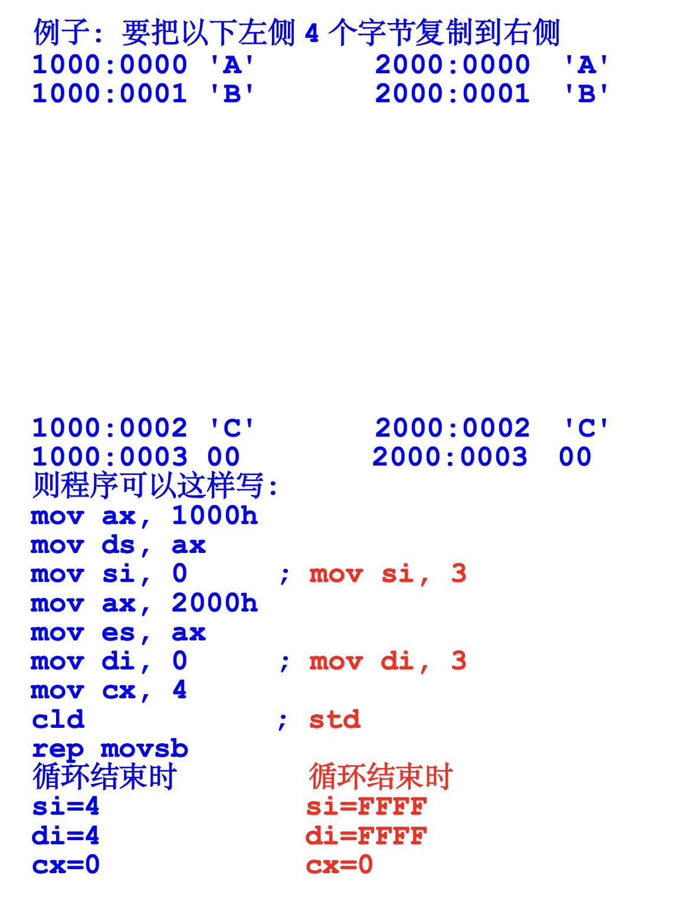

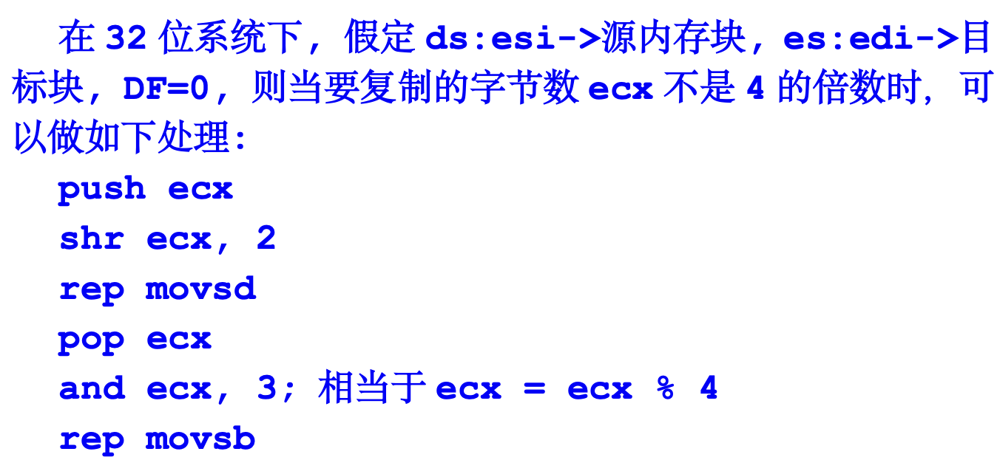

---

#### 字符串比较指令

`cmpsb`, `cmpsw`, `cmpsd`

- 比较两个内存块，`ds:[si]`和`es:[di]`；也是使用DF来控制方向

- repe：ZF=1时重复；    repne：ZF=0时重复

- repe cmpsb（本次比较相等则继续比较下一个）

- repne cmpsb（若本次比较不等则继续比较下一个）

```cpp title="repe cmpsb（本次比较相等则继续比较下一个）"
again:
if(cx == 0) goto done;
比较 byte ptr ds:[si]与 byte ptr es:[di]
if(df == 0){
    si++; di++;
}
else{
    si--; di--;
}
cx--;
goto again;
```

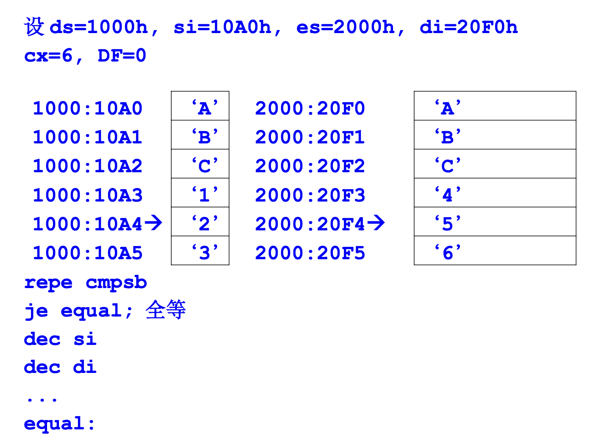

#### 字符串扫描指令

`scasb`, `scasw`, `scasd`

- 在 x86 汇编语言中，SCASB 指令用于扫描字符串中的字节，比较 `AL` 寄存器中的值与 `ES:DI` 指向的内存位置的字节。SCASB 是 "Scan String Byte" 的缩写。

```cpp title="scasb"
scasb:
    cmp al, es:[di]
    di++; 当DF=1时，为di--
```

```cpp title="repne scasb伪代码"
repne scasb:
next:
    if(cx == 0) goto done;
    cmp al, es:[di]
    di++;
    cx--;
    if(cmp is true)
        goto done;
    goto next;
done:
```

---

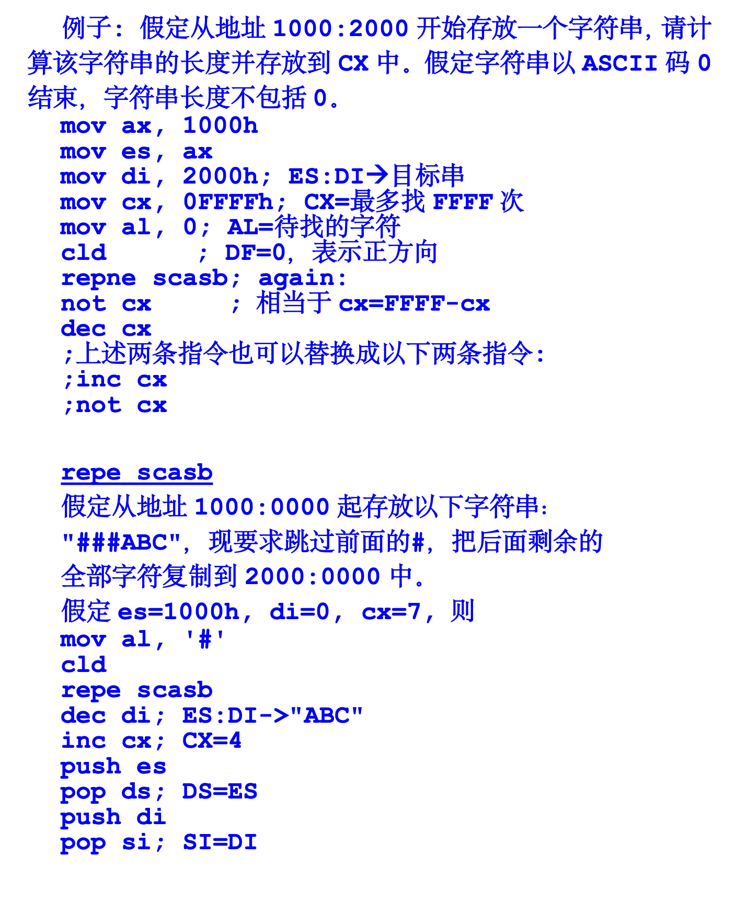


#### 字符串读写

`stosb`, `stosw`, `stosd`, `lodsb`

- 在 x86 汇编语言中，stosb 指令用于将 `AL` 寄存器中的字节存储到由 `ES:DI` 指向的内存位置，并根据方向标志（DF）自动更新 DI 寄存器。stosb 是 "Store String Byte" 的缩写。

```cpp title="stosb"
es:[di] = al
di++ ; DF=1时为di--
```

```cpp title="rep stosb"
again:
    if(cx == 0) goto done;
    es:[di] = al;
    di++; DF=1时为di--
    cx--;
    goto agin;
done:
```

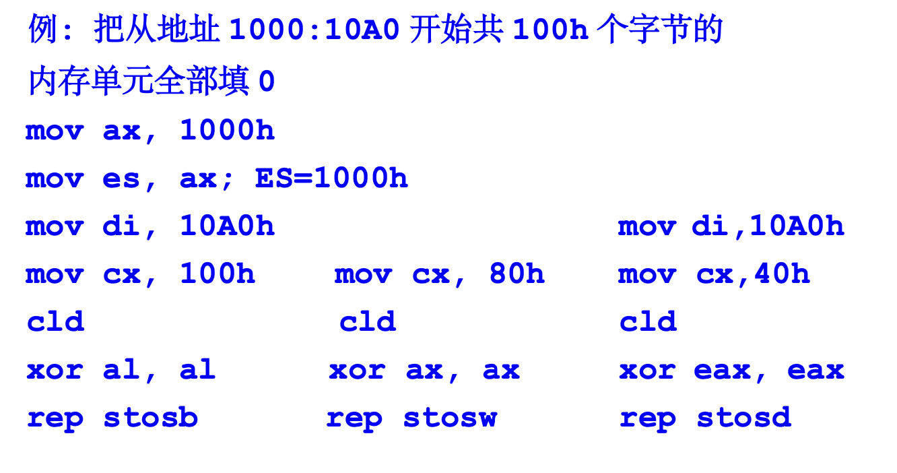

---

`lodsb`

```cpp title="lodsb"
al = ds:[si]
si++ ; 当DF=1时，为si--
```

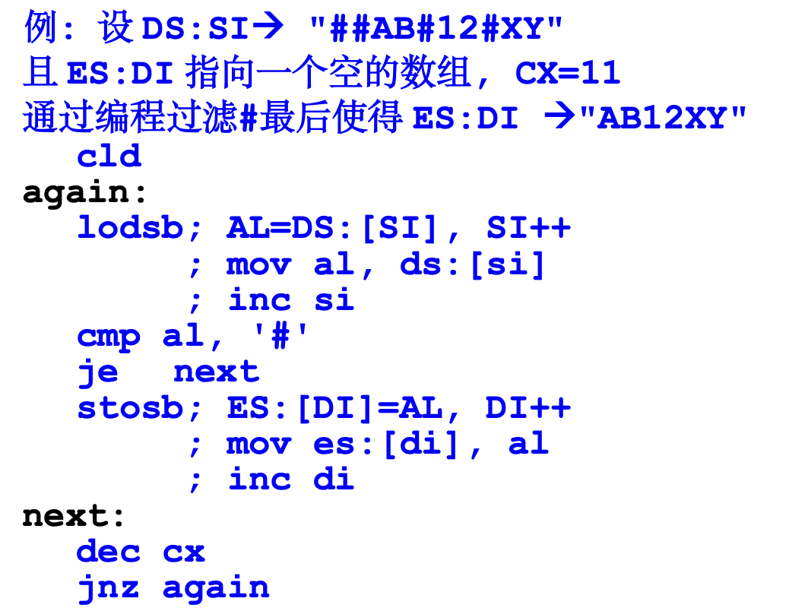

## Lec 14

### __cdecl

- 参数从右到左顺序压入堆栈，由调用者清理堆栈; 是 C 语言参数传递规范。

```asm
f:
    push bp; (4)
    mov bp, sp
    mov ax, [bp+4]; arg0
    add ax, [bp+6]; arg1
    pop bp; (5)
    ret; (6)
main:
    mov ax, 20; arg1
    push ax; (1)
    mov ax, 10; arg0
    push ax; (2)
    call f; (3)
here:
    add sp, 4; (7)
```

- __cdecl 堆栈布局:

    ss:1FF8 old bp <- bp (4) 

    ss:1FFA here <- (3)(5) 

    ss:1FFC 10 <- (2)(6) 

    ss:1FFE 20 <- (1)

    ss:2000 <- (7)

----

### 动态变量

```cpp
int f(int a, int b){
    int c; // c是局部动态变量
    c = a + b;
    return c;
}
```

- 上述的C语言代码可以翻译成一下汇编代码：   

```asm
f:
    push bp;
    mov bp, sp
    sub sp, 2   ; 这里挖的坑是给局部动态变量c的
    mov ax, [bp+4]
    add ax, [bp+6]
    mov [bp-2], ax
    mov ax, [bp-2]
    mov sp, bp  ; 此时变量c死亡
    pop bp
    ret
main:
    mov ax, 20
    push ax
    mov ax, 10
    push ax
    call f
here:
    add sp, 4  ; 此时参数a,b死亡
```

- 执行上述代码时，堆栈布局如下：
    
    ss:1FF6 30 ; 变量c

    ss:1FF8 old_bp  <- bp

    ss:1FFA here

    ss:1FFC 10

    ss:1FFE 20

    ss:2000 

---

### 递归

- 形式和RISC-V差不多，都是反复堆栈来递归调用函数

```cpp title="c代码"
int f(int n){
    if(n==1)
        return 1;
    return n+f(n-1);
}
```

```asm title="递归"
f:
    push bp
    mov bp, sp
    mov ax, [bp+4]
    cmp ax, 1
    je done
    dec ax
    push ax
    call f
there:
    add sp, 2
    add ax, [bp+4]
done:
    pop bp
    ret
main:
    mov ax, 3
    push ax
    call f
here:
    add sp, 2
```

    ss:1FF0 there<-(8)(10) 
    
    ss:1FF2 1<-(7)(11) 
    
    ss:1FF4 oldbp<-bp(6)(12) 
    
    ss:1FF6 there<-(5)(13) 
    
    ss:1FF8 2<-(4)(14) 
    
    ss:1FFA oldbp<-bp(3)(15) 
    
    ss:1FFC here <-(2)(16) 
    
    ss:1FFE 3 <-(1)(17) 
    
    ss:2000 <-(18)

## 考试

理论考 45min 10道判断 25道单选

实验考 85min 2道函数题，2道填空题