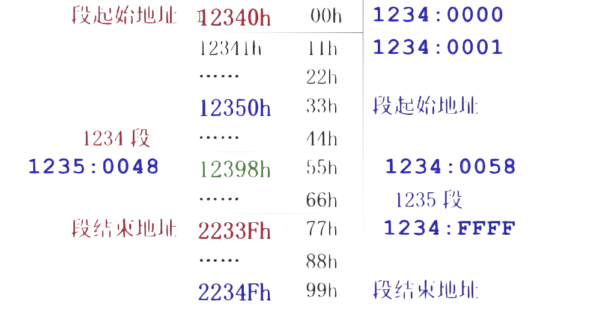

# X86 汇编语言

## Lec 2

### 标号
- 在汇编语言中，**标号（Label）**是指向代码或数据位置的标识符。标号允许程序员在汇编代码中引用**内存地址**，而不需要知道具体的地址值。这使得代码更易于编写、阅读和维护。
```asm
main:         
    mov eax, 0 
    mov ebx, 1
again:
    add eax, ebx
    add ebx, 1  
    cmp ebx, 100
    jbe again   
```

### wsprintf

- `wsprintf`是windows系统内部的函数，对应C标准库的`sprintf`  
- `sprintf`是C语言标准库中的一个函数，用于将**格式化的数据写入字符串**。它是`printf`函数的一个变体，`printf`将格式化的数据输出到标准输出（通常是**屏幕**），而`sprintf`则将格式化的数据输出到一个**字符串**中。
```c
char result[100], format[] = "%d";
sprintf(result,format,5050);
sprintf(&result[0],&format[0],5050);
```

!!! note "invoke, offset"
    - `invoke`是在某些汇编语言环境中用于简化函数或过程调用的指令。它的目的是使函数调用更加直观，类似于高级语言中的函数调用。invoke指令会自动处理参数的传递和调用约定，简化了传统汇编中手动压栈和设置寄存器的过程。  
    - `offset`是一个操作符，用于获取变量、标号或函数的内存地址。


### MessageboxA
- `MessageBoxA`是**Windows API**中的一个函数，用于显示一个模态对话框，该对话框包含一条消息和一些按钮（如“确定”和“取消”）

```asm
invoke MessageBoxA, 0, offset result, offset prompt, 0
```
```c
int MessageBoxA(
  HWND   hWnd,
  LPCSTR lpText,
  LPCSTR lpCaption,
  UINT   uType
);
```
- hWnd：父窗口的句柄。如果此参数为NULL，消息框没有父窗口。  
- lpText：消息框中显示的文本。  
- lpCaption：消息框标题栏的文本。  
- uType：定义消息框样式的选项，比如消息框中按钮的类型（如MB_OK、MB_OKCANCEL等）和图标（如MB_ICONWARNING、MB_ICONERROR等）  


### .data

- 在汇编语言中，`.data`段是用来声明**初始化**的数据或变量的区域。这些数据在程序开始执行前就已经被分配和初始化了。`.data`段通常包含的是程序中将要使用的**静态数据**，比如字符串、整数等。这些数据在程序的整个生命周期内都是可用的，并且它们的值可以在程序执行过程中被修改。  

```asm
.data
result db 100 dup(0); dup:duplicate重复
;char result[100]={0};
format db "%d",0; db:define byte字节类型
; char format[3]="%d";
prompt db "The result",0
```
!!! warning "注意"
    - 在定义数据的时候，把变量名放在最前面，然后跟数据类型，最后接赋值内容  
    - 其中注意**字符串**，要手动在最后加`\0`  

-----

### 打印

!!! note "Example-Hello World"
    === "输出Hello,world!"
        ```asm
        data segment
        hello db "Hello,world!", 0Dh, 0Ah, '$'
        data ends

        code segment
        assume cs:code, ds:data
        main:
            mov ax, data
            mov ds, ax
            mov ah, 9; ah = 9 用来指定要调用的子函数编号
            mov dx, offset hello
            int 21h; interrupt
            mov ah, 4Ch
            mov al, 0
            int 21h
        code ends
        end main

        ```

        - `0Dh`代表回车，`0Ah`代表换行，`$`在DOS中表示字符串结尾  
        - `int 21h`是在DOS操作系统及其编程环境中使用的一种**中断调用**，用于访问DOS提供的各种系统服务，`21h`指定了DOS中断处理程序的编号，其中有许多**子函数**  
        - `ah = 9` 用来指定要调用的**子函数**编号，此处代表*Write String to Standard Output*  
        - `ds`寄存器只能接受一个**变量**或者**寄存器**给它赋值，**不能接受一个常数**  
        - `data` 代表了`hello`的**段地址**，其中`mov ax, data`还可以写成`mov ax, seg hello`  
        - 最后末尾的`int 21h`相当于`exit(0)`，最后三条指令不能改成`ret`，否则会死机；也不能删除，否则cpu会继续执行后续代码导致死机  

    === "输出Hello$world"        
        - 不能像之前程序一样调用`9h`一口气输出，因为有`$`在中间  
        - 于是一个个取然后打印
        
        ```asm
        data segment
        a db "ABC"
        s db "Hello$world", 0Dh, 0Ah, 0
        data ends

        code segment
        assume cs:code, ds:data
        main:
            mov ax, seg s
            mov ds, ax
            mov bx, 0
        next:
            mov dl, s[bx]; 编译后会变成mov dl, ds:[3+bx]
                         ; 其中ds是s的段地址，3是s的偏移地址
            cmp dl, 0
            je exit
            mov ah, 2
            int 21h
            add bx, 1
            jmp next
        exit:
            mov ah, 4Ch
            mov al, 00
            int 21
        ```

        - 在`data segment`中定义了一个没有用的a变量，于是得出s在段地址中的偏移地址为3（a的字节数）  
        - 然后我们一个个读取字符并打印
    
        !!! info "标志寄存器"
            - **标志寄存器（Flag Register）**是CPU中的一个特殊寄存器，用于指示处理器的状态或者指令执行的结果。它包含了多个标志位（Flag Bits），每个标志位代表了不同的状态或条件。在执行指令后，这些标志位会根据指令的执行结果被设置（置1）或清除（置0）。  
                - 零标志（ZF, Zero Flag）：如果指令执行的结果为0，则设置此标志。  
                - 符号标志（SF, Sign Flag）：如果指令执行的结果为负，则设置此标志。  
                - 进位标志（CF, Carry Flag）：在执行算术运算时，如果最高位产生了进位或借位，则设置此标志。  
                - 溢出标志（OF, Overflow Flag）：在执行算术运算时，如果结果超出了目标数据类型的表示范围，则设置此标志。  
                - 奇偶校验标志（PF, Parity Flag）：如果指令执行的结果中1的数量为偶数，则设置此标志。  
            - 标志寄存器的内容会影响程序的流程控制指令，如**条件跳转指令**  
            - 因此，不同于`if`，在到达跳跃语句前，如果比较量发生了改变，`cmp`结果即标志寄存器仍然会**随之改变**  


## Lec 3

### td调试
- ++ctrl+g++可以查看输入地址的对象内容；  
- ++ctrl+o++可以返回将要执行的指令处  
- ++alt+f5++可以查看程序运行结果  

----


### gets

```asm
data segment
s db 100 dup(0)
data ends

code segment
assume cs:code, ds:data
main:
    mov ax, seg s
    mov ds, ax
    mov bx, 0
input:
    mov ah, 1
    int 21h
    cmp al, 0Dh
    je input_done
    mov s[bx], al
    add bx, 1
    jmp input
input_done:
    mov s[bx], 0 ; 字符串末尾'\0'
    mov bx, 0
    mov ah, 2
    mov dl, 0Ah
    int 21h
output:
    mov dl, s[bx]
    cmp dl, 0
    je output_done
    cmp dl, 'a'
    jl not_lower_case ; 小于a则不是小写字母
    cmp dl, 'z'
    jg not_lower_case 
is_lower_case:
    sub dl, ' '
not_lower_case:
    mov ah, 2
    int 21h
    add bx, 1
    jmp output
output done:
    mov ah, 4Ch
    mov al, 0
    int 21h
code ends
end main
```


## Lec 4

### 小端规则

- 先存放低8位，后存放高8位的规则

- x86架构和ARM架构（可以配置大端或小端）都是小端规则

- 优势  
    - 在小端系统中，数据的低位字节存储在低地址，这与**字节地址**对齐，有时可以简化某些类型的数据处理。例如，当处理多字节数据时，可以**直接访问低位字节而无需计算偏移量。**
!!! note "Example"
    `a dw 1234h`

    - 设a的地址是0x1000，则a的值在内存中的布局为

    |地址|值|
    |---|---|
    |1000|34h 低八位在前|
    |1001|12h 高八位在后|

### 汇编器指令

- `.386`:是一个汇编器指令，用于指定目标处理器是 80386 或更高版本的 x86 处理器。这意味着汇编代码可以使用 80386 处理器及其后续版本所支持的所有指令和特性。

- `use16`:是一个汇编器指令，用于指定代码段使用 16 位地址和操作数。这意味着在该代码段中，所有的地址和操作数默认都是 16 位的。采用`.386`后偏移地址就会变为32位，而DOS系统只支持16位


### 强制类型转换

- `byte/word/dword ptr`: 通常用于内存操作指令中，以明确指定操作数的大小，特别是在操作数大小不明确或可能存在歧义的情况下。

- 在汇编语言中，如果你将一个双字（dword，32 位）类型的值强行转换为字节（byte，8 位）类型，那么只会保留最低的 8 位，其余的高位部分会被丢弃。这种操作通常称为截断。

- 示例:假设你有一个 32 位的双字值 `0x12345678`，如果将其强行转换为 8 位的字节值，那么结果将是 `0x78`，因为 `0x78` 是 `0x12345678` 的最低 8 位。


### 数组

- 在汇编语言中，数组是一组连续的内存位置，每个位置存储一个相同类型的数据元素。数组可以存储在数据段或堆栈段中，并且可以通过基址加偏移量的方式访问数组中的元素。


## Lec 5

- 注意汇编中的常数没有宽度，需要在前面的变量**指定宽度**

```asm
add ds:[1000h], 1
× ↑

add byte ptr ds:[1000h], 1

```


```asm title="打印每一位十六进制数"
data segment use16
abc dw 12345678h
data ends

code segment use16
assume cs:code, ds:data
main:
    mov ax,seg abc
    mov ds,ax
    mov eax, abc;
    mov cx, 8
again:
    rol eax,4
    push eax ; 把eax = 23456781h当前值存入栈顶保存，方便下次pop出使用
    and eax,0Fh ; 这里eax = 0000001h
    cmp al, 10
    jl is_digit
is_alpha:
    sub al, 10
    add al, 'A'
    jmp finish_4bits
is_digit:
    add al, '0'
finish_4bits:
    mov ah,2
    mov dl, al
    int 21h
    pop eax
    sub cx,1
    cmp cx, 0
    jnz again
    mov ah, 4Ch
    int 21h
code ends
end main
```


## Lec 6

### 地址

```asm title="对数组元素、标号取地址（显式/隐式）"
.386
data segment
a db 1,2,3
b dw 1234h, 5678h
data ends

code segment
assume cs:code, ds:data ;编译后消失

main:
    mov ax, data
    mov ds, ax
begin:
    mov ax, b[2] ; 此处并非C语言中的数组索引，而是在b地址基础上加2的偏移地址，得到ax=5678h
    mov bx, offset b
    add bx, 2
    mov ax, [bx] ; ax=5678h
    mov si, offset main
    mov di, offset begin ; begin的偏移地址，取决于main前两句指令的机器码长度
    mov ah, 4Ch
    int 21h
code ends
end main
```

---

- 段地址的表示：将段起始地址（**以0结尾**）的LSB0去除，保留前四位

- 因而易得 $物理地址 = 段起始地址*10\text{h} + 偏移地址$

- 段长度：从0000h~FFFFh 即$10000\text{h}=64\text{K}$

- 如下图中，1234段和1235段是可以**有重叠的**



!!! warning "汇编中不能用物理地址去访问变量"
    - 汇编中**不能**用**物理地址**去访问变量，只能使用**逻辑地址**

    - 也不能将**常数**作为段地址来使用

    ```asm title="示例"
    mov al, [12398h] ;错误的写法，直接访问物理地址
    mov al, 1234h: [0058h]; 错误的写法，采用了常数的段地址

    mov ax, 1234h
    mov ds, ax
    mov al, ds:[0058h] ;正确的写法，段地址与偏移地址的组合
    ```

!!! tip "可以放在`[]`内的寄存器"
    - `bx`, `bp`, `si`, `di`只有这四个寄存器可以放在`[]`内引用变量

    - 他们相当于C语言中的指针变量

----

```asm title="将2个段的内存全部清0"
code segment
assume cs:code
main:
    mov ax, 1000h
    mov ds, ax
    mov si, 0
    mov dx, 2 ;这是外层循环次数
again:
    mov cx, 0 ;mov cx, 0 ;巧妙地将cx设为0，因为要循环10000h次
              ;但是10000h无法放在cx(16位)中
next:
    mov byte ptr ds:[si], 0
    add si, 1
    sub cx, 1 ;cx=FFFFh,FFFEh,FFFDh...0001h
    jnz next
    mov ax, ds
    add ax, 1000h
    mov ds, ax
    sub dx, 1 ;执行到这里时，si=0000h，所以对ds进行调整
    jnz again 
code ends
end main
```

----

=== "直接寻址"

- 用常数来表示变量的偏移地址

```asm
mov ax, 1000h
mov ds, ax
mov al, ds:[30h]

mov al, byte ptr ds:[30h] ;这里相当于是char类型的指针
```

=== "间接寻址"

- 用寄存器、寄存器+常数的形式来表示变量的偏移地址

```asm
[bx] [bp] [si] [di]
[bx+2] [bp-1] [si+1] [di+2]
[bx+si] [bx+di] [bp+si] [bp+di]
[bx+si-2] [bx+di-2] [bp+si+6] [bp+di-6]

;[bx-si] [bp-si]是错误写法

```

!!! warning "注意"
    - `b`开头的寄存器不能相加，`i`结尾的寄存器不能相加，所以实际上一共只有4种组合

    - 寄存器**不能相减**

----

### 寄存器

- 16位cpu中共有14个寄存器

|寄存器|功能|
|---|----|
|ax,bx,cx,dx|通用寄存器，常用于算术和逻辑运算|
|bx,bp,si,di|用于存放偏移地址|
|cs, ds, es, ss|段寄存器（都以s结尾）用来表示段地址|
|sp|`ss:sp` 指向堆栈顶端，其中sp是堆栈指针(stack pointer)|
|ip|`cs:ip` 指向当前将要执行的指令，其中ip是指令指针(instruction pointer)|
|fl|标志寄存器|

---

```asm title="sp指针的演示"
stk segment stack ;定义堆栈段
db 100h dup(0); 后100个byte为0
stk ends

code segment
assume cs:code
main:
    mov ax, 1234h
    mov bx, 5678h
    push ax ;默认sp=0100h，push ax后,sp=00FEh
    push bx ;sp=00FCh
    mov ax, 0
    mov bx, 0
    pop ax ;sp+=2
    pop bx ;sp+=2
    mov ah, 4Ch
    int 21h
code ends
end main

```

---

```asm title="在屏幕上打印红色的A和绿色的B"
code segment
assume cs:code
main:
    mov ax, 0B800h ; 理解成显卡段地址
    mov ds, ax
    mov byte ptr ds:[0], 'A'
    mov byte ptr ds:[1], 74h ; 高四位是背景，第四位是前景，此处就是白色背景红色前景
    mov byte ptr ds:[2], 'B'
    mov byte ptr ds:[3], 72h
code ends
end main

```