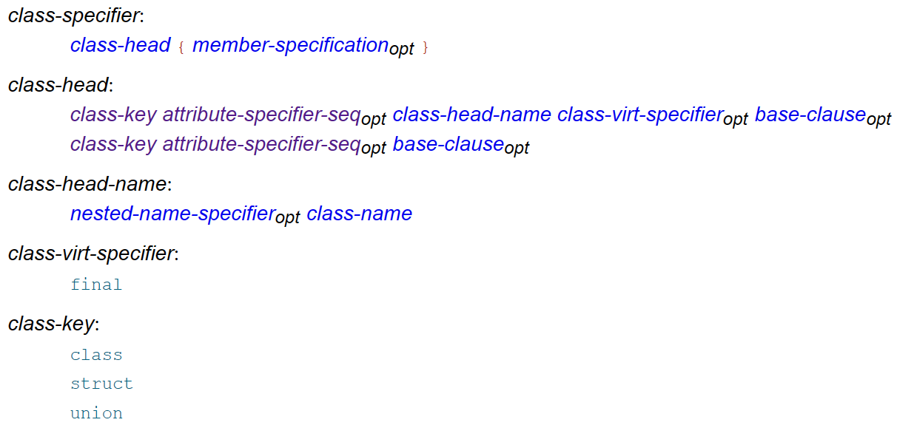
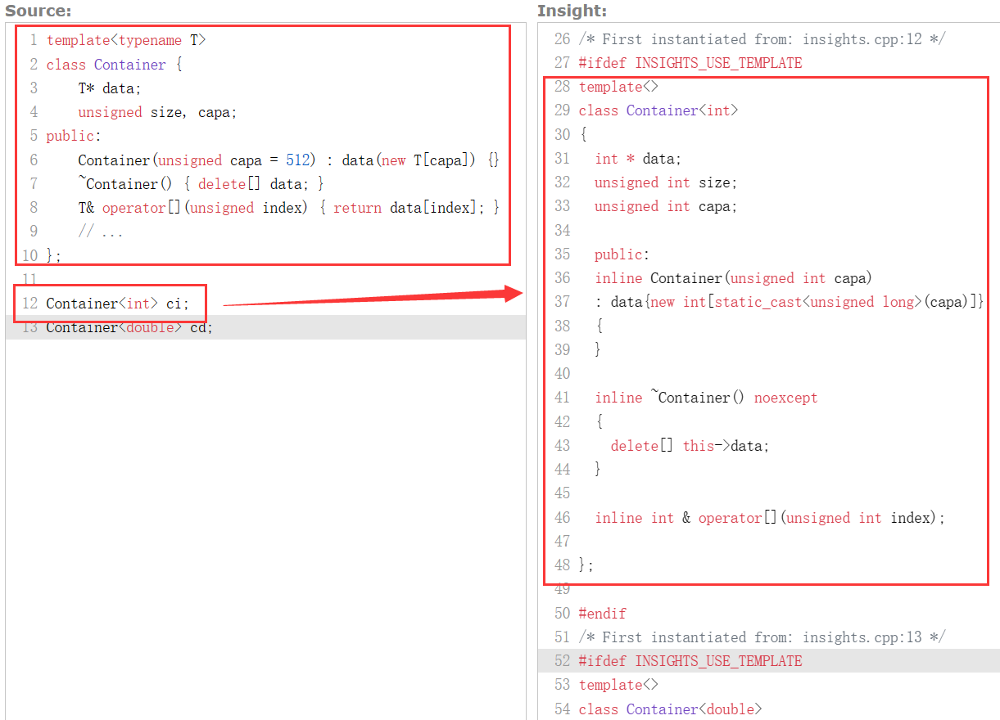
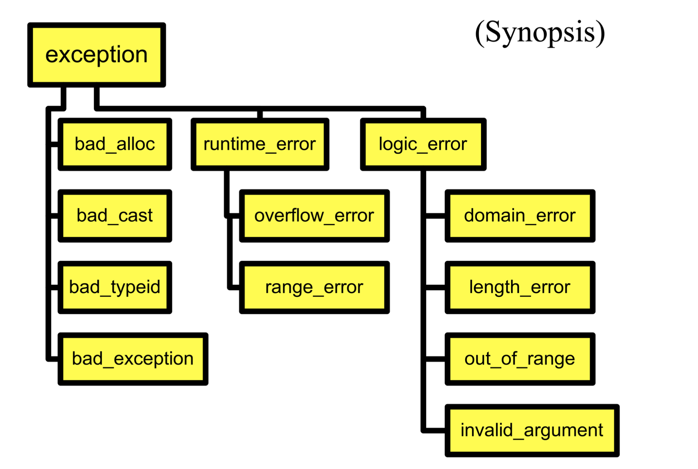

# C++

## C++的诞生与应用

!!! warning
    暂时不写

## 面向对象程序设计思想

- 三种思想：封装、继承、多态

### 封装

- 封装（Encapsulation）是面向对象编程（OOP）中的一个基本概念。它指的是将**对象的状态（属性）和行为（方法）**封装在一起，以实现我们所需要的抽象数据结构

- 对象 == 状态 + 行为，类是一个共享相同结构和行为的对象的集合

- 为了保证封装的访问控制，我们需要对外界隐藏对象的内部实现细节，只暴露必要的接口，从而实现数据的隐藏和保护。于是有了**access-specifier**：public, private, protected

    - **public**之后的成员变量和成员函数对外部可见

    - **private**之后的成员变量和成员函数不能在类外被访问，只能在**类的成员函数内**被访问或调用

??? tip "C++中的struct和class的区别"
    - 在C++中，struct和class的主要区别在于默认的**访问控制权限**。除此之外，它们在语法和功能上几乎是相同的。

    - `struct`的成员默认是**public**的。`class`的成员默认是**private**的。


### 继承&多态

- 继承（Inheritance）是面向对象编程（OOP）中的一个基本概念。它允许一个类（子类 child/sub class）从另一个类（父类 base/parent/super class）**继承属性和方法**，从而实现代码的重用和扩展。

- 多态性（Polymorphism）是面向对象编程（OOP）中的一个基本概念，它允许**同一个接口在不同的对象上表现出不同的行为**。多态性可以通过继承和虚函数来实现，使得程序更加灵活和可扩展。


```cpp title="示例"
class Shape{    // 基类 Shape
private:
    void prepare() { /* 进行画笔的准备*/ }
    void finalize() { /*画笔的最终重置*/ }
public:
    Point center; // 共有的成员变量

    void draw(){ // 共有的成员函数
        prepare();
        do_draw();
        finalize();
    }
    virtual void do_draw() = 0; // 要求所有派生类都实现 do_draw()
};

class Circle : public Shape{
public:
    int radius; // 独有的成员函数
    void do_draw(){
        // 画圆
    }
};

class Rectancle : public Shape{
public:
    int width, height; // 独有的成员函数
    void do_draw(){
        // 画长方形
    }
};

void foo(){
    Circle c;
    Rectangle r;
    
    c.draw();
    r.draw();
}
```

??? tip "多态与继承的体现"
    - 虽然代码中写的是`do_draw()`，但是代码运行时会根据调用对象的实际类型来决定调用`Circle::do_draw()`还是`Rectangle::do_draw()`，这是多态的机制

    - 如果我们想要给所有图形增加*颜色*属性，我们只需要在`Shape`中增加一个字段，并修改`prepare()`和`finalize()`函数即可，不需要一个个地去修改子类，这是继承的机制

## 类

- 在C++中，每个类的定义(class definition)都引入一个新的类型，用类来定义变量时不必像C语言那样带有`struct`关键字

??? tip "类的定义的形式"
    

### 类的成员

??? info "声明与定义"
    - **声明**是将名字引入或者重新引入程序中

    - **定义是声明的一种**，指的是那些引入的名字对应的实体足以被使用的声明


!!! tip "类型别名"
    - C++11引入了`using`来声明类型别名，用途与`typedef`类似，如
        
        ```cpp
        typedef struct arraylist_* arraylist;
        using arraylist = struct arraylist_*;
        ```

    - 类型别名的声明也可以作为类的**成员**，其作用域是**类的作用域**，同样受**access-specifier**的影响，例如：
        
        ```cpp
        class Foo{
            using elem = int;
            elem x;
            elem add(elem v) {x += v; return x;}
        private:
            using type = char;
            type c;
        };

        //elem y;       // Error: unknown type name 'elem'
        Foo:elem z;     // OK, z has type int
        //Foo:type c;   // Error: 'type' is a private member of 'Foo'
        ```

---

- 类的成员函数可以在类内直接定义，也可以在类内**只声明**，在类外给出定义；这**不影响**成员函数的*access-specifier*

    ```cpp
    class Foo{
        int x = 0;
        void foo(int v){x += v;}
        void bar(int v);
    };

    void Foo:bar(int v){x += v;}

    int main(){
        Foo f;
        f.bar(1);   // Error: 'bar' is a private member of 'Foo'
    }
    ```


---

!!! tip "`this`指针"
    - 每个成员函数都会被视为有一个**implicit object parameter**，它即是**calling object**。而在成员函数的函数体内，`this`表达式的值即是implicit object parameter的地址。

    - 也就是说，在成员函数的函数体中，访问任何成员时都会被自动添加`this->`，例如`void Foo:bar(int v) {x += v;}`，其中的`x += v;`，实际上是`this->x += v;`，编译器会帮我们自动加上`this`指针 

---

### `const`成员函数
    
- 在上面的例子中，我们看到了`const`成员函数：

    ```cpp
    class Complex{
        // ...
        string toString() const;
        // ...
    }
    ```

- 声明为`const`的成员函数中，`this`的类型是`const Complex *`；而如果没有声明`const`，则`this`的类型是`Complex *`；这个是用来保证我们的成员函数不会对类成员进行修改

- 有的时候不写这个`const`保证，会出一些问题

    ```cpp title="b不允许修改"
    struct Foo{
        string toString();
    };

    void bar(Foo& a, const Foo& b){
        a.toString();   // OK
        b.toString();   // Error: 'this' argument to member functiong 'toString'
                        // has type 'const Foo', but function is not marked const
    }
    ```

    - 我们要求`b`不能修改，但是函数`toString()`没有保证自己不会修改`*this`的值，因此用`const Foo *`去初始化`Foo *`会丢失`cv-qualifier`

- 在`const`成员函数中，试图调用其他非`const`成员函数，或者更改成员变量都是不合法的：

    ```cpp
    struct Foo{
        int a;
        void foo();
        void bar() const {
            a++;        // error

            foo();      // error
        }
    };
    ```

- `const`和非`const`的两个同名成员函数实际上是合法的**重载**，因为它们其实说明了`this`的类型是`T*`还是`const T*`

    ```cpp
    struct Foo{
        void foo() {cout << 1 << endl;}
        void foo() const {cout << 2 << endl;}
    };

    int main(){
        Foo f;
        const Foo cf;
        f.foo();    // #1 called
        cf.foo()    // #2 called 
    }
    ```

### static成员变量

- 当我们想实现下面这样的功能时，全局变量的运用，让我们感觉封装性的丢失：

    ```cpp
    int tot = 0;
    class User{
        int id;
        User() : id(tot++) {}
    };
    ```

- 对于上面的例子，我们不能使用*automatic*的成员变量进行封装，这样tot不能进行全局计数，如果写成全局变量又不太符合封装性

- 于是我们采用*static*成员变量：

    ```cpp
    class User{
        static int tot;
        int id;
        User() : id(tot++) {}
    };
    int User::tot = 0;
    ```

- *static*成员**不会**被绑定到类的实例（对象）中，也就是上面`User`类的每个实例里仍然只有`id`而没有`tot`；static成员变量放在其他的栈中，对象的大小中也不会包含这个static成员变量

!!! tip "member initializer不适用"

    - 值得注意的是，*default member initializer*和*member initializer list*是针对*non-static*成员变量的，它们对于static成员变量不适用（很好理解，如果适用了话，每创建一个这个类的实例，就会修改我static成员变量的值）

    - 同时意味着，非常量的静态成员变量必须在**类外面**进行初始化，在类中的*static*成员变量**只是声明**，我们必须在类外面给出其定义，才能让编译器知道在哪里构造这些成员

    - 作为例外，如果*static*成员变量是int类型，那么可以用*default member initializer*进行定义
        
        ```cpp
        class Foo{
            static int i = 1;   // OK
        };
        ```

!!! warning "注意：头文件中static成员变量，一定要在源文件中定义!!!"
    ```cpp title="StatMem.h"
    class StatMem{
    public:
        static int m_h;
    }
    ```

    ```cpp title="StatMem.cpp"
    #include "StatMem.h"
    int StatMem::m_h;
    ```

---

!!! tip "inline"

    - 在C++17中，引入了*inline*变量的概念，使得可以在类定义中直接初始化静态成员变量，避免类外部定义（原因是inline告诉编译器，在链接多个文件时，如果有多份static变量的定义，任取一份都是对的）

        ```cpp
        class Foo{
            inline static int i = 1;    // OK since C++17
        };
        ```

#### static成员函数

- *static*函数和变量类似，都是满足“属于类，但不需要和具体对象关联”的需求，在这两种情形下，类被简单地当做一种*作用域(scope)*来使用


#### static辨析

- 对于三种静态变量，我们有三个问题："where are they?", "when to call the ctor and dtor?" , "how to access?"

- 静态全局变量（static global variable）：

    - 位置：在文件的全局作用域中定义，但**仅在定义它的文件中可见**（文件作用域）。

    - 存储：在静态存储区（通常是数据段）。

    - 构造函数：在程序开始执行之前（通常是main函数之前）。
    
    - 析构函数：在程序结束时（通常是main函数之后）。

    - 只能在定义它的文件中访问。

- 静态局部变量（static local variable）：

    - 位置：在函数或代码块内部定义。

    - 存储：在静态存储区（通常是数据段）。

    - 构造函数：第一次执行到定义该变量的语句时。

    - 析构函数：程序结束时（通常是main函数之后）。

    - 只能在定义它的函数或代码块中访问。

- 静态成员变量（static member variable）：

    - 位置：在类的定义中声明，但在类的外部定义。

    - 存储：在静态存储区（通常是数据段）。

    - 构造函数：在程序开始执行之前（通常是main函数之前）。
    
    - 析构函数：在程序结束时（通常是main函数之后）。

    - 可以通过类名或类的对象访问。


### inline函数

- 我们不难发现，在进行类的封装之后，为了访问private成员变量而调用public里的成员函数时，会存在一定的开销（堆栈）；而我们不应为了封装而带来额外的性能开销，于是引入了内联替换（inline substitution）

- 内联替换（**inline substitution**）是C++中的一种优化技术，通过将函数调用替换为**函数体**，从而减少函数调用的开销。使用`inline`关键字可以**建议**编译器将函数定义为内联函数。对于现代编译器来说，它会忽略这个建议，该内联的会自动内联，不能的写了也没用。

- 内联会在每处调用被展开，因此如果被内联的函数非常大，则会导致生成的目标代码很大，这会带来内存紧张或者局部性问题，也会对性能产生影响

!!! tip "inline函数必须在header头文件中定义body"

!!! tip "现代C++中的inline"
    在现代 C++ 中，inline 关键字的含义已经与最初的设计有所不同，其主要作用不再是性能优化，而是解决**链接问题**，尤其是在头文件中定义函数或变量时。

    以下是现代 C++ 中 inline 的主要含义和作用：

    1. 允许在头文件中定义函数或变量而不违反单一定义规则 (ODR)

    - 单一定义规则 (One Definition Rule, ODR): ODR 是 C++ 中非常重要的规则，它规定在一个程序中，任何非内联的函数、变量、类、枚举等都只能有一个定义。

    - inline 的作用： 当你在头文件中定义一个函数或变量并将其声明为 inline 时，你实际上告诉编译器和链接器，**这个函数或变量可以在多个编译单元（.cpp 文件）中拥有相同的定义**。链接器在链接这些编译单元时，不会因为找到多个相同的定义而报错。

    **为什么需要在头文件中定义？**

    - 模板函数和模板类成员函数： 模板的实例化发生在编译时，编译器需要在使用模板的地方看到完整的定义才能进行实例化。因此，模板函数和模板类的成员函数通常需要在头文件中定义。
    
    - 某些小型、频繁调用的函数： 虽然现代编译器通常会自行决定是否内联，但有时为了方便或者出于设计考虑，开发者可能会希望在头文件中定义一些小型函数。
    
    - C++17 引入的 inline 变量： 在 C++17 之前，只能通过技巧（例如静态常量成员）在头文件中定义变量。C++17 引入了 inline 变量，允许直接在头文件中定义变量，方便在多个编译单元中共享。
    
    2. 对编译器的内联建议（但不再是强制性的）

    - 历史意义： 最初，inline 的主要目的是向编译器建议将函数调用处用函数体本身替换，以减少函数调用的开销，从而提高性能。
    
    - 现代编译器： 现代编译器通常比程序员更擅长判断哪些函数适合内联。它们会根据函数的大小、复杂性、调用频率等因素自动进行内联优化，而无需显式的 inline 关键字。
    
    - inline 仍然可以作为一种提示： 虽然编译器不一定会采纳 inline 的建议，但它仍然可以作为一种提示，告诉编译器这个函数是适合内联的。然而，过度使用 inline 可能会导致代码膨胀，反而降低性能。
    
    - 总结来说，在现代 C++ 中，inline 的主要意义是：

    - 允许在头文件中定义函数和变量，避免链接错误。 这是其最主要也是最关键的作用。
    

    ```C++

    // my_header.h

    #ifndef MY_HEADER_H
    #define MY_HEADER_H

    // 模板函数，必须在头文件中定义
    template <typename T>
    inline T add(T a, T b) {
        return a + b;
    }

    class MyClass {
    public:
        // 类内定义的成员函数默认是 inline 的
        int getValue() const { return value_; }

        // 显式声明为 inline 的成员函数
        inline void setValue(int val) { value_ = val; }

    private:
        int value_;
    };

    // C++17 引入的 inline 变量
    inline int globalCounter = 0;

    #endif
    ```

    - 在上面的例子中，add 函数是模板函数，必须在头文件中定义。MyClass 的成员函数在类定义内部定义时，默认是 inline 的。setValue 显式声明为 inline。globalCounter 是一个 inline 变量，可以在多个 .cpp 文件中包含 my_header.h 而不会导致链接错误。

    - 总而言之，不要再将 inline 主要视为性能优化的手段。在现代 C++ 中，它的首要作用是解决在头文件中定义函数和变量时的链接问题。
    
### weak函数

- 在 C++ 中，“weak function” 通常指的是弱符号 (weak symbol) 的概念，它主要在链接 (linking) 阶段发挥作用。弱符号允许在不同的目标文件（.o 或 .obj 文件）中存在同一个符号（函数或变量）的多个定义，而链接器在最终链接成可执行文件或库时，会以一种特定的方式处理这些重复的定义。

以下是 weak function 的主要作用和特点：

1. 允许存在多个定义而不产生硬链接错误:

- 通常情况下，如果在多个目标文件中定义了同一个非 inline 函数或全局变量，链接器会报错，因为这违反了单一定义规则 (ODR)。

- 然而，当一个函数被声明为 weak 时，链接器允许存在多个同名函数的定义。

2. 链接器的选择行为:

- 如果存在一个“强”符号 (strong symbol) 的定义，链接器会优先选择这个强符号的定义。 强符号通常是指没有被显式声明为 weak 的符号。

- 如果只存在多个“弱”符号的定义，链接器会选择其中一个，具体选择哪个定义取决于链接器的实现。 这通常是任意选择的，但行为在不同的链接器和平台上可能有所不同。

3. 主要应用场景:

- 提供默认实现 (Default Implementation): 弱函数最常见的用途是为某个功能提供一个默认的实现。如果用户或另一个库提供了更具体的实现（作为强符号），那么链接器会选择这个更具体的实现；否则，就使用默认的弱函数实现。这在插件系统、库的扩展等方面非常有用。

- 可选功能 (Optional Features): 可以使用弱函数来实现一些可选的功能。如果某个可选功能没有被使用，那么对应的弱函数定义可能不会被链接进来，或者即使链接进来，也不会影响程序的正常运行。

- 库的兼容性 (Library Compatibility): 在库的演进过程中，可以使用弱函数来引入新的功能，而不会破坏与旧版本的二进制兼容性。例如，可以先提供一个弱函数的默认实现，然后在后续版本中提供更完善的强符号实现。

- 避免重复定义冲突: 在复杂的项目中，不同的模块可能需要提供类似的功能。使用弱函数可以避免因为同名函数而导致的链接冲突，并允许在需要时通过强符号来覆盖默认行为。

#### inline vs. weak

||`inline`|`weak`|
|---|---|---|
|Linker Behavior|当同一个`inline`函数，在多个编译单元中定义时，不会链接出错|如果有多个weak symbol存在，不会链接错误，链接器会优先选择non-weak symbol|
|Optimization Focus|减少函数调用的开销|对于动态库或插件可以更好地进行拓展|
|适用场景|适合简单、频繁调用的函数|Commonly used for default implementations, modular plugins, or singleton patterns|

### 构造函数

- 构造函数(**constructor**)是一种特殊的成员函数，用于初始化该类的对象，constructor也时常被简写为**ctor**或者**c'tor**；构造函数是一个无名函数，或者说名字和类一样，也不写返回值

    ```cpp title="示例"
    class Container{
        elem* val;
    public:
        Container(){
            val = nullptr;
        }
    };
    ```

- 由于定义一个对象时需要用到构造函数，因此如果要用的构造函数是private的，对象就**无法**被构造

!!! tip "构造函数的参数"
    - 下面的构造函数允许用户传递一个初始大小，然后直接开一个对应大小的空间
        ```cpp
        class Container{
            elem* val;
        public:
            Container(unsigned size){
                val = (elem*)malloc(sizeof(elem)* size);
            }
        };
        ```

    - 可以使用`Container c2 = Container(64);`构造一个自定义大小的容器，同样地，C++允许更加简洁的写法：`Container c2(64);`

    - 在C++中，声明变量时的初始化器(initializer)除了类似`int a = 4;`的initializer-clause之外，还有类似`int a(4);`的（expression-list）

#### new

- 我们在分配内存时会发现`Container* p = (Container *)malloc(sizeof(Container));`这样的语句，会分配一块给对象使用的空间，但是**不会调用构造函数**

- 于是C++引入了新的用于创建动态对象的操作符`new`以及对应的用来回收的`delete`，`new`是会调用构造函数的；删除时要用`delete`而不是`free`，同时在删除创建的对象数组时要使用`delete[]`

    ```cpp title="new示例"
    struct Foo{
        Foo(int x){printf("ctor %d\n",x);}
    };

    int main(){
        Foo * p = new Foo(5);
        puts("=====");
        Foo * pa = new Foo[](1,2,3,4,5);
    }

    /*
    ctor 5
    =====
    ctor 1
    ctor 2
    ctor 3
    ctor 4
    ctor 5
    */
    ```

- 如果`p`在`new`的时候创建的是单个对象，则应该用`delete p;`的形式(single-object delete expression)回收

- 如果`p`在`new`的时候创建的是数组，则应该用`delete[] p;`的形式(array delete expression)回收

- 否则就是未定义行为(UB,undefined behavior)

---

!!! tip "内存角度看new与delete"

    - C/C++中，我们将内存分为4部分：stack, heap, global, text

    - 我们手动申请的内存空间，会被分配在heap中

    - 当我们调用`new`时，会发生两件事情，第一步向系统申请空间，第二步调用对象的构造函数

    - 当我们调用`delete`时，会发生两件事情，第一步调用对象的析构函数，第二步向系统归还空间

    - 

!!! warning

    - 不要用`delete`来free不是`new`出来的空间

    - 不要连续`delete`两次

    - 现在编译器不会让我们`delete`一个`new []`

    - 当`delete nullptr`时，是**安全**的

#### 默认参数

- C++在函数声明中支持**默认参数(default arguments)**，用来允许函数可以以省略末尾的若干参数的方式调用

    ```cpp title="默认参数示例"
    void point(int x = 3, int y = 4);

    point(1,2); // calls point(1,2)
    point(1);   // calls point(1,4)
    point();    // calls point(3,4)
    ```

- 形如`void point(int x = 3, int y);`这样的定义是不允许的，因为如果没有这样的要求，那么`point(4);`这样的含义是容易让人迷惑的

- 我们必须把默认参数**居后**，也就是默认参数后面的参数也都是默认参数

---

!!! tip "深入看带默认参数的函数"

    - 带有默认参数的函数，实际上和普通的函数编译出来是一样的，并没有*植入*到函数内部

    ```cpp title="p.h"
    class p{
        void k(int a, int x = 0, int y = 1);
    }
    ```

    ```cpp title="p.cpp"
    // void p::k(int a, int x = 0, int y = 1); //Error
    void p::k(int a, int x, int y){
    }
    ```

    - 实际上是编译器帮我们手动填入了参数，因此只能在声明的时候有default argument


#### 函数重载

- 如果我们希望根据**是否传入某个参数**来选择不同的构造函数，例如我们有这么一个构造函数：

    ```cpp
    Container::Container(unsigned size, elem initVal){
        val = (elem*)malloc(sizeof(elem) * size);   // allocate memory 
        for (unsigned i = 0; i < size; i++)         // set init values
            val[i] = initVal;
    }
    ```

- 如果，我们希望没有传入`initVal`时，就不要做那个set init values的循环该怎么办？

- **函数重载（Function Overloading）**是C++中的一种特性，允许在**同一个作用域**内定义多个**具有相同名称**但**参数列表不同**的函数。函数重载使得同一个函数名可以根据不同的参数类型或数量执行不同的操作，从而提高了代码的可读性和灵活性。

    ```cpp title="函数重载"
    class Container{
        elem * val;
        // ...
    public:
        Container(){val = nullptr;}
        Container(unsigned size){
            val = (elem*)malloc(sizeof(elem) * size);
        }
        Container(unsigned size, elem initVal){
            val = (elem*)malloc(sizeof(elem) * size);
            for (unsigned i = 0; i < size; i++)         
            val[i] = initVal;
        }
    };
    ```

---

- 如果一个名字引用多个函数，则称它是overloaded的。当使用这样的名字的时候，编译器用来决定使用哪个；这个过程称为**重载解析(overload resolution)**

- 简单来说，重载解析首先收集这个名字能找到的函数形成候选函数集(candidate functions)，然后检查参数列表来形成可行函数集(viable functions)，然后再可行函数集中按照一定的规则比较这些函数，如果**恰好**有一个函数(best viable function)优于其他所有函数，则重载解析成功并调用此函数，否则编译失败

- *规则*比较复杂，但是一个简单的例子就是，**不需要进行类型转换**的函数肯定更好

    ```cpp title="ambiguous示例"
    void f(long);
    void f(float);

    void foo(){
        f(0L);  // calls f(long)
        f(0);   // error: call to 'f' is ambiguous
    }

    ---

    void f(int i = 1);
    void f();

    void foo(){
        f(1);   // OK, call the first one
        f();    // Error: ambiguous
    }
    ```

    ```cpp title="仅有返回值类型不同的函数是非法的"
    int f(int a);
    void f(int a); // error: functions that differ only in
                   // thier return type cannot be overloaded    
    ```

#### default constructor

- 我们称一个能够**无参调用**的构造函数是**default constructor**。即，它不接收任何参数，或者任何参数都有默认值

- 对于一个类，如果用户没有提供任何构造函数，则编译器会自动为这个类创建一个public的*implicitly-declared default constructor*，它不接收任何参数，也什么都不做；如果有用户提供的构造函数，那么implicitly-declared default constructor就会*deleted*

#### member initializer lists

- 成员初始化列表（Member Initializer Lists）是C++中的一种语法，用于在构造函数中初始化类的成员变量。使用成员初始化列表可以提高代码的效率和可读性，特别是在初始化常量成员、引用成员或需要调用非默认构造函数的成员时。

- 成员初始化列表在构造函数的参数列表之后、函数体之前使用冒号（:）引入，并在其中列出成员变量的初始化表达式。

```cpp title="示例"
class User{
    int id, age, failTimes;
    char* password;
public:
    User(int id, int age, char* pw) : id(id), age(age), failTimes(0), password(copyStr(pw)){}
};
```

---

- C++规定，在构造函数的函数体执行之前，**所有参数**要么按照member initializer lists的描述初始化，要么以default constructor初始化

!!! tip "member initializer lists必要的场景"
    ```cpp
    class Point{
        int x, y;
    public:
        Point(int x, int y) : x(x), y(y) {}
    };

    class Circle{
        Point c;
        int r;
    public:
        Circle(int cx, int cy, int r) : r(r){} 
        // 缺少对c的初始化器
        // error: no matching function for call to 'Point::Point()'
    };
    ```

    - 在上面的例子中，`Point`类并没有default constructor，因此如果member initializer lists没有指明`Point`类的初始化方式，就会出现编译错误

    ```cpp title="正确写法"
    class Circle{
        Point c;
        int r;
    public:
        Circle(int cx, int cy, int r) : c(cx, cy), r(r){} 
    };
    ```

- member initializer list的顺序不影响成员被初始化的顺序，它们按照在**类定义中的顺序初始化**，例如：
    
    ```cpp
    class A{ A(){puts("A ctor");}};
    class B{ B(){puts("B ctor");}};

    class C{
        A a;
        B b;
        C() : a(), b(){}
        C(int) : b(), a(){}
    };

    int main(){
        C c;
        C c2(1);
    }

    /*
    A ctor
    B ctor
    A ctor
    B ctor
    */
    ```

    ```cpp title="错误示例"
    class Container {
        int * data;
        unsigned capa;
        // ...
    public:
        Container(unsigned c = 512) : capa(c * 4), data(new int[capa]) {}   // 声明顺序中data在capa前面，所以我们会先赋值data再赋值capa，这就与我们的代码原意相悖了
    };
    ```

#### delegating constructor

- 委托构造函数（Delegating Constructor）是C++11引入的一种特性，允许一个构造函数调用同一个类中的另一个构造函数。

```cpp
class C{
    C(int) {puts("ctor 1 called");}
    C() : C(42) {puts("ctor 2 called");} 
}

int main(){
    C c;
}

/*
ctor 1 called
ctor 2 called
*/
```

#### default member initializer

- 默认成员初始化器（Default Member Initializer）是C++11引入的一种特性，允许在**类定义**中直接为成员变量提供默认初始值。这种方式可以简化构造函数的实现，并确保成员变量在对象创建时总是有一个合理的初始值。

```cpp title="优化前"
class User{
    int id, age, failTimes;
    char* password;
public:
    User(int id, int age, char* pw) : id(id), age(age), failTimes(0), password(copyStr(pw)){}
    User(int id, int age) : id(id), age(age), failTimes(0), password(nullptr){}
    User(int id) : id(id), age(-1), failTimes(0), password(nullptr){}
}
```

```cpp title="优化后"
class User{
    int id, age = -1, failTimes = 0;
    char* password = nullptr;
public:
    User(int id, int age, char* pw) : id(id), age(age), password(copyStr(pw)){}
    User(int id, int age) : id(id), age(age){}
    User(int id) : id(id){}
}
```

- default member initializer只允许*brace-or-equal-initializer*即`= something`或者`{something}`，而不允许用括号的形式

- 也就是说，作为default memeber initializer的成员可以形如`Foo f = Foo(...);`，但不能形如`Foo f(...);`

    ```cpp
    class Point {
        int x, y;
    public:
        Point(int x, int y):x(x), y(y){}
    };
    class Circle{
        // Point c(0,0);      // error，因为default member initializer不能以这样的形式
        Point c = Point(0,0); // OK
    public:
        Circle(int cx, int cy, int r) : c(cx, cy), r(r){}
    };
    ```

### nullptr

- 为了类型安全，C++不允许`void *`隐式转换到其他指针类型。因此，如果我们将`NULL`定义为`(void *) 0`，那么`int *p = NULL`会引发编译错误（这是C与C++不兼容的例子之一）

- 在C++11之前，空指针常量(null pointer constant)是值为0的整型字面量；因此，如果我们把NULL定义为0，则`int * p = NULL`即`int * p = 0`是合法的（赋值成其他整数是不合法的）

    ```cpp title="something unexpected"
    void f(int *);
    void f(int);

    #define NULL 0
    f(NULL);    // ==> f(0), so f(int) is called
    ```

- 因此，C++11引入了`nullptr`来表示空指针常量，同时空指针字面量0也是兼容的

### 析构函数

- **析构函数（Destructor）**是C++中的一种特殊成员函数，当对象的生命周期结束时自动调用，用于执行清理操作，例如释放资源、关闭文件、释放动态内存等。析构函数的名称与类名相同，但前面加上**波浪号**（~），且没有返回类型和参数。

    ```cpp title="析构函数示例"
    class Container{
        elem* val;
    public:
        Container(unsigned size){
            val = (elem*)malloc(sizeof(elem) * size);
        }
        ~Container(){
            free(val);
        }
    };
    ```

- 析构函数的参数列表永远时空的，是无法重载的；如果某个类没有*user-declared destructor*，编译器会自动生成一个public的*implicitly-declared destructor*，因此，当类的成员中没有需要释放的资源时，我们就不需要写析构函数了。

#### 析构与析构的时机和顺序

- 对于一个类对象，它的生命周期(lifetime)自它的初始化（构造）完成开始，到它的析构函数调用被启动为止

- 任何一个对象都会占用一部分存储；这部分存储的最小生命周期成为这个对象的**storage duration**。对象的lifetime等于或被包含于它的storage duration

=== "构造函数被调用的情况"

    - 对于全局对象，在`main`函数运行之前，或者在同一个编译单元内定义的任意函数或者对象被使用之前。在同意编译单元内，它们的构造函数按照声明的顺序初始化。

    - 对于*static local variables*，在第一次运行到它的声明的时候

    - 对于*automatic storage duration*的对象，在其声明被运行时

    - 对于*dynamic storage duration*的对象，在其用`new`表达式创建时

=== "析构函数被调用的情况"

    - 对于*static storage duration*的对象，在程序结束时，按照与构造相反的顺序

    - 对于*automatic storage duration*的对象，在所在的**block**退出时，按照与构造相反的顺序

    - 对于*dynamic storage duration*的对象，在`delete`表达式中

    - 对于临时对象，当其生命周期结束时

    ```cpp title="构造和析构顺序示例"
    class A{
        int x;
        A(int x) : x(x) {printf("C %d\n", x);}
        ~A(){printf("D %d\n", x);}
    };
    int main(){
        A *p = new A[]{1, 2, 3, 4, 5};
        delete[] p;
    }

    /*
    C 1
    C 2
    C 3
    C 4
    C 5
    D 5
    D 4
    D 3
    D 2
    D 1
    */
    ```

    !!! note "练习"

        ```cpp title="说明下面的代码的输出"
        class Count{
            int s = 0;
        public:
            ~Count();

            Count(int s) {this->s = s;}
            int getS(){
                return s;
            }
            void sPlus(){
                s++;
            }
        };

        Count::~Count() {cout << this->s << " ";}

        Count count5(555);
        static Count count6(666);
        Count count7(777);

        void f(){
            static Count count9(999);
        }

        int main(){
            Count *count1 = new Count(111);
            Count *count2 = new Count(222);

            Count count3(333);
            Count count4(444);

            f();

            static Count count8(888);

            delete(count1);

            for(int i = 1; i <=5; i++)
                for(Count c(1); c.getS() <= i; c.sPlus());

            return 0;
        }        
        ```

        ??? tip "答案"

            111 2 3 4 5 6 444 333 888 999 777 666 555

            - 最先析构的是`count1`，因为在main函数内就被delete了

            - 然后是5个生命周期只在for语句内的对象，析构时分别输出2,3,4,5,6

            - 最后`main`函数生命周期结束，其中的*automatic local variables*析构，输出444,333

            - 最后程序退出，对*static*对象进行析构，按照声明的反顺序，即888,999,777,666,555（全局变量都是*static*的）

---

### 拷贝赋值重载

- 如果我们创建了一个"容器"类：

    ```cpp
    class Container {
        elem* val;
        // ...
    };
    ```

- 然后执行语句`c1 = c2`，会发生一些问题！

- 执行完这个语句之后，`c1.val = c2.val`，也就是说，这两个容器的`val`指针指向同一块内存，这会带来两个问题：

    1. `c1`原来的`val`也许指向一块申请来的内存，但是最终不会被释放掉，造成内存泄露

    2. 这样的“赋值”，实际上完成的是某种“共享”，而不是真正地创建一个副本。这并非我们的本意，在这个操作之后，我们每次对`c1.val`的修改都会对`c2`可见，且两个对象的析构函数可能会重复析构这块内存，引发错误

- 为了解决这个问题，C++允许用户**重载赋值运算符**，实现方法为：在类内声明一个成为`operator=`的成员函数

    ```cpp title="重载赋值运算符示例--不考虑self-assignment"
    class Container{
        elem* val;
        unsigned size = 0, capa;
    public:
        Container(unsigned capa) : val(new elem[capa]), capa(capa){};
        ~Container(){delete[] val;}
        void operator=(Container from){
            delete[] val;
            val = new elem[from.capa];
            for (unsigned i = 0; i < from.size; i++)
                val[i] = from.val[i];
            size = from.size;
            capa = from.capa;
        }
    };

    ```

- 但是这样的代码，还是存在一定的问题，第一个问题是：当我们进行self-assignment时，即形如`x = x`这样的语句，就会使得原来的数据丢失；另外一个问题，如果`capa`和`from.capa`相同，那就没必要再开一份空间了，直接赋值就好了

    ```cpp title="重载赋值运算符"
    class Container{
        elem* val;
        unsigned size = 0, capa;
    public:
        Container(unsigned capa) : val(new elem[capa]), capa(capa){};
        ~Container(){delete[] val;}
        void operator=(Container from){
            if(from.val != val){    // avoid self-assignment
                if(from.capa != capa){
                    delete[] val;
                    val = new elem[from.capa];
                }
                for (unsigned i = 0; i < from.size; i++)
                    val[i] = from.val[i];
                size = from.size;
                capa = from.capa;
            }
        }
    };
    ```

- 如果用户没有显式地给出`operator=`，那么编译器会生成一个public的默认拷贝赋值运算符的声明；如果它被使用，则编译器生成它的定义；它生成的内容即为将各个成员变量用它们的`operator=`拷贝一遍
    ```cpp
    struct Foo{
        void operator=(Foo) {cout << "Foo::operator= called" << endl;}
    };
    class Bar{
        Foo a, b;
    };
    int mian(){
        Bar x, y;
        x = y;
    }

    /*
    Foo::operator= called
    Foo::operator= called
    */
    ```

- 如果`operator=`在当前上下文不可见，那么`a = b`这样的表达式非法

    ```cpp
    class Foo{
        void operator=(Foo){}   // private operator=
        void foo(){
            Foo a, b;
            a = b;  // OK, private function available here
        }
    };

    struct Bar{
        void operator=(Bar) = delete;   // deleted operator=
        void foo(){
            Bar a, b;
            a = b   // error: use of deleted function
                    // 'void Bar::operator=(Bar)'
        };

        void foo(){
            Foo a, b;
            a = b;  // error: 'void Foo::operator=(Foo)'
                    // is private within this context
        }
    }
    ```

### 符号重载

- 类似于拷贝赋值运算符重载，我们也可以对其他运算符进行重载，声明形如`Matrix operator+(Matrix mat)`, `Matrix operator*(int x)`这样的成员函数

- 不止于此，运算符重载还可以放在全局；这样，当`x * y`的操作数中有类实例时，则重载解析会尝试将它解释为`x.operator*(y)`和`operator*(x, y)`；

- 即`x`对应类中的成员`operator*`和全局的`operator*`都会纳入候选函数集，然后再根据实际的参数列表完成重载

    ```cpp
    Matrix operator*(int x, Martirx mat){
        Matrix tmp = mat;
        for (int i = 0; i < M; i++)
            for (int j = 0; j < M; j++)
                tmp.data[i][j] *= x;
        return tmp;
    }
    ```

- 上面就实现了这么一个全局的符号重载函数，但是有一个问题，`Matrix::data`是private的，这个函数并不能直接访问到成员变量

- 于是，C++允许一个类的定义中给一个外部的函数**授予**访问其private成员的权限，方式是将对应的函数在该类的定义中将对应的函数声明为一个**友元(friend)**

    ```cpp title="friend演示"
    constant M = 100;
    class Matrix{
        int data[M][M];
    public:
        friend Matrix operator*(int x, Matrix mat); // Designates a function
                     // as friend of this class
    };
    
    Matrix operator*(int x, Matirx mat){
        Matrix tmp = mat;
        for (int i = 0; i < M; i++)
            for (int j = 0; j < M; j++)
                tmp.data[i][j] *= x;    // can access private member
        return tmp;
    }   
    ```

- 当然，对于矩阵乘法的实现，还有另一种更好的方法：

    ```cpp
    constant M = 100;
    class Matrix{
        int data[M][M];
    public:
        Matrix operator+(Matrix mat) {/* */}
        Matrix operator*(int x) {/* */}
        Matrix operator*(Matrix mat) {/* */}
    };
    Matrix operator*(int x, Matrix mat){
        return mat * x;
    }
    ```

!!! warning "不能重载的运算符"
    - **::(scope resolution)**, **.(member access)**, **.*(member access through pointer to member)**, **?:(ternary conditional)**

    - 对 **=(assignment)**, **()（function call）**, **[](subscript)**,**->(member access)**的重载**必须是成员**

!!! tip "重载运算符的选择"
    - 四则运算，复合赋值运算符（如+=），比较运算符（返回bool），下表运算符[]，函数调用运算符()，以及左右移符号<<和>>

    - 对这些运算符的重载通常是可以利好代码的可读性和便捷性的，不要做一些奇怪的事

### 引用

```cpp title="无引用的减法重载"
const int M = 100;
class Matrix{
    int data[M][M];
public:
    Matrix operator-(Matrix mat){
        Matrix res;
        for (int i = 0; i < M; i++)
            for (int j = 0; j < M; j++)
                res.data[i][j] = data[i][j] - mat.data[i][j];
        return res;
    }
}
```

- 对于上面的减法重载我们会发现，这个类的对象占据的内存是很大的，因此如果我们将对象作为参数进行传递，会造成极大的性能开销

- 因此，我们会想到使用指针的方式，为避免了`&m1-&m2`这样的形式，*BS*对其进行了优化，于是有了**引用(reference)**

- 一个引用是一个已经存在的对象或者函数的**别名**，例如：

    ```cpp
    int x = 2;
    int & y = x;    // y is an alias for x
    ```

- 这样，对y的所有操作都和对x的操作一样了；y不是x的指针，也不是x的副本，而是x本身。包括获取它的地址——`&y`和`&x`的值相同

- 显然，在同一个作用域内，给一个变量起一个别名并不会有太多的现实意义。引用常用于**函数参数传递，返回值优化和避免不必要的拷贝**

#### 引用作为参数

```cpp title="引用作为参数"
    void swap(int& i, int& j){
        int tmp = i;
        i = j;
        j = tmp;
    }

    int main(){
        int x, y;
        swap(x, y);
    }
```  

- 这时候，我们就可以对矩阵的减法重载使用引用了：

    ```cpp title="减法重载中的引用"
    const int M = 100;
    class Matrix{
        int data[M][M];
    public:
        Matrix operator-(const Matrix & mat){
            Matrix res;
            for (int i = 0; i < M; i++)
                for (int j = 0; j < M; j++)
                    res.data[i][j] = data[i][j] - mat.data[i][j];
            return res;
        }
    }
    ```

    - 我们这里使用了`const Matrix &`而不是`Matrix &`，从而说明`mat`是只读的而不是可修改的，虽然后者也能达到我们需要的效果，但是这样能够保证函数中只会读取mat的值，而不会修改

#### 引用作为返回值

```cpp title="引用作为返回值示例"
class Container{
    elem* val;
public:
    elem & operator[](unsigned index){
        return val[index];
    }
};
```

- 上面的代码使得我们可以通过`c[i]`的方式访问容器中的值，如读取操作`x = c[i]`，或者是写入操作`c[i] = x`，这使得我们不需要再写`c.getVal()[i] = x`之类的丑陋代码

- 如果希望`operator[]`返回的值是只读的，只需要让函数返回`const elem &`即可；这在elem比较大的时候有助于避免不必要的拷贝，不过在elem时比较小的基本类型且没有修改需求的情况下，直接返回值会更好

!!! warning "返回引用时要注意避免**dangling reference**"
    ```cpp
    int & foo(){
        int tmp = 10;
        return tmp;
    }
    ```

    - 这里`tmp`作为局部变量，在函数结束时会被销毁，但是函数却返回了它的引用，这是一个不存在的变量的引用(dangling reference)，会导致undefined behavior

!!! info
    - 从实现的角度而言，我们可以认为引用类似于const指针，即`int & y = x`类似于`int * const py = &x`的包装，对`y`的使用实际上使用的`*py`

    - 不过需要注意的是，在实际实现中，引用并不一定占用存储

#### 引用与临时对象

- 对于表达式`m1-m2`，它会调用`Matrix::operator-`并返回一个`Matrix`类型的值，这个值是一个临时对象，

- 有一个问题是：这个对象在什么时候被析构？

- 在这个表达式结束之后**立刻**被析构，原因很简单，我们此后再也无法访问这个对象，因为它是没有名字的临时对象（**temporary object**）；事实上，临时对象会在他所在的完整表达式（full-expression）结束时被销毁，所谓的完整表达式结束时，大多数情况下就是下一个`;`所在的位置

- 因此，C++规定：可以将一个临时对象绑定给一个`const`引用，这个临时对象的生命周期被延长以匹配这个`const`引用的生命周期

    ```cpp
    void foo(){
        const Matrix & m = m1 - m2;
        // temporary 'Matrix'
        // has same lifetime as 'm'
    }
    ```

    - 我们可以视作`m`就是我们为这个临时对象取的名，它以`m`的身份继续延续下去，直至作为一个*automatic variable*被析构

#### 引用与重载解析

- 将一个`int`类型的变量传递给`int &`类型和`int`类型的参数的优先级是一样的：

    ```cpp title="优先级相同的重载解析"
    void f(int x) {puts("int");}
    void f(int & x) {puts("int &");}

    int main(){
        int x = 1;
        f(1);   // ok, only #1 valid
        f(x);   // error: ambiguous overload
    }
    ```

- 将一个`int`类型的变量传递给`const int &`类型和`int`类型的参数的优先级是一样的：

    ```cpp
    void g(int x) {puts("int");}
    void g(const int & x) {puts("const int &");}

    int main(){
        int x = 1;
        const int y = 2;
        g(1);   // error:ambiguous overload
        g(x);   // error:ambiguous overload
        g(y);   // error:ambiguous overload
    }
    ```

- 不过，只有`int &`和`const int &`时，会认为`int &`更优

    ```cpp
    void h(int & x) {}
    void h(const int & x){}

    int main(){
        int x = 1;
        const int y = 2;

        h(1);   // ok, only #2 valid
        h(x);   // ok, #1 is better
        h(y);   // ok, only #2 valid
    }
    ```

#### 类的引用成员和const成员

- 类的引用成员和const成员必须由 member initializer lists 或者 default member initializer 提供初始化

    ```cpp
    int global = 10;
    class Foo{
        const int x = 4;
        const int y;    // must be initialized by member initializer lists
        int & rz = global;
        int & rw;       // must be initialized by member initializer lists
    public:
        Foo(int m , int & n) : y(m), rw(n) {}   //OK
        Foo() : y(0), rw(global){}       //OK
        Foo() : y(0) {}         //Error, rw未初始化
        Foo() : rw(global) {}   //Error, y未初始化
    };
    ```

---

#### 左右值

- 左值（Lvalue，Locator Value）是指可以标识对象的位置的表达式。左值通常表示内存中的一个位置，可以出现在赋值操作符的左侧。

- 特点

    - 可以取地址（使用 & 运算符）。

    - 可以出现在赋值操作符的左侧。

    - 通常表示持久存在的对象。

```cpp
int x = 10;   // x 是一个左值
int* p = &x;  // 可以取地址
x = 20;       // 可以出现在赋值操作符的左侧
```

---

- 右值（Rvalue，Read Value）是指不表示对象位置的表达式。右值通常表示临时值或字面值，不能取地址，也不能出现在赋值操作符的左侧。

- 特点

    - 不能取地址。

    - 不能出现在赋值操作符的左侧。

    - 通常表示临时对象或字面值。

#### 右值引用

- `T && a = returnRVal()` 不会有a的构造，也不会有右值的析构

- `T b = returnRVal()`，有b的构造，也会有右值的析构

#### 其他

- 在Python之类的语言中，函数支持*Keyword arguments*或者*Named Parameter Idiom*，根据参数的名字而非参数的位置来传参

- 这种机制在C和C++中并不支持，它们只支持按位置传参

### Composition

- 在 C++ 中，composition (组合) 是一种面向对象编程的核心概念，它描述了一种类之间的关系，其中一个类的对象包含另一个类的对象作为其成员。这种关系通常被称为 "has-a" 关系。

- "Has-a" 关系: 一个类“拥有”另一个类的对象。例如，一辆 Car 类“拥有”一个 Engine 类的对象。

- 代码重用: 通过组合，我们可以重用现有类的功能，而无需通过继承来获取。这有助于减少代码冗余并提高代码的可维护性。

---

### Inheritance

#### 概念

- 目的：实现代码复用、扩展性和多态性，是面向对象编程（OOP）的三大核心特性之一。

- 本质：派生类（Derived Class）继承基类（Base Class）的成员变量和成员函数，并可添加/修改功能。

- 关键术语：

    - 基类（**Base Class**）：被继承的类（父类）

    - 派生类（**Derived Class**）：继承自基类的类（子类）

-----

#### 继承类型

- C++ 支持多种继承方式，通过访问修饰符（Access Specifier）控制基类成员在派生类中的可见性：

|继承方式	|基类 public 成员|	基类 protected 成员|	基类 private 成员|
|----|--------|-----------|------------|
|public 继承	 |public	|protected|	不可访问|
|protected 继承	 |protected	|protected|	不可访问|
|private 继承	 |private	|private|	不可访问|

- 最常用的是 public 继承，保持“是一个（is-a）”关系。

- `private`继承，其实已经不算是继承了，因为父类的对象都成为了子类的私有变量，可以看成是"has-a"了

#### 构造与析构

- 构造函数调用顺序：基类 → 派生类，总是先执行base class的ctor

- 析构函数调用顺序：派生类 → 基类，析构的顺序和构造时相反

#### using声明

```cpp
class Base{
public:
    f(double){
        cout << "double\n";
    }
};

class Derived : Base{
public:
    // using Base::f;
    void f(int) {
        cout << "int\n";
    }
};

int main(){
    Derived d;
    d.f(4);
    d.f(4.5); // 并不会调用f(double)
}
```

- 在上面的例子中，展示了c++中的那么*name hiding*情况，当子类继承父类的成员函数后，如果子类再次声明了一个**同名函数**（即使参数类型不同），也不会发生重载，而是会把父类的同名函数都**隐藏**了，子类就访问不到了

- 使用`using`语句就可以避免name hiding

```cpp
class Base{
public:
    f(double){
        cout << "double\n";
    }
};

class Derived : Base{
public:
    using Base::f;
    void f(int) {
        cout << "int\n";
    }
};

int main(){
    Derived d;
    d.f(4);
    d.f(4.5); // 可以正常调用f(double)
}
```

### Polymorphism

#### Upcasting

- 向上转型（Upcasting）是面向对象编程中的一个重要概念，特别是在 C++ 这样支持继承和多态的语言中。这是指将派生类（子类）的**指针或引用**转换为**基类**（父类）的指针或引用的过程。

---

#### virutal

- 那么当`upcasting`发生时，就使得我们在想调用**子类的对象***时会变得很困难

```cpp
Manager pete( "Pete", "444-55-6666", "Bakery");
Employee* ep = &pete; // Upcast
Employee& er = pete; // Upcast

ep->print( cout ); // prints base class version
```
- 这有时会与我们的设计相悖，因为我们想用的是子类的成员函数，但是不得不采用父类的指针或引用

---

- 编译器是如何知道我们到底要用哪个函数呢？

- 它会根据static type(declared type)去找到对应的function，然后检查有没有virtual

- 如果function被声明为virtual function，这就是dynamic binding，编译器就会根据dynamic type(actual type)，也就是指针实际指向的对象，来调用对应的成员函数

- 如果没有被声明为virtual function，就是static binding，编译器看到的static type(declared type)是谁，就调用谁的函数

---

#### vtable

- 虚函数表（Virtual Function Table，简称vtable或vtbl）是C++实现运行时多态（动态绑定）的关键机制。它是一种编译器创建的数据结构，用于支持虚函数的调用。

- 定义：vtable是一个**函数指针数组**，包含**类中所有虚函数的地址**。

- 创建时机：当一个类**声明**了**虚函数**时，编译器为这个类创建一个vtable。

- 存储位置：通常vtable作为全局数据存储在程序的**只读数据段**中。

---

!!! tip "vtable的工作原理"
    - 当一个类包含虚函数时，编译器会在该类的每个对象中添加一个隐藏成员：

    ```cpp
    class Base {
    public:
        virtual void foo();
        virtual void bar();
        // ...
    private:
        // 编译器隐式添加：
        void** vptr; // 指向vtable的指针
    };
    ```

    - 这个隐藏成员通常称为vptr（虚函数表指针），它是对象的第一个成员，指向该类的vtable。

    - 当调用对象的虚函数时，实际执行以下步骤：

    1. 访问对象的vptr，找到对应类的vtable
    
    2. 在vtable中查找对应虚函数的位置（在编译时确定的索引）
    
    3. 调用vtable中存储的函数地址对应的函数
    
    4. 这个过程称为"动态绑定"
    

#### 总结

- 多态性是面向对象编程的核心概念之一，它允许使用统一的接口处理不同类型的对象。在 C++ 中，多态性主要通过以下方式实现：

1. 运行时多态（动态多态）

```cpp
class Shape {
public:
    // 使用 virtual 关键字声明虚函数
    virtual void draw() {
        std::cout << "Drawing a shape" << std::endl;
    }
    
    // 虚析构函数确保正确析构派生类对象
    virtual ~Shape() {}
};

class Circle : public Shape {
public:
    // 覆盖基类的虚函数
    void draw() override {  // override 关键字（C++11）帮助检查是否正确覆盖
        std::cout << "Drawing a circle" << std::endl;
    }
};

class Rectangle : public Shape {
public:
    void draw() override {
        std::cout << "Drawing a rectangle" << std::endl;
    }
};

void drawShape(Shape* s) {
    s->draw();  // 调用实际对象的 draw 函数
}

int main() {
    Shape* shapes[3];
    shapes[0] = new Shape();
    shapes[1] = new Circle();
    shapes[2] = new Rectangle();
    
    for (int i = 0; i < 3; i++) {
        drawShape(shapes[i]);
        // 或直接调用：shapes[i]->draw();
    }
    
    // 释放内存
    for (int i = 0; i < 3; i++) {
        delete shapes[i];  // 通过虚析构函数确保正确析构
    }
    
    return 0;
}
```

2. 纯虚函数和抽象类

```cpp
class AbstractShape {
public:
    // 纯虚函数：使用 = 0 表示
    virtual void draw() = 0;
    virtual ~AbstractShape() {}
};

// AbstractShape 现在是抽象类，不能直接实例化
// 所有派生类必须实现 draw 函数
```

## 多重继承

```cpp
class Base1 {
    // Base1 的成员
};

class Base2 {
    // Base2 的成员
};

// 多重继承语法
class Derived : public Base1, public Base2 {
    // Derived 特有的成员
};
```

- 代码重用：可以同时获取多个基类的功能

- 接口组合：允许类实现多个接口（尤其在使用纯虚函数时）

- 模型复杂关系：可以更自然地表达某些复杂的继承关系

---

### 多重继承的问题

1. **菱形继承问题（钻石问题）**

- 最著名的多重继承问题，当类继承链形成菱形：

```cpp
     A
    / \
   B   C
    \ /
     D
```

- 若 B 和 C 都继承自 A，而 D 同时继承 B 和 C，则 D 中会包含 A 的两份副本，导致：

- 内存浪费

- 访问二义性

- 基类方法和构造函数被调用两次

---

2. **名称冲突和二义性**

- 当继承的多个基类中存在同名成员时：

```cpp
class Base1 {
public:
    void display() { cout << "Base1::display()" << endl; }
};

class Base2 {
public:
    void display() { cout << "Base2::display()" << endl; }
};

class Derived : public Base1, public Base2 {};

int main() {
    Derived d;
    // d.display(); // 错误：二义性调用
    d.Base1::display(); // 正确：指定调用哪个基类方法
}
```

### 解决方案

1. **虚拟继承**

解决菱形继承问题的标准方法：

```cpp
class A { /* ... */ };
class B : virtual public A { /* ... */ };
class C : virtual public A { /* ... */ };
class D : public B, public C { /* ... */ };
```

使用虚拟继承后：

- 类 D 中只包含一个 A 的实例

- 最终派生类负责初始化虚基类

- 可能带来性能和内存开销


3. **使用 using 声明**

```cpp
class Derived : public Base1, public Base2 {
public:
    using Base1::display; // 指定使用 Base1 的版本
};
```

### 构造、析构顺序

构造顺序：

1. **按照派生类声明**中基类列出的顺序构造基类（**而非初始化列表**中的顺序）

2. 按声明顺序构造成员对象

3. 执行派生类构造函数主体

---

析构顺序

- 与构造顺序相反：

1. 执行派生类析构函数

2. 按与声明相反的顺序析构成员对象

3. 按与构造相反的顺序调用基类析构函数


### I/O Stream

- 下面，我们主要了解`std::cin`和`std::cout`在语言上的实现

```cpp title="示例"
#include<iostream>

int main(){
    int x;
    double y;
    std::cin >> x >> y;
    std::cout << "x = " << x << ", y = " << y << std::endl;
    return 0;
}
```

- `std::cin`的类型是`std::istream`(input stream)，它对各种基本类型重载了`operator>>`，我们上面的例子中用到了:

    ```cpp
    istream & istream::operator>>(int & value){
        // ...
        return *this;
    }
    istream & istream::operator>>(double & value){
        // ...
        return *this;
    }
    ```

    ??? tip "为什么要返回`istream &`类型的`*this`"
        ```cpp
        cin >> x >> y;
        (cin.operator>>(x)) >> y;
        // cin.operator(x) 返回 cin
        ```

- 与`cin`类似，`std::cout`的类型是`std::ostream`(output stream)，它同样对基本类型重载了`<<`运算符。一个例子是`ostream & ostream::operator<<(int value) {}`  

---

```cpp title="对自定义类型的IO"
using std::istream;
using std::ostream;
using std::string;
using std::to_string;

class Complex{
private:
    double real, imaginary;
public:
    // ...
    string toString() const;
    friend istream& operator>>(istream& is, Complex& right);    
};

string Complex::toString() const{
    string str = to_string(this->real);
    str += " + ";
    str += to_string(this->imaginary);
    str += 'i';
    return str;
}

ostream& ostream::operator<<(ostream& os, const Complex& right){
    return os << right.toString();
}

istream& operator>>(istream& is, Complex& right){
    char op;
    is >> right.real >> op >> right.imaginary >> op;
    // 1 + 3 i
    return is;
}

int main(){
    Complex c;
    std::cin >> c;
    std::cout << c;
}
```


----

## 模板

!!! info "泛型编程"
    - **泛型编程（generic programming）**是一种编程范式，它允许编写的代码可以处理不同类型的数据，而无需指定具体的数据类型。

    - 在泛型的代码中，我们编写的并不是一个具体的类/函数，而是函数/类的一个族(family)；或者说，我们定义了一种生成类/函数的模式 

### 模板和隐式实例化

- 在 C++ 中，**类模板**（如字面意义：用来生成类的模板）和**函数模板**可以将类型作为参数；编写模板时，我们使用这些参数来代替实际的类型。例如：

    ```cpp title="类模板示例"
    template<typename T>
    class Container{
        T* data;
        unsigned size, capa;
    public:
        Container(unsigned capa = 512) : data(new T[capa]){}
        ~Container() {delete[] data;}
        T& operator[](unsigned index){return data[index];}
    };
    ```

- 这里，`template< /* something */ >` 用来表示它后面的东西是个模板，其中尖括号 `<>` 中的内容是模板参数列表；例如上面的代码就定义了一个类模板；`typename T` 说明它接收一个类型作为参数，名字是 `T`。在模板的定义内部，我们可以使用到这个类型变量 T。

    ```cpp title="函数模板示例"
    template<typename T>
        T abs(T x) {return x > 0 ? x : -x;}
    ```

!!! note "`typename`"
    - 在最开始，类型参数 `typename T` 被写作 `class T`；但是后者容易被误解为「只能接受一个类」，虽然事实上内置类型也可以作为其实参。因此，`typename` 被引入。这里 `typename T` 和 `class T` 完全一致。

---

- 类模板独立于具体的类型，它定义的是一种根据给定的参数生成类的规则；类模板本身不是一个类，仅包含模板定义的源文件不会生成任何代码

- 当我们要使用这样的模板时，我们应当给出其参数，编译器会根据参数和模板生成出一个实际的类

- 这个类为对应模板的一个**特化（specialization）**；这个过程叫做模板的**实例化（instantiation）**

!!! tip "编译器 insight"
    

    - 可以看到对于`Container`这个模板，我们传入了`int`这么一个参数，然后它就为我们实例化了一个模板

---

### 模板参数推导

```cpp
template<typename T>
    T abs(T x) { return x > 0 ? x : -x;}

int main(){
    int x = abs<int>(-1);

    double y = abs<>(-1.0);

    float z = abs(-2.0f);
}
```

- 在上面的例子中，我们写了 `abs<>(-1.0)` 而不是 `abs<double>(-1.0)`。这是合法的：虽然模板的实例化必须 **知道** 每个模板参数，但是这并不意味着每个参数都需要由调用者 指定。如果可能，编译器会从函数参数中推断出没有明确给出的模板参数。这一机制叫做 **模板参数推导 (template argument deduction)**。

- 在这里，我们并没有给出第一个模板参数 T 的实参，但是编译器知道参数 `-1.0` 是一个 `double` 类型的字面量，而 `abs` 接受一个 T 为参数，因此编译器推导出 T 是 `double`，因此实例化并调用了 `abs<double>`。

- 我们写了 `abs(-2.0f)` 而不是 `abs<>(-2.0f)` 或者 `abs<float>(-2.0f)`，这意味着我们要求所有模板参数都由编译器推导。这种情况下，`<>` 是可以省略的。

---

### 函数模板调用

- 当然，也可以给出前几个参数，而后几个由编译器推导。例如：

    ```cpp
    template<typename To, typename From>
    To convert(From f);

    void g(double d){
        int i = convert<int>(d);    // calls convert<int, double>(double)

        char c = convert<char>(d);  // calls convert<char, double>(double)

        int(*ptr)(float) = convert  // 函数指针， instantiates convert<int, float>(float)
    }
    ```

- 注意最后，我们定义了一个函数指针 `ptr`，它指向的类型是 `int(float)`；编译器可以据此推断出 `To` 是 `int`，而 `From` 是 `float`，因此实例化出 `convert<int, float>(float)`。但是，在函数调用时，返回值的信息并不明确，因此编译器无法推断出返回值的类型。例如：

    ```cpp
    template<typename To, typename From>
    To convert(From f);

    void g(double d){
        int i = convert(d);
    }
    ```

- 此时，编译器会报错：*no matching function for call to 'convert'*，因为 *couldn't infer template argument 'To'*。

!!! tip "模板参数推导发生在重载解析前，类型推导不考虑隐式转换"
    ```cpp
    template<typename T>
    T greater(const T& lhs, const T& rhs){
        return rhs > lhs ? rhs : lhs;
    }

    void foo(int a, double b){
        // double x = greater(a, b);    // error
        double x = greater<double>(a, b);   // OK
    }
    ```

    - 


### 显式特化&偏特化

#### 显式特化

- 如果我们希望模板类/函数以某个特殊的 `T`出现时，会有特殊的“响应”；比如

    ```cpp
    template<typename T>
    const T & min(const T& a, const T& b){
        return (a < b) ? a : b;
    }

    template<>
    const char * min(const char* pa, const char* pb){
        return (strcmp(pa, pb) < 0) ? pa : pb;
    }
    ```

    ```cpp
    template<typename T>
    class Container { ... };

    template<>
    class Container<bool> { ... };

    ```


    - 通常，`char *`指针我们希望比较字符串的区别，`bool`类可以用bit级的空间来存储，那么我们就可以进行模板的**显式特化**

--- 

> 在 C++ 中，显式特化（Explicit Specialization） 是模板元编程中的一个重要概念。它允许程序员为一个或多个特定的模板参数组合提供一个与通用模板实现不同的、定制化的实现。

> 简单来说，当你有一个通用的模板（类模板或函数模板），但你发现对于某些特定的数据类型，通用模板的实现不是最优的，甚至可能是错误的，或者你想为这些特定类型提供完全不同的行为时，你就可以使用显式特化。

---

#### 偏特化

> 在 C++ 中，偏特化（Partial Specialization） 是类模板（以及 C++14 起的变量模板）的一个特性，它允许你为一个模板提供一个“部分特殊化”的版本。这意味着你不是为所有模板参数都提供具体的类型（像完全/显式特化那样），而是只特化一部分模板参数，或者特化模板参数的某种特定形式（比如指针类型）。

- 比如：

    ```cpp
    template<typename T, typename Allocator = std::allocator<T> >
    struct vector { ... };

    template<typename Allocator>
    struct vector<bool, Allocator> { ... };
    ```

## 异常

- 当 C++ 程序中 throw一个异常时，正常的程序执行流程会被中断，并开始一个称为**栈展开 (stack unwinding)** 的过程。

1. **中断当前执行**: throw 语句执行后，当前函数（或块）的执行立即停止。退出**scope**

2. **销毁局部对象**: 从 throw 语句的位置开始，当前作用域内所有已完全构造的局部对象的析构函数会按照与构造相反的顺序被调用。这个过程会沿着调用栈向上传播。也就是说，如果 throw 发生在函数 `f()` 中，而 `f()` 是由 `g()` 调用的，那么 `f()` 中的局部对象首先被销毁，然后控制权返回到 `g()` 的调用点。

3. **寻找 catch 块**: 在栈展开的每一层，程序都会检查是否有与抛出的异常类型匹配的 catch 块。
    
    - 类型匹配: catch 块的参数类型与抛出的异常对象的类型进行匹配。匹配可以包括：
        
        - 完全相同的类型。
    
        - 抛出的是派生类对象，而 **catch 块捕获的是基类类型**（通过值、引用或指针）。
    
        - `catch(...)` 可以捕获任何类型的异常。

    - 顺序: 如果有多个 catch 块，它们会按照在 try 块后面出现的顺序进行检查。**第一个**匹配的 catch 块会被执行。

### standard library exceptions



## 智能指针


## STL


