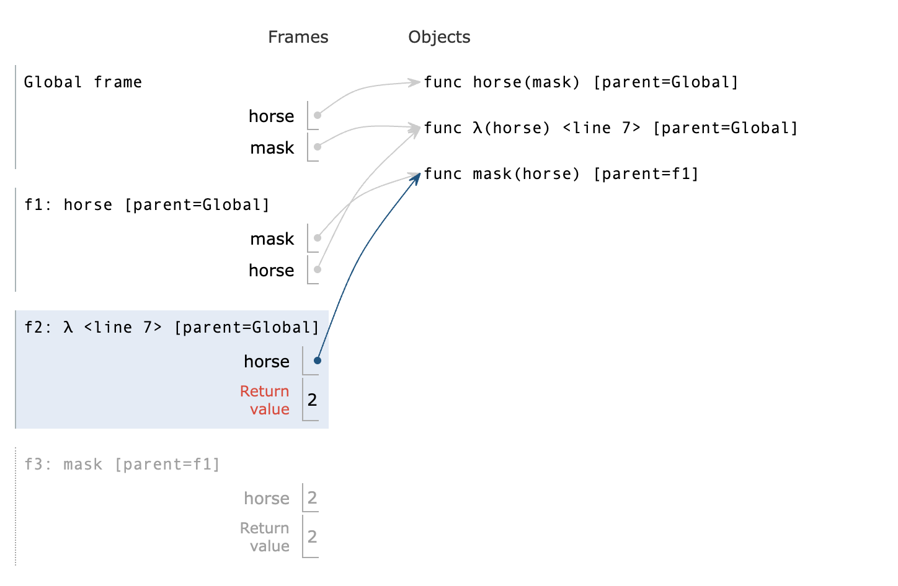

# Functions and Lists

## Functions

### Names,Assignment
- 在Python中，`Name`（名称）是指向对象的引用。在Python的上下文中，几乎所有的东西都是对象，包括函数、变量、数据结构等。Name可以是一个变量名，也可以是一个函数名。当你创建一个变量或函数时，你实际上是在为一个对象创建了一个名称（或标识符），通过这个名称可以访问或调用该对象。

- 在Python中，`assignment`（赋值）是将一个值绑定到一个名称（通常是一个变量名）的过程。赋值操作使用等号=来完成。当进行赋值时，等号右侧的表达式会被计算，然后其结果会被绑定到等号左侧的名称上。
```python
>>> f = min
>>> f = max
>>> g, h = min, max
>>> max = g
>>> max(f(2,g(h(1,5),3)),4)
3
```

- 在上面这个例子中，不同于C，我们将内置函数赋值给变量后，如`f = max`，那么f对应的就是max函数的内容，并**不会随着max的改变而改变**

### Defining Functions
- **纯函数（Pure Functions）** 是这样一种函数，它满足以下两个主要条件：
    - **相同的输入总是产生相同的输出**。纯函数不依赖于并且也不修改定义在函数外部的状态。这意味着，给定相同的参数，无论调用多少次，纯函数都会返回相同的结果。  

    - 没有副作用。纯函数**不会改变任何外部状态**（例如，不修改全局变量，不写入数据库等），也不会有如打印到控制台、写文件这样的操作。
```python
def adder(a,b):
    return a+b
```

- **非纯函数（Non-Pure Functions）** 是指不满足上述纯函数条件的函数。它们可能依赖于外部状态，或者在执行过程中改变外部状态（产生副作用）。  
```python
counter = 0

def increment():
    global counter
    counter += 1
    return counter
```

-------------

- 在Python中，`function signature`（函数签名）指的是函数定义的一部分，它包括函数的名称、接收的参数（包括位置参数、关键字参数、可变位置参数、可变关键字参数等）以及有时候包括返回类型的注解。函数签名为调用者提供了函数如何被调用的信息。

--------

```python
def greet(name: str) -> str:
    return "Hello, " + name
``` 

- 在这个例子中，函数签名是`greet(name: str) -> str`，它告诉我们：

- 函数的名称是greet。

- 它接受一个名为name的参数，该参数被注解为str类型。

- 它返回一个str类型的值。

---------

```python
def divide_exact(n,d=10):
    return n//d, n%d
```
- `d=10`并不是为d赋值，而是当没有传入d的值时，会为d默认赋值为10


### Print and None
- 在Python中，`None`是一个特殊的常量，用于表示空值或者无值的状态。它是`NoneType`类型的唯一值。`None`经常用于函数返回值，表示函数没有返回任何具体的值。同时，它也常用于变量初始化，以及表示某些对象或变量尚未被赋予具体的值。

- 在Python中，`print`是一个内置函数，用于将信息输出到标准输出（通常是屏幕）。它可以接受多个参数，将它们转换为字符串（如果它们不已经是字符串的话），然后输出这些字符串，参数之间默认用空格分隔，最后默认输出一个换行符。同时`print`函数没有返回值，在调用的时候就会**返回None**

```python
>>> print(1)
1
>>> print(1,2)
1 2
>>> print(print(1),print(2))
1
2
None None
```

### Boolean Contexts
- False Values in Python:
    - **False**
    - **0**
    - **''**
    - **None**
- True Values in Python: Anything else

### Short Circuiting
- `and`操作符，Python会先评估左侧表达式，若为`False`则结果为**左侧表达式的值**；若为`True`,则结果为**右侧表达式的值**

- `or`操作符，Python会先评估左侧表达式，若为`False`则结果为**右侧表达式的值**；若为`True`,则结果为**左侧表达式的值**

```python
>>> True and 13
13
>>> False or 0
0
>>> not 10
False
>>> not None
True
```

## Functions(advanced)
### Locally Defined Functions
```python
def make_adder(n):
    def adder(k):
        return k+n
    return adder
"""
>>> add_three = make_adder(3)
>>> add_three(4)
7
"""
```

- `make_adder(n)`定义了一个函数，这个函数内部定义了另一个函数`adder(k)`。`adder`函数将其参数`k`与外部函数的参数`n`相加，并返回结果。

- 当`make_adder`被调用时，比如`make_adder(3)`，它**返回一个adder函数**，这个`adder`函数将会把它的参数和3相加。

!!! warning "注意"
    - 即使在`adder`函数中`n`值发生了改变，也不会影响`n`在`make_adder`中的值，即在`adder`中的`n`是个**形参**
    ```python title="Dead Loop"
    def f(n):
    def g(k):
        if n==0:
            return k
        n //= 10
        return g(k+1)
    return g(0)
    ```
    ```python title="Right Version"
    def f(n):
    def g(k, n):
        if n == 0:
            return k
        return g(k + 1, n // 10)
    return g(0, n)
    ```

-----

### Functions that accept arbitrary arguments
- 我们想编写一个**接受任意数量的参数**的函数，然后使用这些参数调用另一个函数
- 运用 **\*args** 以接受任意数量的参数
```python
>>> def printed(f):
...     def print_and_return(*args):
...         result = f(*args)
...         print('Result:', result)
...         return result
...     return print_and_return
>>> printed_pow = printed(pow)
>>> printed_pow(2, 8)  ## *args represents the arguments (2, 8)
Result: 256
256
>>> printed_abs = printed(abs)
>>> printed_abs(-10)  ## *args represents one argument (-10)
Result: 10
10
```
```python
def make_averaged(original_function, samples_count=1000):
    """Return a function that returns the average value of ORIGINAL_FUNCTION
    called SAMPLES_COUNT times.

    To implement this function, you will have to use *args syntax.

    >>> dice = make_test_dice(4, 2, 5, 1)
    >>> averaged_dice = make_averaged(roll_dice, 40)
    >>> averaged_dice(1, dice)  ## The avg of 10 4's, 10 2's, 10 5's, and 10 1's
    3.0
    """
    def averaged(*args):
        total = 0
        for i in range (samples_count):
            total += original_function(*args)
        return total/samples_count
    return averaged
```

### High Order Function
高阶函数（High Order Function）是指至少满足下列一个条件的函数：
- 接受**一个或多个函数作为参数**。
- 返回**另一个函数**作为结果。
- 高阶函数在函数式编程中非常重要，它们允许函数操作函数，提供了极大的灵活性和表达力。例如，Python中的`map`和`filter`都是高阶函数，因为它们接受一个函数作为参数。另一个例子是装饰器（Decorator），它接受一个函数作为输入并返回一个增强版的函数。
------------
- **高阶函数**，注意是在**调用函数**还是在**赋值**
```python
def cake():
    print('beets')
    def pie:
        print('sweets')
        return 'cake'
    return pie
"""
>>> chocolate = cake()
beets
>>> chocolate
<function pie at ...>
>>> chocolate()
sweets
'cake'
>>> more_chocolate, more_cake = chocolate(),cake
sweets
>>> more_chocolate
'cake'
"""
def snake(x,y):
    if cake == more_cake:
        return chocolate
    else:
        return x+y
"""
>>> snake(10,20)
<function pie at ...>
>>> snake(10,20)()
sweets
'cake'
>>> cake = 'cake'
>>> snake(10,20)
30
```
-------
#### Horse and Mask
- **形参、frame的绕中绕**，搞清每一个frame和它的parent
```python
def horse(mask):
    horse = mask
    def mask(horse):
        return horse
    return horse(mask)

mask = lambda horse: horse(2)
"""
>>> horse(mask)
2
"""
```
- 在`global frame`中我们定义了**两个函数**，一个是`horse`，一个是由lambda表达式构成的`mask`
- 然后调用`horse(mask)`，这里是在global下调用的，所以`horse`和`mask`就指向上文的两者
- 然后进入`f1: horse,[parent = Global]`，开始执行body，执行到`horse = mask`，呈现下图的关系：

- 在定义了内部的`mask`函数后，返回`horse(mask)`，这时候两者所指对象有所变化：

- 于是进入`f2: λ <line 7> [parent = Global]`，在这个函数里 `horse` 其实指向之前定义的**内部函数[parent = f1]**

- 然后因为在`f2`里面返回的是`horse(2)`，所以进入`f3: mask [parent = f1]`，因而`return 2`

- 又回到`f2`返回2，又回到`f1`返回2



### Lambda Expression

- **Lambda 表达式**，也称为匿名函数，是一种在 Python 中快速定义单行的最小函数的方式。Lambda 函数可以接受任意数量的参数，但只能有一个表达式。这个表达式的计算结果会被这个函数**自动返回**。

```python
add = lambda x, y: x + y
print(add(5, 3))  ## 输出: 8

is_even = lambda x: x % 2 == 0
print(is_even(4))  ## 输出: True
print(is_even(5))  ## 输出: False

make_adder = lambda x:lambda y:x+y
adder = make_adder(3)
print(adder(5)) #输出：8
```

---------

- 结合高阶函数和lambda表达式，我们可以写出一些功能强大的函数，比如**inverse**

```python
def search(f):
    x = 0
    while True:
        if f(x):
            return x
        x += 1
## 这个函数用来寻找满足条件的x

def inverse(f):
    return lambda y:search(lambda x:f(x) == y)
## 这个高阶函数返回一个单参函数search
## 其中向search传入了 f(x) == y 的判断函数

"""
>>> square = lambda x: x*x
>>> sqrt = inverse(square)
>>> sqrt(16)
4
"""
## 当然这个版本只适用于普通的整数，更精确的平方根求法可以用牛顿法或者平方根倒数算法
```

### Currying
- **Currying** 是一种在函数式编程中常见的技术，它指的是将一个**多参数的函数**转换成一系列**使用一个参数的，Higher-Order的函数**的过程。

```python
def curry2(f):
    def g(x):
        def h(y):
            return f(x,y)
        return h
    return g

"""
>>> from operator import add
>>> m = curry2(add)
>>> add_three = m(3)
>>> add_three(2)
5
>>> curry2 = lambda f: lambda: x: lambda y: f(x,y)
...
...
"""
```

### Decorators
- **装饰器（Decorator）**是 Python 中一个非常强大的功能，允许你在**不修改原始函数或方法定义**的情况下，给它们**添加额外的功能**。装饰器**本质上是一个函数**，它**接受一个函数作为参数并返回一个新的函数**。使用装饰器可以实现很多功能，比如访问控制、日志记录、测量执行时间等。  
- 装饰器的基本语法是在**函数定义前**使用 `@` 符号加上装饰器的名称。  
- 但对于lambda表达式就不能直接使用`@`，而是调用`Decorator`函数

```python 
def trace1 (fn):
    """Returns a version of fn that first prints before it is called
    fn - a function of 1 argument
    """
    def trace(x):
        print('Calling',fn,'on argument',x)
        return fn(x)
    return trace

@trace1
def square(x):
    return x*x

@trace1
def a_function:
    return 1

"""
>>> square(4)
Calling <function square at ...> on argument 4
16
"""
```


## Recursion

- *For Instance*

```python
def print_sum(x):
    print(x)
    def next_sum(y):
        return print_sum(x+y)
    return next_sum

print_sum(1)(3)(5)
```


- **递归函数（Recursion Functions）** 是在其定义中调用自身的函数。  
- **基本情况（Base Case）**：这是递归停止的条件，没有它，递归将无限循环下去。  
- **递归步骤（Recursive Step）**：在这一步中，函数调用自身，通常是用一组不同的参数。  

### Mutual Recursion
- **互递归（Mutual Recursion）** 是指两个或多个函数相互调用对方以实现递归的情况。
#### Luhn Algorithm
- 从右边**第二个数字**开始，每隔一个数字乘以2。

- 如果乘以2的结果是**两位数**，则将这两位数相加得到一个单一的数字(e.g. 10 -> 1 + 0 = 1)

- 然后加和所有数字，如果这个总和可以**被10整除**则是有效的

```python
def luhn_sum(n):
    if n < 10:
        return n
    else :
        all_but_last, last = split(n)
        return luhn_sum_double(all_but_last) + last

def luhn_sum_double(n):
    all_but_last, last = split(n)
    double_last_sum = sum_digits(2 * last)
    if n < 10:
        return double_last_sum
    else:
        return luhn_sum(all_but_last) + double_last_sum
```

### Tree Recursion
- **树递归（Tree Recursion）** 是一种特殊类型的递归模式，其中一个函数在其执行过程中不止一次地调用自身。每次函数**调用自身时，都会创建一个新的分支**，在逻辑上形成了一棵树。


------

例如：`Cascade`函数
```python
def cascade(n):
    if n < 10:
        print(n)
    else :
        print(n)
        cascade(n // 10)
        print(n)

"""
>>> cascade(123)
123
12
1
12
123
"""
```

- **Inverse Cascade**

```python
"""
1
12
123
1234
123
12
1
"""
## 对于形如这样的inverse_cascade，我们打算把函数拆分成三部分：grow，print，shrink
def inverse_cascade(n):
    grow(n)
    print(n)
    shrink(n)

#然后引入f_then_g函数，来调整函数的前后调用顺序
def f_then_g(f,g,n):
    if n:
        f(n)
        g(n)

#最后定义grow和shrink
grow = lambda n: f_then_g(grow, print, n // 10)
shrink = lambda n: f_then_g(print, shrink, n // 10)
```

-------------

- **Counting Partitions**

- `count_partitions(n,m)`表示用**不超过m的正整数**来表示n，其中这些数的排列成**非递减**的顺序，就叫做n的划分数

```python
def count_partitions(n,m):
    if n == 0:
        return 1 #什么都没有也是一种划分
    elif n < 0:
        return 0
    elif m == 0:
        return 0
    else:
        with_m = count_partitions(n-m,m)
        without_m = count_partitions(n,m-1)

result = count_partitions(5,3)
## 1 + 1 + 1 + 1 + 1 = 5
## 1 + 1 + 1 + 2 =5
## 1 + 2 + 2 = 5
## 1 + 1 + 3 = 5
## 2 + 3 = 5
```

----

- 本质上是一种DFS
- 类似的如 hw03中的`count coins`
```python title="count coins"
def next_larger_coin(coin):
    """Returns the next larger coin in order.
    >>> next_larger_coin(1)
    5
    >>> next_larger_coin(5)
    10
    >>> next_larger_coin(10)
    25
    >>> next_larger_coin(2) # Other values return None
    """
    if coin == 1:
        return 5
    elif coin == 5:
        return 10
    elif coin == 10:
        return 25

def next_smaller_coin(coin):
    """Returns the next smaller coin in order.
    >>> next_smaller_coin(25)
    10
    >>> next_smaller_coin(10)
    5
    >>> next_smaller_coin(5)
    1
    >>> next_smaller_coin(2) # Other values return None
    """
    if coin == 25:
        return 10
    elif coin == 10:
        return 5
    elif coin == 5:
        return 1

def count_coins(total):
    """Return the number of ways to make change using coins of value of 1, 5, 10, 25.
    >>> count_coins(15)
    6
    >>> count_coins(10)
    4
    >>> count_coins(20)
    9
    >>> count_coins(100) # How many ways to make change for a dollar?
    242
    >>> count_coins(200)
    1463
    >>> from construct_check import check
    >>> # ban iteration
    >>> check(HW_SOURCE_FILE, 'count_coins', ['While', 'For'])
    True
    """
    def constrained_count_small(total, largest_coin):
        if total == 0:
            return 1
        if total < 0:
            return 0
        if largest_coin == None:
            return 0
        without_coin = constrained_count_small(total, next_smaller_coin(largest_coin))
        with_coin = constrained_count_small(total - largest_coin, largest_coin)
        return without_coin + with_coin
    return constrained_count_small(total, 25)
```
!!! note
    - 利用`next_smaller_coin`或`next_larger_coin`以及 **with**和**without**来遍历所有分支

-------

!!! tip "lambda表达式嵌套定义函数"
    ```python title="阶乘函数"
    (lambda f: f(f))(lambda f: lambda x: 1 if x == 0 else x * f(f)(x - 1)) 
    (lambda f: lambda k: f(f, k))(lambda f, k: k if k == 1 else mul(k, f(f, sub(k, 1))))
    ```

    - 想要定义阶乘函数，我们先构想这个阶乘函数由哪些参数组成  
    - 根据分析，阶乘函数既然要递归调用自身，肯定要传入一个函数，同时还要传入一个整数，因此是两个参数  
    - 可以设计成双参数函数，或者是高阶函数（第一个例子为高阶函数）  
    - **下面分析例1:**  
        - 那么我们利用条件判断式得到函数的雏形：`lambda f: lambda x: 1 if x==0 else x*f(f)(x-1)`  
        - 现在问题就在于这个雏形函数(记作λ)是 λ()()需要接受两个参数，那么我们就要把他自身传给他  
        - 于是有了外层的 `lambda f: f(f)`，这个外层接受 λ 作为参数后，就可以得到一个单参数函数，最后就可以只传入数值  

??? note "Example-sum fun(tree recursion)"
    - 实现sums(n, m) ，它接受n和最大值m 。它返回含有所有满足条件的子列表的一个列表：
        - 子列表和为 `n`  
        - 子列表中的数最大取到`m`  
        - 没有相邻的两个数是相同的  
        - 两个具有相同数字但顺序不同的列表都应该返回。
    ```python title="示例"
    """
    >>> sums(5, 1)
    []
    >>> sums(5, 2)
    [[2, 1, 2]]
    >>> sums(5, 3)
    [[1, 3, 1], [2, 1, 2], [2, 3], [3, 2]]
    >>> sums(5, 5)
    [[1, 3, 1], [1, 4], [2, 1, 2], [2, 3], [3, 2], [4, 1], [5]]
    >>> sums(6, 3)
    [[1, 2, 1, 2], [1, 2, 3], [1, 3, 2], [2, 1, 2, 1], [2, 1, 3], [2, 3, 1], [3, 1, 2],
    [3, 2, 1]]
    """
    ```

    - 我们注意整个函数最后返回的是一个**大列表**，即`[[...],[...],...]`  
    - 同时这是一个dfs，我们要找到**第一个元素和后续列表组合**的**条件关系**  
        - 先思考边界条件，这个题的构成应该形如**counting partitions**，随着递归`n`会逐渐减小  
        - `n < 0`则说明此路不通，返回一个元素**使得这个列表不会作为子列表**，暂未想到记作`[?]`；`n == 0`则说明成功，返回一个不影响列表组成的元素，即`[[]]`  
    - 下面我们思考 **条件关系**  
        - 面对函数返回的大列表，我们肯定要**遍历每个子列表**，然后把**[k]与之相加**  
        - `[[k] + rest for rest in sums(n-k,m) if ?]` 得到雏形  
        - 能加合的情况有两种：1. rest到底了，返回了`[[]]`， 2. rest的**第一个元素**与`k`不同  
        - `[[k] + rest for rest in sums(n-k,m) if rest==[] or rest[0] != k]`  
        - 到这里，我们就能反推出上面的`[?]` 应该为`[]`，因为这样子`rest`就不会与`[k]`加合，自然不产生错误的子列表
    ```python title="implementation"
    if n < 0:
        return []
    if n == 0:
        sums_to_zero = [] # The only way to sum to zero using positives
        return [sums_to_zero] # Return a list of all the ways to sum to zero
    result = []
    for k in range(1, m + 1):
        result = result + [[k] + rest for rest in sums(n-k, m) if rest == [] or rest[0] != k]
    return result
    ```


---

## Sequences

### Lists
- 在Python中，**列表（Lists）**是一种用于存储有序集合的数据结构。列表是**可变的**，这意味着它们可以在创建后修改。列表中的元素**不必是同一类型**，使得列表非常灵活和强大。

??? note "列表可以做加法和乘法"
    ```python
    >>> lists = [1,'123',None]
    >>> [1,2]+lists*2
    [1,2,1,'123',None,1,'123',None]
    ```

### Container

- 在Python中，`in`运算符用于检查序列（如列表、字符串、元组等）中是否存在某个**元素**。如果元素存在于序列中，`in`运算符返回`True`；如果不存在，返回`False`。

!!! warning "`in`不寻找**子序列**"
    ```python
    >>> digits = [1,3,5,8]
    >>> 1 in digits
    True
    >>> 3 in digits
    True
    >>> [1,3] in digits
    Falst
    >>> [1,3] in [1,[1,3],5]
    True
    >>> [1,3] in [1,[[1,3]],5]
    False
    ```

### For Statement
- 在Python中，`for`语句用于遍历序列（如列表、字符串、元组等）中的每个元素，对每个元素执行代码块。

#### Sequence Unpacking
- 对于有着**固定长度子序列**的序列，我们可以进行unpacking
- 但是若有长度不合群的子序列，则会**报错**
```python title="unpacking"
>>> list = [[1,2],[1,3],[2,5]]
>>> for x,y in list:
        print(x,y)
1 2
1 3
2 5
>>> list += [[1,1,1]]
>>> for x,y in list:
        print(x,y)
1 2
1 3
2 5
Traceback (most recent call last):
  File "<stdin>", line 1, in <module>
ValueError: too many values to unpack (expected 2)
```

### Ranges
- 在Python中，`range`类型表示一个**不可变的连续数字(integers)序列**，`range()`函数用于生成一个**数字序列**。

- 这么设计是有意义的
    - **区间长度**: ending index - starting index  
    - **选择元素**: starting index + index

- range可以转换成一个列表
    - `list(range(-2,2))  
    - `[-2,-1,0,1]`

### List Comprehensions
- 在Python中，**List Comprehensions（列表推导式）**是一种简洁、灵活的构建列表（List）的方法。它允许从一个或多个**迭代器**快速创建列表，可以应用**条件筛选**，也可以对每个元素**执行操作**

### Slicing
- 在Python中，**切片（Slicing）**是一种操作，允许你访问序列类型（如列表、元组、字符串等）的一部分元素。切片操作通过指定索引范围来实现，语法如下：
    - `sequence[start:stop:step]`  
    - `start`：切片开始的位置。如果省略，默认为序列的开始(**0**)。  
    - `stop`：切片结束的位置，但不包括这个位置的元素。如果省略，**默认为序列的结束**（并不是-1，因为取-1就不含最后一个元素）。  
    - `step`：步长，即取元素的间隔。如果省略，默认为1。  

- 在Python中索引可以为负数，表示倒数第几个数
    - `-1`代表最后一个数，`-2`代表倒数第二个数  
    
!!! tip "负数步长"    
    - **步长**也可为负数，意味着**倒着**截取切片  
    - 此时`list[start:stop:-1]`  
        - `start`默认为`-1`  
        - `stop`默认值是序列开始之前的位置，通常可以理解为`None`或者一个无法表示的值，以确保能够包含序列的第一个元素（如果为**空**就会取到列表**第一个**元素）（如果为**0**则刚好**不能**取到列表第一个元素）

??? note "Example-Max product"
    - 函数`max_product`接受一个列表，然后返回这个列表中**非连续元素相乘**所能得到的**最大**结果  
    ```python
    >>> max_product([10,3,1,9,2])
    90  (90 = 10*9)
    >>> max_product([5,10,5,10,5])
    125 (125 = 5*5*5)
    ```

    - 分析可知，对于第一个元素来说，如果最终结果含它则一定是 `s[0]*max_product(s[2:])`；如果不含，则是 `max_product(s[1:])`
    ```python title="max_product"
    def max_product(s)
    if s == []: # empty set
        return 1
    elif len(s) == 1: # single element
        return s[0]
    else:
        return max(s[0]*max_product(s[2:]),max_product(s[1:]))

    ```


---

### Sequence Aggregation

- 在Python中，有许多内置函数可以将**可遍历(iterable)**的参数整合为一个值
    - **sum(iterable, start=0)**：计算可迭代对象中所有元素的总和，可选的start值是累加的初始值。  
    - **max(iterable, \*[, default=obj, key=func])**：返回可迭代对象中的最大值。key参数为一个函数，用于从每个元素中提取一个用于比较的值。  
    - **min(iterable, \*[, default=obj, key=func])**：返回可迭代对象中的最小值。同样支持key参数。 
    - **all(iterable)**：对每个元素调用`bool(x)`函数，若都为真则返回`True`，否则返回`False`

??? note "`sum`的使用"
    - `start`是累加的初始值，默认为整数0 
    ```python title="基本加合"
    >>> sum([1,3,4,5],10)
    23
    >>> sum(['1','3','5'])
    Traceback (most recent call last):
        File "<stdin>", line 1, in <module>
    TypeError: unsupported operand type(s) for +: 'int' and 'str'
    ```
    - 如果我们修改`start`的初始值，就可以进行更多类型的加合
    ```python 
    >>> sum([[1,3],[2,5],[4,7]],[])
    [1,3,2,5,4,7]
    ```

??? note "`max`的使用"
    - `max`函数有两种形式
        - **max(iterable[, key=func]) -> value** 
        - **max(a,b,c...[,key=func]) -> value**
    
    ```python 
    >>> max(range(0,5))
    4
    >>> max(0,1,2,3,4)
    4
    ```

    ```python title="传入一个函数作为可选参数"
    >>> max(range(10),key = lambda x: 7-(x-4)*(x-2)) #二次函数，最大值在x=3处取得
    3
    ```

### Strings
- 在Python中，**字符串（strings）**是由一系列字符组成的不可变序列。字符串可以包含字母、数字、符号和空格。  
- 表示方法:
    - 'This is a string'  
    - "This is also a 'string'"  
    - """use three marks to cotain words over lines"""

!!! note "**Length** 和 **element selection** 与`lists`类似"
    !!! warning inline end "注意"
        - 不同于列表取元素，字符串取出的元素仍然是一个**字符串**  
        - 在`lists`中我们只能一次查找**一个元素**，但是字符串可以查找**连续的字符**  

    ```python 
    >>> city = 'Berkeley'
    >>> len(city)
    8
    >>> city[3]
    'k'
    ```

    - 我们同样可以使用 `in` and `not in` 操作
        
        ```python title="in"
        >>> 'here' in 'where are the strings'
        True
        >>> 123 in [1,2,3,4,5]
        False
        >>> [2,3,4] in [1,2,3,4,5]
        False
        ```

### Dictionaries

- 在Python中，**字典（Dictionaries）**是一种内置的数据类型，用于存储**键值对**的集合。字典是可变的，这意味着你可以在创建后添加、修改或删除键值对。字典中的**键**必须是**不可变**类型，如**字符串、数字或元组**，且每个**键**在字典中必须是**唯一的**。**值**可以是**任何**数据类型，并且**可以重复**。
    - 使用花括号 `{}`来表示  
    - 我们不再使用`index`来取出元素，而是利用`key`  
    - `key`不能是`list` or `dictionary`(**unhashable type**)
    - 字典是由`key`构成的序列
    ```python title="dictionaries are sequence of keys"
    >>> numberals = {'I':1,'V':5,'X':10}
    >>> list(numberals)
    ['I','V','X']
    ```
    - 调用`.values()`，我们可以取出`dict_values`
        - 这并非一个`list`，是一种特殊类型的sequence，但是我们仍然可以进行很多操作  
        - `sum`,`list` etc..
        ```python title="dict_values"
        >>> numberals.values()
        dict_values([1,5,10])
        >>> sum(numberals.values())
        16
        >>> list(numberals.values())
        [1,5,10]
        ```

!!! note "Dictionary Comprehensions"
    - `{<key exp>:<value exp> for <name> in <iter exp> if <fliter exp>}`
    ```python title="example"
    >>> {x*x:x for x in range(6) if x>2}
    {9:3, 16:4, 25:5}
    ```

    ??? tip "Example-Index Function"
        - 函数`index`接受两个参数`key`和`values`，然后接受一个**两参数的函数 match**  
        - 返回一个字典，包含所有使得**match(v,k)**为真的键值对
        ```python title="index inplementation"
        def index(key,values,match):
        """
        >>> index([7,9,11],range(30,50),lambda k,v:v % k == 0)
        {7:[35,42,49], 9:[36,45], 11:[33,44]}
        """
            return {k:[v for v in values if match(k,v)] for k in keys}
        ```
    
------------


## Data Abstraction

- **数据抽象（Data Abstraction）**是一种编程和设计的方法论，它强调将数据的**实现细节隐藏起来**，仅**通过一组公共的接口与数据交互**。这种方法允许程序员在不了解数据的具体实现的情况下，也能够操作数据结构，从而简化了软件开发和维护。

- 我们对于要实现的数据类型，需要层层分装，这样子每层之间互不影响，我们在维护时不跨过边界修改会更容易


!!! warning "错误示范"
    


## Trees

!!! note "implementing the tree abstraction"
    ```python
    def tree(label,branches=[]):
        for branch in branches:
            assert is_tree(branch),"branches must be trees!"
            return [label]+list[branches]
    
    def label(tree):
        return tree[0]

    def branches(tree):
        return tree[1:]

    def is_tree(tree):
        if type(tree) != list or len(tree) < 1:
            return False
        for branch in branches(tree):
            if not is_tree(branch):
                return False
        return True
    
    def is_leaf(tree):
        return not branches[tree]

    # 斐波那契树
    def fib_tree(n):
        if n<=1:
            return tree(n)
        else:
            left, right = fib_tree(n-2),fib_tree(n-1)
            return tree(label(left)+label(right),[left,right])        
    ```
    


!!! note "Tree processing using Recursion"
    === "数叶节点"
        ```python 
        def count_leaves(tree):
            if is_leaf(tree):
                return 1
            else:
                cnt = 0
                for branch in branches(tree):
                    cnt += count_leaves(branch)
                return cnt

                """ another version
                branches_count = [count_leaves(branch) for branch in branches(tree)]
                return sum(branches_count)
                """
        ```
        

    === "创建树"
        ```python
        """ return a tree from another tree 
        in order to increment every node"""
        def increment(t):
            if is_leaf(t):
                return tree(label(t)+1)
            else:
                root_label = label(t)+1
                new_branches = sum([increment_leaves(b) for b in branches(t)],[])
                return tree(root_label,new_branches)
        
        ```
    

-----


## Iterator

- 在Python中，**迭代器（iterator）**是用作访问各种不同容器中元素的一种方式  
- `iter(iterable)`：**返回**一个基于可迭代对象中元素的**迭代器**  
- `next(iterator)`：返回迭代器中的下一个元素  
- `list(iterator)`：以列表形式列出迭代器中的剩余元素，并且`StopIteration`  
```python 
>>> s = [3, 4, 5, 6]
>>> t = iter(s)
>>> t
<list_iterator object at ...>
>>> next(t)
3
>>> next(t)
4
>>> s = [[1, 2], 3, 4, 5]
>>> t = iter(s)
>>> next(t)
[1, 2]
>>> list(t)
[3, 4, 5]
>>> next(t)
Traceback (most recent call last):
  File "<stdin>", line 1, in <module>
StopIteration
```

!!! note "修改容器后迭代器的变化"
    === "list"
        - 对于列表来说，迭代器的原理其实是遍历所有索引下的元素（**从0到末尾**）
        - 每次调用`next(t)` 实际上是在**increment**迭代器指向列表的**索引值**
        ```python
        >>> s = [3, 4, 5, 6, 7]
        >>> t = iter(s)
        >>> next(t)
        3 # s[0]，下一次调用next(t)就是返回s[1]
        >>> s.insert(1,100)
        >>> next(t)
        100 # 而不是4，因为s[1]是100而不是4了
        ```
    
    === "Dictionary"
        - 对于字典来说，如果大小发生了改变，则迭代器会**失效**
        ```python
        >>> d = {'one' : 1, 'two' : 2}
        >>> t = iter(d.keys())
        >>> next(t)
        'one'
        >>> d['zero'] = 0
        >>> next(t)
        Traceback (most recent call last):
          File "<stdin>", line 1, in <module>
        RuntimeError: dictionary changed size during iteration
        ```

!!! note "for statement in iterator"
    - 利用for循环遍历迭代器时，迭代器中的**index**一样会移动，所以就会出现**迭代器最后为空**的情况
    ```python
    >>> r = list(range(3,7))
    >>> ri = iter(r)
    >>> for i in ri:
            print(i)

    3
    4
    5
    6
    >>> for i in ri:

    >>>
    # 什么也不会输出
    ```

------

### Built-in Functions for iteration

- `map(func,iterable)`：返回一个**迭代器**，其中为`iterable`中每个元素采用`func`后的结果（`iterable`内的元素**不会有变化**）  
- `filter(func,iterable)`：返回一个**迭代器**，其中为`iterable`中满足 **if func(x)**的元素  
- `zip(first_iter,second_iter)`：接受两个`iterable`，返回 **(x,y)元组元素** 的**迭代器**  
- `reversed(sequences)`：返回反向遍历结果的**迭代器**  
- 如果想要查看迭代器的全部内容，可以装入一个容器
    - `list()`,`tuple()`,`sorted()`

!!! tip "惰性计算"
    - 如上文提到的`map、filter、zip`等函数返回的都是迭代器，它们**不会立即执行**，而是**在迭代时才**逐个处理元素。
    ```python 
    def double(x):
    print('**',x,'=>',2*x)
    return 2*x
    
    >>> m = map(double,[1,3,5,7]) # assignment后并没有执行double函数
    >>> next(m)
    ** 1 => 2 **
    2
    >>> next(m)
    ** 3 => 6 **
    6

    >>> m = map(double,[1,3,5,7])
    >>> f = lambda y: if y >= 10
    >>> t = fliter(f, m)
    >>> next(t)
    ** 1 => 2 **
    ** 3 => 6 **
    ** 5 => 10 **
    10
    >>> list(fliter(f,map(double,[1,3,5,7])))
    ** 1 => 2 **
    ** 3 => 6 **
    ** 5 => 10 **
    ** 7 => 14 **
    [10,14]
    ```

??? note "Zip的用法"
    - `zip(first_iter,second_iter)`：接受两个`iterable`，返回 **(x,y)元组元素** 的**迭代器**   
        ```python
        >>> list(zip([1,3],[5,7]))
        [(1,5),(3,7)]
        ```
    
    - 如果一个iterable比另一个iterable**长**，`zip`只会遍历可以配对的组合，跳过多余的
        ```python
        >>> list(zip([1,3,5],[7,9]))
        [(1,7),(3,9)]
        ```
    
    - 可以传入**两个以上**的iterable
        ```python
        >>> list(zip([1,2,3],[4,5,6],[7,8]))
        [(1,4,7),(2,5,8)]
        ```

    ??? tip "构建回文(palindrome)函数"
        - 如果某个iterable是回文的，那么`zip(s,reversed(s))`中的所有pair中两个元素都相等
        ```python
        # First Version
        def palindrome(s):
            return list(s) == list(reversed(s))
            # 注意一定要统一为list类型，不然list或者字符串类型不会equal于iterator
        
        # Second Version
        def palindrome(s):
            return all([a == b for a,b in zip(s,reversed(s))])
        ```

------


## Generator
- 在Python中，**生成器（Generator）**是一种用于创建迭代器的简单而强大的工具。  
- 它们写起来就像是正常的函数，但是使用`yield语句`每次返回一个值。这使得函数能够在每次`yield`被调用时**暂停执行**，并在下一次从上次**离开的地方**继续执行。  
```python
def plus_minus(x):
    yield x
    yield -x

>>> t = plus_minux(3)
>>> next(t)
3
>>> next(t)
-3
>>> t
<generator object plus_minus at ...>

```

-----

- `yield from`：允许我们遍历`iterator`或`iterable`，简化版的`for x in iterator:...`

??? note "Example-process strings"
    ```python
    def prefixes(s):
        if s:
            yield from prefixes(s[:-1])
            yield from s
    
    """
    >>> list(prefixes('both'))
    ['b', 'bo', 'bot', 'both']
    """

    def substrings(s):
        if s:
            yield from prefixes(s)
            yield from substrings(s[1:])
    
    """
    >>> list(substrings('top'))
    ['t', 'to', 'top', 'o', 'op', 'p']
    """    
    ```

??? note "Example-Partitions"
    - 和之前的*counting_partitions*差不多，同样的思路，考虑有m和无m两种情况
    - 这一次我们将罗列出所有的可能性
    ``` python
    def list_partitions(n,m):
        if n>0 and m>0:
            # 含m的情况
            if n == m:
                yield str(m)
            for p in list_partitions(n-m,m):
                yield p + '+' + str(m)
            
            # 不含m的情况
            yeild from list_partitions(n,m-1)

    """
    >>> for p in list_partitions(6,4):print(p)
    2 + 4
    1 + 1 + 4
    3 + 3
    1 + 2 + 3
    1 + 1 + 1 + 3
    2 + 2 + 2
    1 + 1 + 2 + 2
    1 + 1 + 1 + 1 + 2
    1 + 1 + 1 + 1 + 1 + 1
    """
    ```

----


## Project 1: Hog

## Project 2: Cats

!!! tip "难点:`minimum_mewtations`的实现"
    - 最关键的一点，这个题只考究最优的改法的**操作数**，而不是如何最优  
    - 所以我们可以在假设**这个操作会有贡献数**的情况下进行递归  
    - `add`: 假设`add`有意义，那么我们只需要考虑typed和source[1:]（增添的字符必须是source[0]）  
    - `remove`: 假设`remove`有意义，那么我们只需要考虑typed[1:]和source （删去的字符必须是typed[0]）  
    - `substitute`: 假设`substitute`有意义，那么我们只需要考虑typed[1:]和source[1:]  
    - basic cases:  
        - 两者相等：操作数为0
        - 一空一有：操作数必须是**非空者的长度**
        - 两者首字符相等：进行递归
        - limit < 0：我们上方进行操作时，默认操作数**加一**，那么相应的其实就是`limit`会收紧即**减一**；为防止多余递归，此时返回一个极大值
    ```python
    def minimum_mewtations(typed, source, limit):
    
    if typed == source:  # 如果两个字符串相等，编辑距离为0
        return 0
    if not typed or not source:  # 如果其中一个字符串为空，返回另一个的长度
        return max(len(typed), len(source))
    if typed[0] == source[0]:  # 如果当前字符相同，直接比较剩下的部分
        return minimum_mewtations(typed[1:], source[1:], limit)
    if limit < 0:
        return float('inf') # 返回一个无限大的数，保证不会多余递归

    # 尝试添加、删除、替换操作，每次操作后递归比较剩余部分
    add = minimum_mewtations(typed, source[1:], limit - 1)  # 在typed前添加一个字符
    remove = minimum_mewtations(typed[1:], source, limit - 1)  # 删除typed的一个字符
    substitute = minimum_mewtations(typed[1:], source[1:], limit - 1)  # 替换typed的一个字符
    
    # 返回三种操作中的最小编辑距离 + 1（当前操作）
    return 1 + min(add, remove, substitute)
    ```

