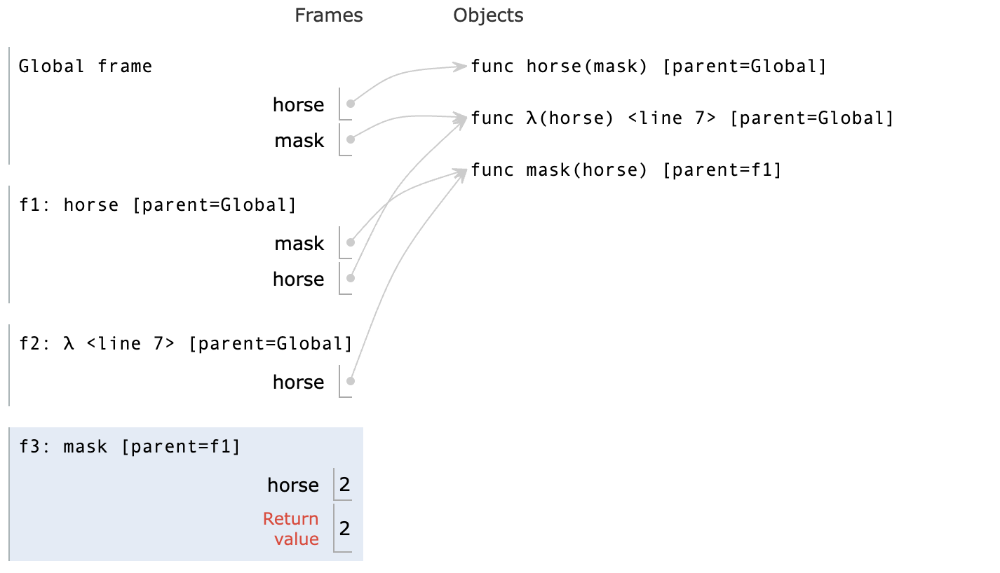

# Week 1
## Names,Assignment
- 在Python中，`Name`（名称）是指向对象的引用。在Python的上下文中，几乎所有的东西都是对象，包括函数、变量、数据结构等。Name可以是一个变量名，也可以是一个函数名。当你创建一个变量或函数时，你实际上是在为一个对象创建了一个名称（或标识符），通过这个名称可以访问或调用该对象。

- 在Python中，`assignment`（赋值）是将一个值绑定到一个名称（通常是一个变量名）的过程。赋值操作使用等号=来完成。当进行赋值时，等号右侧的表达式会被计算，然后其结果会被绑定到等号左侧的名称上。

```python
>>> f = min
>>> f = max
>>> g, h = min, max
>>> max = g
>>> max(f(2,g(h(1,5),3)),4)
3
```
- 在上面这个例子中，不同于C，我们将内置函数赋值给变量后，如`f = max`，那么f对应的就是max函数的内容，并**不会随着max的改变而改变**

## Defining Functions
- **纯函数（Pure Functions）** 是这样一种函数，它满足以下两个主要条件：
    - **相同的输入总是产生相同的输出**。纯函数不依赖于并且也不修改定义在函数外部的状态。这意味着，给定相同的参数，无论调用多少次，纯函数都会返回相同的结果。
    - 没有副作用。纯函数**不会改变任何外部状态**（例如，不修改全局变量，不写入数据库等），也不会有如打印到控制台、写文件这样的操作。

```python
def adder(a,b):
    return a+b
```

- **非纯函数（Non-Pure Functions）** 是指不满足上述纯函数条件的函数。它们可能依赖于外部状态，或者在执行过程中改变外部状态（产生副作用）。
```python
counter = 0

def increment():
    global counter
    counter += 1
    return counter
```
-------------

- 在Python中，`function signature`（函数签名）指的是函数定义的一部分，它包括函数的名称、接收的参数（包括位置参数、关键字参数、可变位置参数、可变关键字参数等）以及有时候包括返回类型的注解。函数签名为调用者提供了函数如何被调用的信息。

--------

```python
def greet(name: str) -> str:
    return "Hello, " + name
``` 
- 在这个例子中，函数签名是`greet(name: str) -> str`，它告诉我们：
- 函数的名称是greet。
- 它接受一个名为name的参数，该参数被注解为str类型。
- 它返回一个str类型的值。

---------

```python
def divide_exact(n,d=10):
    return n//d, n%d
```
- `d=10`并不是为d赋值，而是当没有传入d的值时，会为d默认赋值为10


## Print and None
- 在Python中，`None`是一个特殊的常量，用于表示空值或者无值的状态。它是`NoneType`类型的唯一值。`None`经常用于函数返回值，表示函数没有返回任何具体的值。同时，它也常用于变量初始化，以及表示某些对象或变量尚未被赋予具体的值。

- 在Python中，`print`是一个内置函数，用于将信息输出到标准输出（通常是屏幕）。它可以接受多个参数，将它们转换为字符串（如果它们不已经是字符串的话），然后输出这些字符串，参数之间默认用空格分隔，最后默认输出一个换行符。同时`print`函数没有返回值，在调用的时候就会**返回None**

```python
>>> print(1)
1
>>> print(1,2)
1 2
>>> print(print(1),print(2))
1
2
None None
```

## Boolean Contexts
- False Values in Python:
    - **False**
    - **0**
    - **''**
    - **None**
- True Values in Python: Anything else

## Short Circuiting
- `and`操作符，Python会先评估左侧表达式，若为`False`则结果为**左侧表达式的值**；若为`True`,则结果为**右侧表达式的值**
- `or`操作符，Python会先评估左侧表达式，若为`False`则结果为**右侧表达式的值**；若为`True`,则结果为**左侧表达式的值**

```python
>>> True and 13
13
>>> False or 0
0
>>> not 10
False
>>> not None
True
```

# Week 2
## Locally Defined Functions
```python
def make_adder(n):
    def adder(k):
        return k+n
    return adder
"""
>>> add_three = make_adder(3)
>>> add_three(4)
7
"""
```
- `make_adder(n)`定义了一个函数，这个函数内部定义了另一个函数`adder(k)`。`adder`函数将其参数`k`与外部函数的参数`n`相加，并返回结果。
- 当`make_adder`被调用时，比如`make_adder(3)`，它**返回一个adder函数**，这个`adder`函数将会把它的参数和3相加。

## Functions that accept arbitrary arguments
- 我们想编写一个**接受任意数量的参数**的函数，然后使用这些参数调用另一个函数
- 运用 **\*args** 以接受任意数量的参数
```python
>>> def printed(f):
...     def print_and_return(*args):
...         result = f(*args)
...         print('Result:', result)
...         return result
...     return print_and_return
>>> printed_pow = printed(pow)
>>> printed_pow(2, 8)  # *args represents the arguments (2, 8)
Result: 256
256
>>> printed_abs = printed(abs)
>>> printed_abs(-10)  # *args represents one argument (-10)
Result: 10
10
```
```python
def make_averaged(original_function, samples_count=1000):
    """Return a function that returns the average value of ORIGINAL_FUNCTION
    called SAMPLES_COUNT times.

    To implement this function, you will have to use *args syntax.

    >>> dice = make_test_dice(4, 2, 5, 1)
    >>> averaged_dice = make_averaged(roll_dice, 40)
    >>> averaged_dice(1, dice)  # The avg of 10 4's, 10 2's, 10 5's, and 10 1's
    3.0
    """
    def averaged(*args):
        total = 0
        for i in range (samples_count):
            total += original_function(*args)
        return total/samples_count
    return averaged
```

## High Order Function
高阶函数（High Order Function）是指至少满足下列一个条件的函数：
- 接受**一个或多个函数作为参数**。
- 返回**另一个函数**作为结果。
- 高阶函数在函数式编程中非常重要，它们允许函数操作函数，提供了极大的灵活性和表达力。例如，Python中的`map`和`filter`都是高阶函数，因为它们接受一个函数作为参数。另一个例子是装饰器（Decorator），它接受一个函数作为输入并返回一个增强版的函数。
------------
- **高阶函数**，注意是在**调用函数**还是在**赋值**
```python
def cake():
    print('beets')
    def pie:
        print('sweets')
        return 'cake'
    return pie
"""
>>> chocolate = cake()
beets
>>> chocolate
<function pie at ...>
>>> chocolate()
sweets
'cake'
>>> more_chocolate, more_cake = chocolate(),cake
sweets
>>> more_chocolate
'cake'
"""
def snake(x,y):
    if cake == more_cake:
        return chocolate
    else:
        return x+y
"""
>>> snake(10,20)
<function pie at ...>
>>> snake(10,20)()
sweets
'cake'
>>> cake = 'cake'
>>> snake(10,20)
30
```
-------
### Horse and Mask
- **形参、frame的绕中绕**，搞清每一个frame和它的parent
```python
def horse(mask):
    horse = mask
    def mask(horse):
        return horse
    return horse(mask)

mask = lambda horse: horse(2)
"""
>>> horse(mask)
2
"""
```
- 在`global frame`中我们定义了**两个函数**，一个是`horse`，一个是由lambda表达式构成的`mask`
- 然后调用`horse(mask)`，这里是在global下调用的，所以`horse`和`mask`就指向上文的两者
- 然后进入`f1: horse,[parent = Global]`，开始执行body，执行到`horse = mask`，呈现下图的关系：

- 在定义了内部的`mask`函数后，返回`horse(mask)`，这时候两者所指对象有所变化：

- 于是进入`f2: λ <line 7> [parent = Global]`，在这个函数里 `horse` 其实指向之前定义的**内部函数[parent = f1]**

- 然后因为在`f2`里面返回的是`horse(2)`，所以进入`f3: mask [parent = f1]`，因而`return 2`

- 又回到`f2`返回2，又回到`f1`返回2


## Lambda Expression
- **Lambda 表达式**，也称为匿名函数，是一种在 Python 中快速定义单行的最小函数的方式。Lambda 函数可以接受任意数量的参数，但只能有一个表达式。这个表达式的计算结果会被这个函数**自动返回**。
```python
add = lambda x, y: x + y
print(add(5, 3))  # 输出: 8

is_even = lambda x: x % 2 == 0
print(is_even(4))  # 输出: True
print(is_even(5))  # 输出: False

make_adder = lambda x:lambda y:x+y
adder = make_adder(3)
print(adder(5)) #输出：8
```
---------
- 结合高阶函数和lambda表达式，我们可以写出一些功能强大的函数，比如**inverse**
```python
def search(f):
    x = 0
    while True:
        if f(x):
            return x
        x += 1
# 这个函数用来寻找满足条件的x

def inverse(f):
    return lambda y:search(lambda x:f(x) == y)
# 这个高阶函数返回一个单参函数search
# 其中向search传入了 f(x) == y 的判断函数

"""
>>> square = lambda x: x*x
>>> sqrt = inverse(square)
>>> sqrt(16)
4
"""
# 当然这个版本只适用于普通的整数，更精确的平方根求法可以用牛顿法或者平方根倒数算法
```

## Currying
- **Currying** 是一种在函数式编程中常见的技术，它指的是将一个**多参数的函数**转换成一系列**使用一个参数的，Higher-Order的函数**的过程。

```python
def curry2(f):
    def g(x):
        def h(y):
            return f(x,y)
        return h
    return g

"""
>>> from operator import add
>>> m = curry2(add)
>>> add_three = m(3)
>>> add_three(2)
5
>>> curry2 = lambda f: lambda: x: lambda y: f(x,y)
...
...
"""
```

## Decorators
- **装饰器（Decorator）**是 Python 中一个非常强大的功能，允许你在**不修改原始函数或方法定义**的情况下，给它们**添加额外的功能**。装饰器**本质上是一个函数**，它**接受一个函数作为参数并返回一个新的函数**。使用装饰器可以实现很多功能，比如访问控制、日志记录、测量执行时间等。
- 装饰器的基本语法是在**函数定义前**使用 `@` 符号加上装饰器的名称。
- 但对于lambda表达式就不能直接使用`@`，而是调用`Decorator`函数

```python 
def trace1 (fn):
    """Returns a version of fn that first prints before it is called
    fn - a function of 1 argument
    """
    def trace(x):
        print('Calling',fn,'on argument',x)
        return fn(x)
    return trace

@trace1
def square(x):
    return x*x

@trace1
def a_function:
    return 1

"""
>>> square(4)
Calling <function square at ...> on argument 4
16
"""
```


## Recursion
- *For Instance*
```python
def print_sum(x):
    print(x)
    def next_sum(y):
        return print_sum(x+y)
    return next_sum

print_sum(1)(3)(5)
```


- **递归函数（Recursion Functions）** 是在其定义中调用自身的函数。
- **基本情况（Base Case）**：这是递归停止的条件，没有它，递归将无限循环下去。
- **递归步骤（Recursive Step）**：在这一步中，函数调用自身，通常是用一组不同的参数。

### Mutual Recursion
- **互递归（Mutual Recursion）** 是指两个或多个函数相互调用对方以实现递归的情况。
#### Luhn Algorithm
- 从右边**第二个数字**开始，每隔一个数字乘以2。
- 如果乘以2的结果是**两位数**，则将这两位数相加得到一个单一的数字(e.g. 10 -> 1 + 0 = 1)
- 然后加和所有数字，如果这个总和可以**被10整除**则是有效的

```python
def luhn_sum(n):
    if n < 10:
        return n
    else :
        all_but_last, last = split(n)
        return luhn_sum_double(all_but_last) + last

def luhn_sum_double(n):
    all_but_last, last = split(n)
    double_last_sum = sum_digits(2 * last)
    if n < 10:
        return double_last_sum
    else:
        return luhn_sum(all_but_last) + double_last_sum
```

### Tree Recursion
- **树递归（Tree Recursion）** 是一种特殊类型的递归模式，其中一个函数在其执行过程中不止一次地调用自身。每次函数**调用自身时，都会创建一个新的分支**，在逻辑上形成了一棵树。

------
例如：`Cascade`函数
```python
def cascade(n):
    if n < 10:
        print(n)
    else :
        print(n)
        cascade(n // 10)
        print(n)

"""
>>> cascade(123)
123
12
1
12
123
"""
```
- **Inverse Cascade**
```python
"""
1
12
123
1234
123
12
1
"""
# 对于形如这样的inverse_cascade，我们打算把函数拆分成三部分：grow，print，shrink
def inverse_cascade(n):
    grow(n)
    print(n)
    shrink(n)

#然后引入f_then_g函数，来调整函数的前后调用顺序
def f_then_g(f,g,n):
    if n:
        f(n)
        g(n)

#最后定义grow和shrink
grow = lambda n: f_then_g(grow, print, n // 10)
shrink = lambda n: f_then_g(print, shrink, n // 10)
```
-------------

- **Counting Partitions**
- `count_partitions(n,m)`表示用**不超过m的正整数**来表示n，其中这些数的排列成**非递减**的顺序，就叫做n的划分数


```python
def count_partitions(n,m):
    if n == 0:
        return 1 #什么都没有也是一种划分
    elif n < 0:
        return 0
    elif m == 0:
        return 0
    else:
        with_m = count_partitions(n-m,m)
        without_m = count_partitions(n,m-1)

result = count_partitions(5,3)
# 1 + 1 + 1 + 1 + 1 = 5
# 1 + 1 + 1 + 2 =5
# 1 + 2 + 2 = 5
# 1 + 1 + 3 = 5
# 2 + 3 = 5
```

