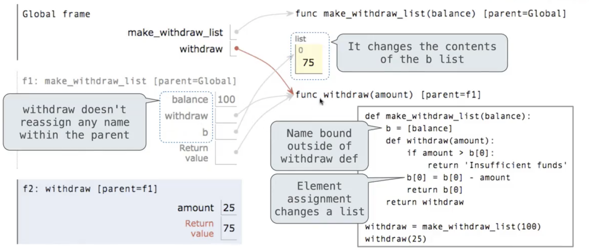
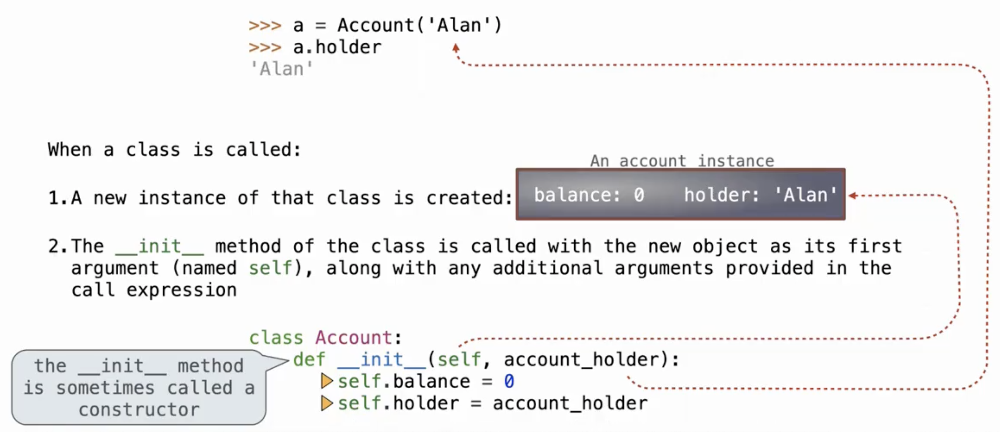
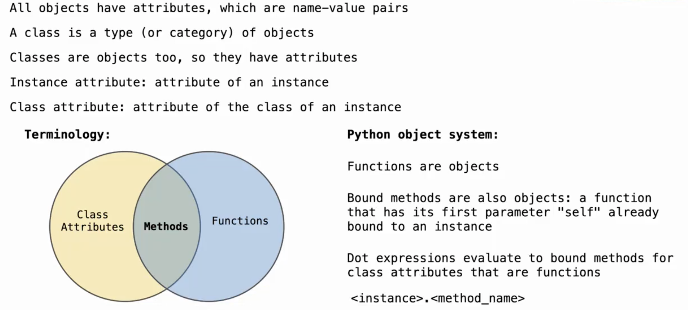
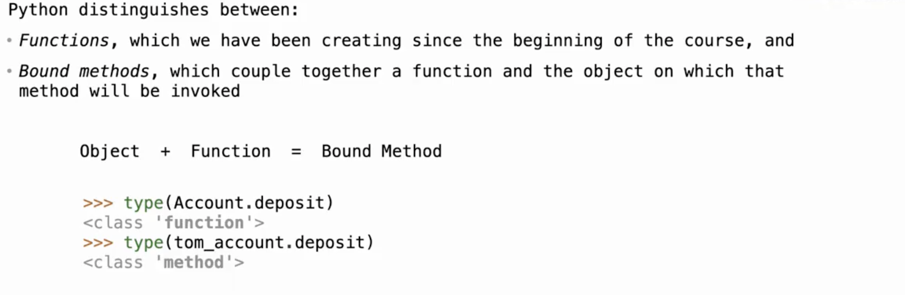
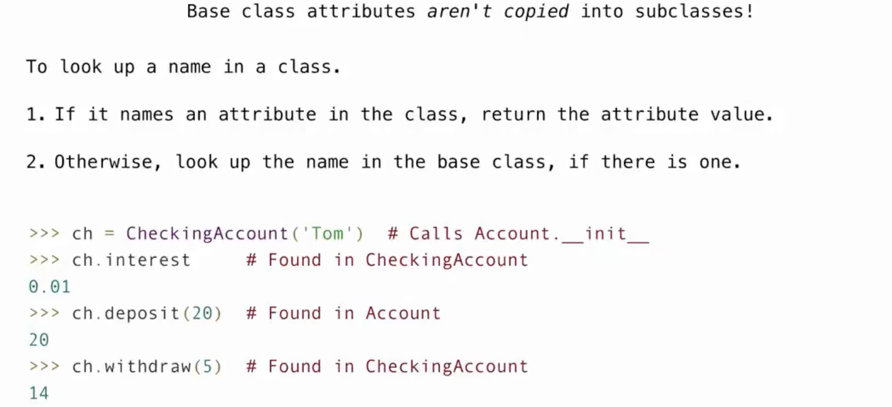
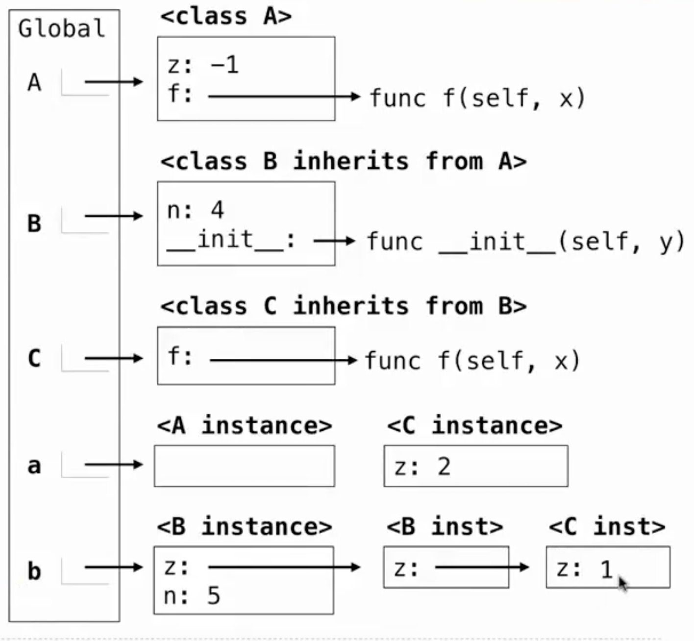

# Object-Oriented Programming

## Object

!!! info "对象"
    - 在Python中，**对象**是数据结构的一个实例，它包含数据（称为属性）和可以操作这些数据的代码（称为方法）。Python是一种面向对象的编程语言，这意味着它支持使用对象来模拟现实世界中的事物和概念。  
    > Objects represent information  
    > They consists of **data and behavior**, bundled together to create abstractions  
    > Objects can represent things, but also **properties, interactions, & processes**  

    - 在Python中，每个值都是一个**对象**
        - 所有对象都有属性  
        - 通过对象方法可以实现各种操作  
        - 函数只能做一件事，对象则是做相关的各种事情  

- A `class` defines how objects of a particular type behave   
- A `object` is an instance of a class; the class is its type  
- A `method` is a function called on an object using a *dot*

### Mutability

- 在Python中，**可变性（Mutability）**是指对象所持有的数据是否可以被修改。根据对象的类型，对象可以被分类为**可变（mutable）**或**不可变（immutable）**。
    - **不可变对象（Immutable）**：这类对象一旦创建，它们的内容就不能改变。Python中的一些不可变类型包括整数（int）、浮点数（float）、字符串（str）和元组（tuple）。这意味着如果你尝试改变这些类型的对象的值，Python实际上会**创建一个新的对象来代替**旧的对象。

    - **可变对象（Mutable）**：这类对象创建后，它们的内容可以被修改。Python中的一些可变类型包括列表（list）、字典（dict）和集合（set）。这意味着你可以**在不创建新对象的情况下修改这些对象的内容**  
- 所有指向**相同对象**的变量都会受**Mutation**影响   
- 只有**可变对象**才可以被修改  
- 函数在自身作用域内是**可以修改对象**的值的  

??? tip "不可变的对象也可以'变'"
    - 如果不可变对象中的元素是可变对象，那么我们仍然可以修改这个元素的值  
    ```python
    >>> t = ([1,2],3)
    >>> t[0] = 4
    Traceback (most recent call last):
        File "<stdin>", line 1, in <module>
    TypeError: 'tuple' object does not support item assignment
    >>> t[0][0] = 4
    >>> t
    ([4,2],3)
    ```

----

??? note "Identity Operator"
    - `is`：判断两个变量是否**evaluate to the same object**  
    - `==`：判断两个变量的值是否相同  
    - **Identical object always have equal values**

----

!!! warning "函数中**可变的默认参数**是高危的"
    ```python
    def f(s=[]):
        s.append(5)
        return len(s)
    >>> f()
    1
    >>> f()
    2
    >>> f()
    3
    ```
    - 正如上面这个函数，`s`作为一个默认参数却在函数中发生了**mutation**  
    - 这使得每次调用函数都会有不同的结果

    --------

    

## Class

- 在Python中，`class`是用于定义新类型的代码模板，它允许我们封装数据和功能，从而创建具有**特定属性（attributes）**和**方法（method）**的**对象（object）**。类提供了面向对象编程（OOP）的基础，这是一种编程范式，它鼓励将程序分解成通过消息传递进行交互的对象集合。

!!! note "Example-The Account Class"
    - `__init__` 方法是一个特殊的**方法**，被称为类的构造器，用于初始化新创建的对象。
    - `self` 参数代表类的**实例自身**，用于访问类的属性和方法。

    ```python
    class Account:
        def __init__(self, account_holder):
            self.balance = 0
            self.holder = account_holder

        def deposit(self, amount):
            self.balance += amount
            return self.balance
        def withdraw(self, amount):
            if amount > self.balance:
                return 'Insufficient funds'
            self.balance -= amount
            return self.balance
        
    ```

-----

!!! tip "What happens when a `class` is called"
    1. 一个类型的新的实例被创建（此时并没有任何属性）

    2. `__init__`方法被调用，然后这个新的对象作为方法中的第一个参数`self`，紧接着处理传入的其他参数

    
    
------

### Instance Attributes

- 我们可以通过点表达式来访问一个对象的属性: `a.balance`  
- 任何属性都可以被**赋以任何值**  
- 一个**新的属性**可以在**任何时间**被添加
```python
>>> a = Account('Alan')
>>> b = Account('Ada')
>>> b.balance
0
>>> b.balance = 12
>>> a.backup = b # 这里我们创建了一个新的属性
>>> a.back.balance
12
```

----

### Class Attributes

- `class attributes`就是`class`其中的各种 `assignment`以及`def` 语句  
- `class attributes`被所有同一个`class`的`instances`所共享

!!! note "访问`attributes`的方法"
    - 运用**dot expressions**
    - `getattr(object, name[, default]) -> value`：传入`object`和要访问的属性名称，返回这个对象属性的值
    - `hasattr(obj, name)`：返回对象的`name`属性是否存在

!!! note "Assignment to Attributes"
    - 如果赋值对象是`instance`，则赋值一个`instance attribute`
    - 如果复制对象是`class`，则赋值一个`class attribute`
    ```python
    class Account:
        interest = 0.02
        def __init__(self, account_holder):
            self.balance = 0
            self.holder = account_holder
        ...
    
    >>> tom_account = Account('Tom')
    >>> tom_account.interest = 0.08 
    # 这个表达式会被评估为一个`object`而非`class`
    # 因而我们其实是为这个实例添加了新的属性，而不是修改了原类型中的属性
    ```
!!! Abstract 
    
    

------

## Inheritance

- 在Python中，**继承（Inheritance）**是面向对象编程的一个核心概念，它允许我们定义一个类（称为**子类或派生类**）来继承另一个类（称为**父类或基类**）的**属性**。继承的主要目的是为了代码重用和实现多态。
```python
class <name>(<base class>):
    <suite>
```
- 子类继承父类的所有属性，同时也可以在其基础上**override**

??? note "Example-CheckingAccount"
    ```python
    class CheckingAccount(Account):
        withdraw_fee = 1
        interest = 0.01
        def withdraw(self, amount):
            return Account.withdraw(self,amount + self.withdraw_fee)

    ```

----

- `inheritance`实际上并不是把父类的代码copy到子类中  
- 如果我们尝试在一个`class`寻找一个`name`  
    - 会先在这个`class`寻找这个`name`的`attribute`  
    - 如果没有，则回去`base class`中寻找  
    

??? note "Example-A,B,C"
    ```python
    class A:
        z = -1
        def f(self,x):
            return B(x-1)
    
    class B(A):
        n = 4
        __init__(self,y):
            if y:
                return self.z = self.f(y)
            else:
                return self.z = self.C(y+1)
    
    Class C(B):
        def f(self, x):
            return x
    
    >>> a = A()
    >>> b = B(1)
    >>> b.n = 5
    >>> C(2).n
    _____
    >>> a.z == C.z
    _____
    >>> a.z == b.z
    _____
    >>> b.z
    _____
    >>> b.z.z
    _____
    >>> b.z.z.z
    _____
    ```
    
    - 分清**实例**与**类**  
    - 对于`C.z`，由于C是`class`，而在自身定义中并未找到z，于是去父类B中寻找，仍没有后去父类A中寻找；因而`C.z = -1`  
    - 对于`b.z`系列  
        - `b.z = B(0)` 是一个对象  
        - `b.z.z = B(0).z = C(1)` 也是一个对象  
        - `b.z.z.z = C(1).z = f(1) = 1` 此处的`f`应该调用**C中定义的**  

## String Representations

- 在Python中，**字符串表示（String Representation）**是指对象的文本表示形式，主要用于调试和日志记录。Python提供了两种内置的方式来定义一个对象的字符串表示：**__str__方法**和**__repr__方法**。

- `__str__`方法：  
    - 定义了对象的“非正式”或可打印的字符串表示，它的目的是可读性。  
    - 当你使用`print()`函数或`str()`函数时，Python会调用对象的`__str__`方法。所以`str()`返回的内容就是`print()`打印出的内容  
    - 如果一个类中没有定义`__str__`方法，Python会尝试调用`__repr__`方法作为备选。  

- `__repr__`方法：  
    - 定义了对象的“官方”字符串表示，其目的是明确性。  
    - `__repr__`的目标是尽可能地返回一个与对象创建自身相同的字符串，理想情况下，它的输出可以用`eval()`函数来重新创建这个对象。(`eval(repr(object)) == object`)  
    - 当你在交互式解释器中直接输入对象名或使用`repr()`函数时，Python会调用对象的`__repr__`方法。  

??? note "Example"
    ```python
    >>> from fractions import Fraction
    >>> half = Fraction(1, 2)
    >>> half
    Fraction(1, 2)
    >>> repr(half)
    'Fraction(1, 2)'
    >>> print(half)
    1/2
    >>> str(half)
    `1/2`
    >>> eval(repr(half))
    Fraction(1, 2)
    >>> eval(str(half))
    0.5

    >>> s = "Hello, World"
    >>> s
    'Hello, World'
    >>> print(repr(s))
    'Hello, World'
    >>> print(s)
    Hello, World
    >>> str(s)
    'Hello, World'
    >>> repr(s)
    "'Hello, World'"
    >>> repr(repr(s))
    '"\'Hello, World\'"'
    >>> eval(s)
    Traceback (most recent call last):
      File "<stdin>", line 1, in <module>
      File "<string>", line 1, in <module>
    NameError: name 'Hello' is not defined
    ```

--------

!!! tip "`str()`和`repr()`的实现"
    - 它们实际上是在调用类的内置方法`__str__`和`__repr__`
    - 我们只能找到`class`的`attribute`，而实例的`__repr__`被忽略了
    - 于是实现方式略有不同
    ```python
    def repr(x):
        return type(x).__repr__(x)
    ```

-------

### F-string

- 在Python中，**f-string（格式化字符串字面量）**是自Python 3.6版本引入的一种字符串格式化机制。f-string以f或F为前缀，后跟一个字符串。它允许你在字符串中直接嵌入**表达式**，这些表达式会在运行时**被求值并格式化**。
- `f'{expression}'`

## Polymorphic Functions

- 在Python中，**多态函数（Polymorphic Function）**是指可以接受**多种不同类型的参数**或在不同上下文中表现出不同行为的**函数**。在面向对象编程中，多态性是一个核心概念，它允许相同的函数或方法在不同的对象实例上被调用，而这些对象实例属于不同的类。

## Interface

