# Chapter 3 | ILP 

!!! info "Overview"

    1. ILP的含义

    2. 发现、利用ILP的方法

        - 硬件方法：scoreboard，tomasulo，multiissue

        - 软件方法：compiler，VLIW

## 基础流水线功能的拓展

- 我们现在为原来的基础流水线添加浮点数运算、mul、div的功能

- 那么就会涉及到一个问题，整数运算、浮点数运算、乘除法它们在EX阶段所用的时间是不同的，即**FU**操作时间不同

- 流水线中会有两处改变：

    1. 为了完成操作EX周期可根据需要**重复多次**——不同操作重复次数可能不同。 
    
    2. 可存在**多个**浮点功能单元。如果待发射指令会导致它所用功能单元结构冒险或 数据冒险则会stall 。

- 同时，我们引入两个概念：

    1. **Latency** **上一个指令产生结果** 与 **下一个指令使用结果**之间的时间间隔； $Latency = (FU~time -1) cc$

    2. **Initiation interval**：两条指令发射入同一个FU之间，必须至少间隔多少个时钟周期

        - 如果FU**完全流水化（Fully Pipelined）**，那么initiation interval = 1

        - 如果FU**非流水化（Non Pipelined）**，那么initiation interval = Latency + 1

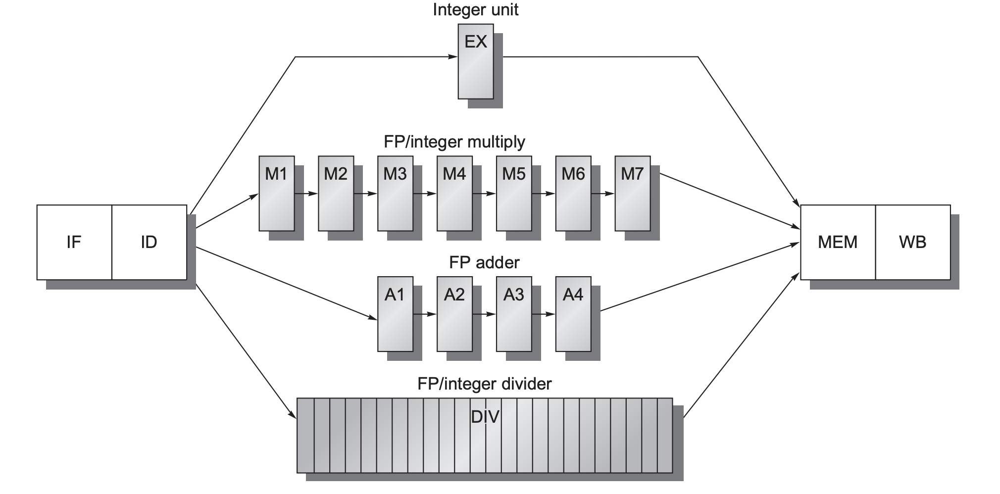

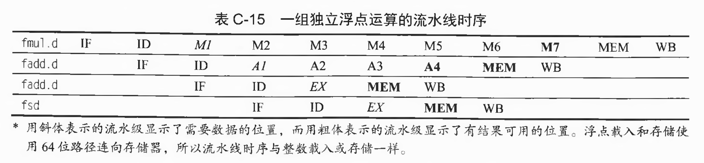

### 存在的问题

- 需要添加新的流水线寄存器

- 由于除法器是非流水化的，有可能发生结构冲突

- 由于指令执行时间不同

    - 可能发生同一个周期内多条指令同时写回寄存器的问题

    - 可能发生写寄存器顺序错乱问题：**WAW数据冲突**

- 由于某些操作执行时间较长，**RAW**冲突造成的停顿会更长

- 由于乱序完成，精确中断可能是一个问题

### 数据冲突的分类

> 这些冲突的命名是根据两条指令的正常关系来命名的，并不是说这个冲突本身是名字的这个情况

1. **RAW**：

    - *e.g.*：`add x1, x2, x3; add x4, x1, x5;`

    - true dependency，数据依赖

2. **WAR**：

    - *e.g.*：`A x1, x2, x3; add x2, x4, x5;`；如果第二条指令在第一条指令读寄存器之前完成，`x2`的值就错了！

    - anti dependency, 可以通过寄存器重命名解决，也叫naming dependency

3. **WAW**：

    - *e.g.*：`mul x1, x2, x3; add x1, x2, x3`；如果第二条指令在第一条指令写寄存器之前完成，由于乘法更慢，`x1`的最终值就错了！

    - output dependency，也可以通过寄存器重命名解决

---

### 解决方法

- **解决结构冲突**

    - 每个FU设置一个**busy**位，开始执行设置为1，结束执行设置为0

    - 需要注意：不同FU的流水化程度不同

- **解决同时写回冲突**

    - 设计移位寄存器。如果当前开始执行的指令要在N个周期后写回，则将**预约** 寄存器的第N位置位。每个时钟周期，预约寄存器整体左移。这样就可以判断当前 M 个周期后是否有指令需要写回

    ??? tip "移位寄存器"
        1. 移位寄存器 (Shift Register)：

        - 想象一个有多位的寄存器，比如8位：[bit0, bit1, bit2, bit3, bit4, bit5, bit6, bit7]。

        - 每一位代表一个未来的时钟周期。比如，bit0 代表下一个时钟周期，bit1 代表下下个时钟周期，以此类推，bitN 代表 N+1 个时钟周期之后。

        - 这个寄存器的值表示了未来各个时钟周期的写回端口是否已经被“预约”。1 表示已预约（忙），0 表示空闲。

        2. 预约过程 (Reservation)：

        - 当一条指令即将开始执行（或者在某个可以确定其完成时间的阶段），处理器会计算出它还需要多少个时钟周期 (N) 才能到达写回阶段。

        - 然后，处理器检查“预约寄存器”的第 N 位 (bitN)。（注意：这里的“第N位”可能指从0开始的索引N，即 bitN，代表N+1个周期后；也可能指N个周期后，对应 bit(N-1)。我们下面例子假设是 bit(N-1)，代表N个周期后，这更直观些）。

        - 如果 bit(N-1) 是 0：表示 N 个周期后的写回端口是空闲的。太好了！这条指令可以被“签发”（Issue）或允许继续执行，并且同时将预约寄存器的 bit(N-1) 设置为 1，表示这个时间点已经被预约了。

        - 如果 bit(N-1) 是 1：表示 N 个周期后的写回端口已经被其他更早开始执行的指令预约了。这条新指令就不能在此时被签发或继续执行，它必须等待（**stall**），直到未来的某个时刻，它计算出的写回时间点所对应的预约位是 0。
        
        3. 时间的流逝 (Shift Left)：

        - 每个时钟周期结束时，预约寄存器整体向左移动一位。

        - 最左边的那位（比如 bit7）被移出并丢弃，因为它代表的那个“未来”时间点已经变成了“现在”或者“过去”。

        在最右边（bit0）会移入一个 0，代表更遥远的未来一个新的空闲时间点。
        这个左移操作模拟了时间的流逝。原本预约在 k 个周期后的写回，在下一个时钟周期就变成了预约在 k-1 个周期后，其预约标志位也相应地向左移动了。

- **解决WAW冲突**

    - 记录每个FU将会写回到什么位置，同时利用**预约寄存器**判断FU将在多久后写回，这样只需要**stall**，直至当前指令在其之后写回

- **解决RAW冲突**

    - 记录每个FU将会写回到什么位置，同时利用busy来判断FU是否仍未完成。如果未完成，等待直至结果写回

## ILP的概念

**Instruction Level Parallelism**，指令级并行

- 试图寻找 **指令之间能够overlap执行** 的机会

- 目标是尽可能减小CPI；CPI = 理想CPI + 各种冲突导致的CPI增加

- 在一个基本块（**Basic Block, BB**，代码段没有分支跳转）中，指令之间的ILP机会比较少

    - 块内的指令，尤其是算数指令一般都有相互的依赖关系

---

- 发现、利用ILP，两大类方法：

    1. 软件的、静态的方法：compiler等

    2. 硬件的、动态的方法：动态调度、multiissue等

- 需要保证程序执行的正确性：

    - 维持数据流正确

    - 维持异常行为正确

## Scoreboard

- 假设有这样一段程序：

```asm
DIVD F0, F2, F4
ADDD F10, F0, F8
MULD F12, F8, F14
```

- 由于除法器是非流水化的，DIVD指令需要很多个时钟周期

- 由于数据依赖，第二条指令需要等待第一条指令的完成才能issue

- 第三条指令与前面两条没有任何数据依赖

    - 在之前的设计中，由于需要顺序发射，第三条指令必须推迟到后面执行

    - **能不能让第三条指令提前执行？**

---

### 思想

- 允许原本被 stall 阻塞住的指令提前执行

- 而仍然**维持数据流的正确性**

- 出现了**乱序执行、乱序完成**，但是**按序发射**

### 硬件设计

流水线五个阶段被重新划分：

- IF：取指

- IS：Issue。这一阶段负责解码指令，监视结构冲突

- RO：Read Operands。监视数据冲突，读取操作数

- EX：送到不同的FU执行。因为我们可以把**MEM看做是一个FU**。

- WB：写回结果

---

**设计三张表**：

1. 指令状态表 **Instruction Status Table**

    - 记录指令的状态，在哪个阶段

2. 功能单元状态表 **Functional Unit Status Table**

    - `busy`：FU是否空闲；`op`：FU正在执行什么操作

    - `Fi`, `Fj`, `Fk`：FU的操作数对应着哪个寄存器

    - `Qj`, `Qk`：FU的操作数如果没准备好，应该从哪个FU读取

    - `Rj`, `Rk`：操作数是否准备好

3. 寄存器状态表 **Register Status Table**

    - 如果某个寄存器的值**正在被某个FU的操作生成**，填入这个操作的编号

    - 生成好了之后，填入实际值

---

!!! tip "Demo"

    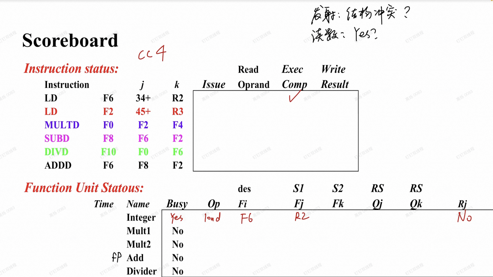

    （理论课上WB阶段，可以清空原来的FUS，然后发射新指令）

    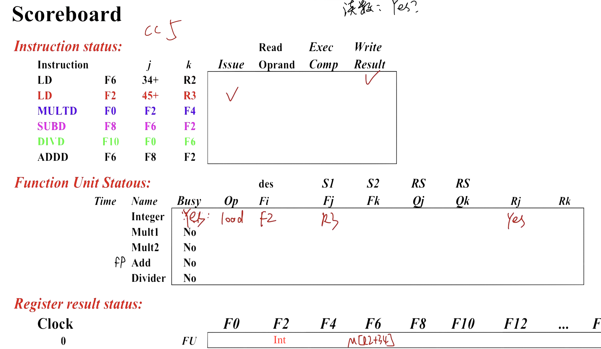


### 总结

- **Issue**：以下情况，允许发射

    - FU空闲（避免了结构冲突）

    - 其他正在执行的指令，**没有**任何一条要写回与本指令**相同的Rd**（避免了WAW冲突）

- **Read Operand**：

    - 当且仅当**两个源寄存器都准备好了**

- **Execution**：

    - 一条指令执行完成后，记得更新记分牌

- **Write Back**：

    - 要写回的时候看这个目的寄存器是否在某个FU的ready list中为yes

    - 如果是yes，说明有指令正在读寄存器，等读完再写回（**避免了WAR冲突**）

### 存在的问题

- 发射窗口太小

    - 目前（没有分支预测），我们的发射窗口只能cover一个basic block

- FU的数量、种类和延迟是瓶颈

- WAR和WAW冲突需要解决，大量花费时间

    - 可以通过显式的寄存器重命名来解决

    - Tomasulo算法也是一种解决方法

- 不能精确中断

---

## Tomasulo

### 硬件设计

- 每个FU有一个保留站(**reservation station**)

    - `busy`：标识FU是否空闲，`op`：表示进行什么操作

    - `Vj`, `Vk`：表示两个要用的寄存器的**值**（注意是值）

    - `Qj`, `Qk`：表示寄存器没有准备好，要从哪个**FU**读取

    - `time`：记录这个操作的剩余周期数

- 内存也有专门的保留站，叫做**Load/Store Buffer**

    - `busy` 同理

    - `address`：读写的地址

- 有一个**Register Status Table(RST)**和scoreboard相同

- 有一个**Common Data Bus(CDB)**负责将WB的结果**广播**到所有的保留站和寄存器中

---

流水线划分为**四个阶段**

- IF：取指令

- **IS**：发射指令，监视结构冲突（保留站busy），读操作数（从RST）， 重命名寄存器

- EX：FU执行

- **WB**：写回结果（写回到CDB，广播到保留站和寄存器）

!!! tip "Demo"

    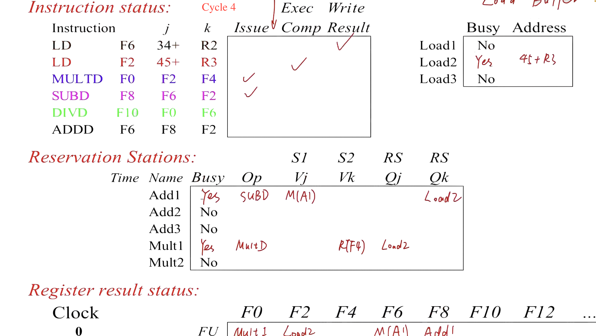

    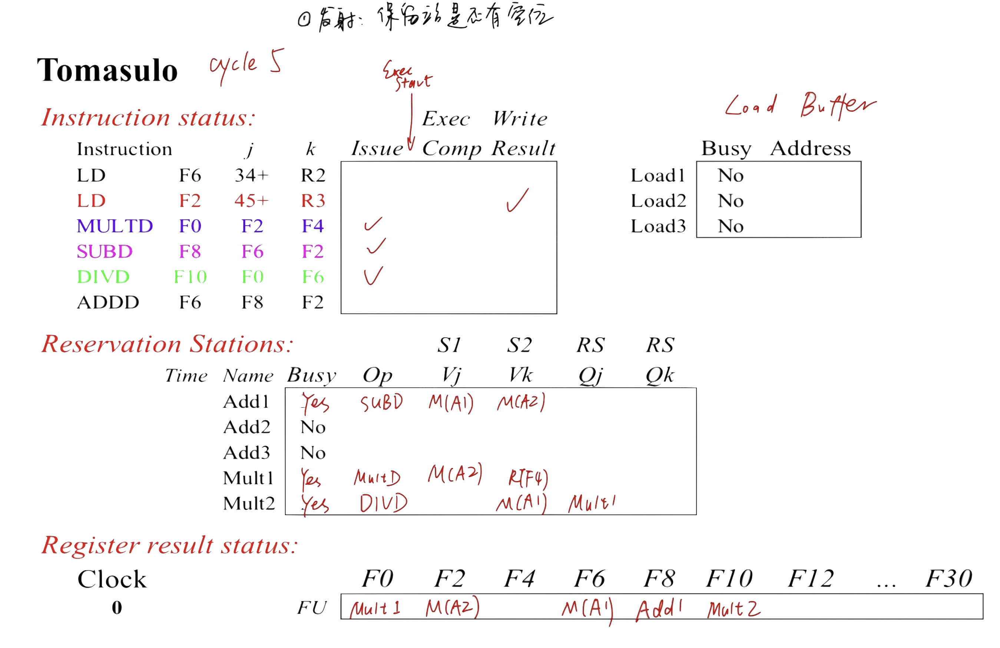

    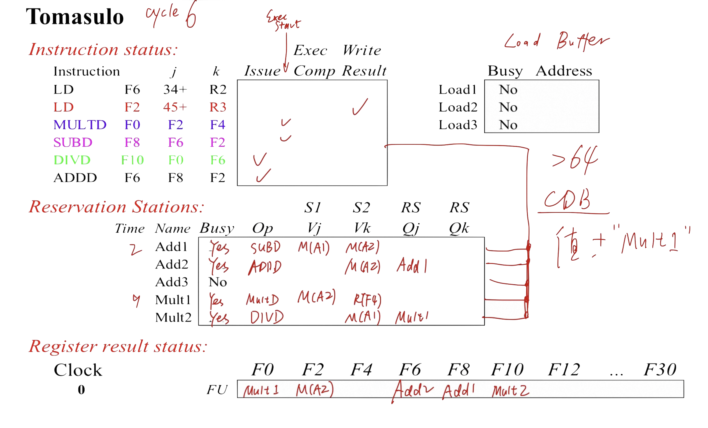

### 总结

优点：

- **分布式冲突检测**：不同的FU有自己的保留站，提升了并行度

- 解决了**WAR**和**WAW**冲突

    - **隐式(implicit)**寄存器重命名；

- 能够在循环中多次迭代中重叠

缺点：

- 需要解决同一时间发射多条指令，同一时间多个值写入CDB的问题

- 无法实现精确中断

## Scoreboard 寄存器重命名优化

- 我们通过寄存器重命名，可以让scoreboard避免WAW和WAR冲突

例如：

```asm title="将R3重命名为R10解决WAW冲突"
ADD R3, R1, R2  --> ADD R3, R1, R2
ADD R5, R3, R4  --> ADD R5, R3, R4
ADD R3, R6, R6  --> ADD R10, R6, R7
ADD R9, R3, R8  --> ADD R9, R10, R8
```

---

```asm title="将R3重命名为R10解决WAR冲突"
ADD R1, R3, R2  --> ADD R1, R3, R2
ADD R3, R5, R4  --> ADD R10, R5, R4

```

- 出现WAW和WAR冲突的原因是 **ISA没有提供足够的逻辑寄存器**

- 不过我们可以设置更多的**物理寄存器**，对每一条需要写寄存器的指令，都为其分配一个物理寄存器

    - 完成之后，物理寄存器的值会被写回到逻辑寄存器

    - 需要知道是否有free的物理寄存器，维护一个**free list**

- 需要维护一张物理寄存器和逻辑寄存器之间的**映射表**

---

- Scoreboard算法的寄存器重命名是一种**显式(explicit)**的寄存器重命名，也就是**真正地分配了新的寄存器**

- 优点：
    
    - 值可以直接从寄存器取，**不需要保留站来进行bypass**

    - 提供了一种**实现精确中断**的方法

---

## 3.2 动态（硬件）分支预测

- **动态分支预测**：都是基于硬件实现的，通过历史记录来进行预测

### 1-bit predictor

- 就是用一个位来表示分支是否跳转，上次跳这次也跳，上次不跳这次也不跳

- 可以用一张表来记录是否跳转，**分支历史表(Branch History Table, BHT)**

- 优点：硬件简单； 缺点：准确率低

### 2-bit predictor

- 同计组，是个状态机，有4个状态

- `00`: strongly not taken -> `01`: weakly not taken -> `10`: weakly taken -> `11`: strongly taken

---

!!! tip "Example"
    What is the prediction accuracy of a 2-bit predictor working on a loop which takes branches of 3n+1 and 3n+2, and not taken branches of 3n

    - 假设我们从`00`开始预测

    $3n\rightarrow 3n+1\rightarrow3n+2\rightarrow3n\rightarrow3n+1\rightarrow3n+2\rightarrow3n\rightarrow3n+1\rightarrow3n+2\rightarrow3n\rightarrow3n+1\rightarrow3n+2$

    $00->00->01->10->01->10->11->10->11->11->10->11$

    $\checkmark->\times->\times->\times->\times->\checkmark->\times->\checkmark->\checkmark->\times->\checkmark->\checkmark$

    - 我们发现最后进入了一个循环，这个稳定状态下的预测率就是答案 2/3

### Correlating predictor/相关预测器

- 许多分支指令其实**依赖于别的分支指令的结果**，这个时候就不能仅仅按照自己的跳转历史来进行预测了

- **相关预测器**的设计有两个bits：

    - **1st bit**：上一次分支的结果是NT，看1st bit

    - **2nd bit**：上一次分支的结果是T，看2nd bit

    !!! warning "上一次的分支可能不是上一条指令，可以是同一条指令"

!!! tip "Example"

    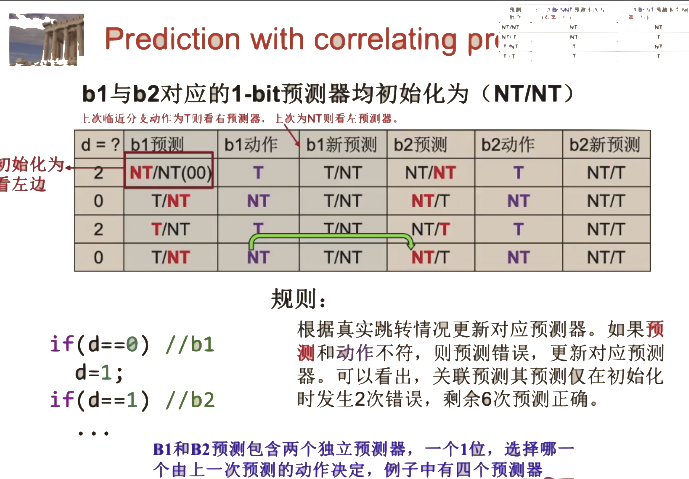

    - 我们每次预测的时候，都是根据**上一次分支**的T/NT来决定看第一位（NT）还是第二位（T）

!!! tip "(m,n) predictor"

    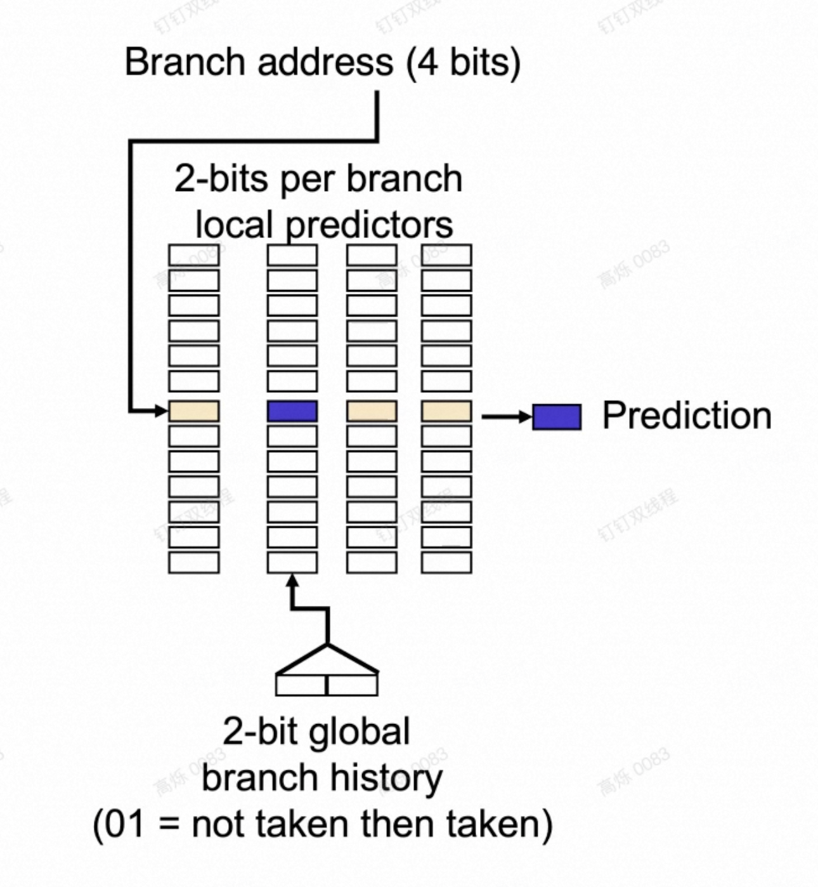

    - $m$代表全局下前m条分支指令

    - $n$代表local下是n-bit predictor

    - total size = $2^m \times n$ bit

    - 每一个小块都是一个local predictor，然后每一行有几个，是global($2^m$个)

    > Consider a Correlating Branches Prediction Buffer using (2,2) predictor with 4K entries. How many bits are needed to implement the predictor?

    - ans: $2^2 \times 2 \times 4K = 32K$ bits

### Tournament predictor

记A4纸就完事了

### Branch Target Buffer(BTB)

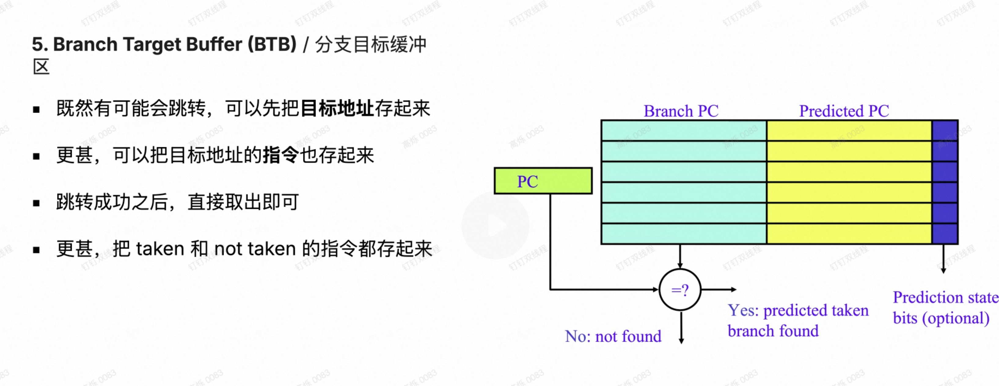

### others

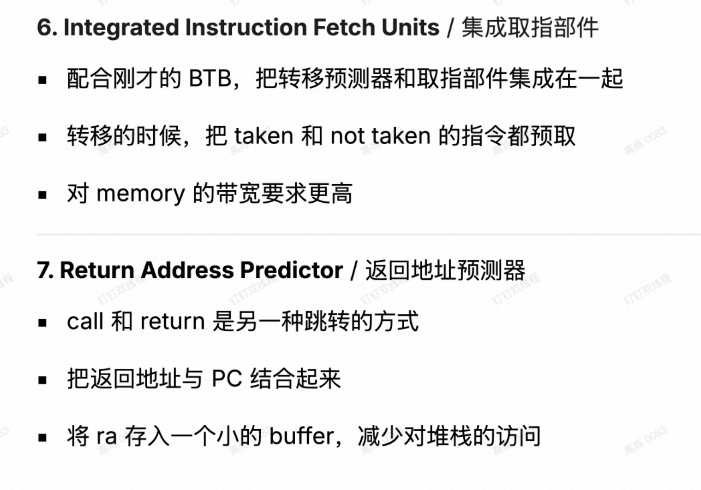

## 3.3 speculation

- Tomasulo能够实现一些跨越基本块的乱序执行

- 但是前提是在issue下一个基本块之前，分支结果已经确定

- 如果分支结果没有确定，就需要进行speculation

    - 假装分支结果已经确定，按照predict的结果执行

    - 如果预测失误了就需要**rollback**

---

### Instruction Commit

- 联想数据库的 **事务提交**

- 为了支持rollback，把指令拆分成 **指令执行** + **指令提交**

- 按照预测的方向执行程序，但是只commit能够确定正确的指令

- 所谓的 commit 就是**允许将结果写回寄存器和内存**

- 所以需要一个**提交缓冲区**，用来存储已经执行的指令

    - 在Tomasulo中，这个东西叫做 **ReOrder Buffer(ROB)**

### ROB in Tomasulo

- ROB在TOmasulo中扮演保留站的角色，但不仅仅如此

1. 作为循环FIFO队列来实现顺序提交

2. 在 执行 和 提交 之间缓存结果

3. 为普通指令和投机指令提供**额外的寄存器**作为操作数

4. 也可以作为存储缓冲区，**不再需要**原来的store buffer了

### Speculation in Tomasulo

指令执行分为以下阶段：

1. **Issue**

    - **保留站**和**ROB**都free的时候，发射指令；预填相关信息

2. **Execute**

    - 执行指令；检查**RAW**

3. **Write Result**

    - 将结果写入CDB和ROB

4. **Commit**

    - 对ROB的头部指令，如果是**普通指令**

        - 将结果**写回**寄存器和内存

        - 将这条指令**从ROB删除**

    - 如果是**分支指令**

        - 正确，则当做普通指令commit

        - 错误，则**清空ROB中所有指令**（也叫**flush**）

---

- 带预测执行ROB的tomasulo是

    - **顺序发射**

    - **乱序执行，乱序完成**

    - **顺序提交**

- 进而实现了**精确中断**

!!! warning "注意：内存也会发生RAW冲突"

    ```asm
    ST 0(R2), R5
    LD R6, 0(R3)
    ```

    - 在编译的时候，两个地址可能不知道是不是一样的，所以在load的时候，要先在**ROB里对比一下store相关的地址**

---

## Scoreboard/Tomasulo/Speculation总结

!!! abstract

    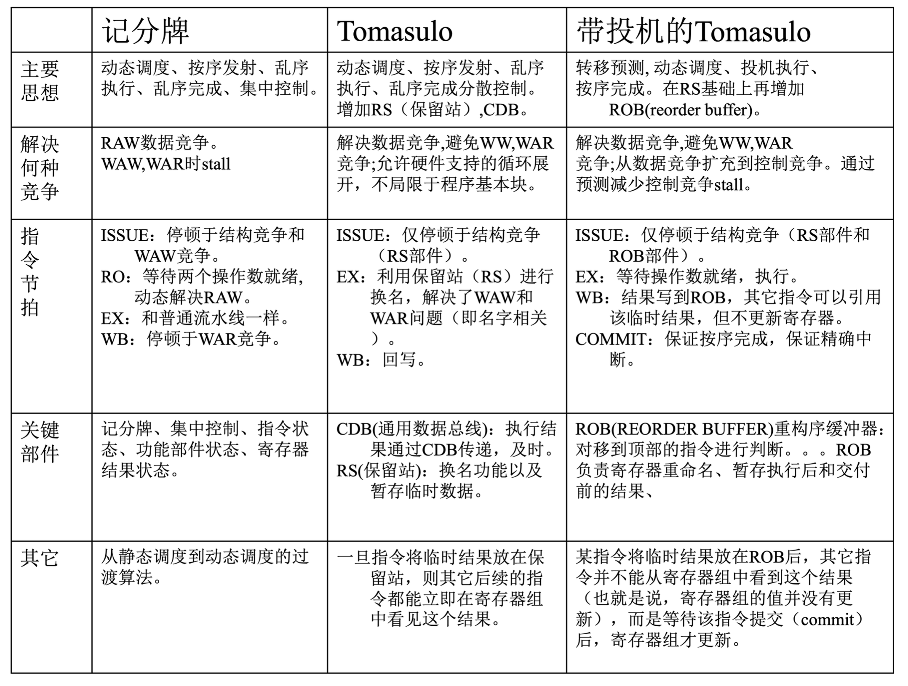

## 多发射

- 多发射的目的：允许多条指令在同一周期内发射，使得 **ideal CPI < 1**

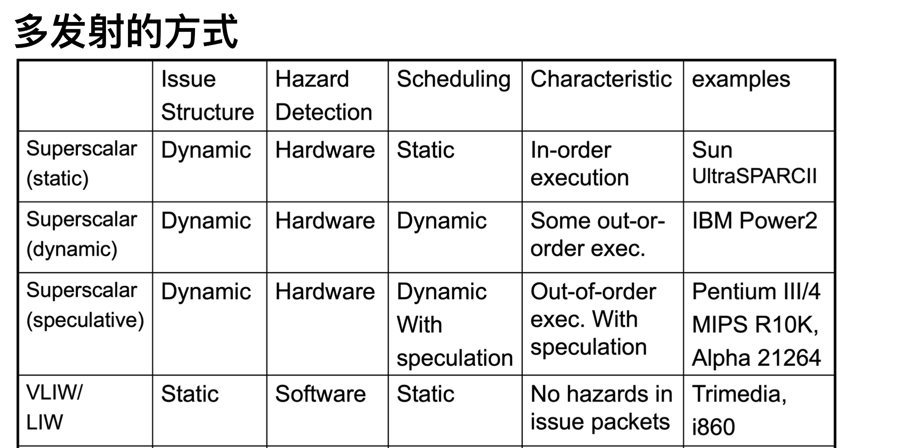

### Superscalar

- 处理器在同一周期内同时发射n条指令，n一般是1到8

- **最好能让所有的FU都能同时工作**，最大化利用率

---

- **静态调度的Superscalar**

    - 编译器技术优化

    - 顺序执行

- **动态调度的Superscalar**

    - 基于Tomasulo算法

    - 乱序执行

---

### 静态调度的Superscalar

- 处理器在发射指令时已经知道了指令之间的依赖关系（硬件实现）

- 将指令打包成 issue packet

- 将issue过程分割并流水化

    - 先决定packet内的指令

    - 再看packet之间的冲突

!!! warning "注意"

    1. 在一个周期内需要完成issue check，**增大了clock cycle time**

    2. 更高的发射率也会导致**更高的分支预测失误代价**

### 动态调度的Superscalar

-  划分为4个阶段：

    1. **Issue At**：**分支单独发射**

    2. **Executes**：就是进行ALU的计算或者是地址的计算，如果只有一个integer unit，这两件事是会冲突的；如果分离开ALU和地址计算，则不会冲突，但也认为只有一个ALU和一个地址计算单元

    3. **Memory Access**：Load/Store访存

    4. **Write CDB**：写回

### 带Speculation的Superscalar

- 分支指令单独发射

- 可以**一起提交**，但是要**按序提交**

### VLIW

- **软件方法**

- **Very Long Instruction Word**

- 把几条指令打包成一个长指令

    - 确保一个长指令里面的指令之间是独立的

    - 进而可以并行执行

!!! warning "问题"

    1. 技术问题

        - code size变大

        - 会有很多限制的FU（因为找不到足够多的独立指令）

        - 某个FU的延迟会影响整个指令的延迟

    2. 兼容性问题

        - 不同的硬件实现，不同的指令集

    3. 发掘不到足够多的ILP

## 软件方法的ILP

!!! abstract

    - 基本编译器优化技术

        - 循环展开

    - 静态的分支预测

    - 静态的多发射：VLIW

### 代码重排与循环展开

**需要注意**：

- 重排要保证数据依赖关系

    - 以及相应的逻辑正确性

    - 对于**寄存器的依赖检查**比较容易做

    - 对于**内存的依赖检查比较难**

- 对于课件上的例子，做重排的时候实际需要做出 `0(R1) != -8(R1) != -16(R1)`这样的假设

- 此外，一般**不会一次性全部展开**

    1. 先执行$n % k $次循环（**去掉余数**）

    2. 然后就进行展开后的 $n/k$次迭代

    3. 对于较大的n，大部分时间花在step2上

!!! tip "Practice"

    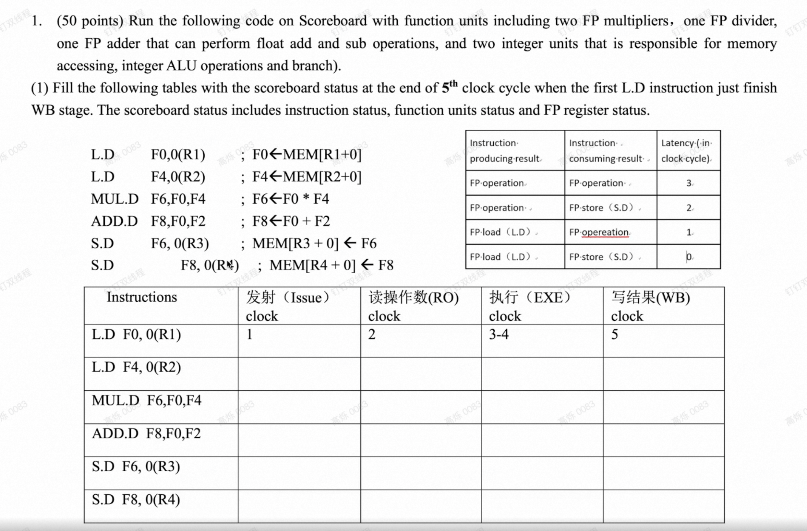

    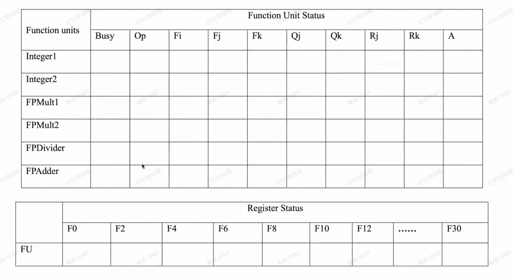

    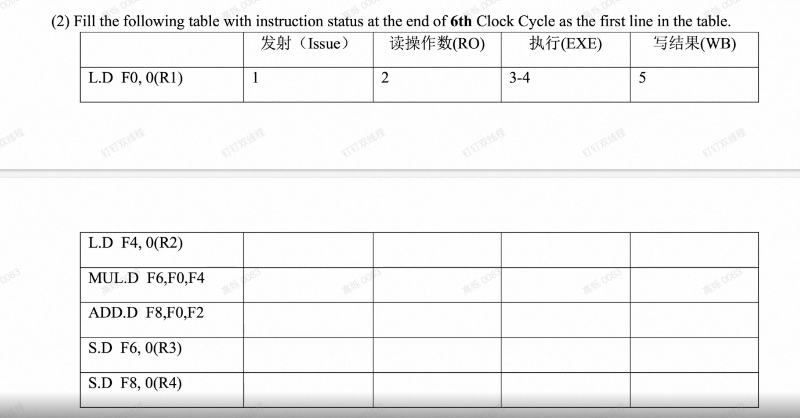

    ??? note "answer"
    
        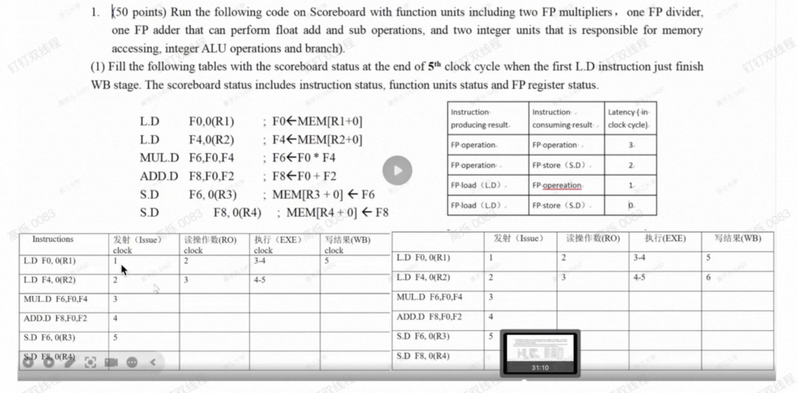

        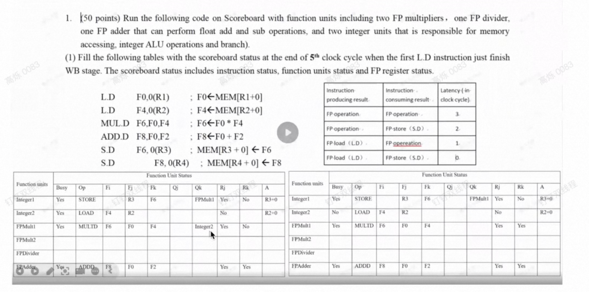

        

        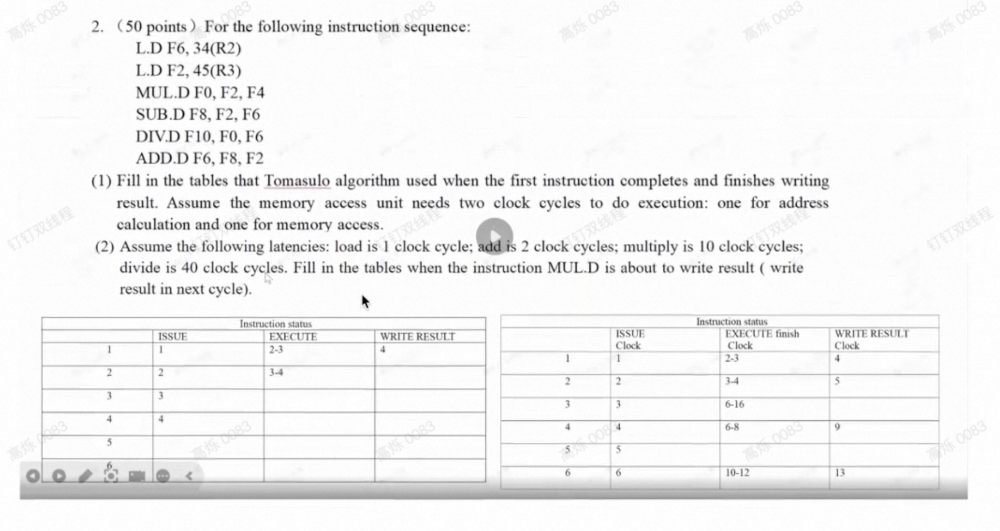


### 静态（软件）分支预测

- 预测跳转或者不跳转

- 还可以根据条件跳转的方向来预测

    - 例如对于 **loop** 类型的，一般是**向后预测跳转**

    - 对于 **if** 类型的，一般是**向前预测不跳转**

- 根据前几次运行结果的profile来预测

