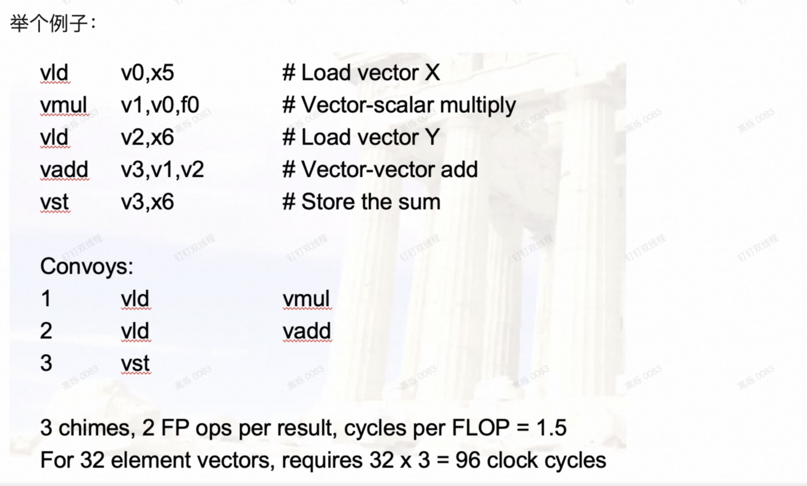
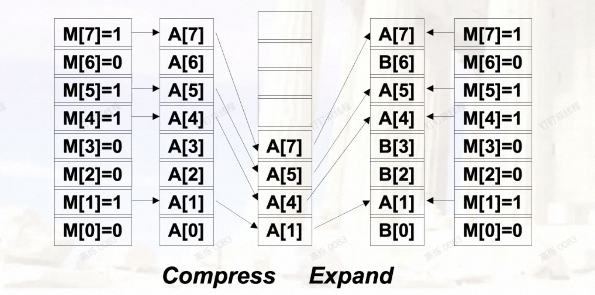
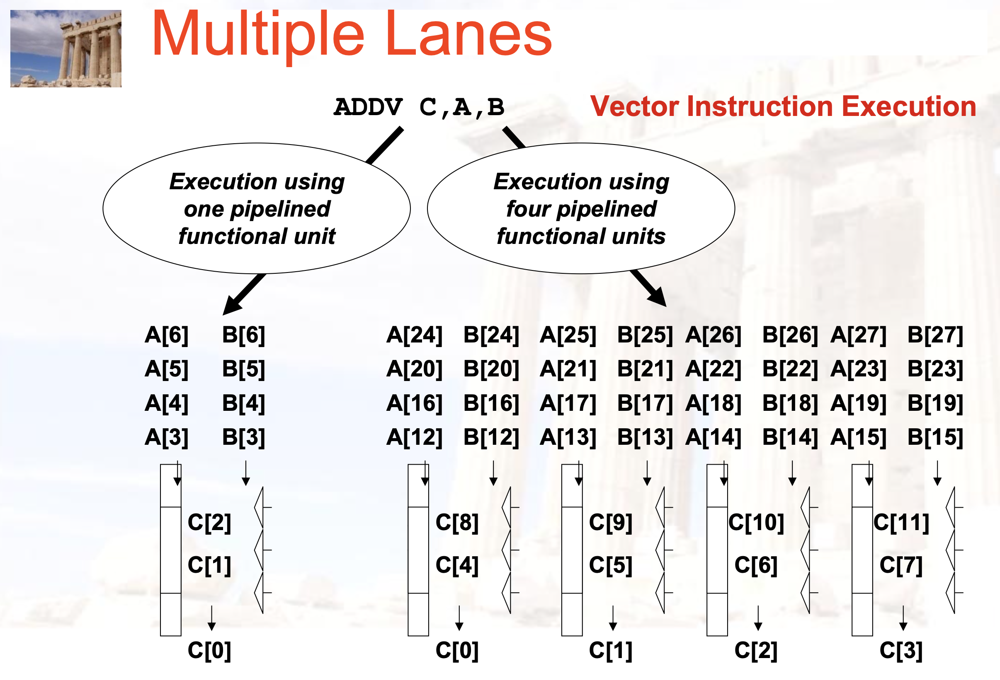
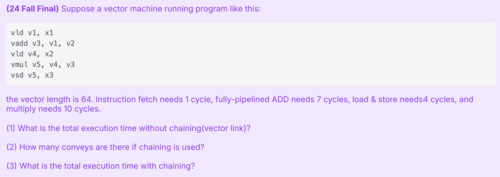

# Data-level Parallelism & Vector,SIMD, and GPU

- 本章主要围绕数据级并行 (Data-Level Parallelism, DLP) 展开，这是一种通过对多个数据元素同时执行相同操作来提高计算速度的方法。

## DLP

- DLP 是 数据级并行 (Data-Level Parallelism) 的缩写 。它是一种并行计算的形式，即在不同的数据片段上同时执行相同的任务 。可以将其想象成多名工人同时在装配线上对不同的物品执行完全相同的动作。

- 实现 DLP 的主要动机是**提高性能**和**效率**，尤其是在涉及处理大量数据的任务中。

- 本章讨论了实现数据级并行的几种架构方法：**Vector, SIMD, GPU**

## 向量处理器

- **SIMD的一种实现**：单独的一条指令能够对一串类似数组的数据（向量）进行操作

    - 节省了**instruction fetch** 和 **decode** 的时间

- 每个计算结果不依赖于之前的结果

    - 编译器来保证没有数据依赖

    - 硬件无需检查数据以来，能够实现较高的clock rate

- 为访存特殊设计

    - 高度交错的存储器

    - 无需 data cache 

- 减少流水线中的branch问题

### 两种类型

1. **memory-memory**

    - 直接操作内存中数据

    - CDC Star-100, TI ASC

    - 要求比较高的内存带宽

    - 检查memory的依赖相对复杂

2. **vector register**

    - 先将数据加载到寄存器中，再进行操作

    - Cray-1(1976)是第一个这样的机器

    - 后面的讨论中，默认是vector register

!!! tip "Example"
    ```c
    for (i = 0; i < N; i++){
        C[i] = A[i] + B[i];
        D[i] = A[i] - B[i];
    }
    ```

    ```asm title="Memory-memory"
    ADDV C, A, B
    SUBV D, A, B
    ```

    ```asm title="vector register"
    LV V1, A
    LV V2, B
    ADDV V3, V1, V2
    SV V3, C
    SUBV V4, V1, V2
    SV V4, D
    ```

### 结构

- Vector Register

    - 一个vector 一般是定长的 bank 存放

- Vector Functional Unit

    - 完全流水化，每个周期都可以开始新的操作

- Vector Load-Store Unit

    - 也是完全流水化的

- Scalar Register

    - 用于存放scalar数据

### 缺点

- **如果数据并行性不高，比较不高效**

- 内存带宽可能是瓶颈

### 执行时间

取决于：**向量长度**，**结构冲突与数据冲突**

- **其执行时间可以认为是向量的长度**

### 寻址方式

1. Unit Stride

    - 每次访问一个元素

    - **最快**

2. Non-unit(constan) Stride

    - 每次访问一个常数倍的元素

3. Indexed(gather-scatter)

    - 对于稀疏矩阵比较有用

### 向量长度

- 每个机器有自己的**最大向量长度** MVL

    - 一条指令最多能处理 MVL 个元素

- 向量长度VL需要**小于等于**MVL

!!! tip "如果VL > MVL 怎么办？-- **Strip Mining**"

    - 生成多个MVL长度向量的循环

    - 通常，第一个循环处理 (N mod MVL) 个元素（**余数**部分），其余**循环处理 MVL** 个元素 

    - 例如 N > MVL, N < 2*MVL

        - 先处理 N mod MVL 个元素

        - 然后处理 MVL 个元素

### 提升性能

1. **Vector Chaining（最重要，最容易考大题）**

    - 向量版本的 bypassing/forwaring

    - 在这里，RAW冲突反而是有利的

    - 对于有前后依赖的指令来说

        - 没有链接技术，需要等到前一条指令最后一个分量完成才能开始下一条指令，**浪费了向量长度的时间**

        - 有链接技术，前一条指令的**第一个分量完成**后就可以开始下一条指令的**第一个分量**

    - 几个概念

        - Convey: 一组可以放在一块执行的指令

        - Chimes: 通过链接技术产生的执行序列

        - Chaining: 链接技术

!!! tip "Example"
    

2. **Conditional Execution**

    - 用于处理向量代码中的 `if` 语句 。

    - 通过引入向量标志寄存器 (vector flag registers)，其元素为单个比特 。

    - 将标志寄存器用作掩码 (mask) 来控制向量操作，**只有对应标志位为真的元素才执行操作或写回结果**

    - 例如：掩码为1010，只有第0和第2个元素会被执行

    - 这样在执行的时候先**扫描一遍掩码，只执行需要的元素**

    - 传输数据也可以只传输需要的元素，来**节省带宽**

    !!! tip "Compress/Expand"

        

3. **Sparse Matrix**

    - 对于稀疏矩阵，访问或存入可以使用 Gather/Scatter 操作

    - 只把需要的元素的索引传输到寄存器

    - 存入的时候，只存入需要的元素

4. **Multi-Lane Implementation**

    - 将向量寄存器的元素和功能单元在多个“通道 (lanes)”中交错分布

    - 每个时钟周期可以执行多个元素的操作

    - 例如，如果一个向量寄存器有32个元素，机器有8个通道，那么可以同时对8个元素进行操作，完成整个向量需要4个“批次”

    

## GPU

- 一种外部的执行设备

    - CPU负责控制，GPU负责计算

- 需要为GPU开发一个类似C语言的编程语言

    - Single Instruction Multiple Threads

- **GPU实际上是对线程进行操作，而不是应用或者操作系统**

### NVIDIA GPU

- 与向量机的不同：

    - 没有标量处理器

    - 通过多线程来减小内存延迟

    - 有非常多的FU；相比之下，向量机的FU相对较少

## Loop-Level Parallelism

- 基于循环的并行性

- **主要看循环的迭代之间是否有数据依赖（Loop-carried dependence）**，有循环依赖的不适合在向量机上执行

```c
// 没有循环依赖
for(i = 999; i >= 0; i--)
    x[i] = x[i] + s;

// 有循环间依赖
for(i = 0; i < 100; i++){
    A[i+1] = A[i] + C[i];
    B[i+1] = A[i+1] + B[i];
}
```

- 循环间以来可以通过改写来解决：

```c
// 有循环间依赖
for(i = 0; i < 100; i++){
    A[i] = A[i] + B[i];
    B[i+1] = C[i] + D[i];
}

// 无循环间依赖
A[0] = A[0] + B[0];
for(i = 0; i < 99; i++){
    B[i+1] = C[i] + D[i];
    A[i+1] = A[i+1] + B[i+1];
}
B[100] = C[99] + D[99];
```

## 练习



- (1): 每条指令时间等于 **IF + 执行时间 + 向量长度**，依次是1+4+64, 1+7+64, 1+4+64, 1+10+64, 1+4+64