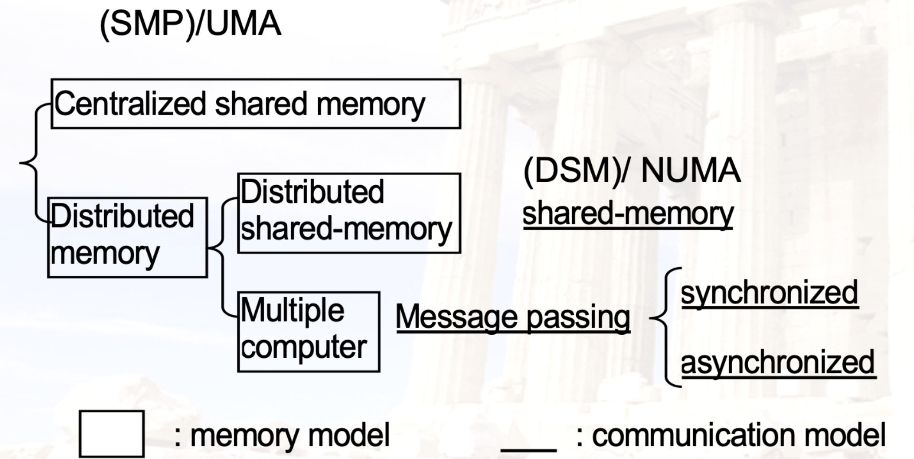
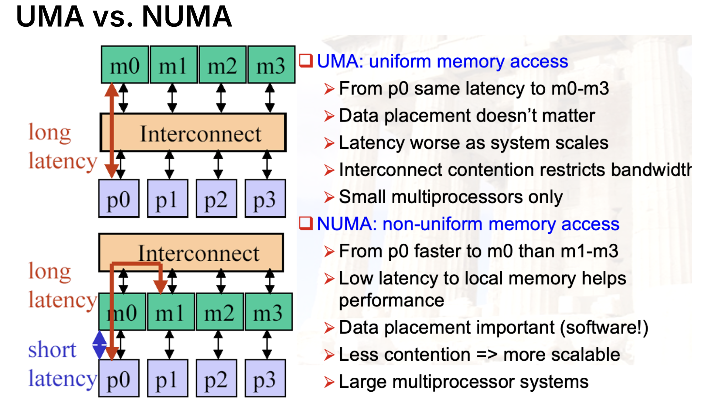
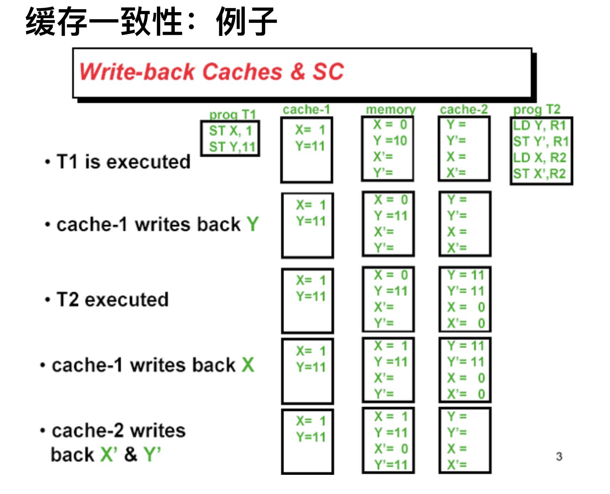

# Ch5

## 多处理器

- 为什么使用多处理器？

    - 提升性能

    - 单处理器性能瓶颈

- 多处理器属于MIMD，内部可以继续划分

### 分类

- UMA适合**小型**的多处理器；NUMA适合**大型**的多处理器

### 编程模型

- Multiprogramming: 无交流

- Shared Address Space: 通过内存共享

- Message Passing: 通过消息传递

- Data Parallel: 在不同数据上同时处理，并全局实时交换信息

### 问题

- 有限的程序并行性

- 处理器之间的通信延迟

    - 硬件解决方法：缓存共享数据；但是带来了问题：**缓存一致性**

    - 软件解决方法：同步

## 缓存一致性

- 上面的例子中，缓存一致性无法保障，导致X'的值读写出错

- 在Shared Memory情况中，对于同一块内存，可能出现不同的处理器进行读写操作。如果每个处理器都有自己的一个缓存，就会发生一个问题：当一个处理器**修改了内存中的数据**，其他处理器的**缓存中仍保留着旧的数据**

- 因此需要保证对同一个地方的**写保持序列化**

- 有两种策略：**监听**策略（Snooping），**目录**策略（directory-based）

### Snooping协议

- 处理器之间可以通信

- 如果P1写入X，需要通知其他的处理器

- 其他处理器监听通知，并作出相应操作

    - 如果自己的cache也含有X的副本，根据策略进行处理

        - Write Invalidate(结合write-through): 将X的副本置为无效

        - Write Broadcast(结合write-back): 将X的副本置为最新（由P1写入）

#### 状态机

每块缓存接受**两种信号**：

- Processor（来自自己所在的处理器）

    - CPU Read, CPU Write

- Bus（来自其他处理器）

    - Bus Read, Bus Write

---

!!! tip "Simple write-invalidate protocal例子"

    - 每个cache块有三个状态：

        - Invalid, Shared, Exclusive

    - **抄书上以及习题的监听图**！

### 目录协议

- 记录内存中每一块的状态，这个状态叫做directory

- directory中的内容

    - 每一块的状态：shared/uncached/exclusive

    - 哪些处理器有这个块的副本：用bit vector来表示

    - dirty/clean

- 可以在distributed memory中实现，也可以在被组织成banks的centralized memory中实现

#### 原理

- 对一个内存的操作，设计三个处理器的概念：

    - Local node: 发起请求的处理器

    - Home node: 对应内存地址所在的处理器

    - Remote node: 拥有这个副本的处理器