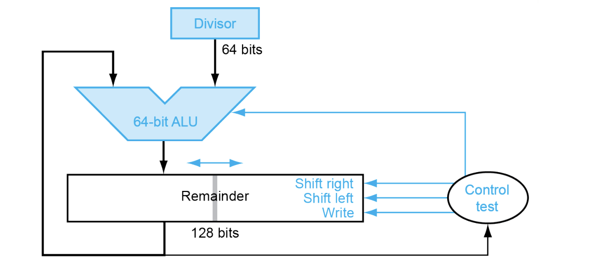
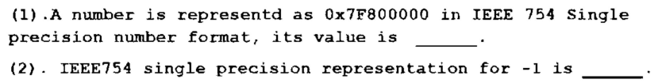

# Arithmetic

!!! info
    - 在RISC-V中有 32bit/word 或 64bit/word  
    - “传统”意义上一个word是**4byte**  
    - 本书主要讲的是 64bit/word

## 加减法

- 加减法，本质都是加法，我们采用补码的形式进行相加，就可以很好地得到结果  
- 加减处理的关键就在于overflow

### overflow

- **Overflow**。硬件规模是有限的，因此运算结果超过这个限制时，就会发生溢出。对于有符号加法，当正数和正数相加得到负数，或者负数和负数相加得到正数时，就可以判定溢出。对于无符号加法，如果结果小于二者中任意一个，也可以判定溢出。  
    - 关于 Overflow，硬件层面需要能检测溢出，然后将这个指令的地址存储到一个特别的寄存器 **EPC** 里，然后跳转到 **OS** 中专门的程序中来**处理**这个溢出（异常处理）； 

!!! note "overflow的判别条件" 
    - overflow的设计，扩展到33位，然后根据 A[31],B[31],result[32:31]的结果来判断  

    |操作|A|B|结果以及最高位和overflow位情况|
    |----|----|---|-----------|
    |A+B|>=0|>=0| <=0 (01)|
    |A+B|<=0|<=0| >=0 (10)|
    |A-B|>=0|<0| <=0 (01)|
    |A-B|<0|>=0| >=0 (10)|

## 移位

### 算术右移

- 算术右移（Arithmetic Right Shift）操作会将一个数的所有位向右移动指定的位数，同时**保留该数的符号位**（通常是最左边的位）。在移动过程中，空出的位将根据原始数的符号位填充：**如果原始数是正数（符号位为0），则空出的位填充0；如果原始数是负数（符号位为1），则空出的位填充1。**这种移位方式保证了负数在算术右移后仍然保持为负数，且其绝对值按二进制递减。

### 逻辑右移

- 逻辑右移（Logical Right Shift）操作也会将一个数的所有位向右移动指定的位数，但与算术右移不同的是，逻辑右移不考虑数的符号位，移动过程中**空出的位统一填充0**。这意味着无论原始数是正是负，空出的位都将填充0。逻辑右移主要用于无符号数的操作。

## ALU

### 1-bit ALU

- 在这一节中，我们希望 ALU 具有加法、减法、与运算、或运算和比较的能力。  
- 我们先考虑 1 bit ALU 的构造。我们学习过 1 bit Full Adder 的构造：  

$$
\begin{align} 
Sum &= A \oplus B \oplus Carry_{in} \\
Carry_{out} &= Carry_{in}A + Carry_{in}B + AB
\end{align}
$$

{width=300px}{width=200px}

- 把4个小CLA送入unit得到c4,c8,c12,c16，再送回小CLA去算

## 乘法

- **Multiplicand：被乘数**，**Multiplier：乘数**  
- 关键在**V3**  

### V3

- 根据乘法的原理，我们知道被乘数永远不变，然后乘数**一位一位**地与被乘数相乘，然后把所有结果相加  
- 然后对于64bit $\times$ 64bit的运算，结果肯定需要拓展到128bit  
- 但是乘算过程中产生的始终是64bit的量，只不过移位再相加罢了  
- 所以天才的想法就是把`Product`里的前64bit用来存储计算中间量，后64bit用来存乘数  
- 那么每计算一次，就是取乘数中的最右位，结果存到前64位；  
- 然后我们把`Product`整体右移，舍弃掉刚刚乘数的最右位的同时，下一个中间量也间接地扩大了2倍（左移了一位），然后我们重复上述过程就得到最终结果  

## 除法

- 被除数放在remainder的右半部分，然后每次左移，在高64位与除数相减，共移动65次

- 如果相减不是负数，那么就在remainder最右边置1；

- 最后移动完65次后，再把高64位右移1位；高64位就是余数，低64位是商

## IEEE 浮点数

### IEEE 754 浮点表示

- IEEE 754 规定了一种浮点数标准：我们将浮点数表示为 
$$
(-1)^S \times F \times 2^E
$$

- 这是一种类似于科学计数法的表示  
    - $(-1)^S$表示了符号位  
    - $F$和$E$用若干bits表示，分别表示尾数和指数  
    - 将其表示为$1.xxxxx_2 \times 2^{yyyy}$的形式

- IEEE 754 规定了两种精度的浮点数格式，分别是 *single precision* 和 *double precision*（分别对应 C 语言中的 `float` 和 `double` ），RISC-V 这两种都支持：

- 可以看到，*fraction* 的位数越多，浮点数的精度就越高；而 *exponent* 的位数越多，浮点数能保存的范围就越大。

- 注意到这个指数在实际使用中可能是正整数、负整数或 0，因此我们使用一个偏移，对单精度浮点数偏移 127，双精度浮点数偏移 1023（刚好是表示范围的一半！），也就是说我们保存的 exponent 其实是 $E+bias$ 的二进制。也就是说，对于这样的一个表示，其值是：

$$
(-1)^S·(1+\text{fraction})·2^{\text{exponent-bias}}
$$

- 当指数为0或全1时是特殊值，用来表示非规格化数、零和无穷大等，**实际可用范围**是 **1 ~ 254 / 1 ~ 2046**
- 对于单精度浮点数：

$$
\pm 1.0 \times 2^{-126} \sim \pm (2-2^{-23}) \times 2^{127}
$$

- 对于双精度浮点数：

$$
\pm 1.0 \times 2^{-1022} \sim \pm (2-2^{-52}) \times 2^{1023}
$$    

!!! tip "Denormal Numbers"
    - **Exponent = 000...0**  

        - 远比正常数要小  
        - When Fraction = 0.000...0 -> `Zero`  
    
    - **Exponent = 111...1**  

        - Fraction = 0.000...0 -> $\pm \text{Infinity}$  
        - Fraction ≠ 0 -> `NaN`  

!!! tip "18-19 final"
    

    ??? tip "答案"
        (1) +inf
        (2) 0xBF800000

### 浮点加法
- 五步走  
    - **对阶**    
    - **规格化**  
    - **尾数相加**    
    - **规格化**  
    - **舍入**  

- [浮点数计算网站](https://www.h-schmidt.net/FloatConverter/IEEE754.html)

---

以 $1.000_2 \times 2^{-1} - 1.110_2 \times 2^{-2}$ 为例

1. 对齐、规格化:    

    - **将小指数对齐到大指数**，小对大可以防止精度丢失  

    - $-1.110_2 \times 2^{-2} = -0.111_2 \times 2^{-1}$  

2. 尾数*fraction*相加减:  

    - $1.000-0.111=0.001$

3. 结果规格化:  

    - $0.001_2 \times 2^{-1}= 1.000_2 \times 2^{-4}$

4. 舍入:

    - 将*fraction*部分舍入到**正确位数**

### 浮点乘法

分别处理符号位、exponent 和 fraction：

- **符号位**：根据两个操作数的符号决定结果的符号  
- *exponent*：将两个 Exponent 相加并 **减去**一个 **bias**，因为 **bias 加了 2 次**  
- *fraction*：将两个 (1 + Fraction) 相乘，并将其**规格化**；此时同样要考虑 overflow 和 underflow；然后舍入，如果还需要规格化则重复执行  

### 精确算术

- 保护位（guard）、舍入位（round）

!!! note "以十进制数为例"
    - 进行加法$2.56_{10}\times 10^0 + 2.34_{10}\times 10^2$

    - 我们肯定需要进行对齐得到$0.0256\times 10^2+2.34\times 10^2$

    - 本来我们是只有两位的小数，那么现在其实多扩充了两位，这两位就是保护位和舍入位，分别是5和6

    - 进行加法后得到结果$2.3656_{10}$

    - 然后我们以50为界，0-49之间的部分舍去，51-99则进1；最终结果为$2.37_{10}\times 10^2$

- 粘滞位（sticky）

!!! note "例子"
    - 如果我们计算$5.01_{10}\times 10^{-1} + 2.34_{10}\times 10^2$

    - 即使有保护位和舍入位，我们有$0.0050 + 2.34 = 2.3450$，而这时我们就需要有粘滞位，来辨别出$0.50...00$和$0.50...01$的区别

    - 而只要**舍入位的右边非零**，我们就把粘滞位 **置1** 就好了

!!! note "作业题"

    - 假设带符号的8位十进制整数185和122以符号一数值(sign-magnitude)形式存储。计算185+ 122 是 否上溢或下溢，或都没有?

    ??? note "答案"

        $$
        181_{10} = 10111001_2 \\
        122_{10} = 01111010_2 \\
        $$

        Because it is a 8-bit sign-magnitude number, $10111001_2$ actually presents $-57_{10}$

        $$
        10111001_2 + 01111010_2 = (1)00110011_2 = 65_{10}
        $$

        a negative number adds a positive number -> **this is no overflow or underflow**

!!! note "作业题"
    - EEE754-2008包含一种只有**16位宽**的“半精度” 格式。最左边仍是符号位，指数 5 位宽且以余-16(excess-16)的形式存储，偏移量是15，尾数是10位宽。假设隐含1。

    -  手动计算 $( 3 . 9 8 4 3 7 5 \times 1 0 ^{- 1} + 3 . 4 3 7 5 \times 1 0^{ - 1} ) + 1 . 7 7 1 \times 1 0^{10}$ ， 假 设 每 个 值 都 以 练 习 3. 27 中描述的16位半精度格式存储(在文中也有描述)。假设有1个保护位、1个舍人位和1 个 粒 游 位 ， 并 舍 人 到 最 近 的 得 数 。 给 出 所 有 步 骤 ， 并 用 1 6 位 浮 点 格 式 和 十 进 制写 出 答 案

    ??? note "答案"
    
        
        $3.984375_{10}\times 10^{-1} = 1.1001100000_2\times 2^{-2}$

        $3.4375_{10}\times 10^{-1} = 1.0110000000_2 \times 2^{-2}$

        $1.771_{10} \times 10^{3} = 1.1011101011_2 \times 2^{10}$

        Mark this three numbers as $X,Y,Z$

        $X+Y = 10.1111100000_2 \times 2^{-2} = 1.01111100000 \times 2^{-1}$

        $(X+Y)+Z = 1.01111100000 \times 2^{-1} + 1.1011101011 \times 2^{10}= (0.0000000000~ 10~1111100000+1.1011101011)\times 2^{10}$

        guard = 1,safe = 0, sticky = 1;
        result:
        $1.1011101011~101 \times 2^{10}$ -> round up
        \= $1.1011101100 \times 2^{10} = 1772$

