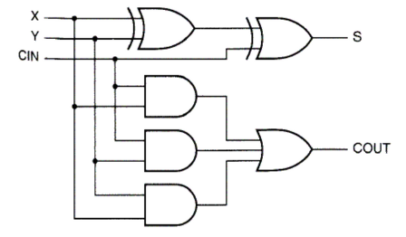
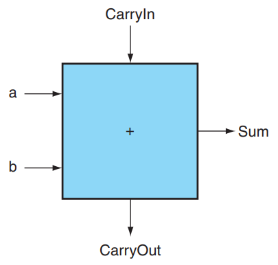
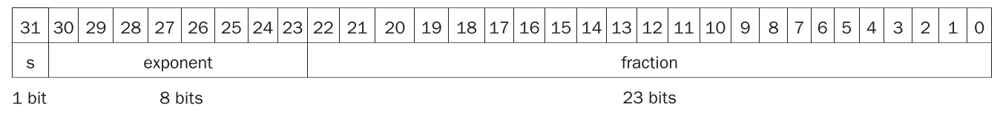
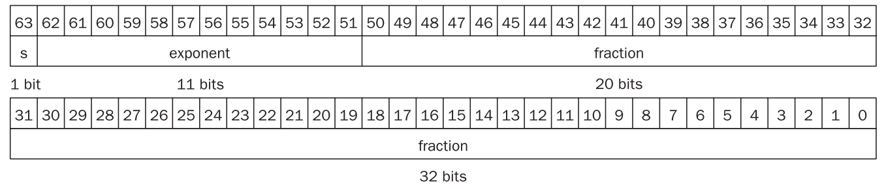
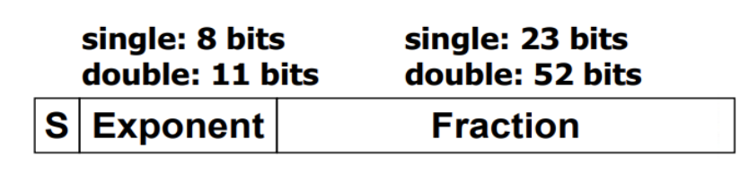

# Arithmetic

!!! info
    - 在RISC-V中有 32bit/word 或 64bit/word  
    - “传统”意义上一个word是**4byte**  
    - 本书主要讲的是 64bit/word

## 加减法

- 加减法，本质都是加法，我们采用补码的形式进行相加，就可以很好地得到结果  
- 加减处理的关键就在于overflow

### overflow

- **Overflow**。硬件规模是有限的，因此运算结果超过这个限制时，就会发生溢出。对于有符号加法，当正数和正数相加得到负数，或者负数和负数相加得到正数时，就可以判定溢出。对于无符号加法，如果结果小于二者中任意一个，也可以判定溢出。  
    - 关于 Overflow，硬件层面需要能检测溢出，然后将这个指令的地址存储到一个特别的寄存器 **EPC** 里，然后跳转到 **OS** 中专门的程序中来**处理**这个溢出（异常处理）； 

!!! note "overflow的判别条件" 
    - overflow的设计，扩展到33位，然后根据 A[31],B[31],result[32:31]的结果来判断  

    |操作|A|B|结果以及最高位和overflow位情况|
    |----|----|---|-----------|
    |A+B|>=0|>=0| <=0 (01)|
    |A+B|<=0|<=0| >=0 (10)|
    |A-B|>=0|<0| <=0 (01)|
    |A-B|<0|>=0| >=0 (10)|

## 移位

### 算术右移

- 算术右移（Arithmetic Right Shift）操作会将一个数的所有位向右移动指定的位数，同时**保留该数的符号位**（通常是最左边的位）。在移动过程中，空出的位将根据原始数的符号位填充：**如果原始数是正数（符号位为0），则空出的位填充0；如果原始数是负数（符号位为1），则空出的位填充1。**这种移位方式保证了负数在算术右移后仍然保持为负数，且其绝对值按二进制递减。

### 逻辑右移

- 逻辑右移（Logical Right Shift）操作也会将一个数的所有位向右移动指定的位数，但与算术右移不同的是，逻辑右移不考虑数的符号位，移动过程中**空出的位统一填充0**。这意味着无论原始数是正是负，空出的位都将填充0。逻辑右移主要用于无符号数的操作。

## ALU

### 1-bit ALU

- 在这一节中，我们希望 ALU 具有加法、减法、与运算、或运算和比较的能力。  
- 我们先考虑 1 bit ALU 的构造。我们学习过 1 bit Full Adder 的构造：  

$$
\begin{align} 
Sum &= A \oplus B \oplus Carry_{in} \\
Carry_{out} &= Carry_{in}A + Carry_{in}B + AB
\end{align}
$$

{width=300px}{width=200px}

- 把4个小CLA送入unit得到c4,c8,c12,c16，再送回小CLA去算

## 乘法

- **Multiplicand：被乘数**，**Multiplier：乘数**  
- 关键在**V3**  

### V3

- 根据乘法的原理，我们知道被乘数永远不变，然后乘数**一位一位**地与被乘数相乘，然后把所有结果相加  
- 然后对于64bit $\times$ 64bit的运算，结果肯定需要拓展到128bit  
- 但是乘算过程中产生的始终是64bit的量，只不过移位再相加罢了  
- 所以天才的想法就是把`Product`里的前64bit用来存储计算中间量，后64bit用来存乘数  
- 那么每计算一次，就是取乘数中的最右位，结果存到前64位；  
- 然后我们把`Product`整体右移，舍弃掉刚刚乘数的最右位的同时，下一个中间量也间接地扩大了2倍（左移了一位），然后我们重复上述过程就得到最终结果  

## IEEE 浮点数

### IEEE 754 浮点表示

- IEEE 754 规定了一种浮点数标准：我们将浮点数表示为 
$$
(-1)^S \times F \times 2^E
$$

- 这是一种类似于科学计数法的表示  
    - $(-1)^S$表示了符号位  
    - $F$和$E$用若干bits表示，分别表示尾数和指数  
    - 将其表示为$1.xxxxx_2 \times 2^{yyyy}$的形式

- IEEE 754 规定了两种精度的浮点数格式，分别是 *single precision* 和 *double precision*（分别对应 C 语言中的 `float` 和 `double` ），RISC-V 这两种都支持：

- 可以看到，*fraction* 的位数越多，浮点数的精度就越高；而 *exponent* 的位数越多，浮点数能保存的范围就越大。

- 注意到这个指数在实际使用中可能是正整数、负整数或 0，因此我们使用一个偏移，对单精度浮点数偏移 127，双精度浮点数偏移 1023（刚好是表示范围的一半！），也就是说我们保存的 exponent 其实是 $E+bias$ 的二进制。也就是说，对于这样的一个表示，其值是：
$$
(-1)^S·(1+\text{fraction})·2^{\text{exponent-bias}}
$$

- 当指数为0或全1时是特殊值，用来表示非规格化数、零和无穷大等，**实际可用范围**是 **1 ~ 254 / 1 ~ 2046**
- 对于单精度浮点数：
$$
\pm 1.0 \times 2^{-126} \sim \pm (2-2^{-23}) \times 2^{127}
$$

- 对于双精度浮点数：
$$
\pm 1.0 \times 2^{-1022} \sim \pm (2-2^{-52}) \times 2^{1023}
$$    

!!! tip "Denormal Numbers"
    - **Exponent = 000...0**  

        - 远比正常数要小  
        - When Fraction = 0.000...0 -> `Zero`  
    
    - **Exponent = 111...1**  

        - Fraction = 0.000...0 -> `Infinity`  
        - Fraction ≠ 0 -> `NaN`  

### 计算
- 五步走  
    - **对阶**    
    - **规格化**  
    - **尾数相加**    
    - **规格化**  
    - **舍入**  

- [浮点数计算网站](https://www.h-schmidt.net/FloatConverter/IEEE754.html)