# Cache

## Memory Hierarchy Introduction

!!! info "两个局部性"
    - **Temporal locality**（时间局部性），即近期访问的项目很有可能会在短时间内再次被访问。例如循环中的指令、induction variables (循环中用来计数的变量) 等

    - **Spatial locality**（空间局部性），即近期访问项目附近的项目也有可能会在短时间内再次被访问。例如连续的指令执行，或者数组变量等

- 因此，结构化的 memory 被设计出来。**近期访问到的内存单元和它附近的内容**被复制一份放在离 CPU 更近、访问更快，但也更小的 **cache** 中，从而利用上述局部性加速访问。

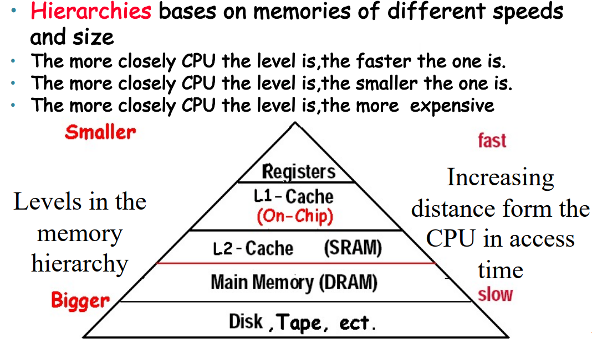

- Block(line)，搬运是搬整个block或者line，而不是某个单独的字节；

- Hit：从upper level中access到；Miss：The CPU accesses the upper level and fails

- miss penalty:要将lower level把整个block搬上去，同时加上把block传递给cpu的时间

## The Basics of Cache

- 下面我们来具体考虑 cache 怎么实现。主要需要讨论的问题是：
    
    1.如何知道一个 block 是否在 cache 里？
    
    2.以及如果知道它在的话，如何找到它？

### Direct Mapping

- cache中有$2^n$个blocks，那么索引就占$n$个bits

- 然后每个block中有$2^m$个word，即$2^{m+2}$个bytes,那么byte offset就是$m+2$，要占$m+2$个bits

- 剩下的$(32-n-m-2)$就是tag位占的bits

---

- 同样地，计算cache的大小：

- 例如一个64位地址的机器，cache的大小是1024个block，一个 block 有 1 个 word，即 4 个 byte，那么 index 的位数就是 $\text{log}_21024=10$，byte offset 的位数就是 $\text{log}_24=2$，因此 tag 的位数就是 $64-10-2=52$；另外一个 block 的大小是 4 个 byte，即 32 位，因此一个 cache 的条目的位数就是 valid bit 1 位 + tag 52 位 + word 32 位 = 85 位。

- cache的总共大小，就是$索引数\times 每个索引的大小=1024\times(valid + tah + data)$

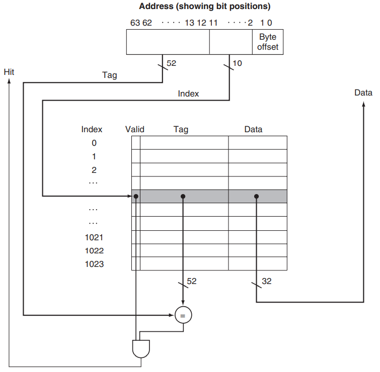

!!! tip "Example--Cache相关计算"
    - How many total bits are required for a direct-mapped cache **16KB of data** and **4-word blocks**, assuming a 32-bit address?

    ??? note "答案"
        - cache是16KB，block的数量就是$\frac{16KB}{4word}=2^{10}$，所以索引是10位；byte offset显然是4；Tag就是$32-10-4=18$；Data是$4word=128bits$

        - Total cache size $= 2^{10}\times(128+18+1)=147Kbits$

    ??? tip "Example-2"
        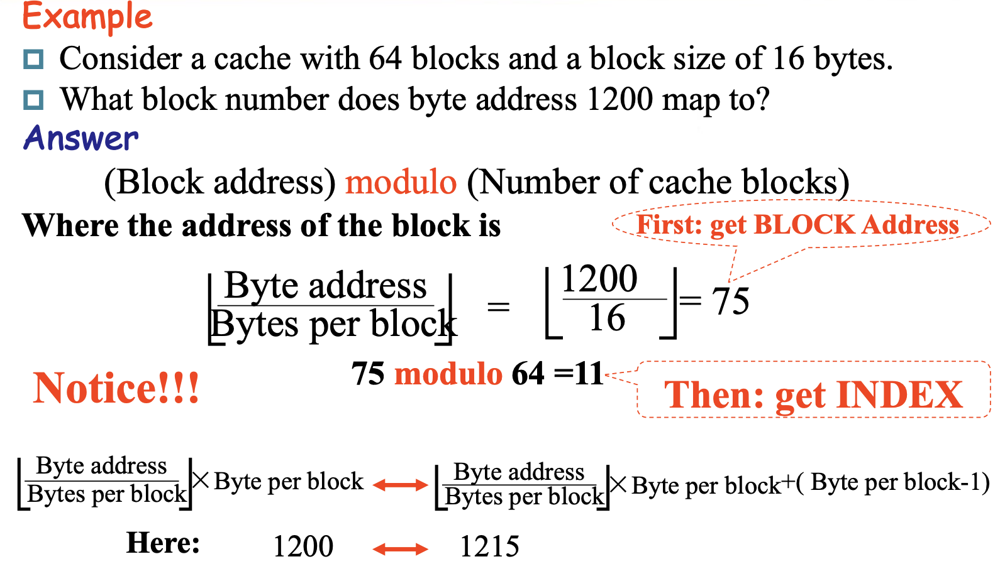

### Handling Cache Hits & Misses

显然，读和写的时候发生 cache miss 的处理方式是不一样的；另外读也有读数据和读指令之分（指令 cache 和数据 cache 通常是分离的）。我们分别对其进行讨论：

=== "Read"
    
    - **Hit**:直接从 cache 里读就好了

    - **Miss**
        
        1. **Data cache miss**
            
            - 从 memory 里把对应的 block 拿到 cache，然后读取对应的内容。

        2. **Instruction cache miss**

            - 暂停 CPU 运行，从 memory 里把对应的 block 拿到 cache，从第一个 step 开始重新运行当前这条指令。

=== "Write"
    
    - **Hit** 有两种可以选的方式：

        1. **write-through**，即每次写数据时，既写在 cache，也写在 main memory。这样的好处是 cache 和 main memory 总是一致的，但是这样很**慢**。

            - 一个改进是引入一个 **write buffer**，即当需要写 main memory 的时候不是立即去写，而是加入到这个队列中，找机会写进去；此时 CPU 就可以继续运行了。当然，当 write buffer 满了的时候，也需要暂停处理器来做写入 main memory 的工作，直到 buffer 中有空闲的 entry。因此，如果 main memory 的写入速率低于 CPU 产生写操作的速率，多大的缓冲都无济于事。

        2. **write-back**，只将修改的内容写在 cache 里，等到这个 block 要被覆盖掉的时候将其写回内存。这种情况需要一个额外的 **dirty bit** 来记录这个 cache block 是否被更改过，从而直到被覆盖前是否需要被写回内存。由于对同一个 block 通常会有多次写入，因此这种方式消耗的总带宽是更小的。

    - Miss

        1. 把整个block搬到cache，然后再写

        2. 直接写回memory

## Deep concept in Cache

!!! abstract "重要复习大纲"
    

### 1. Block Placement

- Direct mapped： **address MOD blocks的数量**

- Fully associative（全关联）： go anywhere

??? tip "Fully associative 图示"
    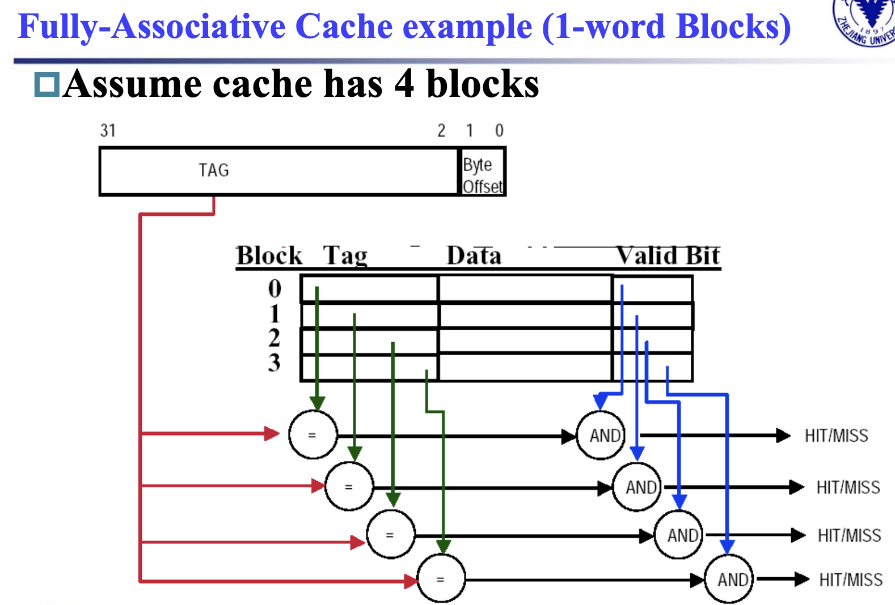

- Set associative（组关联）：**address MOD set的数量**；set就是把几个block看做一个组

- Direct mapped 其实就是 1-way set associative; Fully associative 就是 m-way set associative

### 2. Block Identification

- Index：$\text{log}_2\text{sets}$，由组的数量来决定，direct mapped也是这样的（一个block就是一组）

- Byte Offset：$\text{log}_2\text{size of block}$，由block的大小决定

- Tag：$\text{Address_size} - \text{Index_size}-\text{Byte_Offset_size}$

- Valid bit：一位valid

### 3. Block Replacement

- direct mapped中没有替换一说，因为每个地址的位置都是unique的

- 对于组关联，一个组里面有好几个block可选，此时就会有**替换策略**

1. 随机替换(**random replacement**)：选择组里面随机的一个block

2. **Least-recently used**(LRU)：替换掉**最久**没访问过的block（相当于替换掉被**”尘封“**的block）；实现上来说，2-way组关联里只需要添加一个额外bit就可以标记，比较好用；但是way数多了就不方便了

3. First in, first out(**FIFO**)：**最先进来**的block最先被替换

### 4. Write Strategy

- 我们最大的问题其实就是，在data写入cache的时候，**是否要写进内存？**

1. **Write Through**

    - 可以**放心地替换**掉cache里的数据

    - 只需要valid这一个control bit

2. **Write Back**

    - 不能随意替换掉cache里的数据，可能需要写回memory才能行（以一个完整的**block**写回去）

    - 多一个**dirty bit**来control

    - lower bandwidth，因为数据经常在cache里覆写很多次，但是写回memory只有一次

---

#### Write stall, Write buffer

- CPU必须等待write的完成；而为了避免这个stall，我们引入一个**write buffer**

- write buffer是一个小的cache存储着要写回memory里的数据；当CPU进行读操作时，就顺手地写回去，减少cpu的stall；但是当大量的写操作时，buffer满了之后还是要stall

- 写穿（Write Through）缓存：在写穿缓存中，写操作同时写入缓存和主存。写缓冲区用于缓存写操作的数据，减少处理器等待主存写入完成的时间。

- 写回（Write Back）缓存：在写回缓存中，写操作只写入缓存，缓存中的脏块在被替换出缓存时写回主存。写缓冲区用于缓存脏块的数据，减少处理器等待主存写入完成的时间。

---

#### Write misses

- 当read miss的时候，我们需要从memory中把整个block搬进cache；

- 当write miss时有两个选择

1. **write allocate**：当miss发生时，把整个block搬进cache

2. **write around**：当miss发生时，只会写回memory，不会把block搬进cache

**write-back caches** -> **write-allocate**

**write-through caches** -> **write-around**

## Virtual Memory

- 计组把 main memory 描述为 secondary storage (即 disk) 的 "cache"。或者，反过来说，我们把那些在 main memory 里放不下的内容存到 disk 里（这样更能符合我们熟悉的“可执行文件必须加载到内存才能运行”的一贯认知）。这种技术称为 **virtual memory**。

- 虚拟内存技术可以让多个程序之间高效、安全地共享内存，同时允许单个程序使用超过内存容量的内存（正如虽然 CPU 取数据时是从 cache 中取的，但是它能访问到的数据的数目比 cache 的容量要大）。在远古时期，很多程序因为需要使用过大的内存而无法被运行；但现在由于虚拟内存技术的广泛使用，这些程序都不成问题了。

- 如下图所示，实际上的 main memory（我们称之为 物理内存, physical memory）中的地址称为 物理地址, physical addresses；而我们给每一个程序内部使用到的内存另外编一套地址，称为 虚拟地址, virtual addresses；虚拟内存技术负责了这两个地址之间的转换 (address translation，我们稍后再讨论转换的方式)：

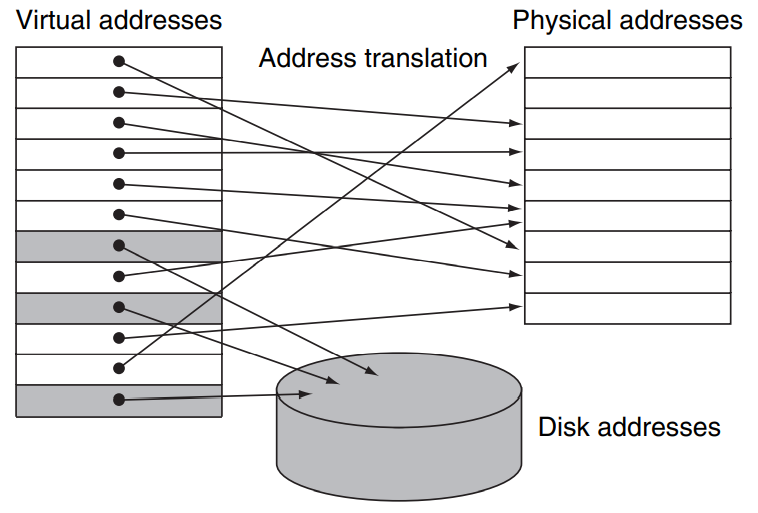

- 从这张图中我们也可以很容易地看出“虚拟内存技术可以允许单个程序访问超过物理内存大小限制的内存”的原因，即有一些内存可以被临时地存放在磁盘上，到被访问的时候再被放到 physical memory 中，就像 cache 做的那样。

- 从这张图中，我们还可以注意到 physical memory 的存放并没有分组的概念，即用 cache 的术语来说，main memory 是 fully-associative 的。

- 虚拟存储的技术和 cache 的原理是一样的，但是一些术语的名字并不相同。对应于 cache 中的 block / line，**虚拟存储的内存单元**称为 **page**，当我们要访问的 page 不在主存中而是在磁盘里，也就是 miss，我们称之为一次 **page fault**。

### 映射

- 首先我们要考虑的一个问题就是，一个 page 应该有多大。我们知道，访问磁盘相比于访问内存是非常慢的（相差大约十万倍），这个主要时延来自于**磁盘转到正确的位置上的时间花费**；所以我们希望**一次读进来多一点**从而来分摊这个访问时间。典型的 page 大小从 **4KiB ~ 64KiB** 不等。

- 下面我们考虑映射关系。我们不妨假设一个 page 的大小是 4KiB，那么其页内的偏移 **page offset** 就需要 12 位来表示；那么物理地址中除去后 12 位以外前面的部分就表征着它是属于哪一页的，我们称之为 **physical page number**。

!!! info 
    如我们之前所说，memory 作为 disk 的 "cache" 是 fully-associative 的，因此 physical page number 其实就是 cache 中的 "tag"，而 page offset 就是 cache 中的 "byte offset"，fully-associative 的 cache 并没有 index 这一字段。

- 为什么要使用 fully-associative 的存储方式呢？我们在 cache 中讨论过，这种方式的好处是**失效率低**，坏处是查询难度大。但是我们也讨论到了，page fault 的开销是非常大的，因此比较低的 page fault 的概率相对于额外的查询来说是非常划算的。

- 同样，由于读写磁盘是**非常慢**的，write through 的策略并不合适，因此在 virtual memory 的技术中，我们采取 **write back** 的方式。

- 而 **virtual address** 的形式与之类似，由若干位 **page number** 和若干位 **page offset** 组成。

- 我们之前提到，我们有一种方式可以找到 virtual page 对应的 physical page，因此当我们要访问一个虚拟地址时，将其 virtual page number 通过这种 translation 转换为 physical page number（这种 translation 也会负责 page fault 的处理并给出正确的转换），而 **page offset** 表示的是在一页内的偏移，**保持不变**即可。这样我们就获得了这个 virtual address 对应的 physical address，也就是它**在实际的 main memory 中存储的位置**。如下图所示：

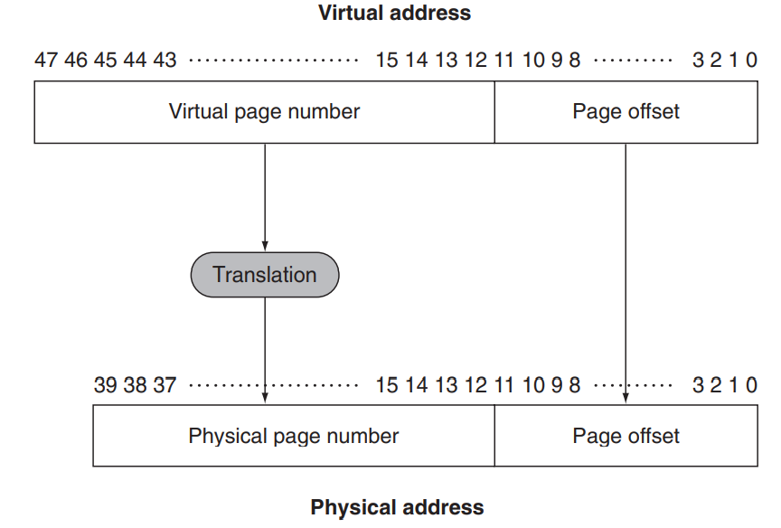

- 同时也可以看出，virtual page number 的位数比 physical 的**多**；这也是显然的，因为我们引入虚拟内存的一个重要原因就是为了**使用比 main memory 更大的内存**。

### Page Table

- 我们下面讨论这种 **translation** 的具体方案。之前也提到，fully-associative 的一个重要问题就是如何去定位某一项；这里我们引入 page table 这种结构，它被存放在 main memory 中，**每个程序（进程）都有一个自己的 page table**；同时硬件上有一个 **page table register** 保存当前进程这个页表的地址。

- 使用页表时，我们根据 virtual page number 找到对应 **page table entry, PTE** 在 page table 中的**偏移**，然后与 page table register **相加**得到对应 entry 的 physical address，从中读取对应的 entry。其实就是说，page table 就是一个**数组**， `page_table[i]` 表示第 `i` 个 virtual page 对应的 physical page number。

- 如下图所示，每个 entry 中包含了一个 valid bit 和 physical page number。valid 位（有效位）用于 **Page Table Entry**, **PTE** 所对应的虚拟页是否在物理内存中有效。如果 **valid bit = 1**，那么转换完成；否则触发了 page fault，handle 之后再进行转换。

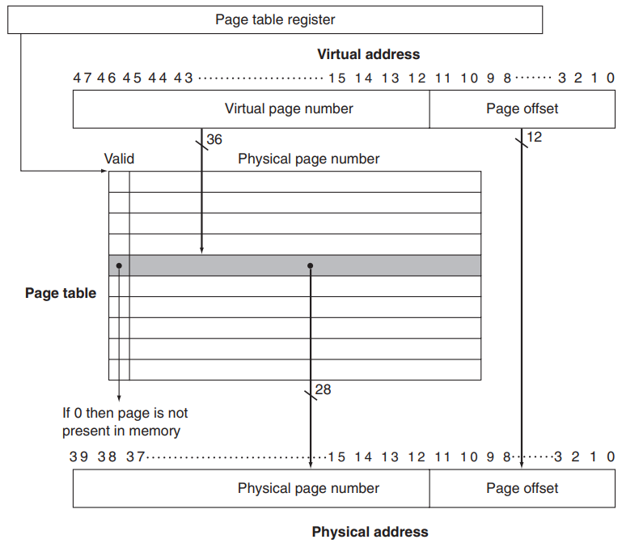

---

- **Page fault** 会引发一个 exception，由操作系统接管控制，处理完之后再将控制交还给进程。操作系统要做的事情是在 **secondary storage** 中找到这一 page，将其**放到 main memory** 里（可能需要与当前主存中的某个 page 交换），然后**更新 page table**。

- 操作系统在创建进程时在 disk (或者 flash memory) 上创建一个虚拟地址空间那么大的空间，以便上述的交换；这个空间称为 **交换区**, **swap space**。（当系统的物理内存不足以满足所有正在运行的程序的需求时，操作系统可以将不常用的内存页从物理内存中移出，存储到交换区中，以释放物理内存供其他程序使用。这一过程称为交换Swapping。）下面的问题是操作系统如何在 swap space 中找到需要的 page。

- 我们可以看到，如果 page table entry 的 valid bit 为 **0**，那么后面的 physical page number 是没有用到的。我们可以利用这个字段存储对应 page 被交换到了 disk 的哪个位置；或者另外开辟一个索引结构，在其中记录每个 virtual page number 对应的 disk 位置。作为前者的一个例子，请看下图：

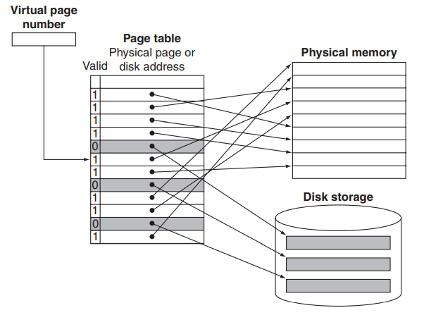

---

- 然后当我们把page搬进main memory时，可能会遇到满了的情况；为了满足让交换引发后续 page fault 的次数**尽可能少**，于是就采用**LRU,Least Recently Used**的交换策略

- LRU 的代价有点太大了，毕竟如果使用 LRU 的话需要遍历整个 main memory。因此，很多操作系统引入了 **reference bit** (或者称为 **use bit**) 来近似地实现 LRU。当一个 page 被访问时这个 bit 被置为 1；操作系统定期将 reference bit 清零。因此，在需要交换时，只需要找一个 reference bit 为 0 的就可以说明它在这段时间内没有被访问过。

---

#### 使用多级页表解决页表过大的问题

- 我们不妨关注一下 page table 有多大。在我们之前的例子中，virtual address 有 48 bit，每个 page 的大小为 4KiB，所以 page table entry 的数目是 $\frac{2^{48}B}{4KiB}=2^{36}$，而 RISC-V 每个表项有 8 Byte，所以 page table 的总大小来到了 $2^{39}B=0.5TiB$，这是极其不合理的；尤其是每个进程都有一个 page table 的前提下。那么**页表过大**的问题，我们可以通过**多级页表**的方式解决。

- 如我们之前所述，页表是一个数组， `page_table[i]` 中存储的是 virtual number 为 i 的 page 所对应的 physical number。考虑我们的逻辑地址结构：

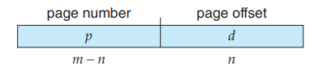

- 我们考虑将 p 再分为 p1 和 p2 ：

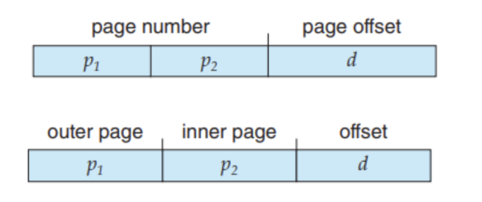

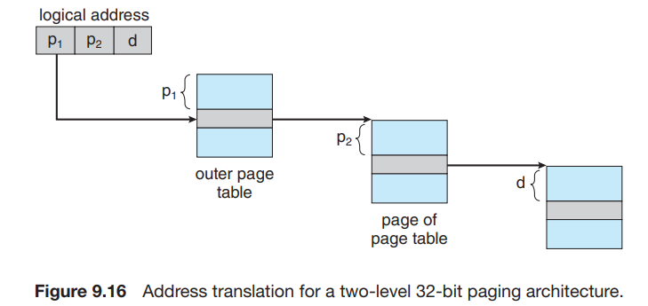

- 我们使用一个两级页表，这里，我们称 p1 为 **page directory number** ，p2 为 **page table number**，d 为 **page offset**。

#### 使用TLB加快地址转换

- 我们之前提到，使用页表时，我们根据 virtual page number 找到对应 page table entry 在 page table 中的偏移，然后与 page table register 相加得到对应 entry 的 physical address，从中读取对应的 entry。但是这种方法的**效率存在问题**。要访问 virtual address 对应的 physical address，我们首先要根据 page table register 和 virtual page number 来找到页表在内存的位置，并在其中得到 page 对应的 physical page number，这需要一次内存访问**；**然后我们根据 physical page number 和 page offset 算出真实的 physical address，并访问对应的字节内容。即，访问一个字节需要两次内存访问，这会加倍原本的内存访问的时间，这是难以接受的。

- 这个问题的解决方法用到一个专用的高速查找硬件 cache，这里称它为 **translation look-aside buffer (TLB)**。它实际上就是 page table 的专用 cache（它**真的是 cache**；page table 并不是 cache，只是像 cache），其 associativity 的设计可以根据实际情况决定。

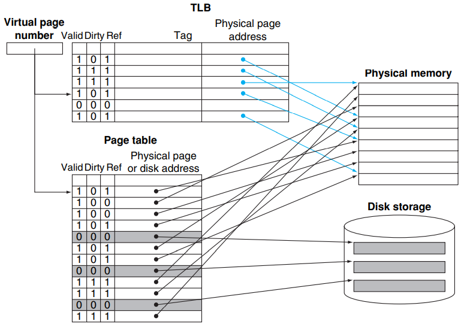

- 当 **TLB miss** 的时候，处理器去 page table 查找对应的项；如果发现对应项是 valid 的，那么就把他拿到 TLB 里（此时被替换掉的 TLB entry 的 dirty bit 如果是 1，也要写回 page table）；否则就会触发一个 page fault，然后在做上述的事。

!!! abstract
    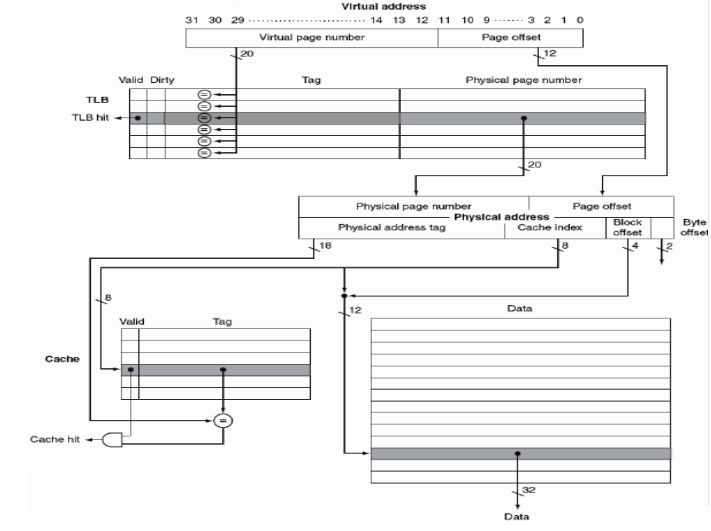
    
    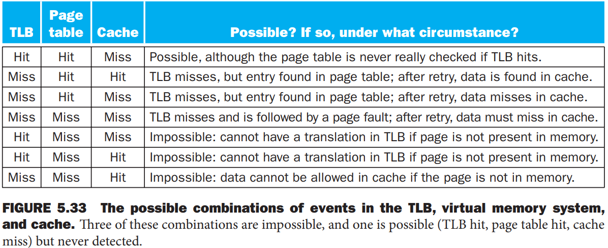

!!! tip "计算page table大小"
    - 假设Virtual address = 32bits;page size = 4KB; Entry size = 4 Bytes

    ??? note "答案"
        - 先算有多少个page table entry，也就是virtual address number=page address number=$\frac{2^{32}}{2^{12}}=2^{20}$（$2^{12}$是page offset）

        - 然后就能算总大小了：$2^20 \times 4 Bytes = 4MB$

- 补题目 5.3 5.6，5.10，5.11，5.16（word address和byte address）

- 补miss的类型：

    - conflict miss：set容量不够，导致替换的miss

    - cold/compulsory miss：第一次访问一定会miss

    - capacity miss：cache满了的时候的miss