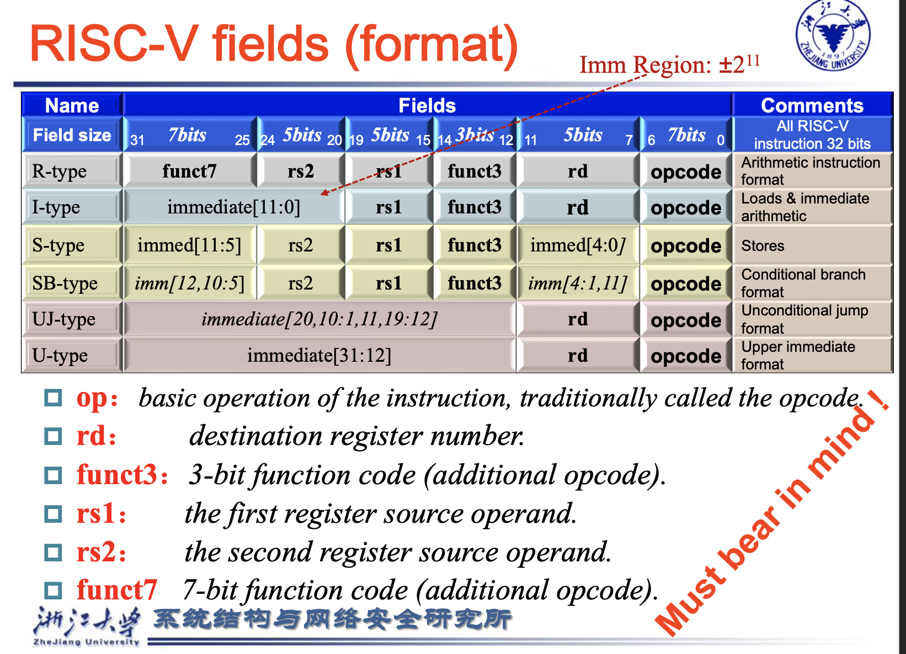
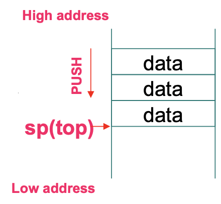
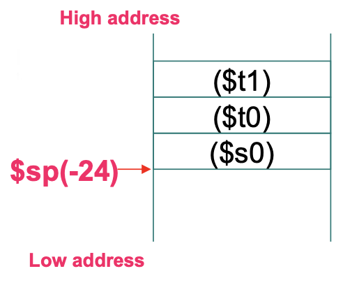
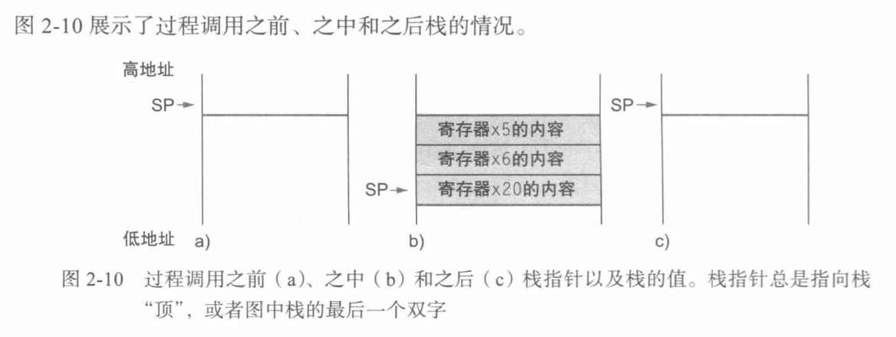
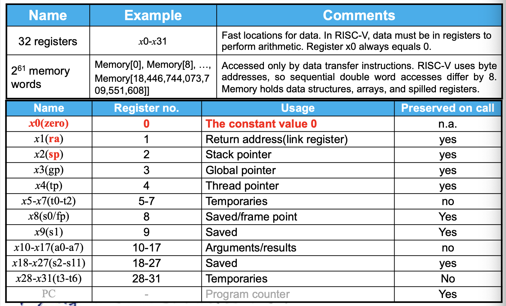
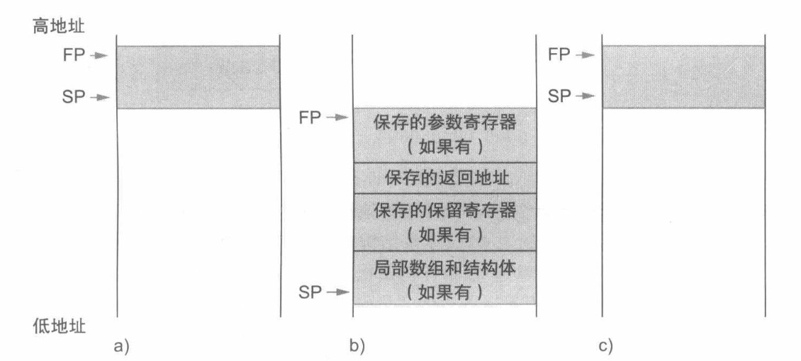
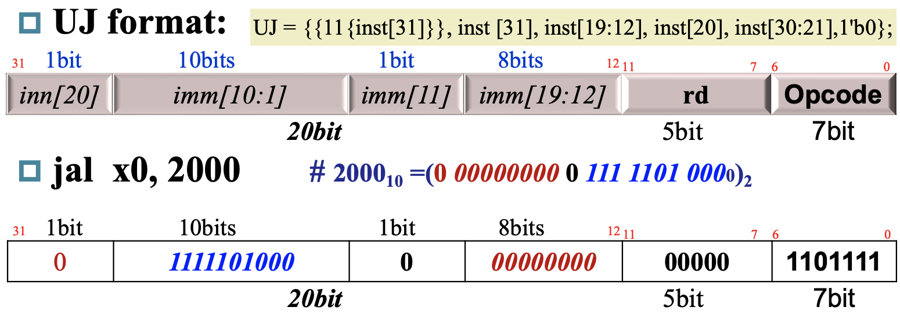
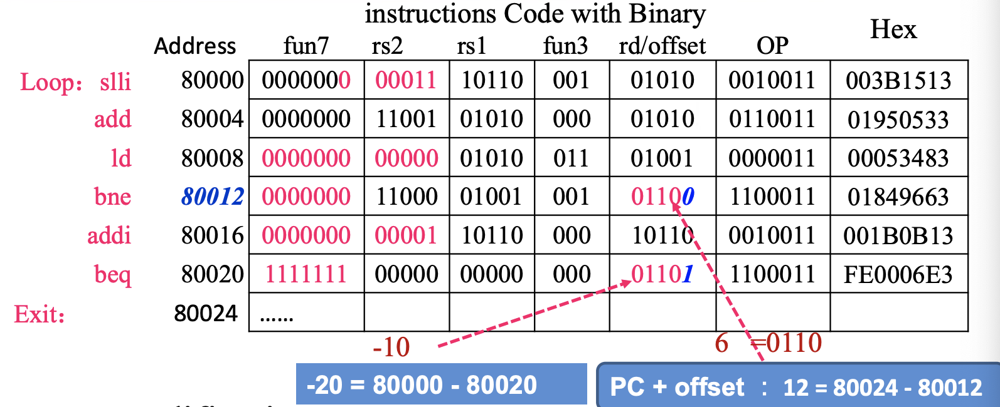

# Instructions

## 寄存器

- RISC-V architecture 提供 32 个数据寄存器，分别命名为 `x0` ~ `x31` ，每个寄存器的大小是 **64 位**。在 RISC-V architecture 中，一个 **word 为 32 位**，一个 **doubleword 为 64 位**。这些寄存器中的一部分有专门的用途

## 寻址


## Memory Operands

- 主存用于**存储复合数据**，如数组、结构、动态数据

- 内存只是用来读和写的，不能用来计算，必须读取到寄存器里进行算术操作，最后存回memory（Load-Store）

- 内存是 **byte addressed**，数据是以一个一个的 **byte** 存储在Memory; 

- RISC-V是**小端编址** -> LSB在第0个byte；大端 -> MSB在第0个byte

- RISC-V不要求word对齐（但大部分的ISA都需要对齐！）

----

- 涉及**常数**的操作，我们引入`immediate`的这一量


!!! abstract 
    - 32个寄存器: `x0`-`x31`
    
    - 由于一个寄存器64-bit，所以能访问到的最大地址是 $2^{64}$即 $2^{61}$ DoubleWord

    - 


----

## 指令类型

- 寄存器x0-x31，需要5位bit表示（所以寄存器不能太多，否则每个的编码要占很多位）

- **指令编码为32位**，也就得到了机器码

二进制表示下的机器码:
$0000000~00000~00000~000~00000~0000000$

----

- 任何指令中 rs1,rs2,rd在指令中的位置都是**固定**的

R-Format: 算术运算

|funct7| rs2| rs1| funct3| rd| opcode|
|:--:|:--:|:--:|:--:|:--:|:--:|
|7bit | 5bit| 5bit| 3bit| 5bit| 7bit|

---

I-Format: Load&Immediate

|immediate| rs1 |funct3 |rd |opcode|
|:--:|:--:|:--:|:--:|:--:|
|12bit    | 5bit|  3bit |5bit|  7bit|

- immediate: 常数操作数 或者 基地址偏移量

---

S-Format: Store

|imm[11:5]| rs2| rs1 |funct3| imm[4:0]| opcode|
|:--:|:--:|:--:|:--:|:--:|:--:|
|7bit    |5bit| 5bit| 3bit | 5bit    |7bit|

- rs1 -> 存地址的寄存器，和I-Format 统一起来


---

!!! note "例子"

    ```c title="C code"
    - `A[30] = h + A[30] + 1`
    
    // (Assume: h -> x21   base address of A -> x10)
    ```

    ```asm title="RISC-V"
    ld x9, 240(x10)
    add x9, x21, x9
    addi x9, x9, 1
    sd x9, 240(x10)
    ```

    - MachineCode: 以`ld`为例

    |immediate |rs1 |funct3| rd opcode|
    |:--:|:--:|:--:|:--:|:--:|
    |240|10|3|9|3|


----

### Logical Operation

|Operation|C|RISC-V|
|:--:|:--:|:--:|
|Shift left|<<|slli|
|Shift right|>>|srli|
|Bit-by-bit AND|&|and,andi|
|Bit-by-bit OR|\||or,ori|
|Bit-by-bit XOR| ^|xor,xori|
|Bit-by-bit NOT|~|用与全1异或来实现|


----

### 跳转

```asm
beq r1,r2,L1 -> 如果相等就跳转L1
bne r1,r2,L1 -> 如果不等就跳转L1
```

!!! warning "关于L1"
    - L1: 是两条指令的**地址差**


### Loops

例子： `g`-`j` -> `x20`-`x23`  base of `A` -> `x25`
```c title="C code"
Loop: g = g + A[i];
      i = i + j;
      if(i != h) goto Loop;

```

```asm title="RISC-V"
Loop:   slli x10,x22,3  // 索引i*8后作为偏移量加到地址寄存器上
        add x10,x10, x25  // 得到A[i]的地址
        ld x19, 0(x10)    // temp reg x19 = A[i]
        add x20,x20, x19  // g = g + A[i]
        add x22,x22, x23  // i = i + j
        bne x22, x21, Loop // goto Loop if i != h

```

!!! warning "注意第一条指令"
    - `slli x10, x22, 3` 
    
    - `x10 = 8*i`，**i乘8**才是正确的地址，因为i是索引值，当作为**地址偏移量时就必须乘8**才有效


----


### slt

- `slt`: set on less on

    - 如果rs1 < rs2，则rd = 1

```asm
slt x5, x19, x20  # x5=1 if x19< x20
```

!!! note "Example"
    ```c title="C"
    if(a<b), goto Less
    ```

    ```asm title="RISC-V"
    slt x5,x8,x9   # x5=1 if x8 < x9
    bne x5,zero,Less # go to Less if x5 != 0
    ......
    ```


----

- **更多选择**

- `blt rs1, rs2, L1`: if(rs1 < rs2) goto L1

- `bge rs1, rs2, L1`: if(rs1 >= rs2) goto L1

!!! tip "比较分为有符号与无符号"
    |Type|Instruction|
    |:--:|:--:|
    |Signed comparison|blt,bge|
    |unsigned comparison|bltu,bgeu|

    $x22 = 1111~1111~1111~1111~1111~1111~1111~1111$
    
    $x23 = 0000~0000~0000~0000~0000~0000~0000~0001$

    ```py
    x22 < x23 #signed，因为 -1 < 1

    x22 > x23 #unsigned，因为+4,294,967,295>+1
    ```


### 实现switch/case语句

!!! info "`jal`与`jalr`"
    - `jal` 和 `jalr` 是两条用于跳转和链接的指令，通常用于函数调用和过程调用。

    - `jal` (Jump and Link)
        - 语法：`jal rd, offset`
        
        - 功能：跳转到当前程序计数器（`PC`）加上偏移量（`offset`）的位置，并将返回地址存储在目标寄存器 `rd` 中。
        
        - 用途：用于直接跳转到一个相对位置，常用于调用函数或过程。

    - `jalr` (Jump and Link Register)
        - 语法：`jalr rd, offset(rs1)`

        - 功能：跳转到寄存器 `rs1` 的值加上偏移量（`offset`）的位置，并将返回地址存储在目标寄存器 `rd` 中。

        - 用途：用于间接跳转到一个地址，常用于返回调用点或跳转到动态计算的地址。


**例子**

```c title="C code"
switch(k){
    case 0: f = i + j; break;
    case 1: f = g + h; break;
    case 2: f = g - h; break;
    case 3: f = i - j; break;
}
```

- 想要实现这样的switch/case语句,我们在内存里开一块来存放 **不同程序的地址** 的**表**

- 然后每次去这个表里读取到地址，同时要把原来的**返回地址存好**（存储在`x1`），然后再跳转过去，


```asm title="RISC-V"
blt x25,x0, Exit  
bge x25,x5, Exit    # 两个边界条件，如果k<0 或者 k>= 4就跳出
slli x7,x25, 3      # 经典偏移量k乘8
add x7,x7,x6        # x7 = address of JumpleTable[K]
ld x7,0(x7)         # temp reg x7 = JumpTable[k]
jalr x1,0(x7)       # jump到x7存的地址的程序处

```


!!! warning "关于`jalr x0, 0(x1)`"
    - 因为我们已经执行到了程序的结尾，要返回原地址`x1`处

    - 但是执行`jalr`指令必须要存一个“返回地址”，因而把这个无用的地址存入`x0`中


----

!!! abstract "总结"
    


## Procedure/Function

!!! info "Basic Block"
    - 一段指令中如果没有跳转，会从头执行到尾，这就叫*basic block*

    - 然后编译器会对这个进行优化


!!! abstract "Procedure的执行有6步"
    1. 把**形参**放在procedure能访问到的地方
    2. 然后我们**jump to**
    3. 为进程分配资源-> 分配栈帧、保存寄存器、传递参数等等
    4. 执行任务
    5. 将**结果存储**在**calling program**能访问到的地方
    6. **return**控制权给源程序


### 调用指令

**Caller -> jal x1, ProcedureAddress**

- 跳转到`ProcedureAddress`，然后将返回地址存储在`x1`中

Callee -> jalr x0, 0(x1)

- 跳转到`x1`即返回地址，然后由于不需要再存储新的返回地址，就存储到零寄存器

----

### 更多寄存器与堆栈

- `a0`-`a7`(`x10`-`x17`)用于**传参和返回的寄存器**

----

!!! note "Stack"
    - 函数在执行时会用到寄存器，所以我们先前把原来的寄存器**push**栈中保存，函数执行完再**pop**出来

    !!! tip "Stack pointer"
        - 由于栈由高内存向低内存分布

        - 堆栈指针*sp(x2)*指向**最后一个有数据的地方**，每次**push**的时候**sp就会减8**

    !!! tip inline end "Demo"
        
    
    
    ```asm title="push"
    addi sp,sp,-8
    sd ..., 0(sp)
    ```


    ```asm title="pop"
    ld ... 0(sp)
    addi sp,sp,8
    ```


!!! note "Example"
    `g`-`j` -> `x10`-`x13`,`f` in `x20`
    
    ```c
    long long int leaf_example(
        long long int g,long long int h,
        long long int i,long long int j){
            long long int f;
            f = (g+h)-(i+j);
            return f;
    }
    ```

    ---

    !!! tip inline end "Demo"
        
    
    
    
    ```asm title="RISC-V"
    addi sp,sp,-24  # 调整栈顶指针腾出三个寄存器的空间
    sd x5,16(sp)    
    sd x6,8(sp)
    sd x20,0(sp)    # push 3个寄存器

    add x5,x10,x11  # x5 = g + h
    add x6,x12,x13  # x6 = i + j
    sub x20,x5,x6   # f = x5-x6
    addi x10,x20,0  # 为了返回f的值，将其复制到一个参数寄存器中

    ld x20,0(sp)
    ld x6,8(sp)
    ld x5,16(sp)
    addi sp,sp,24   # pop数据来恢复寄存器的三个旧值，同时调整指针位置

    jalr x0, 0(x1)  # 使用返回地址的寄存器来结束进程
    ```

    


----

!!! tip "两类 Registers"
    - 但是这样子反复压栈出栈，函数调用的代价很大，所以我们又引入 `t0`-`t6`(x5-x7,x28-x31)来作为只被函数临时使用的寄存器

    - `s0`-`s11`(x8-x9,x18-x27)：12个saved寄存器，使用时必须**压栈保存**

    


!!! tip "最绕的嵌套函数——阶乘"

    ??? warning "嵌套的问题"
        - 假设主程序调用过程A，参数为`3`，将`3`存入寄存器`x10`后使用`jal x1,A`

        - 然后过程A又要调用过程B,使用`jal x1, B`，同时又有参数`7`也存入`x10`。

        - 由于A尚未结束任务，所以寄存器`x10`和`x1`的使用都存在冲突！！！

        - 于是，一种解决方法就是将其他所有必须保存的寄存器压栈，就像saved registers一样
    
    ```c title="C code"
    long long int fact(long long int n){
        if(n < 1) return (1);
        else return (n * fact(n-1));
    }
    ```

    ```asm title="RISC-V"
    fact:
        addi sp,sp,-16
          sd x1,8(sp)  
          sd x10,0(sp)  # 把后续有冲突的两个寄存器,返回地址的x1和参数寄存器x10压栈

        addi x5,x10,-1  # x5 = n - 1
         bge x5,x0,L1   # if(n-1) >=0, goto L1

    # n == 0时的最终情况
        addi x10,x0,1   # return x10 = 1
        addi sp,sp,16   # 这一步是 fact(0)下的x10和x1，然后我们在最前面的两步也把他们压栈了
                        # 但不会再执行fact(-1)了，可见这两次压栈多余了
                        # 一会儿load的时候要的是fact(1)下的x10和x1了，因此要sp+=16，否则一会儿出栈会出错
        jalr x0,0(x1)   # return to caller

    # n不小于1的情况，先递减n，再调用fact
    L1: addi x10,x10,-1 # argument变成(n-1)
         jal x1, fact   # 再次调用fact，且参数x10 = n-1


    # 下面处理fact返回后，旧的返回地址和旧的参数可以在栈顶找到
        addi x6,x10, 0  # 经过上面fact的调用后，此刻x10存的是fact(n-1)的结果，我们把它存入x6

          ld x10,0(sp)  
          ld x1, 8(sp)
        addi sp,sp,16   # pop出旧的x1与x10，恢复栈顶指针    
        
         mul x10,x10,x6 # x10 = x10*x6 = n*fact(n-1)
        jalr x0,0(x1)   # 返回caller

    ```

    !!! warning "递归的问题"
        - 从硬件的角度来看，递归会**一直压栈**直到leaf，那么如果嵌套的次数过多，就会压爆内存


---

!!! note "Local Data在栈中的分布"
    - `FP`是指向**Frame**中**第一个**数据的地址

    


---

## Character Data


!!! tip "Example--Strcpy"
    - 假设`x`和`y`的基址存在`x10`和`x11`；`i`存在`x19`

    ```c title="C code"
    void strcpy(char x[], char y[]){
        size_t i;
        i = 0;
        while((x[i] = y[i]) != '\0')
            i++;
    }
    ```

    ```asm title="RISC-V"
    strcpy:
        addi sp, sp, -8
          sd x19, 0(sp)   # i欲存一个非临时寄存器中，因此要把原来的x19压栈
                          # 其实后面分析的时候就会发现，完全可以优化，一开始就把i存在临时寄存器就可以了
         add x19, x0, x0  # i初始化为0
    
    L1:  add x5, x19, x11 # y[i]的地址存在x5
         lbu x6, 0(x5)    # 读取y[i]，x6=y[i]
         add x7, x19, x10 # x7 = addres of x[i]
          sb x6, 0(x7)    # 写入x[i] = x6 = y[i]
         beq x6, x0, L2   # 如果y[i]是'\0'则暂停，跳转到L2
        addi x19, x19, 1  # i = i + 1
         jal x0, L1       # goto L1

    L2:   ld x19,0(sp)    # 出栈还原x19
        addi sp, sp, 8
        jalr x0, 0(x1)    # return to caller
    ```

    !!! tip "优化"
        - 由于上面的`strcpy`过程是一个**叶过程**，编译器可以将`i`分配给**临时**寄存器并**避免保存和恢复x19**。因此，我们可以将它们视为被调用者在方便的时候可使用的寄存器，而不是将这些寄存器视为临时寄存器。当编译器找到一个叶过程时，它会在使用必须保存的寄存器之前耗尽所有临时寄存器。

---

## Addressing for 32-bit Immediate and Address

- 大部分的常数，我们只能表示12-bit

- 于是我们引入一个新的指令，`lui`（load upper immediate），可以读取一个32-bit常数的高20位(immediate[31:12])，并存储到寄存器的[31:12]，寄存器的[11:0]全填充0


!!! tip "Example--load 32-bit constant & 第11位为0"
    - 给定这么一个32位常数要load  
    - $00000000~00111101~00000101~00000000$  
    - immediate[31:12] = $0000~0000~0011~1101~0000_2 = 976_{10}$  
    - immediate[11:0] = $00000101~00000000_2 = 1280_{10}$

    ```asm
     lui x19, 976
    addi x19, x19, 1280
    ```

    !!! warning "同样的例子但是常数**第11位为1**"
        - 在前面的例子中，常数的第11位为0，则是安全的

        - 如果第11位是1，那么就会出现复杂情况

        - 因为12位立即数是**符号扩展**的，它会把这个立即数解读为负数，意味着**高位全部扩展为1**（这个12-bit数从$x$变成$(x-2^{12})$）

        - 解决方法很简单：就是在读取高20位的时候，在LSB（即第12位）上多加1，也就是这个32-bit立即数多加上了$2^{12}$，也就是用$0000~0000~0000~0000~0001_2 + 1111~1111~1111~1111~1111_2$来抵消

        ```asm title="示例"
         lui x19, 977        # 976 + 1 = 977
        addi x19, x19, 2304  # 2304 = 1001 0000 0000

        ```

----

### Branch addressing

!!! warning "注意SB指令中的偏移地址"

    ```asm title="imm[4:1]=2000"
    bne x10, x11, 2000  
    ```

    |0|111110|01011|01010|001|1000|0|1100011|
    |:--:|:--:|:--:|:--:|:--:|:--:|:--:|:--:|
    |imm[12]|imm[10:5]|rs2|rs1|funct3|imm[4:1]|imm[11]|opcode|

    - 对于上面的`bne`指令，它的机器码如图所示
    
    - 注意：我们在机器码中只存了这个立即数的[12:1]部分，而舍掉了第0位，因而在`bne x10,x11,2000`中，偏移地址实际上是$2000\times 2 = 4000$

$\text{Target address} = \text{PC} + \text{Branch offset} = \text{PC} + \text{immediate} \times 2$

- 因此条件分支的范围为 分支**前后**大约4K($2^{12}$)

### Jump Addressing

- `jal`（jump-and-link）指令，用20-bit的立即数来进行跳转

- 这里是一个有符号数，因此范围就是分支**前后**大约512K($2^{19}$)



??? tip "更远的跳转"

    - 有了`lui`后**基地址**就可以很**大**了，尽管偏移地址很小，依然可以一次跳到很远的地方

    - 用`lui temp, address[31:12]`读取address[31:12]到一个寄存器`temp`中

    - 再用`jalr x0, address[11:0](temp)`附以立即数imm=address[11:0]来跳转到 **target address**

----

!!! tip "Example--show offset in 机器码"
    ```c title="C code"
    while(save[i]==k) i=i+1;
    ```

    ```asm title="RISC-V"
    Loop: slli x10, x22, 3     # x10 = i*8
           add x10, x10, x25   # x10 = i*8 + base = address of save[i]
            ld x9, 0(x10)      # x9 = save[i]
           bne x9, x24, Exit   # if save[i]!=k goto Exit
          addi x22, x22, 1     # i++
           beq x0, x0, Loop    # goto Loop
    Exit:
    ```

    - 我们假设Loop开始处为内存地址80000的位置

    - 然后每条指令的机器码为4-byte，那么第一个`beq`中`Exit`偏移地址就是**12**;第二个`beq`中`Loop`偏移地址为**-20**

    

    !!! warning "注意offset在机器码中写的是6和-10"

---

## 反汇编

- `opcode`决定是什么format，然后`funct3`决定是对应format里具体哪种指令


---

## 指令与并行性：同步


