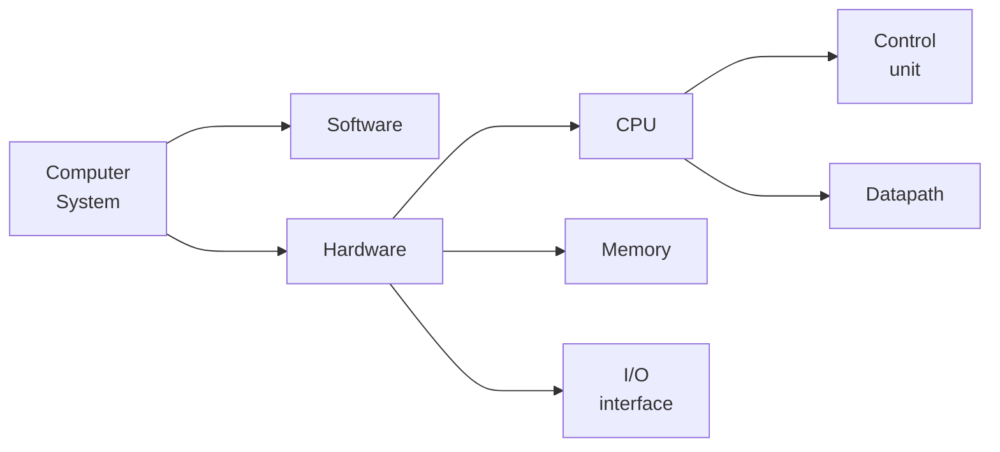

# Preface

## Components

## Performance

- 衡量计算机的性能和表现，无论对于工程师还是消费者都是一个非常必要的需求。其中一个重要的标准就是“运行速度”，具体来说：  
    - Response Time / Execution Time 从程序开始到结束的时间  
    - Throughput / Bandwidth 单位时间内完成的任务数量  

- 并且我们这样联系 performance 和 execution time：

$$
\text{Performance}_X = \frac{1}{\text{Execution time}_X}
$$

- 当我们需要衡量一个 CPU 的性能，或者具体去分析一个 CPU 的性能构成时，就需要更加具体的指标：  
    - CPU (execution) time（CPU 执行时间）  
    - CPU clock cycle（时钟周期数）  
    - clock rate（时钟频率） / clock cycle time（时钟周期）  

$$
\begin{aligned}
\text{CPU execution time} &= \text{CPU clock cycles} \times \text{Clock cycle time} \\
&= \frac{\text{CPU clock cycles}}{\text{Clock rate}}
\end{aligned}
$$

- 同时，还有一个容易得到的关系：

$$
\text{CPU execution time} = \text{Instructions counts } \times \text{Average Cycles per instruction}
$$

- 其中，每条指令的平均周期数(Average cycles per instruction)又缩写为 CPI。  
> CPI(clock cycles per instruction), the average number of clock cycles each instruction takes to execute = $\frac{\text{CPU clock cycles}}{\text{Instruction count}}$

- 于是，将上面的两块关系整合起来就得到：

$$
\begin{aligned}
\text{CPU time} &= \text{Instruction count} \times \text{CPI} \times \text{Clock cycle time} \\
&= \frac{\text{Instruction count} \times {\text{CPI}}}{\text{Cycle rate}}
\end{aligned}
$$

??? note "练习"
    === "题目"
        编译器可能提供两种代码序列，每一个序列都包含 A、B、C 三种类型的指令，每种指令的 CPI 如下表所示。

        |     |  A  |  B  |  C  |   
        |:---:|:---:|:---:|:---:|
        | CPI |  1  |  2  |  3  |
        |Instruction count @ seq 1|  2  |  1  |  2  |
        |Instruction count @ seq 2|  4  |  1  |  1  |

        1. 哪一个 seq 执行了最多的指令？
        2. 哪一个 seq 更快？
        3. 每一个 seq 的 CPI 是多少？

    === "答案"

        1.加起来就行。

        $$
        \begin{aligned}
            \text{instruction count @ seq 1} = 2 + 1 + 2 = 5 \\
            \text{instruction count @ seq 2} = 4 + 1 + 1 = 6
        \end{aligned}
        $$

        所以 2 多。

        2.由于产生差异的地方是编译器，所以我们默认时钟周期相同，所以比较 CPU time 等效于比较 clock cycles。

        $$
        \begin{aligned}
            \text{clock cycles @ seq 1} = 2 \times 1 + 1 \times 2 + 2 \times 3 = 10 \\
            \text{clock cycles @ seq 2} = 4 \times 1 + 1 \times 2 + 1 \times 3 = 9
        \end{aligned}
        $$

        所以 2 快。

        3.seq 的 CPI 就是 seq 的 clock cycles 除以 seq 的 instruction count：

        $$
        \begin{aligned}
              \text{CPI @ seq 1} = \frac{10}{5} = 2 \\
              \text{CPI @ seq 2} = \frac{9}{6} = 1.5
        \end{aligned}
        $$

