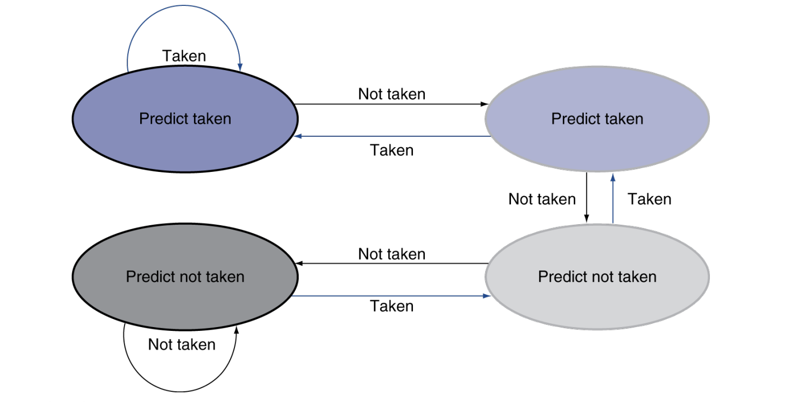

# Processor

## 单周期处理器

### Datapath

!!! abstract "Overview"

    

    - **PC** 寄存器存储当前运行到的指令的地址。**PC** 寄存器连到 **Instruction memory** 中，读出的结果就是当前要运行的指令。这个指令被 **Control** 解析产生相应的信号。

??? note "CPU在干什么"
    1. Fetch
        
        - 从memory中读取指令

        - 调整PC指针

    2. 解码指令并读取operand
        
        - 我们根据三种register在指令中的位置来确定读取哪些register operands，虽然不一定要用但一定要读

    3. 进行控制

        - 控制ALU进行哪个操作

    4. 访问内存

        - 决定是读取还是写入内存

    5. 结果写入寄存器

        - R-type **ALU结果**写入`rd`；I-type **MemoryData**写入`rd`

    6. 调整PC指针到跳转处(branch target)

---

#### R型指令

- (1) 处取出指令， `[6:0]` 被送到 Control 产生对应的控制信号，我们稍后可以看到； `[19:15]` , `[24:20]` ,`[11:7]` 分别对应 `rs1` , `rs2` , `rd` ，被连入 Registers 这个结构，对应地 `Read data 1` 和 `Read data 2` 两处的值即变为 `rs1` , `rs2` 的值；

- (2) 处 MUX 在 `ALUSrc = 0` 的信号作用下选择 `Read data 2` 作为 ALU 的输入与 `Read data 1` 进行运算，具体的运算由 `ALU control` 提供的信号指明。运算结果在 `ALU result` 中。

- (3) 处 MUX 在 `MemtoReg = 0` 的信号作用下选择 `ALU result` 作为写回 Register 的值，连到 (4) 处；在 (5) 处 `RegWrite = 1` 信号控制下，该值写入到 `rd` 寄存器中。

#### I型指令

#### S型指令

#### 跳转

### Control

|信号名称|置0时|置1时|
|---|----|----|
|RegWrite|不写入|写入WriteRegister|
|ALUScr|Rs2|立即数|
|Branch(PCSrc)|PC+4|跳转地址|
|Jump|PC+4|跳转地址|
|MemRead|不读|结合`address`从memory中读取数据|
|MemWrite|不写|往`address`处写入`Write data`|
|MemtoReg(**两位**)|00:选择ALU的结果|01:选择`memory data`；10:选择PC+4|

- 7+4的控制信号组合

- 我们发现只看opcode就可以决定7个控制信号，然后再去分析ALU的控制信号

- 于是我们采用两层解码的方式来控制

!!! tip "Main Controller"

    

    - 决定7个信号和ALUop的选择

---

!!! tip "ALU Controller"

    

## 流水线处理器

??? abstract "五级流水线"
    1. IF: Instruction Fetch

    2. ID: Instruction Decode and register read

    3. EX: Execute operation or calculate address

    4. MEM: Memory Access

    5. WB: Write Back to register

- CPI趋近于1，每一个时钟周期都有一个`WB`完成

### Hazards

!!! warning 
    1. Structure Hazards：一个被请求的资源仍处于忙碌状态

    2. Data Hazards：一条指令的数据，依赖于上一条的结束

    3. Control Hazards：在跳转之前可能就取到了下一条指令

#### Sturcture Hazards

- 问题：比如，前一个指令在 `ID` 阶段的时候，会使用到其在 `IF` 阶段读出的指令的内容；但与此同时后一个指令已经运行到 `IF` 阶段并读出了新的指令，那么**前一个指令就没的用了**！这个现象在很多地方普遍存在，包括 `Control` 信号的传递，因此我们实际上会在每两个 `stage` 之间用一些**寄存器**保存这些内容：

- 解决方法：在两级之间添加了寄存器；`IF/ID`,`ID/EX`,`EX/MEM`,`MEM/WB`

- 寄存器中的`WB/M/EX`（这些就是我们在中途会用到的`ALUSrc`,`MemRW`,`Branch``MemtoReg`,`RegWrite`等）一层一层往后传，直至只剩`WB`；

- 同时注意在图下方，我们还要处理`WB`阶段写回数据，因此还要将`WB`中的内容往回送到`WriteRegister`中

#### Data Hazard

- 问题：

    1. 在**同一个时钟周期**里，我既要把数据写回，也要读取新的寄存器值该怎么办呢？
    
    2. 我们在面对形如这样的指令时，流水线就会进入一个**stall**，因为形如第二句和第三句中的`x2`都依赖于第一句中的`x2`，那么它们必须等待第一句执行完毕

- 解决方法：

    1. 我们把一个时钟周期对半砍成上升和下降沿，前面交给`WB`去写回，后半交给`ID`去读取

    2. 我们引入一个聪明的方法"Bypass/Forward"，通过**旁路**把前一条或者前两条指令中已经计算好的寄存器结果，提前通过旁路拉给需要的那个**stage**

---

**最终方案**

- 第一步，划分开五级，中间加入寄存器；同时寄存器的数据要一步一步地往后传，（比如write register要一直传到WB这里才行）

- 第二步，处理bypass时，有hazard的情况就四种：

    - ID/EX.rs1 == EX/MEM.rd && REX/MEM.RegWrite == 1 && rd != x0

    - ID/EX.rs2 == EX/MEM.rd && REX/MEM.RegWrite == 1 && rd != x0

    - ID/EX.rs1 == MEM/WB.rd && REX/MEM.RegWrite == 1 && rd != x0

    - ID/EX.rs2 == MEM/WB.rd && REX/MEM.RegWrite == 1 && rd != x0

- 第三步，设定好control信号

!!! warning "特殊情况：Double Data Hazard"
    

    - 一定要选择**最新的**来Forward 

!!! warning "Load-Use Hazard"
    - 仔细观察会发现，Load操作也会满足上述公式的这些条件，但是Load全程的register里其实并没有最终值，最终值来自WB时

    - 那么我们就必须让下一条指令**stall**，**见"如何让流水线stall"**

    

!!! abstract "Forwarding公式"
    - 以01的情况为例

    

    - 这个公式就是先判断，Forward是来自祖先辈的，同时判断Forward不会来自父辈（标蓝的部分）

!!! tip "如何让流水线Stall"
    - 我们添加一个**Hazard detection unit**来判断是否发生了`Load`指令

    - 输入是IF/ID的`rs1`,`rs2`， ID/EX的`rd`,`MemRead`;

    - 输出是`PC Write`,`IF/ID Write`，和对contorl的一个MUX的选择信号

    - 强制让一会儿所有 ID/EX 中的控制信号**置零**，这样即使我stall的这条指令继续往下走，也是不会有任何改变（相当于变成了一条无效指令）

    - 让PC和IF/ID等待（通过使他们的write为0），防止stall的这条指令被覆盖了，同时我们不能继续往下读下一条指令

    

!!! tip "如何避免stall"
    > Code Scheduling to Avoid Stalls

    - 编译器把代码之间重新排序，来避免一些`stall`

    

#### Control Hazard/Branch Hazard

- 如果有beq指令，那么branch信号的产生在 MEM 这一阶段，但是这太晚了，会使得**下面取的三条指令可能白执行了**

---

- 所以我们将branch信号的计算提前到ID/EX，这样只可能浪费**一条指令**（比如下图中的`and x12,x2,x5`）

---

- 对于 branch 的进一步优化 -> 预测与缓存

- 预测：我们设置一个dynamic prediction；一般是2-bit(两次的历史branch信号)，如果一直预测成功，就保持这种预测；如果连续两次预测失败，就修正预测结果

- 缓存：添加一个cache来记录下最近使用过的target address

---

## Interrupt and Exception

!!! abstract "主要讨论"
    - 异常（Exception）：undefined instruction

    - 中断（Interrupt）：Interruption by IO, System call

- 问题：当异常发生的时候，CPU需要知道两件事

    1. 造成异常的原因

    2. 原来触发异常的位置

- 解决方案（查询模式）：
    
    1. 将造成这次异常的原因存入`CAUSE`寄存器,64-bits

    2. 将原来`PC`的内容存入`EPC`这个寄存器内

    3. CPU跳到一个固定的handler位置，然后查`CAUSE`，最后再到处理这个exception的程序上去

- 解决方法（向量模式）：

    1. 发现某个异常，就跳到对应的中断向量地址

    2. 然后于中断向量处再跳转

---

- 为了处理中断，我们会引入很多新的寄存器

- 然后这些寄存器的访问，只能通过csr指令

=== "mtvec"
    - 中断向量（Interrupt Vector）是一个指针或地址，用于指向处理特定中断请求的中断服务程序（Interrupt Service Routine, ISR）。中断向量通常存储在一个称为中断向量表（Interrupt Vector Table, IVT）的特定内存区域中。每个中断向量对应一个特定的中断类型，当中断发生时，处理器会查找中断向量表以确定相应的中断服务程序的地址，并跳转到该地址执行中断处理。

    

=== "mepc"

    

=== "mcause"

    - 通过特殊的编码，我们往`mcause`寄存器里存放造成Exception/Interruption的原因

    

    

----

- 异常处理的优先级: External > software > timer

- 中断处理的过程：

    1. 停止当前的程序流，从`mtvec`定义的PC地址开始执行

    2. 更新异常原因：`mcause`

    3. 更新异常PC寄存器：`mepc`

    4. 更新状态寄存器：`mstatus`

    5. 更新异常值寄存器：`mtcal`

- 退出异常的过程（`MRET`指令）：

    1. 程序流从`mepc`定义的pc地址开始执行

---

### Exceptions in a Pipeline

- 可以把中断视作另一种形式的 **control hazard**

- 我们重点关注 EX stage就行了，因为previous的指令是无罪的，可以让它们执行完，然后flush掉这一条和后面已经开始执行的指令

!!! tip "Example"
    
    

    ---

    