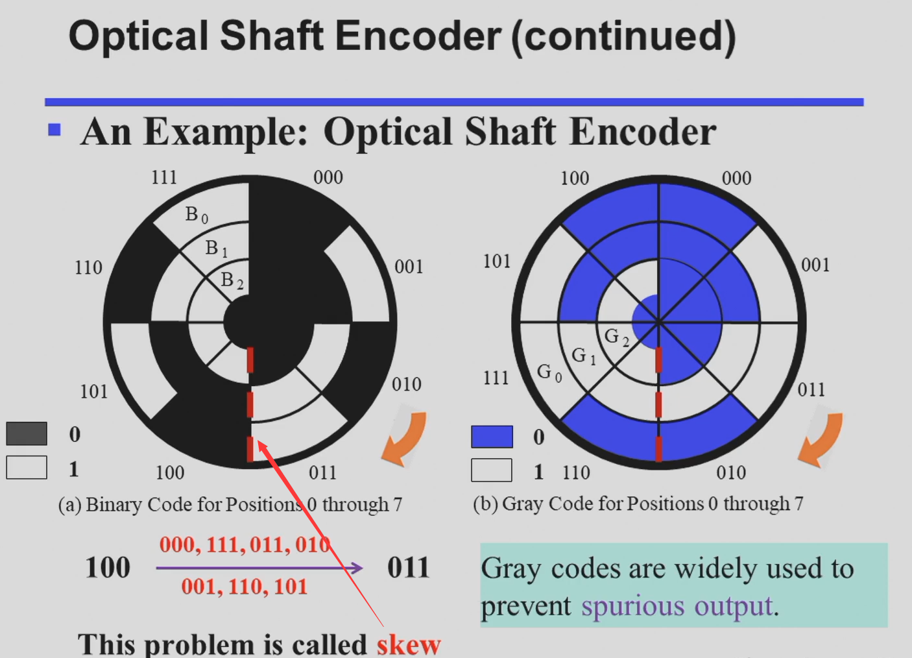

# Chapter 1
Digital Systems and Information

## BCD

| Decimal | 8,4,2,1 |
| --- | --- |
| 0 | 0000 |
| 1 | 0001 |
| 2 | 0010 |
| 3 | 0011 |
| 4 | 0100 |
| 5 | 0101 |
| 6 | 0110 |
| 7 | 0111 |
| 8 | 1000 |
| 9 | 1001 |

- 超过9的数都是 invalid

- 对于超过9的数字，先加6(0110)再进位，保证每四位满足BCD

- 将BCD码转binary,则先转decimal再算binary

## One-hot

- 独热码(one-hot) 要求比特向量中只有一位是 1；对应的还有 独冷码(one-cold)。

- 使用这种编码的好处是，决定或改变状态机目前的状态的成本相对较低，容易设计也容易检测非法行为等。

- 但是相对应的，缺点是信息表示率较低，非法状态非常多而有效状态很少。

## Gray

- 格雷码的特征，也是他的优点，就是相邻的两个数在二进制下的表示只差一位（当在占满时，对于整个编码序列，环状满足该条件）。

- 比如有如下应用：

- 以及在许多状态控制中都有着广泛的应用。

- 从笔试做题角度来说，格雷码最麻烦的其实是与十进制数的转换。