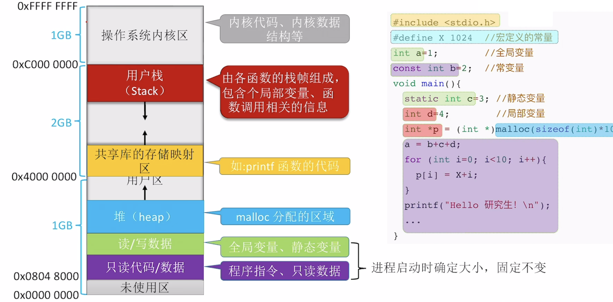

## 2.1 进程和线程

|进程|线程|
|---|----|
|资源分配的基本单位|CPU调度的基本单位|
|拥有独立分配的内存空间、寄存器；PCB作为唯一标识，记录资源分配状态|TCB|
|系统开销大，因为切换进程需要保存和恢复大量的上下文信息|系统开销小|

### 进程的通信

1. 共享存储

    - 存在一片可直接访问的共享空间，进程可以进行读写操作，实现进程间的信息交换；操作系统要提供同步互斥工具实现并发控制

2. 消息

    - 进程间可以通过格式化的message，实现数据交换。操作系统提供发送消息和接收消息两个原语，

    1. 直接通信方式：发送进程将消息发送到接受进程，消息会挂在消息缓冲队列上，接收进程从缓冲队列中读取消息

    2. 间接通信方式：利用信箱作为中间实体，这种用于*计网*

3. 管道通信

    - 管道是一种特殊的文件，本质上是一个固定大小FIFO的缓冲区；同时保证了三点机制：**1.互斥：一个进程对管道进行读写时，其他进程等待；2.同步：写满时阻塞等待读进程；读空时阻塞等待写进程；3.确定对方的存在**

    - Linux中频繁地使用到了管道，通常是4KB

    - 从管道读数据室一次性操作，一旦被读取，就会释放空间；普通管道只支持**单向通信**，双向通信需要两个管道

---

### 线程实现方式

1. 用户级线程

    - 并非真正地实现了线程，因为操作系统是不可见的，也无法用到多核实现并发

2. 内核级线程

    - 操作系统真正将核心线程和用户线程实现映射，然后采用多对多，就可以提高并发性，同时避免了内核线程过多开销大

## 3.1 内存管理

!!! abstract

    1. **内存的分配和回收**

    2. **内存的扩充**

    3. **进程逻辑地址和物理地址转换**

    4. **内存保护，进程运行时所占内存空间互不干扰**

### 进程的内存映像

### 连续分配管理方法

!!! info "**内部碎片**和**外部碎片**"

    - **内部碎片**，某进程分配的内存空间有部分没用上

    - **外部碎片**，内存的**空闲分区太小**而难以利用（本可以用上）

=== "单一连续分配"

    - 用户区就只放一个进程，
    
    - “奢侈”——无外部碎片，有内部碎片

=== "固定分区分配"

    - 用户区划分为固定的分区大小，每个分区只能放一个进程

    - 无外部碎片，有内部碎片，

=== "动态分区分配"

    - 无内部碎片，有外部碎片

    - 外部碎片用**紧凑**技术解决

