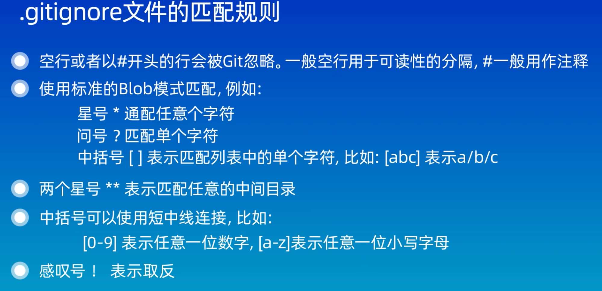
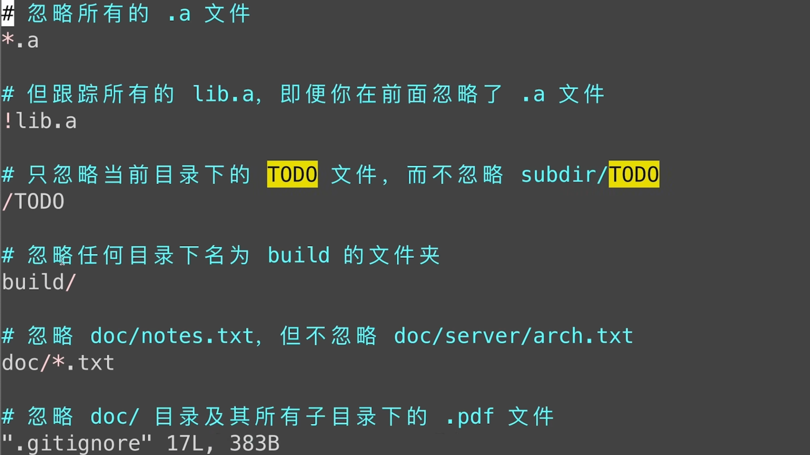

## basic commands

- `git add`
添加到暂存区(**stage**)
后可跟文件或文件夹  
`*.txt`可以添加所有以`.txt`结尾的文件  
`git add .`可以添加当前目录下所有文件
- `git commit`
提交暂存区中文件到仓库，工作区文件不会有变动  
`-m ”descriptions”`来添加本次提交的描述，不使用时会默认打开vim进行编辑
- `git log (--oneline)`  
查看git日志、版本号、修改内容等
- `git ls-files` 查看暂存区内容
- `git reset`  
`git reset --soft`保留暂存区和工作区的所有内容，只回溯commit内容  
`git reset --hard`删除暂存区和工作区的所有内容，回溯commit  
`git reset --mixed`删除暂存区内容，保留工作区内容，回溯commit  
`git reflog` 查看之前的操作找寻版本号，就可以再再回溯  
- `git diff` 比较各种区/提交/分支之间的差异  
`git diff` 比较工作区和暂存区的差异  
`git diff (Head/version)` 比较工作区和版本库的差异  
`git diff —cached / staged`比较暂存区和版本库的差异  
`git diff v1 v2` 比较两个版本的差异  
- `git rm` 删除暂存区和工作区中的文件，对版本库没有影响，所以记得提交  
`git rm —cached` 只删除暂存区文件  
`git rm -r *` 递归删除某个目录下所有文件和子目录  

## .gitignore

## github

- 生成SSH Key
`ssh-keygen -t rsa -b 4096`  
private:`id_rsa`    
public: `id_rsa.pub`
- 添加远程仓库  
`git remote add <远程仓库别名> <远程仓库地址>`  
    
    `git push -u <远程仓库名> <分支名>`
    
- 拉取远程仓库内容  
`git pull <远程仓库名> <远程分支名>:<本地分支名>`

## branch

- `git branch` 查看分支列表  
`git branch branch-name` 创建分支  
`git checkout branch-name` （可能有冲突） 切换分支  
`git switch branch-name` 切换分支  
`git merge branch-name` （目标分支为当前所在分支）  
`git branch -d branch-name` 删除已合并分支  
`git branch -D branch-name` 强制删除分支   
- `git merge`  
发生冲突时，利用`git status`，`git diff` 查看冲突  
并手动修改文件内容后再提交  
若想终止合并则用 `git merge —abort`  
- `git rebase branch` 变基分支，变成一条直线  