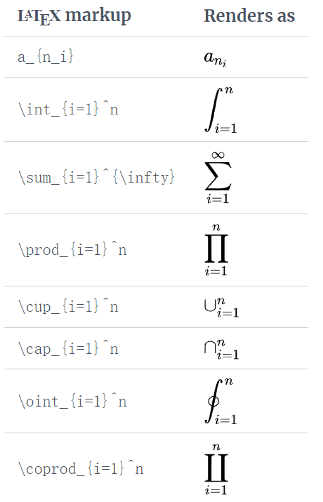
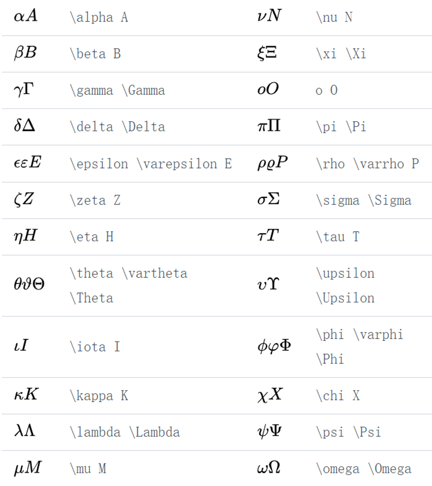
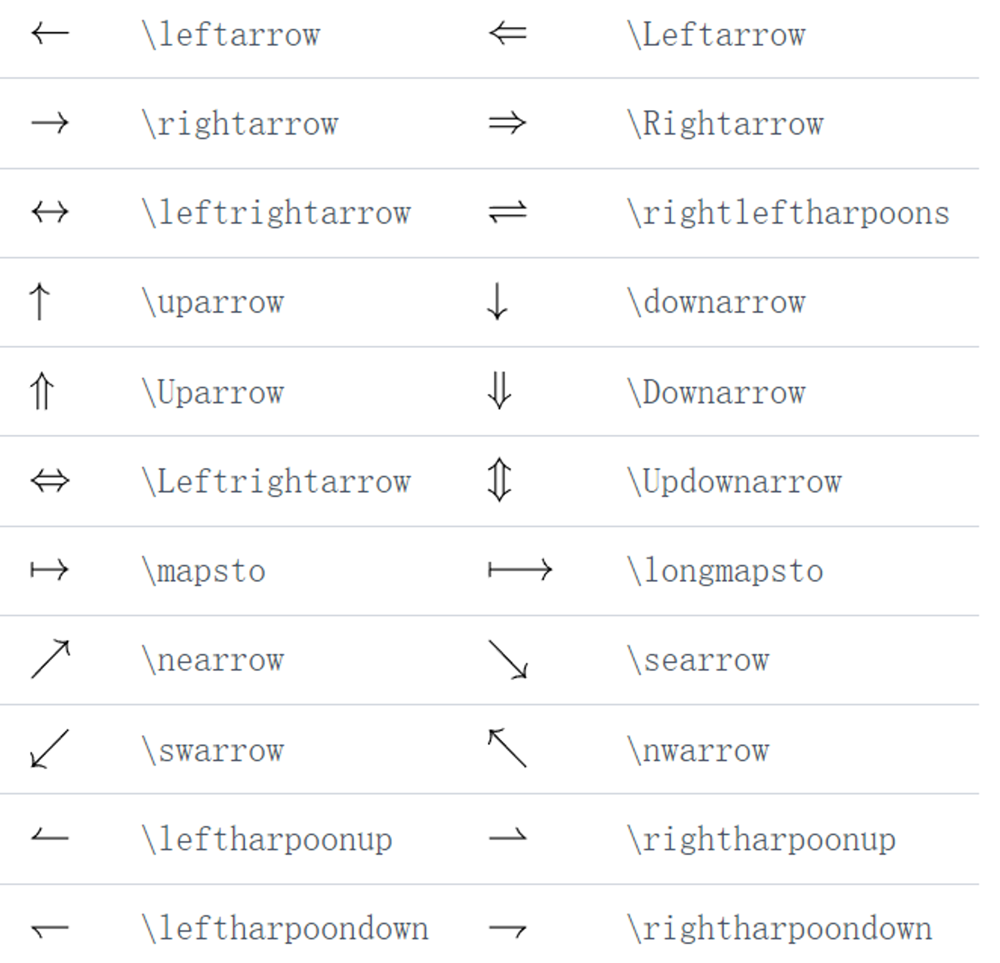
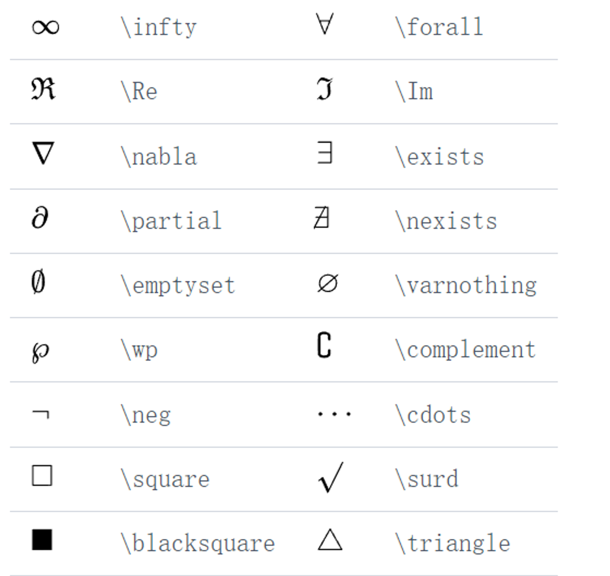
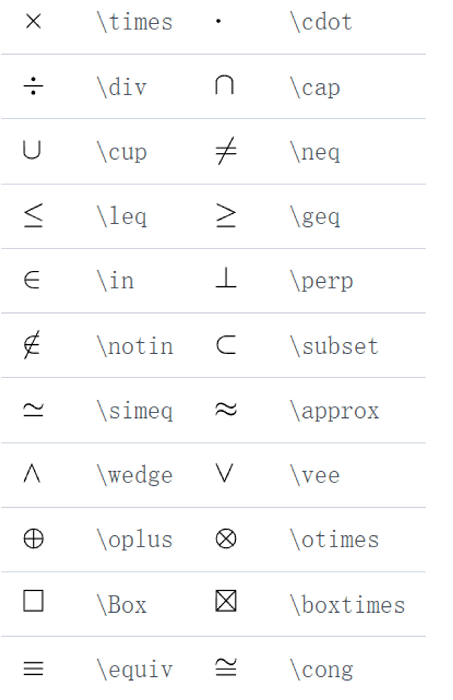

## Reference
[***Overleaf manual***](https://cn.overleaf.com/learn/latex/Learn_LaTeX_in_30_minutes)

### 基本框架

- 第一行代码声明**文本类型**

    ```latex
    \document{article}
    \begin{document}
    contents
    contents
    \end{document}
    ```

- **序言（before the `\begin{document}`）（*preamble*）**
    
    ```latex
    \documentclass[12pt, letterpaper]{article}
    \usepackage{graphicx}
    ```
    
    - `[]`内设置文本**字体大小**(12pt,11pt,10pt,9pt)，**纸张尺寸(letterpaper,a4paper,legalpaper)**等
    - **加载外部包(如**`\usepackage{graphicx}`**),以拓展Latex功能**

### 标题、作者与日期

- 在***preamble***部分添加三类行

```latex
\documentclass[12pt]{article}
\title{title name}
\author{author's name}
\author{author's\thanks{somebody}}
\date{Year month day}
\date{today}
\begin{document}
\maketitle

\end{document}
```

- **记得添加`\maketitle`来排版**

### 文本

- **斜体、粗体、下划线**

```latex
**\textbf{…}
\textit{…}
\underline{…}**
```

- **注释：%**

### **图像**

- **前置：附加包（add-on package）**

```latex
\usepackage{graphicx}
\graphicspath{{directory/}}
...
...
...
\includegraphics{file_path or file_name}
```

**注意：目录地址有2个中括号**

- **为图片添加标题(captions)、标签(labels)、参考文献(references)**

```latex
\documentclass{article}
\usepackage{graphicx}
\graphicspath{{images/}}
 
\begin{document}

\begin{figure}[h]
    \centering
    \includegraphics[width=0.75\textwidth]{mesh}
    \caption{A nice plot.}
    \label{fig:mesh1}
\end{figure}
 
As you can see in figure \ref{fig:mesh1}, the function grows near the origin. This example is on page \pageref{fig:mesh1}.

\end{document}
```

常用命令**：**

- **`\includegraphics[width=0.75\textwidth]{mesh}`**  
`\includegraphics` 指示 LATEX 将图形的**宽度设置**为文本宽度的 75%，其值存储在 `\textwidth` 命令中。
- `\caption{A nice plot.}`   
此命令设置可以放置在图形上方或下方的**图形标题**。如果创建图表列表，则此标题将在该列表中使用。
- `\label{fig:mesh1}`  
为其添加**标签**。该标签用于为图像生成一个数字，并与下一个命令结合使用，将允许您引用它。
`\ref{fig:mesh1}`
此代码将替换为与参考图对应的数字。

### 创建列表

- 可以使用**环境**创建不同类型的列表，这些环境用于封装实现特定排版功能所需的 LATEX 代码。  
- 环境以 `\begin{*environment-name*}` 开头并以`\end{*environment-name*}` 结尾
- 其中`*environment-name*` 可以是 ***figure,tabular***或列表类型之一：`itemize` 无序列表或 `enumerate` 有序列表。
- **有序列表：**
    
    ```latex
    \documentclass{article}
    \begin{document}
    \begin{enumerate}
      \item This is the first entry in our list.
      \item The list numbers increase with each entry we add.
    \end{enumerate}
    \end{document}
    ```
    
    


- **无序列表：做法相同，就是 *enumerate 换成 itemize***
    
    

### 数学公式

**两种模式：*Inline math mode  
                  Display math mode***

- ***Inline math mode：嵌入文本***
    
    ```latex
    \documentclass[12pt, letterpaper]{article}
    \begin{document}
    \begin{math}
    E=mc^2
    \end{math} is typeset in a paragraph using inline math mode---as is $E=mc^2$, and so too is \(E=mc^2\).
    \end{document}
    ```
    ??? note "示例"
        $$
        E=mc^2
        $$

        is typeset in a paragraph using inline math mode --- as is $E=mc^2$, and so too is \(E=mc^2\)
    
    **排版**使用以下**分隔符**对之一：或 `$ ... $` `\begin{math} ... \end{math}`
    
- ***Display math mode：另行醒目***
    
    ```latex
    \documentclass[12pt, letterpaper]{article}
    \begin{document}
    The mass-energy equivalence is described by the famous equation
    \[ E=mc^2 \] discovered in 1905 by Albert Einstein. 
    
    In natural units ($c = 1$), the formula expresses the identity
    \begin{equation}
    E=m
    \end{equation}
    \end{document}
    ```
    ??? note "示例"
        The mass-energy equivalence is described by the famous equation 
        
        $$
        E=mc^2
        $$

        discovered in 1905 by Albert Einstein  
        In natural units ($c = 1$), the formula expresses the identity

        $$
        E=m \tag{1}
        $$
    
    - **使用以下分隔符对之一：** 
    `\[ ... \]` 
    `\begin{displaymath} ... \end{displaymath}` 
    `\begin{equation} ... \end{equation}` **（有公式编号）**
- **示例**
    
    ```latex
    \documentclass{article}
    \begin{document}
    Subscripts in math mode are written as $a_b$ and superscripts are written as $a^b$. These can be combined and nested to write expressions such as
    
    \[ T^{i_1 i_2 \dots i_p}_{j_1 j_2 \dots j_q} = T(x^{i_1},\dots,x^{i_p},e_{j_1},\dots,e_{j_q}) \]
     
    We write integrals using $\int$ and fractions using $\frac{a}{b}$. Limits are placed on integrals using superscripts and subscripts:
    
    \[ \int_0^1 \frac{dx}{e^x} =  \frac{e-1}{e} \]
    
    Lower case Greek letters are written as $\omega$ $\delta$ etc. while upper case Greek letters are written as $\Omega$ $\Delta$.
    
    Mathematical operators are prefixed with a backslash as $\sin(\beta)$, $\cos(\alpha)$, $\log(x)$ etc.
    \end{document}
    ```
    ??? note "示例"
        Subscripts in math mode are written as $a_b$ and superscripts are written as $a^b$. These can be combined and nested to write expressions such as
        
        \[ T^{i_1 i_2 \dots i_p}_{j_1 j_2 \dots j_q} = T(x^{i_1},\dots,x^{i_p},e_{j_1},\dots,e_{j_q}) \]
        
        We write integrals using $\int$ and fractions using $\frac{a}{b}$. Limits are placed on integrals using superscripts and subscripts:
        
        \[ \int_0^1 \frac{dx}{e^x} =  \frac{e-1}{e} \]
        
        Lower case Greek letters are written as $\omega$ $\delta$ etc. while upper case Greek letters are written as $\Omega$ $\Delta$.
        
        Mathematical operators are prefixed with a backslash as $\sin(\beta)$, $\cos(\alpha)$, $\log(x)$ etc.
    

    
- `amsmath` 包提供 `equation*` 的环境：
\usepackage{amsath}
[help article](https://cn.overleaf.com/learn/latex/Aligning_equations).

- **教程**
    - [Mathematical expressions数学表达式](https://cn.overleaf.com/learn/latex/Mathematical_expressions)
    - [Subscripts and superscripts下标和上标](https://cn.overleaf.com/learn/latex/Subscripts_and_superscripts)
        
    - [Brackets and Parentheses括号和括号](https://cn.overleaf.com/learn/latex/Brackets_and_Parentheses)
    - [Fractions and Binomials 分数和二项式](https://cn.overleaf.com/learn/latex/Fractions_and_Binomials)
        - *\frac{enumerator}{denominator}*
        - 各类文本呈现形式
        `\textstyle` ：在段落中应用用于数学排版的样式
        `\displaystyle` ：将数学排版的风格单独应用于行
        `\scriptstyle` ：应用用于下标或上标的样式
        `\scriptscriptstyle` ：应用用于二阶下标或上标的样式
            
        ```latex
        \documentclass{article}
        % Using the geometry package to reduce
        % the width of help article graphics
        \usepackage[textwidth=8cm]{geometry}
        \usepackage{amsmath}% For the \text{...} command
        \begin{document}
        We use the \texttt{amsmath} package command
        \verb|\text{...}| to create text-only fractions
        like this:
        
        \[\frac{\text{numerator}}{\text{denominator}}\]
        
        Without the \verb|\text{...}| command the result 
        looks like this:
        
        \[\frac{numerator}{denominator}\]
        \end{document}
        ```
        ??? note "示例"
            We use the amsmath package command
            \text(...) to create text-only fractions
            like this:

            \[\frac{\text{numerator}}{\text{denominator}}\]

            Without the \text(...) command the result 
            looks like this:

            \[\frac{numerator}{denominator}\]

        
        ```latex
        \documentclass{article}
        % Using the geometry package to reduce
        % the width of help article graphics
        \usepackage[textwidth=9.5cm]{geometry}
        \begin{document}
        
        Fractions typeset within a paragraph typically look like this: \(\frac{3x}{2}\). You can force \LaTeX{} to use the larger display style, such as \( \displaystyle \frac{3x}{2} \), which also has an effect on line spacing. The size of maths in a paragraph can also be reduced: \(\scriptstyle \frac{3x}{2}\) or \(\scriptscriptstyle \frac{3x}{2}\). For the \verb|\scriptscriptstyle| example note the reduction in spacing: characters are moved closer to the \textit{vinculum} (the line separating numerator and denominator).
        
        Equally, you can change the style of mathematics normally typeset in display style:
        
        \[f(x)=\frac{P(x)}{Q(x)}\quad \textrm{and}\quad \textstyle f(x)=\frac{P(x)}{Q(x)}\quad \textrm{and}\quad \scriptstyle f(x)=\frac{P(x)}{Q(x)}\]
        \end{document}
        ```
        ??? note "示例"
            Fractions typeset within a paragraph typically look like this: \(\frac{3x}{2}\). You can force \(\LaTeX{}\) to use the larger display style, such as \( \displaystyle \frac{3x}{2} \), which also has an effect on line spacing. The size of maths in a paragraph can also be reduced: \(\scriptstyle \frac{3x}{2}\) or \(\scriptscriptstyle \frac{3x}{2}\). For the *\scriptscriptstyle* example note the reduction in spacing: characters are moved closer to the $\textit{vinculum}$ (the line separating numerator and denominator).

            Equally, you can change the style of mathematics normally typeset in display style:

            \[f(x)=\frac{P(x)}{Q(x)}\quad \textrm{and}\quad \textstyle f(x)=\frac{P(x)}{Q(x)}\quad \textrm{and}\quad \scriptstyle f(x)=\frac{P(x)}{Q(x)}\]

        
    - **套娃且字体合适的分数** `\cfrac`
        
        ```latex
        \documentclass{article}
        % Using the geometry package to reduce
        % the width of help article graphics
        \usepackage[textwidth=9.5cm]{geometry}
        % Load amsmath to access the \cfrac{...}{...} command
        \usepackage{amsmath}
        \begin{document}
        Fractions can be nested but, in this example, note how the default math styles, as used in the denominator, don't produce ideal results...
        
        \[ \frac{1+\frac{a}{b}}{1+\frac{1}{1+\frac{1}{a}}} \]
        
        \noindent ...so we use \verb|\displaystyle| to improve typesetting:
        
        \[ \frac{1+\frac{a}{b}} {\displaystyle 1+\frac{1}{1+\frac{1}{a}}} \]
        
        Here is an example which uses the \texttt{amsmath} \verb|\cfrac| command:
        
        \[
            a_0+\cfrac{1}{a_1+\cfrac{1}{a_2+\cfrac{1}{a_3+\cdots}}}
        \]
        
        Here is another example, derived from the \texttt{amsmath} documentation, which demonstrates left
        and right placement of the numerator using \verb|\cfrac[l]| and \verb|\cfrac[r]| respectively:
        \[
        \cfrac[l]{1}{\sqrt{2}+
        \cfrac[r]{1}{\sqrt{2}+
        \cfrac{1}{\sqrt{2}+\dotsb}}}
        \]
        \end{document}
        ```
        ??? note "示例"
            Fractions can be nested but, in this example, note how the default math styles, as used in the denominator, don't produce ideal results...
        
            \[ \frac{1+\frac{a}{b}}{1+\frac{1}{1+\frac{1}{a}}} \]
            
            \noindent ...so we use \verb|\displaystyle| to improve typesetting:
            
            \[ \frac{1+\frac{a}{b}} {\displaystyle 1+\frac{1}{1+\frac{1}{a}}} \]
            
            Here is an example which uses the \texttt{amsmath} \verb|\cfrac| command:
            
            \[
                a_0+\cfrac{1}{a_1+\cfrac{1}{a_2+\cfrac{1}{a_3+\cdots}}}
            \]
            
            Here is another example, derived from the $\text{amsmath}$ documentation, which demonstrates left
            and right placement of the numerator using *\cfrac[l]* and *\cfrac[r]* respectively:
            
            $$
            \cfrac[l]{1}{\sqrt{2}+
            \cfrac[r]{1}{\sqrt{2}+
            \cfrac{1}{\sqrt{2}+\dotsb}}}
            $$
        
        
        ```latex
        \documentclass{article}
        \usepackage{amsmath}
        \begin{document}
        \newcommand*{\contfrac}[2]{%
        {
            \rlap{$\dfrac{1}{\phantom{#1}}$}%
            \genfrac{}{}{0pt}{0}{}{#1+#2}%
        }
        }
        \[
            a_0 +
            \contfrac{a_1}{
            \contfrac{a_2}{
            \contfrac{a_3}{
            \genfrac{}{}{0pt}{0}{}{\ddots}
            }}}
        \]
        
        \end{document}
        ```
        
        ??? note "示例"
            

            
    - [Operators 运算符](https://cn.overleaf.com/learn/latex/Operators)
    - [Spacing in math mode数学模式下的间距](https://cn.overleaf.com/learn/latex/Spacing_in_math_mode)
    - [Integrals, sums and limits积分、和和极限](https://cn.overleaf.com/learn/latex/Integrals%2C_sums_and_limits)
        
        
    - [Display style in math mode数学模式下的显示样式](https://cn.overleaf.com/learn/latex/Display_style_in_math_mode)
    - [List of Greek letters and math symbols希腊字母和数学符号列表](https://cn.overleaf.com/learn/latex/List_of_Greek_letters_and_math_symbols)
        - **Greek Letters**
        
        
        
        - **Arrows**
        
        
        
        - **Miscellaneous symbols**
        
        
        
        - **Binary Operation/Relation Symbols**
        
        
        
    - [Mathematical fonts 数学字体](https://cn.overleaf.com/learn/latex/Mathematical_fonts)