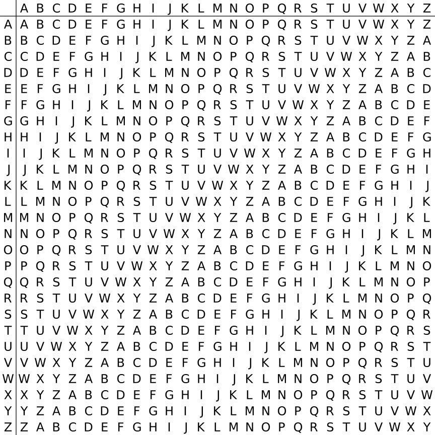

## Crypto

### 古典密码

#### 凯撒密码

凯撒密码（Caesar）加密时会将明文中的 每个字母 都按照其在字母表中的顺序向后（或向前）移动固定数目（循环移动）作为密文。例如，当偏移量是左移 3 的时候（解密时的密钥就是 3）：

```
明文字母表：ABCDEFGHIJKLMNOPQRSTUVWXYZ
密文字母表：DEFGHIJKLMNOPQRSTUVWXYZABC
```

#### Vigenere
维吉尼亚密码（Vigenere）是使用一系列凯撒密码组成密码字母表的加密算法，属于多表密码的一种简单形式。


- 对于类Vigenere密码的破解
1. 对于大量出现的常见单词来进行推测，如the,and等
2. Vigenere加密会有周期性，那么相同密文的索引值的公因数就是密文长度
3. 确定密文长度后，然后根据推测的明文和已知的密文来反推密钥
4. 确定几位密钥后，我们就按密钥长度将全文进行划分，然后利用密钥把每组的密文翻译成明文，再根据单词常识去猜测附近明文

#### Hill

希尔密码（Hill）使用每个字母在字母表中的顺序作为其对应的数字，即 A=0，B=1，C=2 等，然后将明文转化为 n 维向量，跟一个 n × n 的矩阵相乘，再将得出的结果模 26。注意用作加密的矩阵（即密匙）必须是可逆的，否则就不可能解码。只有矩阵的行列式和 26 互质，才是可逆的。

- E.g:
我们有明文`ACT`，转成矩阵

$$
\left[
\begin{matrix}
0\\
2\\
9\\
\end{matrix}
\right]
$$

假设密钥是：

$$
\left[
\begin{matrix}
6 & 24 & 1\\
13 & 16 & 10\\
20 & 17 & 15\\
\end{matrix}
\right]
$$

加密过程为：

$$
\left[
\begin{matrix}
0\\
2\\
9\\
\end{matrix}
\right]
\left[
\begin{matrix}
6 & 24 & 1\\
13 & 16 & 10\\
20 & 17 & 15\\
\end{matrix}
\right]
\equiv
\left[
\begin{matrix}
67\\
222\\
319\\
\end{matrix}
\right]
\equiv
\left[
\begin{matrix}
15\\
14\\
7\\
\end{matrix}
\right]
\text{mod 26}
$$

密文即为：`POH`
