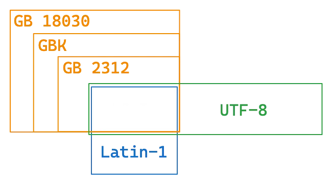
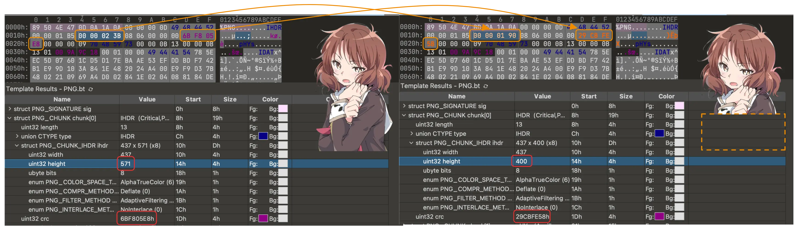

## Misc

### 编解码

常见的字符编码：

- ASCII：一共 128 个项，即每个字符可以用一个 7 位的 01 串表示（或一字节）
- Latin-1（ISO-8859-1）：扩展了 ASCII，一共 256 个项
- 利用 Unicode 字符集的一系列编码
    - UTF-8 / UTF-16 / UTF-32 / UCS
- 中国国标字符集系列编码
    - GB 2312 / GBK / GB 18030-2022

乱码的原因:  
**几个字符集不兼容的部分互相编解码**，常见的：

- 用 GBK 解码 UTF-8 编码的文本
- 用 UTF-8 解码 GBK 编码的文本
- 用 latin-1 解码 UTF-8 编码的文本
- 用 latin-1 解码 GBK 编码的文本
- 先用 GBK 解码 UTF-8 编码的文本，再用 UTF-8 解码前面的结果
- 先用 UTF-8 解码 GBK 编码的文本，再用 GBK 解码前面的结果
    

#### Base编码系列
- Base16：即 16 进制表示字节流，长度翻倍
- Base32：按照 5 bit 一组（每个 0-31），按照字符表（A-Z2-7）映射
    - 结果长度必须是 5 的倍数，不足的用 = 不齐（明显特征）
- Base64：按照 6 bit 一组，按照字符表映射（最常用）
    - 标准字符表：A-Za-z0-9+/
    - 另有多种常用字符表，如 URL 安全字符表：A-Za-z0-9-_
    - 结果长度必须是 4 的倍数，不足的用 = 不齐（1~2 个，明显特征）

### 文件、图像隐写

#### 文件系统基础

如何判断文件的类型

- 拓展名
    - .jpg .bmp .gif .wav ...
    - 是文件名的一部分，可以随意修改
    - （在一些桌面系统下）决定了打开文件的默认程序
- 内容
    - 通过文件内容来识别文件类型
    - file命令
    - 不同文件类型有各自独特的**魔数（magic number）**
- 常见文件的magic number：

| 文件类型 | 文件头 | 对应ASCII |
|--------|--------|--------|
| JPEG | FF D8 FF | ... |
| PNG |89 50 4E 47 0D 0A 1A 0A|.PNG....|
| GIF |47 49 46 38 39 61	|GIF89a|
|PDF|25 50 44 46	|%PDF|
|ZIP|50 4B 03 04	|PK..|
|RAR|52 61 72 21	|Rar!|
|7zip|37 7A BC AF 27 1C	|7z..'.|
|WAV|52 49 46 46	|RIFF|

- 利用binwalk或者foremost来分离文件末尾附加内容

#### 图像隐写基础技术

- 文件末尾添加数据
    - exiftool 识别短数据，或者十六进制编辑器直接观察
    - binwalk 识别叠加文件，foremost 提取
    - 图像末尾叠加一个压缩包，就是所谓的“图种”
        - 修改后缀名可能可以解压（部分解压软件会忽略前面的图像）
        - 其实不如直接分离
- 直接利用元信息
    - exiftool 即可读取

##### LSB隐写
- 人眼对于微小的颜色变化不敏感
    - 对于 8 bit 的颜色值，最低位的变化不会被察觉
    - 可以随意修改最低位，而不影响图像的显示效果
- LSB 隐写将颜色通道的最低位用来编码信息
    - 图像：stegsolve / CyberChef View Bit Plane
    - 数据：stegsolve / CyberChef Extract LSB / zsteg / PIL

##### PIL图像处理基础
- PIL（Python Imaging Library）是 Python 中非常常用的图像处理库
- 基本用法：
    - from PIL import Image 导入和图像读写处理有关的 Image 类
    - img = Image.open(file_name) 打开图像
    - img.show() 显示图像；img.save(file_name) 保存图像
    - img.size 图像大小，img.mode 图像模式
    - img.convert(mode) 转换图像模式
    - img.getpixel((x, y)) 获取像素点颜色
    - img.putpixel((x, y), color) 设置像素点颜色
    - np.array(img) 将图像转换为 numpy 数组

#### 进阶隐写技术
##### 图像大小修改
- PNG 图像按行进行像素数据的压缩，以及存储 / 读取
- 当解码时已经达到了 IHDR 中规定的大小就会结束
- 因此题目可能会故意修改 IHDR 中的高度数据，使之显示不全
- 恢复的话更改高度即可，同时注意 crc 校验码，否则可能报错
    - binascii.crc32(data)，data 为从 IHDR 开始的数据

##### ZIP伪加密
- ZIP 也使用分段的方式存储数据
    - 本地文件记录 50 4B 03 04，可以有多个  
    - 中央目录记录 50 4B 01 02，可以有多个
    - 中央目录结束 50 4B 05 06
- 在中央目录记录中有一个字段记录加密方式
    - 如果不为 0 表示有加密
- 其他字段，如最小版本
    - 可能修改为一个不合法的值，无法用解压软件解压
