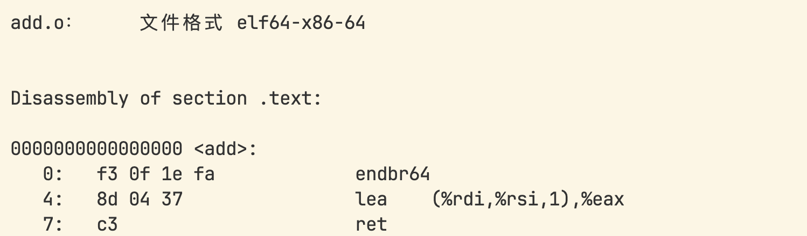
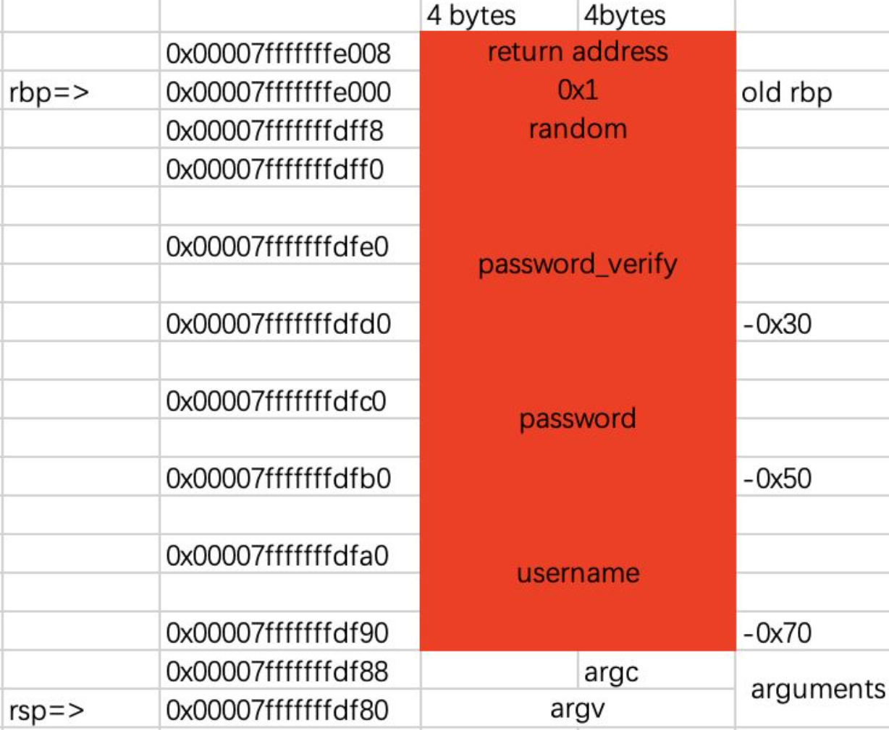

## Pwn
### 代码注入漏洞
#### shellcode
- 以inject_me为例
    - 题目给定了一段可读可写可执行的内存，程序将会读取我们的输入并写入这段内存中，然后通过函数指针来实现想要的效果——我们要将**机器码**作为STDIN
    - 便捷方法，用c写一个函数，然后编译汇编得到机器码
    - `gcc -O2 add.c -o add.s`选择二级优化得到更简洁的汇编代码，然后`as add.s -o add.o`得到机器码
    
    - 最后利用python传入`add_code=b'\xf3\x0f\x1e\xfa\x8d\x04\x37\xc3'`
- 同样的inject_me，由于给定的这段内存很危险，我们就可以用来执行**sh()**命令，只需要传入相应的机器码即可（可以用**pwntools**中的**shellcraft**或者是自己编写**汇编代码**后汇编）
- 注意：不同**架构**对应的shellcode也不同

### 栈溢出
- 栈溢出操作的用途
    
- 栈从高地址->低地址
- \$rsp 栈顶指针，\$rbp 栈底指针
- 函数通过在栈中取用一段内存空间来存放临时变量
    
- 应用例：
    - 将password内容覆盖，以实现验证通过
    - 将函数返回的地址修改（ret指针），以跳转到另一个函数
