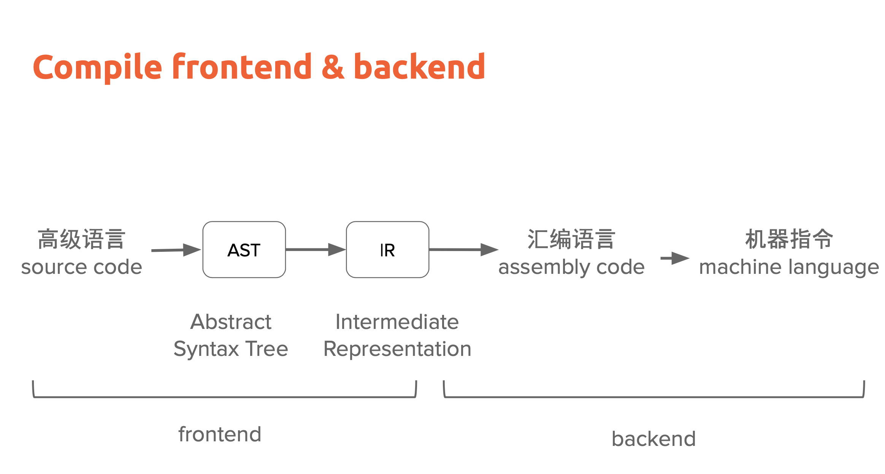
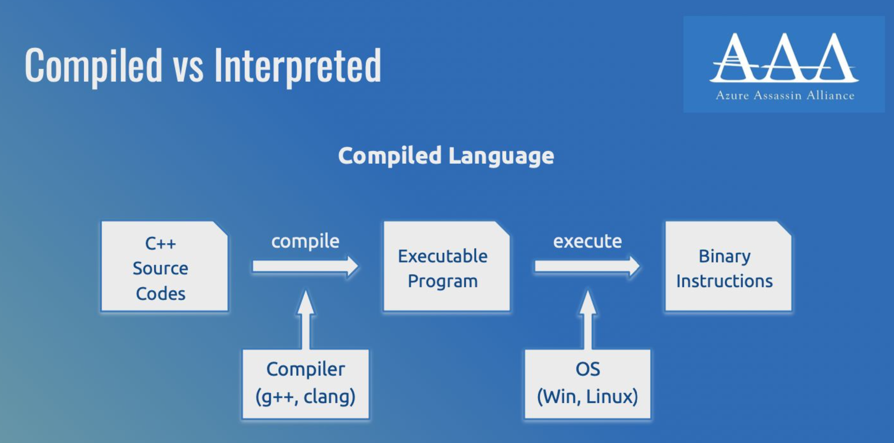
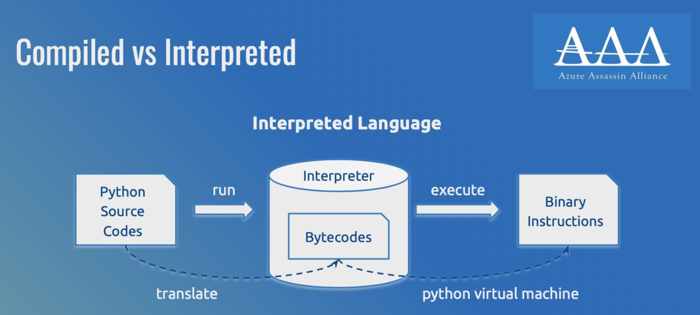
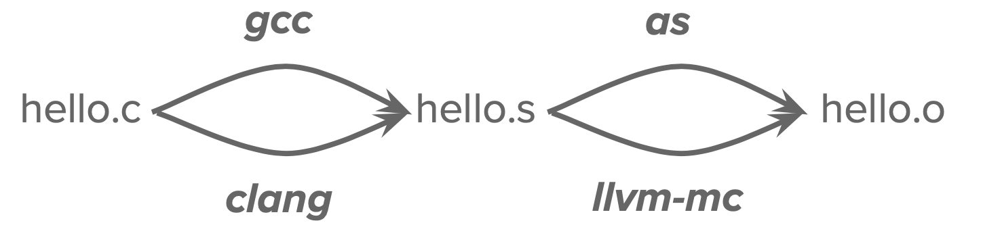
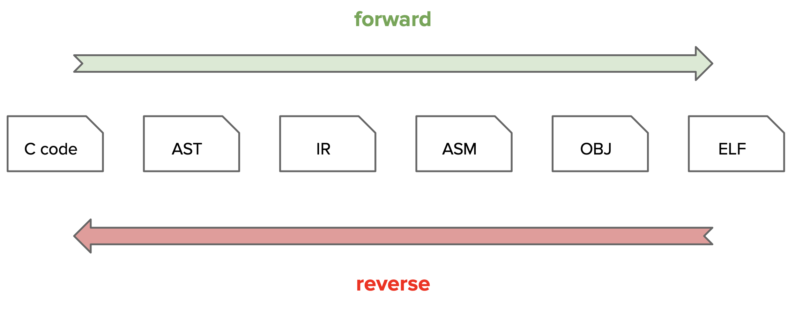

# Reverse
## 从程序到可执行文件

## 检视ELF文件
- file
    - `file`命令用于确定给定文件的类型
- objdump
    - `objdump -d hello.o | less`
    - `objdump`命令用于显示二进制文件的信息，通过-d选项来进行反汇编的得到汇编语言结果，hello.o是要处理的目标文件
- readelf
    - `readelf -a program | less`
    -  `readelf`是一个工具，用于显示 ELF 文件格式的信息
    - `-a`显示所有可用的信息，包括文件头、节头、版本、架构、大小端序

## ELF的编译、链接
- 编译（汇编）：从源文件到目标文件
    - 预处理：包含**头文件替换，宏展开**;`gcc -E hello.c -o hello.c.i`
    - 编译：将预处理后的源代码转换为**汇编语言**，`gcc -S hello.c -o hello.s`
    - 汇编：`as hello.s -o hello.o`
    - `.s`为汇编语言源代码文件，`.o`为目标文件，包含了从.s文件经过汇编器处理后生成的机器语言代码
- 链接：从目标文件到可执行文件

链接的部分暂略过

## ELF程序的逆向

### ELF 的静态逆向: 反汇编器与反编译器
- 反汇编:机器指令 => 汇编指令(查表、准确)
    - objdump
- 反编译:汇编指令 => 编程语言(分析/特征匹配/启发式 ... 、往往不准确)
    - IDA pro
    - Ghidra 
