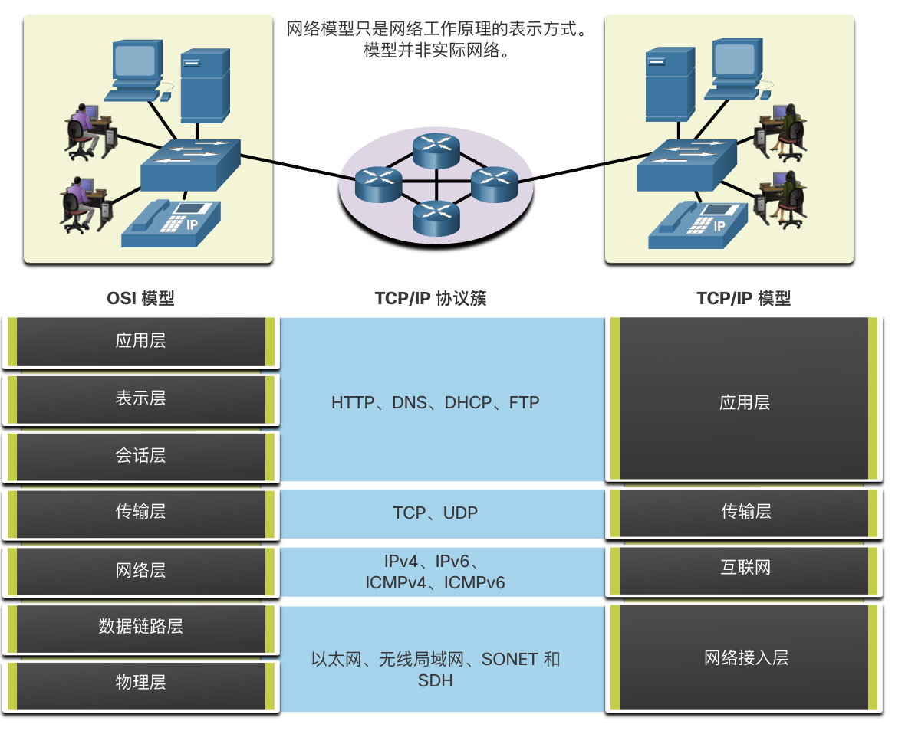
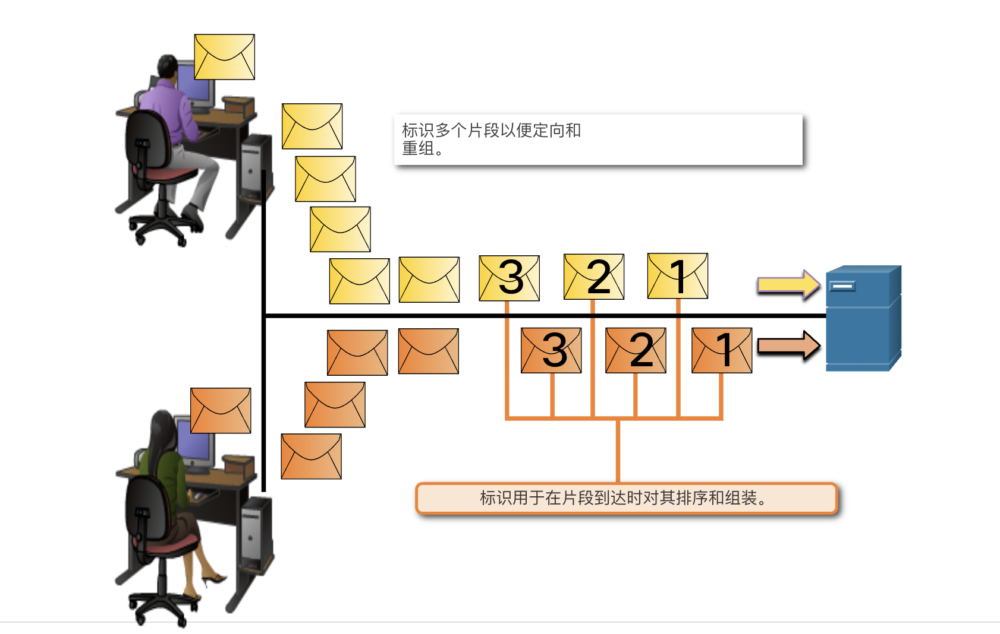
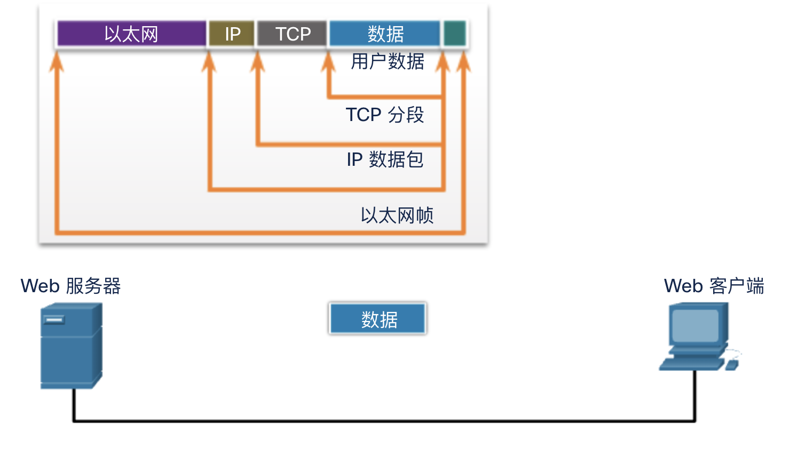
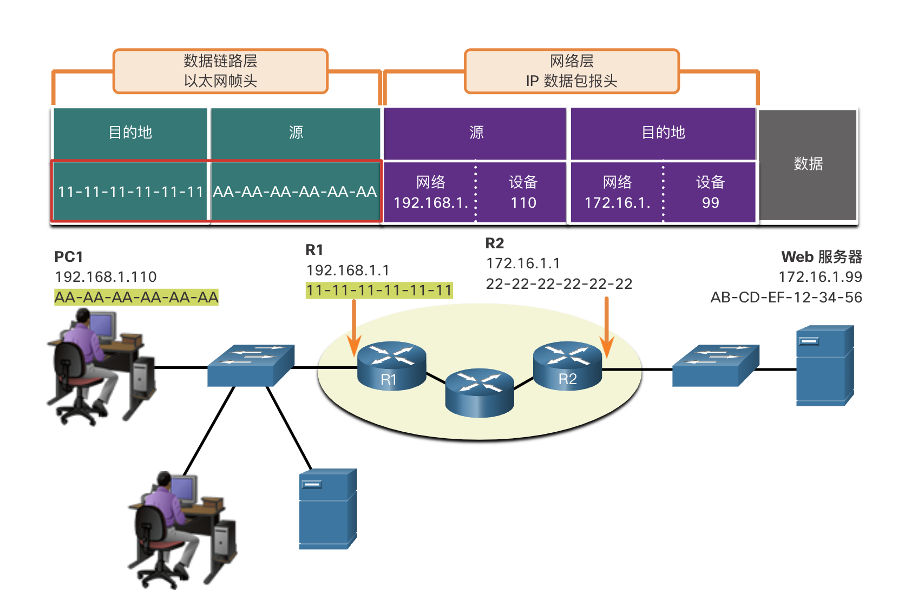
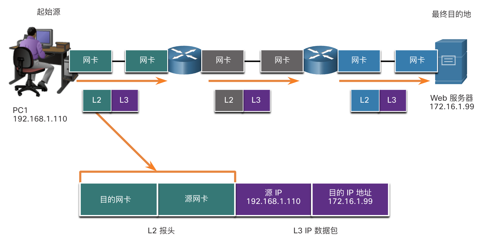
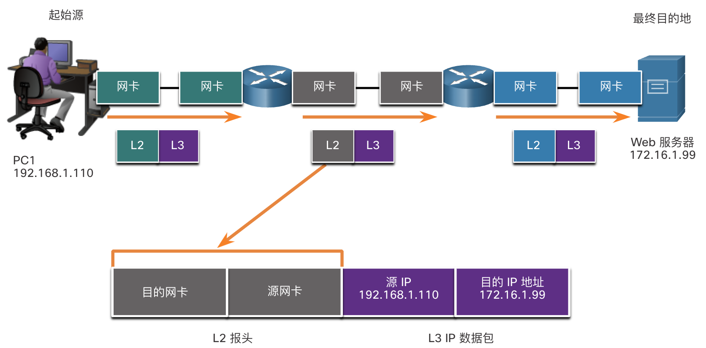
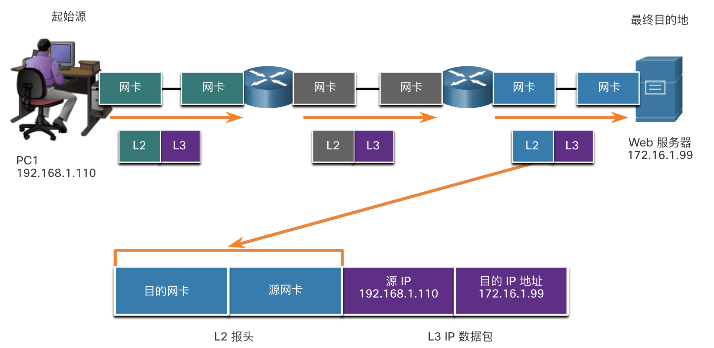
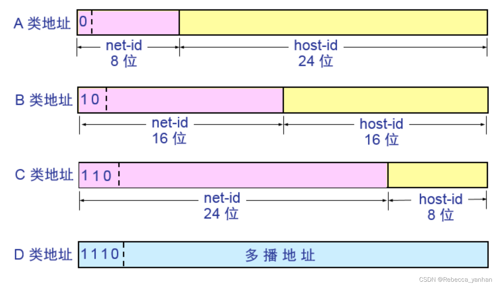
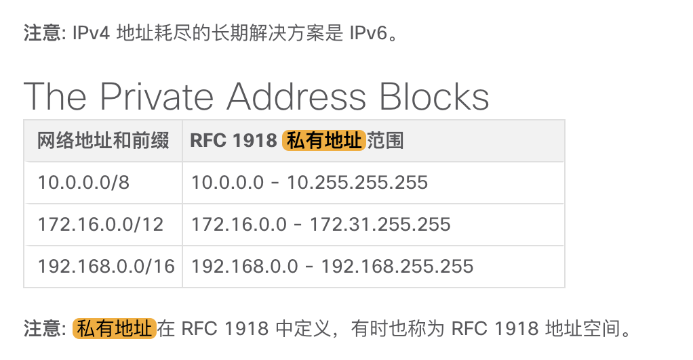

# 无线网络应用

!!! abstract
    1. 其中五次实验，每次3分，一共15分

    2. 实验报告，20分

    3. 学在浙大 35分

    4. 3个选做实验 5分

    5. 线上课程学习：线上模块1-3：基本网络连接和通信考试， >=80分得5分，60~79分得3分

    6. 期末在线考：两个半小时，满分20分 

---

## Lec1

### 局域网

- 基础架构网络：中间设备（交换机、路由器、接入点）和终端设备（服务器和客户端）构成

??? tip "交换机"
    - 交换机（Switch）是一种网络设备，用于在计算机网络中连接多个设备（如计算机、服务器、打印机等），并通过数据包交换技术在这些设备之间传输数据。

---

- 点对点（对等网络）

    - 多台PC直接互联，没有中间设备，它们既是服务器也是客户端

---

??? tip "交换机和路由器的区别"
    - 交换机连接在终端设备、路由器上，路由器一般连接在交换机和路由器上

    - 交换机和终端设备可以构成一个lan，路由器可以把这些lan连接起来

    - 交换机：主要用于局域网内部连接设备，基于MAC地址转发数据包，工作在数据链路层。
    
    - 路由器：主要用于连接不同网络，基于IP地址转发数据包，选择最佳路径，工作在网络层。

---

#### 中间设备

- 无线路由器、LAN交换机、（有线）路由器、多层交换机、防火墙设备

- 网络介质：
    
    - 电缆、光纤、无线（电磁波）

### 网络表示方式和网络拓扑

??? tip "网络地址"
    - 在IPv4地址中，IP地址的最后一位为0的地址通常被称为网络地址（Network Address）。网络地址用于标识一个特定的网络，而不是网络中的某个具体设备。它表示一个子网的起始地址，用于网络路由和管理。

### 常见网络类型

- 小型、企业级、Internet

- 冗余：防止断了一个无法传输

- 可拓展性：软硬件开发时采用统一的技术标准，就可以使得网络易于拓展

## Lec 2

### 分层模型

### 数据封装

- 理论上来说，可以将一次通信的内容（如音乐视频或有很多很大的附件的电子邮件）作为一大块连续的高容量比特流，通过网络从源发送到目的地。但是，这会给其他需要使用相同通信通道或链路的设备带来问题。这种大型数据流会导致严重的延迟。而且，一旦互联网络基础架构中的任何链路在传输期间出现故障，那么整个消息都会丢失，必须全部重传。

- 所以，更好的办法是先将数据划分为更小、更易于管理的片段，然后再通过网络发送。分段是将数据流划分成更小的单元，以便在通过网络传输的过程。分段是必要的，因为数据网络使用TCP/IP协议簇以单独的IP数据包发送数据。每个数据包都是单独发出的，类似于把一封长信作为一系列独立的明信片寄出。包含同一目的地数据段的数据包可以通过不同的路径发送。

- 这导致消息分段有两个主要好处:

    - 提高速度：由于将大数据流分段成为数据包，因此可以在不独占通信链路的情况下，通过网络发送大量数据。这允许许多不同的会话在称为多路复用的网络上交错。

    - 提高效率：如果单个数据段由于网络故障或网络拥塞而无法到达其目的地，则只需要重新传输该段，而不需要重新发送整个数据流。

??? tip "排序"
    - 使用分段和多路复用在网络上传输消息要面临的挑战是增加了该过程的复杂程度。试想一下，这就如同您要邮寄一封 100 页的信件，但每个信封里只能装一页纸。因此，将需要100个信封，每一个信封都需要分别写好地址。100个不同的信封装着的100页的信有可能顺序是混乱的。因此，信封中的信息需要包含一个序列号，以确保接收者可以按适当的顺序重新组装页面。

    - 在网络通信中，每个消息段也必须经过类似的过程才能确保其到达正确目的设备并重新组装成原始消息的内容，如图所示。TCP 负责对单独的数据段进行排序。

    - 该图显示了两台计算机通过网络向一台服务器发送消息。每条消息都被分成多份，显示为黄色和橙色的信封，有些是交错排列并编号的。文字显示：标识多个片段以便定向和重组。标识用于在片段到达时对其排序和组装。

    

---

### 数据访问

- 当 IP 数据包的发送方和接收方位于不同网络时，以太网数据链路帧不能直接发送到目的主机，因为在发送方的网络中无法直接到达该主机。必须将以太网帧发送到称为**路由器**或默认网关的另一设备。在我们的示例中，默认网关是 R1。R1 有一个以太网数据链路地址与 PC1 位于同一网络中。这使 PC1 能够直接到达路由器。

    - 源 MAC 地址 - 发送设备 PC1 的以太网 MAC 地址。PC1 以太网接口的 MAC 地址是 AA-AA-AA-AA-AA-AA。

    - 目的 MAC 地址 - 当接收设备（目的 IP 地址）与发送设备位于不同网络时，发送设备使用默认网关或路由器的以太网 MAC 地址。在本示例中，目的 MAC 地址是 R1 的以太网接口的 MAC 地址：11-11-11-11-11-11。这是连接到与PC1相同的网络的接口，如图所示。

??? tip "MAC地址"
    - 以太网中的每个主机都有自己的一个物理地址

    - MAC 地址（介质访问控制地址/物理地址）是网络接口卡（NIC）的**唯一标识符，用于网络通信**。它是一个 48 位的地址，通常表示为 12 位十六进制数（例如，00:1A:2B:3C:4D:5E）。MAC 地址在网络层次上用于确保数据包能够正确地传输到目标设备。

    - 特殊地，当它是由**全部都是1**组成的48位地址时，表示发送一个**广播消息**，发送给本地网络里的所有主机

- 在传输过程中，IP数据包始终不变，但是帧头一直被解封装、再封装

=== "主机到路由器"
    

=== "路由器到路由器"
    

=== "路由器到服务器"
    

### 以太网的层次设计

- 我们把大量主机组成的大型以太网络，分割成便于管理的小型网段

- 层次设计有三层：
    
    - 接入层：连接本地以太网络中的主机

    - 分布层：将较小的本地网络相互连接起来

    - 核心层：在分布层设备之间高速转发大量数据

- 在这种层次化设计中，我们就需要使用逻辑寻址（ip地址）来标识主机位置

??? tip "IPv4"
    - 32位，4个十进制数字

    - 第一部分(前三个8-bit)标识本地网络：所有连接到同一本地网路的主机，其IP地址的**网络部分**都是一样的

    - 第二部分（最后一个8-bit）标识特定主机：在同一个本地网络中，IP地址的**主机部分**是每个主机所独有的

    - 而特殊地，主机部分为全0的地址，是**网络地址**，**不可以给任何主机设备使用**

!!! abstract "对比MAC地址和IP地址"
    - MAC地址是固化在网卡里的，和连接的网络无关

    - MAC地址在数据帧，IP地址在数据包头

!!! tip "ARP"
    - ARP （Address Resolution Protocol ）是网络设备（如计算机、路由器、交换机）中用于存储本地网络中设备 IP 地址与对应 MAC 地址映射关系的表格。

#### 分布层

- 随着网络规模的扩大，应将一个本地网络**分成多个接入层网络**，用分布层设备（如路由器）进行互联

??? tip "路由器"
    - **交换机**读取的是**数据帧帧头的MAC地址**，**路由器**读取的是**数据包包头的IP地址**

    - 利用路由表，列出**接口到达的目的网络和优劣信息

??? tip "默认网关"
    - 默认网关是**本地网路的出口**，如果要到其他外界网路去，必须先到默认网关然后再出去

    - **默认网关地址就是本地网络中路由器接口的IP地址**

## Lab1 网线制作

- 双绞线(Twisted Pair,TP)是以太网通常使用的

- 针对干扰情况不同的场合，有三种类型：
    
    - STP(Shield TP)：外层有金属箔层，能更好地抵抗EMI和RFI

    - UTP(Unshield TP)：非屏蔽，民用

    - ScTP：略

- UTP末端线序有两种，一个是T568A，一个是T568B；

- 相似设备两头的线序不同；不同设备两头的线序相同

- 制作网线的关键，要让线按照T568A或T568B排序

## Lec 3

### IP和子网掩码的交互方式

- **子网掩码**用于表明：IP地址中哪些部分代表网络，哪些部分代表主机

- **子网掩码中“1”的部分对应IP地址中的网络部分**；**“0”的部分则对应IP地址中的主机部分**

- 子网掩码一定是连续的全1开头，连续的全0结束

- 所以常见的子网掩码有：255.255.255.0; 255.255.0.0; 255.0.0.0

??? tip "前缀长度"
    - 前缀长度就是方便识别子网掩码的速记方法

    - 前缀长度就是子网掩码中"1"的bit数

!!! end inline warning "注意主机数量结果要减2"
    - 因为主机位置全1的IP地址是**广播地址**，全0的地址是**网络地址**

- 计算主机数量：
    - 计算某一子网掩码中对应网络中可容纳的主机数量，其实就是子网掩码中全0的部分
    
    - 比如255.255.255.0，那么就是$2^8=256$，主机数量$=256-2=254$

---

- IP地址分为5类，A类、B类、C类是商业类地址，可分配给主机；D类保留供组播使用；E类用于实验用途

    - C类分配给小型网络$2^8-2$;B类分配给中型网络$2^{16}-2$；A类分配给大型网络$2^{24}-2$

!!! warning
    - 每类地址前面都会有一个不定长的固定位，因而第一个byte大小不一样（这也是为了很好地区分开每一类地址）

    |地址类|MSByte|
    |---|---|
    |A|1-127|
    |B|128-191|
    |C|192-223|
    |D|224-239|
    |E|240-255|

### 公有地址和私有地址

- 由于IPV4地址有限，所以保留了部分私有IP地址供组织内部使用，这样组织内部的主机无需使用IP地址，也能够相互通信

- 私有地址不能在Internet上路由，其数据包会被路由器所阻挡；因此多个组织可使用**相同的私有地址而不用担心发生IP地址冲突的问题**

??? tip "Example--ZJU"
    - 例如：浙江大学的对外公有地址`210.32.*.*`和`222.205.*.*`（C类）是中国交渴望管理结构分配的

    - 校内IP地址`10.*`是校内自定的大型私有网络地址，是学校自主管理的

    - `10.10.0.21/10.10.2.21`是首选/备用DNS服务器地址

    - `10.*`可以在学校内相互通信，但是要出校网的话，必须转换成上述的`210...`和`222...`这些公有IP才行

??? tip "为什么家庭中使用的私有地址却可以上网"
    - 这是由于NAT（网络地址转换）

### 专用IPv4地址

- 环回地址：A类`127.0.0.0`或`127.0.0.1`至`127.255.255.254`，主机使用这些特殊地址将流量指向其自身

- 本地链路地址（自动私有IP地址）：`169.254.0.0`,`169.254.0.1`至`169.254.0.254`；这是自动**获取IP地址失败**时，系统设定的一个**临时地址**

### 单播

- 单播传输是指在一对一通信中，一个设备向另一个设备发送消息。

- 单播数据包具有一个目的 IP 地址，该地址是一个单播地址，该地址指向一个单独的接收者。源 IP 地址只能是单播地址，因为数据包只能来自单个源。这与目的IP地址是单播、广播还是组播无关。

### 广播

- 广播传输是指设备在一对多通信中，向网络上的所有设备发送消息。

- 值得注意的就是一个网络里的广播地址，就是主机地址全为1的地址

### 组播

- 主机通过组播传输可以向**所属组播组中的选定主机组**发送一个数据包，从而减少了流量。

- 组播IP地址的范围是`224.0.0.0`~`239.255.255.255`（D类）；组播地址代表一组主机，只能用作**目的地址**，原地址必须为**单波地址**

- 也就说一台设备进入组播组后，既有它的单播地址，也有它的组播地址；

- **组播MAC地址**是一个特殊的十六进制数，以**01-00-5E**开头；后面的\[23:0\]位作为MAC地址中剩余的24位低地址（即后半部分）

### SSID

- SSID（服务集标识符/System Set Identifier）：是一个区分大小写的数字字母字符串，最多32个字符，包含在无线帧的爆头，通过WLAN以明文方式传输；SSID相当于WLAN的名字

## Lab2 

- 无线路由器和无线AP的配置，整体配置比较简单

- 基本流程：

    1. 对于初始化的设备，用网线连接到主机上，然后配置好IP和网关，进入浏览器进行基础的配置（主要是2.4G或5Ghz的选择，WAN、LAN的配置，配好设备的IP）

    2. 然后再尝试用无线连接，至于要上校网就需要交换机；其中路由器分到一个校网地址，每台主机通过NAT访问校网；而AP则为每个主机分配一个校网地址

## Lec 4

### 应用层协议

- HTTP,FTP,DHCP,DNS,SMTP,TELNET

### TCP

- 当应用程序需要确认**报文**是否已送达时，会使用TCP协议

- 在发送主机上，TCP将报文划分成**数据段**，按顺序进行编号并传出

- 在接收主机上，TCP按顺序号重组报文各个的数据段，然后发回一个确认

- 如果发送主机在规定时间内未收到“确认”，则会将**丢失的部分**重新传输

### UDP

- UDP不需要确认对方有没有收到，是一种高效率的传输机制，UDP**没有确认和重传**机制

- 与TCP不同，UDP不跟踪数据段的顺序号，仅仅是将接收到的数据段按先来后到的顺序传送到上层的应用程序

- 是音频流、视频流等的首选

### TCP/IP 端口号

- 使用TCP或UDP传送报文时，在**数据段**内封装了**端口号**

- 端口号包括：源端口与目的端口，分别用于**跟踪特定会话**和**表明所需服务类型**

- 目的端口：客户端将目的端口号封装在数据段内，以此通知服务器，客户端请求的是何种服务。端口号与服务相对应，**两个不同的服务不能用同一个端口号**，否则会发生端口冲突

- 源端口：用于标识和跟踪两台设备之间的会话

---

- 公认端口：目的端口，范围1~1023，如HTTP 80，FTP 21

- 注册端口：1024~49151，可作为源端口或目的端口，厂商可使用这些端口注册各自的应用程序

- 私有端口：49152~65535通常作为源端口使用

---

## Lec 5

### 防火墙

- 防火墙使用多种技术来区分**禁止**和**允许**的网络访问

    - 数据包过滤：根据**IP地址**或**MAC地址**来阻止或允许访问

    - 应用程序/网站过滤：根据**端口号**来阻止或允许访问；网站过滤则是通过网站**URL地址**或**关键字**来实现

- 防火墙通常还会执行**NAT**，将内部私有地址转换为一个外部公有地址，用于**隐藏内部IP地址**

---

- 双防火墙配置是一种增强的网络安全架构，通过使用两个防火墙来隔离和保护内部网络、DMZ（非军事区）和外部网络（如互联网）。这种配置提供了额外的安全层，确保即使一个防火墙被攻破，内部网络仍然受到保护。

- 双防火墙配置通常包括以下部分：

    1. **外部防火墙**：

    - 位于外部网络（互联网）和 DMZ 之间，保护 DMZ 中的服务器免受外部攻击。

    - 控制外部用户对 DMZ 中服务器的访问权限。

    2. **DMZ（非军事区）**：

    - 位于外部防火墙和内部防火墙之间，托管需要公开访问的服务，如 Web 服务器、邮件服务器、FTP 服务器和 DNS 服务器。

    - 提供对外部用户的服务，同时隔离内部网络。

    3. **内部防火墙**：

    - 位于 DMZ 和内部网络之间，保护内部网络免受来自 DMZ 的潜在威胁。

    - 控制 DMZ 中服务器对内部网络的访问权限。

    4. **内部网络**：

    - 组织的私有网络，包含敏感数据和内部资源。

### 无线身份验证

- PSK(pre-shared key):就是普通意义下的密码

- EAP(extensible authentication protocal):EAP 是一种灵活的认证框架，支持多种认证方法，通常用于企业和大型网络。EAP 需要一个认证服务器（如 RADIUS 服务器）来验证用户身份。

---

### WLAN上的加密

- 身份验证和MAC地址过滤可以阻止攻击者链接网络，但是无法阻止他们拦截**空间中传输的数据**

- 所有信息都通过空间传输，因此要对信息进行加密

---

- WEP（Wired Equivalent Privacy，有线等效保密）是一种用于无线网络的安全协议，旨在提供与有线网络相当的安全性。WEP 是最早的无线安全协议之一，但由于其设计上的缺陷和易受攻击性，已经被更安全的协议（如 WPA 和 WPA2）所取代。

    - 缺陷：WEP 使用静态密钥，所有设备共享相同的加密密钥。更改密钥需要手动配置所有设备，管理不便。

- WPA 是 WEP 的替代方案，使用 TKIP（Temporal Key Integrity Protocol）来增强安全性。TKIP 动态生成加密密钥，增加了安全性；WPA2 是 WPA 的改进版本，使用 AES（Advanced Encryption Standard）加密算法，提供更高的安全性。WPA2 是目前广泛使用的无线安全协议。

## Lec 6

### 子网划分 

- 子网划分（Subnetting）是将一个大的网络划分成多个较小的子网络（子网）的过程。子网划分可以提高网络的管理效率、增强安全性并优化网络性能。

- 子网划分的目的

    - 提高网络管理效率：通过将网络划分为多个子网，可以更容易地管理和维护每个子网。
    
    - 增强安全性：子网之间可以设置不同的访问控制策略，限制不必要的访问。
    
    - 优化网络性能：减少广播域的大小，降低网络拥塞，提高网络性能。

- 子网划分的步骤

    - 确定子网数量和每个子网的主机数量：根据需求确定需要划分的子网数量和每个子网所需的主机数量。
    
    - 计算子网掩码：根据子网数量和主机数量计算合适的子网掩码。
    
    - 划分子网：根据子网掩码将网络地址划分为多个子网。

    - 分配IP地址：为每个子网分配IP地址范围。

#### 无类子网划分（传统）

- 无类子网划分（Classless Inter-Domain Routing，CIDR）是一种灵活的IP地址分配方法，它不再使用传统的A类、B类和C类网络划分，而是**允许任意长度的前缀**来表示网络部分，从而提高了IP地址的利用效率。

#### VLSM

- 可变长子网掩码 (Variable Length Subnet Mask, VLSM) 是一种灵活的子网划分方法，它允许在同一个网络中**使用不同长度的子网掩码**，从而更有效地利用IP地址空间。VLSM 是 CIDR 的一种应用，特别适用于需要不同大小子网的网络环境。

---

### DHCP服务器

