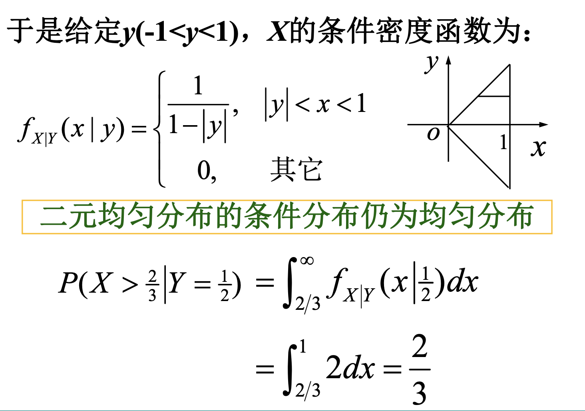
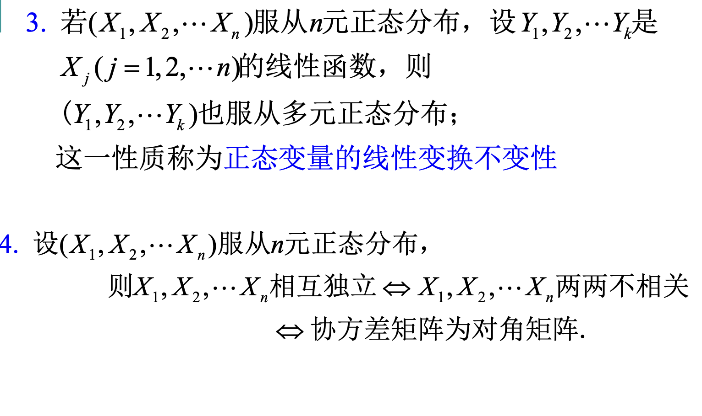

# 概率论与数理统计

## 第一章与第二章

|符号|分布|
|---|---|
|$N(\mu,\sigma)$|正态分布(**Normal**)|
|$U(a,b)$|均匀分布(**Uniform)**|
|$E(\lambda)$|指数分布(**Exponent**)|
|$P(\lambda)$|泊松分布(**Poisson**)|
|$B(n,p)$|二项分布(**Binomial**)|
|$H(n,a,N)$|超几何分布(**Hypergeometric**)|

<embed src="../笔记.pdf" width="600" height="800" type="application/pdf">

----

### 2.4 连续型随机变量及其密度函数

#### 泊松分布

**背公式**！

$$
X\sim P(\lambda)
$$

$$
P(X=i) = e^{-\lambda}\cdot \frac{\lambda^i}{i!}
$$

#### 2.4.3 正态分布

!!! note "标准正态分布"
    

    

    !!! warning "注意"
        - $\Phi(0) = 0.5, \Phi(x)+\Phi(-x)=1$

----

- 当我们用变量代换 $t = \frac{x-\mu}{\sigma}$时，得到的就是标准正态函数$\phi(t)$的积分，只不过变换了上下限

- $Y = \frac{x-\mu}{\sigma} \sim N(0,1)$

- $F(x) = \Phi(\frac{x-\mu}{\sigma})$

    

    

----

### 2.5 随机变量函数的分布

!!! abstract
    - 我们想要研究：当已知X的分布情况时，来求**Y=f(X)的分布情况**

    - 对于Y是离散量，则非常易求，列举即可

    - 对于Y是连续值，则先求**分布函数**，再求**密度函数**

---

!!! tip "Example-- $Y = X^2$"
    

    ??? note "答案"
        - 这个题我们已知X的密度函数和分布函数，对于Y来说，分布函数是易求的，密度函数可以由分布函数求导得到

        - 把Y的分布函数，改写成有关X的概率分布，然后结合X的分布函数得到具体的值

        
        

!!! tip "Example--不给出具体的密度函数"
    - 思路和上题是一样的，只不过用函数字母表示而已

    
    
    

----

!!! tip "由Y=g(X)间存在单调关系，来求Y的密度函数，存在**简易方法**"
    - $y=g(x)$在x的取值范围内严格单调，则存在反函数$h(y)=x$

    - 那么Y有密度函数 $f_Y(y)=f_X(h(y))\in|h'(y)|,y\in (\alpha,\beta)$

    
    ??? note "证明"
        

    ??? note "在正态分布中的应用"
        
        

        - 这个挺好理解，均值肯定是**线性变化**的，而标准差**只与斜率有关**

-----

## 第三章

### 3.1 二元离散型随机变量

!!! abstract "三个概念"
    - **联合分布律，边际分布律，条件分布律**

=== "3.1.1 联合分布"
    

=== "3.1.2 边际分布"

    
    

=== "3.1.3 条件分布"

    
    

----

!!! tip "Example--用实际含义去理解三种分布"
    

    ??? note "答案"
        - 联合分布律的求法有点像二次分布，第X次和最后一次是击中，其余全是未击中

        - 边际分布律的求法可以说就是只考虑一个量，不去管另一个量

        - $P(X=m)$那就是第$m$次命中，前$(m-1)$次未中

        - $P(Y=n)$那就是第$n$次命中，然后前面的$(n-1)$次任选一次命中，然后余下的$(n-2)$次都没命中

        

### 3.2 二元随机变量的分布函数

=== "联合分布函数"

    

    

=== "边际分布函数"

    

=== "条件分布函数"

    
    

---

### 3.3 二元连续型随机变量

#### 联合概率密度函数

- 这是两个积分，**而非二重积分**

??? tip "几何意义"  
    - 分布函数就是，平面上给定f(x,y)函数，在约束条件里的二重积分面积

!!! tip "Example--$P(Y\leq X)$"
    

    - 求系数的时候，从负无穷积分到正无穷，结果为1，然后求解

    - 求分布函数，则从负无穷积分到(x,y)

    - 有两种切法，横着或者竖着切，

    ??? note "答案"
        

        

        ---

        
        
        $$
        \int_0^{\infty}dx\int_0^x f(x,y)dy
        $$

        
        
        $$
        \int_0^{\infty}dy\int_y^{\infty}f(x,y)dx
        $$
        
    
!!! tip "Example--与二重积分的几何意义联系"
    

    - 第一问就是红色区域的积分，有两种积法（横着或者竖着）

    - 第二问就是在x=0.5处划分，求右半面积

    - 第三问就是在y=0.5处划分，求下半面积

    - 第四问同理

    ??? note "答案"

        1. $\int_0^1dx\int_{x^2}^x f(x,y)dy$
        
        2和3略
        
        4. $\int_{1/2}^{\frac{\sqrt{2}}{2}}dx\int_{x^2}^{1/2}f(x,y)dy$

        
    
---

#### 边际概率密度函数

??? tip "续上例"    
    
    

#### 条件概率密度函数

??? note "证明"
    

!!! tip "性质"
    

!!! tip "Example--极致的例题"
    

    1. 根据两个均匀分布，可以写出x的密度函数$f_X(x)$，以及条件密度函数$f_{Y|X}(y|x)$，然后就能求出联合密度函数，最后求另一个条件密度函数

    2. 利用第一问求的条件密度函数，将Y=25代入，然后积分上下限就是0~10

    ??? note "答案"
        
        
        

---

#### 二元均匀分布

!!! tip "Example"
    

    

        

    - 在Y条件下, $X \sim U(|y|,1)$

#### 二元正态分布

？？？这一块要掌握吗？

### 3.4 随机变量的独立性

!!! tip "判断是否相互独立的定理"
    

??? note "Example--判断二维正态随机变量独立"    
    - 证明：对于二维正态随机变量（X,Y）,X与Y相互独立的充要条件是参数$\rho=0$

    - 必要条件特别简单

    - 充分条件的情况，由于这几个函数都是连续函数，连续函数相等，说明必须处处**相等**

    - 于是代入特殊点$f(\mu_1,\mu_2)=f_X(\mu_1)f_Y(\mu_2)$，得到$\rho=0$

---

!!! tip "多元随机变量相互独立"
    

    - 例子：$(X_1,X_2)与(Y_1,Y_2,Y_3)独立，那么根据定理可以得到(X_1+X_2)与(2Y_1+3Y_3)独立$

---

### 3.5 二元随机变量的函数的分布 

#### 3.5.1 Z=X+Y的分布

!!! tip "Example--泊松分布"
    - 设随机变量$X\sim P(\lambda_1),Y\sim P(\lambda_2)$，且X，Y相互独立，若$Z=X+Y$，求Z的概率分布律

    - 思路：把$Z=K$拆分成给定每个X，对应Y情况下的概率，再求和

    - 对于最后的求和结果，要敏锐观察，**提取无关的因数**，再考虑剩下的级数

    ??? tip "答案"
        $$
        \Sigma_{i=0}^k\frac{\lambda_i^i\lambda_2^i}{i!(k-i)!}
        $$

        - 注意这个式子极似**二项展开式**
        
        

---

**密度函数**

!!! tip "Example--正态分布的函数的密度函数"
    - 设X和Y都是相互独立的标准正态随机变量，求Z=X+Y的概率密度函数

    - 直接用卷积公式，注意计算过程中**凑正态分布的巧妙思想**

    ??? note "答案"
        

        - 我们先进行指数的配方，然后挪出常数$e^{-z^2/4}$

        - 对于剩下的部分$\int_Re^{-(x-z/2)^2}dx$，我们要去凑对应的正态分布！！！，因为凑出来后，整个定积分就是1

        - 分析出来$\mu=\frac{z}{2},\sigma=\frac{1}{2}$

        - 然后我们在前面添加$\frac{1}{\sqrt{2\pi}\times \sigma}$

!!! tip "Example--分段讨论的密度函数"
    === "题1"

        - 设X,Y独立，同服从[0,1]上的均匀分布，求Z=X+Y的概率密度函数

        ??? note "答案"
            === "方法一"
                

                - 注意：x同时满足两个不等式！！！，必须对z进行分段讨论！！！

                - 可以拿x-z图像来理解！！

            === "方法二"
                

                - 这里用x-y图像来理解，相当于画不同的直线

                - 从无->三角形->三角形+梯形（总面积扣去右上角的三角形）-> 1

    === "题2"
        

        

---

!!! tip "Example--X离散，Y连续"
    

    ??? note "答案"
        
        

---

#### 3.5.2 M=max{X,Y},N=min{X,Y}的分布

!!! tip "Example--综合"
    

    ??? note "答案"
        
        
        
        

---

## 第四章 随机变量的数字特征

### 4.1 数学期望

=== "离散型"
    !!! warning "E(X)必须收敛"

    $$
    E(X) = \Sigma_{k=1}^{\infty}x_kp_k
    $$

=== "连续型"
    !!! warning
        只有$\int_{-\infty}^{\infty}|x|f(x)dx < \infty$，则才有期望！！

    $$
    E(X) = \int_{-\infty}^{\infty}xf(x)dx
    $$

---

#### 4.1.2 随机变量函数的数学期望

!!! abstract

    

    - 其实和原来的原理是一样的，本质也是小矩阵，只不过现在值是$h(x,y)$，概率函数还是原来的$f(x,y)$，自然期望就是$E=\int_R \int_R h(x,y)f(x,y)dxdy$

!!! tip "指数分布与泊松分布的期望"
    - 指数分布中期望$E=\frac{1}{\lambda}$

    - 泊松分布中期望$E=\lambda$

!!! tip "Example--联合密度函数的期望以及与指数分布的结论"
    
    
    求$E(X),E(XY)$

    ??? note "答案"
        

        

        - 注意：在对dy积分的时候，$\int_0^{\infty}y\cdot xe^{-xy}dy$可以看成一个是一个参数$\lambda = x$的指数分布，自然积分结果就是$\frac{1}{x}$
    
!!! tip "Example--综合"
    

    ??? note "答案"

        - 分段表示出利润值，然后求期望

        

        - 二次函数一眼盯真得到正确答案

---

#### 4.1.3 数学期望的性质

!!! abstract
    
    

!!! tip "Example--逆向思维！"
    

    - 这个题如果用正向思维，企图求出所有的X的分布律，然后再求期望，这会十分困难$P(X=k)=C_10^k ....$

    - 所以我们调转思路，只关注期望

    - **不要总是想着求分布律，要去把$X$分解**

    ??? note "答案"
        - 把X分解成每一层是否有人下的期望

        

!!! tip "Example--易错"
    - 我们从1~10中任取4个数，和记作$X$，求$E(X)$

    ??? note "答案"
        - 我们可以把X拆分成四次数的总和,$X=X_1+X_2+X_3+X_4$

        - 对于$X_i=\Sigma p_jx_j$
        
        - 注意了：由以前的结论我们知道，**无论是放回还是不放回，每个数的概率都是不变的**

        - **所以无论放回还是不放回，期望都是一样的！！！**

        - 所以每一次的数的期望是5.5，最终期望为22

---

??? warning "几道好题"
    
    

    - 11题：一个是清楚均匀分布时密度函数就是$\frac{1}{\pi r^2}$，其次就是可以用极坐标，不过要**记得极坐标积分**的时候前面是$\rho d\rho$，这个题就是考极坐标积分的熟练度；答案是2/3r

    - 14题：就是上面例题里的电梯问题，此处$E(X_i)=1-(1-\frac{1}{n})^n$

    - 15题：最远距离$D=\text{max}\{x_1,x_2...,x_n\}-\text{min}\{x_1,x_2...,x_n\}，然后去算均匀分布时的密度函数和期望$

    - 其中期望$E(M)=\frac{n}{n+1},E(N)=\frac{1}{n+1}$；

### 4.2 方差

!!! abstract 
    
    $$
    Var(X)=E{[X-E(X)]^2}
    $$

    $$
    \sigma(x)=\sqrt{Var(X)}
    $$

    - 对于离散型：
    
        $Var(X)=\Sigma[x_i-E(X)]^2p_i$

    - 对于连续型：

        $Var(X)=\int_{-\infty}^{\infty}[x-E(X)]^2f(x)dx$

    都适用：
    
    $$
    Var (X) = E ( X^2 ) - [ E ( X )]^2
    $$

---

!!! tip "Example--对结论的应用"
    

    - 泊松分布这个题的思路是：$E(X^2)=\Sigma k^2 \cdot \frac{\lambda^ke^{-\lambda}}{k!}$

    - 消掉一个k之后，再**拆分成1和(k-1)**，然后**提取参数**再用泊松求和

    

#### 4.2.2 方差的性质

!!! abstract 
    

    

!!! tip "Example--巧妙的应用"
    

### 4.3 协方差

!!! abstract
    
    
    

!!! abstract "相关系数"
    
    
    

    - 这里的相关，指的是**线性相关**
    
    ??? tip "证明"
        
        
        

---

!!! tip "Example--独立与不相关"
    
    

!!! tip "Example--相关系数"
    - 现在有n包相互独立的巧克力，每包的重量遵循正态分布$N(\mu,sigma^2)$，现取前k包，求这k包的总重量与n包总重量的相关系数

    ??? note "答案"

        - 首先，k包的总重量相当于是$S_k=X_1+X_2+...+X_k$，自然$E(S_k)=E(X_1)+E(X_2)+...+E(X_k)=k\mu,D(S_k)=k\sigma^2$；同理n包的期望和方差也就知道了

        - $\rho=\frac{Cov(S_k,S_n)}{\sqrt{Var(S_k)\cdot Var(S_n)}}$

        - 分母是已知的，现在关键就是这个协方差如何求解，这里巧妙地把$S_n = S_k + X_{k+1}+...+X_n$，然后把协方差展开；由于$S_k$与后面的$X_i$全都独立，因而最后只剩下$Cov(S_k,S_k)=Var(S_k)=k\sigma^2$

        - 最终得到答案$\rho = \sqrt{\frac{k}{n}}$
    
!!! tip "结论--联合正态分布"
    - 联合正态分布时，**独立就等价与不相关**

### 4.4 其他数字特征

- 上α分位数就是说，在密度函数$x=x_\alpha$右侧的面积和就是$\alpha$

- 特别地，把标准正态分布的上α分位数称为$z_\alpha$

### 4.5 多元随机变量的数字特征

- 对于多元随机变量，期望是一个向量，协方差是一个矩阵

$$
\begin{align}
E(X_1,X_2...X_n)&=(E(X_1),E(X_2)...E(X_n))^T \\
协方差矩阵 A_{n\times n}, a_{ij}&=Cov(X_i,X_j)
\end{align}
$$

!!! tip "n元正态随机变量的性质（重要！！）"
    - **n维联合正态分布 一定能推出 边际正态分布**；反过来，**边际正态分布必须是在独立的情况下，才能推出联合正态分布**

    

    

!!! tip "Example--n元正态随机变量"
    

    - 第一问，这就是用方差的性质，$Var(aX+bY)=a^2Cov(X)+b^2Cov(Y)+2Cov(X,Y)$，代入公式易得； 其中$Cov(2X,-Y)=-2Cov(X,Y)$

    - 第二问，把概率转换成P(2X-Y>0)，那么$2X-Y$的线性组合其实也满足正态分布，于是我们就求这个正态分布的$\mu,\sigma$，分别就是期望和方差；最后再套用标准正态分布的函数$P(2X-Y>0)=1-\Phi(\frac{0-\mu}{\sigma})$

    - 第三问，也是由n元正态分布性质可知，$Z_1,Z_2$也满足二元正态分布，然后我们就要去算5个参数，$E(Z_1),E(Z_2),Var(Z_1),Var(Z_2),\rho_{Z_1Z_2}=Cov(Z_1,Z_2)/\sqrt{Var(Z_1)\cdot Var(Z_2)}$；其中$Cov(Z_1,Z_2)=Cov(X+Y,X-Y)=Var(X)-Var(Y)$

    ??? note "答案"
        
        
        

## 第五章 大数定律和中心极限定律

### 5.1 大数定律

#### 5.1.1 依概率收敛

- 类比微积分中的极限，$lim_{n->+\infty}a_n=c$是$|a_n-c|<\epsilon$

- 于是有，$\forall \epsilon >0$，$lim_{n->+\infty}P(|Y_n-c|<\epsilon)=1$ 或者说$lim_{n->+\infty}P(|Y_n-c|\geq\epsilon)=0$

!!! tip "Example--简单的证明题"
    

#### 5.1.2 马尔科夫不等式和切比雪夫不等式

!!! abstract 
    
    

    - 马尔科夫不等式不考

!!! tip "Example"
    

    - A事件的次数X满足$X\sim B(n,0.75)$，得到期望和方差

    - 然后我们要计算的是$f(A)=\frac{X}{n}$概率在0.74~0.76之间，然后用切比雪夫

    ??? note "答案"
        

#### 5.1.3 几个大数定律

??? abstract "弱大数定律"
    

??? abstract "切比雪夫大数定律"
    
    ??? abstract "辛钦大数定律"
        

        

        - 这里和切比雪夫大数定律的唯一区别就是**同分布**

        - **陷阱是：同分布，可能方差不存在**

    ---

    - 只要相互独立，同均值$\mu$，同分布/同方差；就有这个结论$\frac{1}{n}\sum X_i$->$\mu$

??? abstract "贝努利大数定律"
    

??? tip "Example--大数定律"
    
    
    
    
    - 1.7一定要先取对，因为这样才是**和的形式**，符合辛钦大数定律

### 5.2 中心极限定理

??? tip "推论——二项分布"
    

    - 当n足够大时，n重贝努利试验成功的总次数满足正态分布$B(n,p)~N(np,np(1-p))$

!!! tip "Example"
    某宴会上提供一瓶6升(l)的大瓶法国红 酒,假定与会者每次所倒红酒的重量服从同一 分布,期望值为100毫升(ml),标准差为32毫升. 若每次所倒红酒都是相互独立的,试问:倒了55 次后该瓶红酒仍有剩余的概率约为多少?

    ??? note "答案"
        

## 第六章 数理统计的基本概念

### 6.1 随机样本与统计量

#### 6.1.1 总体与样本

!!! abstract "简单随机样本"
    $X_1,X_2,...,X_n$是容量为n的简单随机样本

    - 一定要满足 **同分布和相互独立**

#### 6.1.2 统计量

!!! abstract "统计量"
    - 样本的**不含任何未知参数**的函数；都是随机变量

    **常用统计量**

    1. 样本均值:$\bar{X}=\frac{1}{n}\sum X_i$

    2. 样本方差:$S^2 = \frac{1}{n-1}\sum (X_i-\bar{X})^2$

    3. 样本矩:

        - k阶距:$A_k=\frac{1}{n}\sum X_i^k$

        - k阶中心距:$B_k=\frac{1}{n}\sum(X_i-\bar{X})^k$

- $E(X)=\mu$ 是一个固定的数，可能已知可能未知，而$\bar{X}$是随机变量，依赖于样本值！！！

- 所有样本均值的平均值恰好是总体均值（**无偏**）

- 当$\sigma^2>0,E(S^2)=\sigma^2,E(B_2)=\frac{n-1}{n}\sigma^2$

### 6.2 三种重要分布

#### 6.2.1 χ^2分布

!!! abstract "定义"
    - n个独立同分布的标准正态分布N(0,1)，则称$\chi^2=\sum X_i^2$为服从自由度为n的$\chi^2$分布

!!! abstract "性质"
    1. $\chi^2\sim\chi^2(n),E(\chi^2)=n,D(\chi^2)=2n$

        - 其中$E(X^2)=Var(X)+E(X)^2=1$，$Var(X^2)=E(X^4)-[E(X^2)]^2=E(X^4)-1$，其中$E(X^4)=3$，所以$Var(X^2)=2$

    2. $\chi^2$分布的可加性：如果$Y_1\sim\chi^2(n_1),Y_2\sim\chi^2(n_2)$，并且$Y_1,Y_2$独立，那么$Y_1+Y_2\sim\chi^2(n_1+n_2)$

    3. $\chi^2$分布的上α分位数可以查表获得，（上α分位数是指大于$x_\alpha$时概率恰为α）

!!! tip "Example"
    
    

#### 6.2.2 t分布

!!! abstract "定义"
    - 一个是标准正态分布，一个是$\chi^2$分布，$X\sim N(0,1),Y\sim\chi^2(n)$

    - 那么随机变量$T=\frac{X}{\sqrt{Y/n}}$是服从自由度为n的t分布,$T\sim t(n)$

!!! abstract "性质"
    $$
    t(n)=\frac{N(0,1)}{\sqrt{\chi^2/n}}
    $$

    - 可以发现当n越来越大时，分母越来越接近于$E(X^2)=1$，t(n)趋近于一个**标准正态分布**，同时我们还能发现t(n)的密度函数一定是一个**偶函数**

    

    

#### 6.2.3 F分布

!!! abstrac "定义"
    - 涉及两个独立的$\chi^2$分布，

    - 设$X\sim\chi^2(n_1), Y\sim\chi^2(n_2)$，且X，Y独立

    - 那么变量$F=\frac{X/n_1}{Y/n_2}$，服从自由度为$(n_1,n_2)$的F分布，其中$n_1$为第一自由度，$n_2$为第二自由度

    **性质**：若$F\sim F(n_1,n_2),则\frac{1}{F}\sim F(n_2,n_1)$

**证明**：$\alpha=P(F>F_\alpha(n_1,n_2))=P(\frac{1}{F}<F_\alpha(n_2,n_1))=1-P(\frac{1}{F}>F_\alpha(n_2,n_1)),P(\frac{1}{F}>F_\alpha(n_2,n_1))=1-\alpha$

!!! tip "Example--三种分布综合"
    

### 6.3 正态总体下的抽样分布

!!! warning "注意第二条"
    - 左边式子等价于$\sum \frac{X_i-\bar{X}}{\sigma^2}$

    - 看着有n项，但是自由度确实$n-1$！！！，这可以抽象认为是**左边的n项并不完全独立**，所以自由度会减少一个

    - 如果换成$\sum \frac{X_i-\mu}{\sigma^2}$，那么就是服从$\chi^2(n)$

!!! tip "Example--计算样本方差的期望和方差"
    

    - 第一问就是$E(S^2)=\sigma^2$

    - 第二问，当总体是正态分布时,$(n-1)S^2/\sigma^2 \sim \chi^2(n-1)$，然后就能得出$D[(n-1)S^2/\sigma^2]=2(n-1),D(S)=\frac{2\sigma^2}{n-1}$

#### 两个正态总体的抽样分布

!!! tip "样本方差之间"
    

    ---

    
    

!!! tip "$\bar{X}-\bar{Y}$"
    

!!! tip "Example--样本的分布1"
    

    - 分析：肯定是要把左边两项标准化为标准正态分布，所以就分析$X_1-X_2$和$2X_3-X_4-X_5$的分布

    ??? note "答案" 
        
    

!!! tip "Example--样本的分布2"
    

    - 第一问，和上道题一样，一次分析$\bar{X}-\bar{Y}$还有$3S1/\sigma^2$

    !!! warning "注意第一问的正负号！！！"

    - 第二问，根据形式猜测可知是F分布

    ??? note "答案"
        
        

## 第七章 参数估计

### 7.1 点估计

#### 7.1.1 矩法

!!! tip "Example--要估计量是均值的函数"
    
    

!!! tip "Example--利用两个原点矩"
    
    

#### 7.1.2 极大似然法

??? info "In Computer Science"
    - 极大似然估计（Maximum Likelihood Estimation, **MLE**）是一种统计方法，用于估计模型参数，使得在给定数据下，模型生成这些数据的概率最大。极大似然估计量是通过最大化似然函数得到的参数估计值。

!!! abstract "定义"
    
    

    - 对于连续型的理解，因为我们在算某点领域的概率时要乘上$\delta x$，那么大家都有$\delta x$，概率其实还是取决于$f(x_i,\theta)$；所以$L(\theta)$并不是所有概率的乘积，只是一个用来辅助计算极大值的函数

----------

??? tip "Example--离散型"
    
    

!!! abstract "计算技巧"
    
    

--------

??? tip "Example--连续型"
    
    

    - 所以$\hat{\theta}=\frac{n^2}{(\sum \text{ln}X_i)^2}$

!!! tip "Example--正态分布"
    设总体$X\sim N(\mu, \sigma^2),X_1...X_n$是样本，$\mu,\sigma^2$未知，求$\mu, \sigma^2$的极大似然估计

    - 直接把所有的密度函数相乘，然后得到$L(\mu, \sigma^2)$，参数是$x_i$，然后分别求偏导

    ??? note "答案"
        

!!! tip "Example--均匀分布与纠偏"
    设总体$X\sim U(0,\theta),\theta$是未知参数，样本$X_1...X_n$，求θ的极大似然估计

    - 显然$L(\theta)=\frac{1}{\theta^n}$，关于$\theta$递减，然后有定义域$x_1...x_n \leq \theta$，所以$\hat{\theta}=\text{max}\{X_1...X_n\}$

    **纠偏：**

    - $\hat{\theta_2}=\frac{n+1}{n}X_{(n)}$就是一个**无偏**估计量了

---

### 7.2 估计量的评价准则

!!! abtract "总结"
    - 无偏性

    - 有效性：无偏估计量中方差越小越好

    - Mse：估计量的均方越小越好

    - 相合估计：概率无限趋近于$\theta$

#### 7.2.1 无偏性准则

!!! abstact "定义"
    若参数$\theta$的估计量有函数$\hat{\theta}=\hat{\theta}(X_1,X_2...X_n)$，满足

    $$
    E(\hat{\theta})=\theta
    $$

    则称$\hat{\theta}$是$\theta$的一个**无偏估计量**

    若$E(\hat{\theta})\neq\theta$，则称$E(\hat{\theta})-\theta$是估计量的**偏差**    

    若$\text{lim}_{n->\infty}E(\hat{\theta})=\theta$，则称为**渐进无偏估计量**

??? tip "Example--均匀分布中矩估计和MLE的无偏"
    $X\sim U(0,\theta)$,$\theta$是未知参数，样本$X_1...X_n$

    - 矩估计：$E(\hat{\theta})=E(2\bar{X})=2E(X)=\theta$，无偏！

    - MLE：$\hat{\theta}=\text{max}\{X_1...X_n\}$

        - $F_M(x)=F(X)^n=\frac{x^n}{\theta^n},f_M(x)=\frac{nx^{n-1}}{\theta^n}$

        - $E(\hat{\theta})=\frac{n}{n+1}\theta\neq\theta$

#### 7.2.2 有效性准则

!!! abstract "定义"
    

    总结：**方差较小**的**无偏**估计量是一个更有效的估计量

??? tip "Example--哪个均值更有效？"
    

    显然有$D(\hat{\theta_k})=\frac{\sigma^2}{k}$，肯定$\hat{\theta_k}$最有效

!!! tip "均匀分布中的两个无偏估计量"
    

    - 均匀分布的方差$\sigma^2 = \theta^2/12$，根据这个易求$D(\hat{\theta_1})=D(2\bar{X})=\frac{4}{n}\cdot\frac{\theta^2}{12}=\frac{\theta^2}{3n}$

    - 另一个的方差就必须要求$D(X_{(n)})$了，得先计算$E(X_{(n)}^2)$

    ??? note "答案"
        

#### 7.2.3 均方误差准则

!!! abstract "定义"
    

!!! tip "样本方差$S^2$和样本二阶中心距$B_2$的均方误差准则"

    - 根据$(n-1)S^2/\sigma^2 \sim \chi^2(n-1)$

    - 得到$Mse(S^2)=D(S^2)=\frac{2\sigma^4}{n-1}$

    $$\begin{aligned}
    Mse(B_2)&=E[(B_2-\sigma^2)^2]=D(B_2)+[E(B_2)-\sigma^2]^2\\
    &=D(\frac{n-1}{n}S^2)+[E(\frac{n-1}{n}S^2)-\sigma^2]^2\\
    &=\frac{2n-1}{n^2}\sigma^4
    \end{aligned}
    $$

    - 当$n>1,\frac{2n-1}{n^2}\sigma^4<\frac{2\sigma^4}{n-1}$

    - 因此均方误差准则下，$B_2$优于$S^2$

#### 7.2.4 相合性准则

!!! abstract "定义"
    

    - 相合估计量（一致估计量）是在讲**概率**上最后无限趋近于$\theta$，而渐进无偏估计量是期望无限趋近于$\theta$

    - 一致性：**随着样本容量的增大，估计量越来越接近被估计的总体参数**

!!! tip "相合估计——K阶矩、$B_2$和S^2"

    

    - 第一问：直接用辛钦大数定律

    - 第二问：$D(X)=\sigma^2=\mu_2-\mu_1^2$把$B_2$进行化简，$B_2=\frac{1}{n}\sum(X_i-\bar{X})=A_2-\bar{X}^2$，$S^2=\frac{n}{n-1}B_2$，显然两者都是$\sigma^2$的相合估计

    - 第三问：在第二问基础上秒了

??? tip "Example--均匀分布中的相合估计，切比雪夫证明法"
    

    - 第一问，辛钦大数定律，趋近于$2\mu=\theta$

    - 第二问，用切比雪夫

    ??? note "答案"
        

### 7.3 区间估计

根据具体样本观察值,点估计提供一个明确的数值。

但这种判断的**把握有多大**,点估计本身并没有告诉人们。为弥补这种不足,提出区间估计的概念。

!!! abstract "定义--双侧置信区间、置信水平"
    对于给定值$\alpha$，有两个统计量$\hat{\theta_L}=\hat{\theta_L}(X_1...X_n),\hat{\theta_U}=\hat{\theta_U}(X_1...X_n)$,使得

    $$
    P\{\hat{\theta_L} < \theta < \hat{\theta_U}\} \geq 1-\alpha
    $$

    - 称$(\hat{\theta_L},\hat{\theta_U})$是$\theta$置信水平为$1-\alpha$的双侧置信区间

    - 反复抽样多次时，每个样本值确定一个区间$(\hat{\theta_L},\hat{\theta_U})$，每个这样的区间有可能包含$\theta$的真值，按伯努利大数定律，这些区间中，**包含$\theta$真值的比例约为$1-\alpha$**

---

!!! abstract "单侧置信上下限"
    $$
    P\{\hat{\theta_L}<\theta\} \geq 1-\alpha
    $$

    $$
    P\{\hat{\theta < \theta_U}\} \geq 1-\alpha
    $$    

    - 称$\hat{\theta_L}$为单侧置信下限，$\hat{\theta_U}$为单侧置信上限

---

#### 7.3.2 枢轴量法

!!! abstract "定义：枢轴量"
    

    - 枢轴量其实就是一个中间量，可以让我们通过已知分布来得到含有未知参数的置信区间

构造的步骤：

1. 构造枢轴量$G(X_1,...,X_n;\theta)\sim g$是已知分布

2. 找到 $a<b$ 使得 $P(a<G<b) = 1-\alpha$；然后我们对这个步骤进行了优化，因为对于正态分布和t分布来说，精确度最小的最好的a和b的取值就是上$\alpha/2$分位数 $z_{\alpha/2}$；

- 所以更新为：找 $a<b$ 使得$P(G\leq a) = P(G\geq b) = \alpha/2$

3. 从$a < G < b$ 中解出$\theta_L<\theta<\theta_U$

- 所以$\hat{\theta_L}$是$1-\frac{\alpha}{2}$的单侧置信下限，$\hat{\theta_U}$是$1-\frac{\alpha}{2}$的单侧置信上限

### 7.4 正态总体参数的区间估计

!!! abstract 

    

#### 7.4.1 单个正态总体情形

!!! abstract "常见枢轴量"
    

- 我们一开始想的是用样本方差$\bar{X} \sim N(\mu,\sigma^2/n)$，但是这个量的分布并不是已知的，所以我们尝试把它改造为已知的分布（即标准正态分布）

- 得到$G = \frac{\bar{X}-\mu}{\sigma/\sqrt{n}} \sim N(0,1)$

---

同理，我们可以得到当$\sigma^2$**未知**时的$\mu$置信区间

---

##### 成对数据均值差

!!! tip "Example"
    
    

#### 7.4.2 两个正态总体情形

!!! abstract "$\mu_1 - \mu_2$"
    $$
    \begin{aligned}
    &\sigma_1^2和\sigma_2^2已知时：\\
    &置信区间：(\bar{X}\mp\bar{Y}\cdot z_{\alpha/2}\sqrt{\frac{\sigma_1^2}{n_1}+\frac{\sigma_2^2}{n_2}})\\
    &\sigma_1^2=\sigma_2^2=\sigma^2未知时：\\
    &置信区间：(\bar{X}\mp\bar{Y}\cdot t_{\alpha/2}(n_1+n_2+2)\cdot S_w\sqrt{\frac{1}{n_1}+\frac{1}{n_2}})\\
    \end{aligned}
    $$

    

---

!!! abstract "方差比$\frac{\sigma_1^2}{\sigma_2^2}$"
    

---

## 第八章 假设检验

### 8.1 假设检验的基本思想

- 三者分别是，左边假设，右边假设，双边假设

#### 8.1.2 检验统计量和拒绝域

- 第I类错误：拒绝了真的原假设；第II类错误：接受错误的原假设

- 这两类错误的概率是相互制约的

- 根据Neyman-Pearson原则：首先控制犯**第I类**错误的概率**不超过**某个常数$\alpha\in$(0,1)，再寻找检验，使得犯第II类错误的概率尽可能小。其中常数$\alpha$被称为显著水平

- 然后根据这个原则，我们直接控制**第I类**错误的概率**等于**$\alpha$即可

- 所以可以说$H_0$和$H_1$的地位是不平等的，我们其实是在保证$H_0$不被轻易拒绝；所以原假设$H_0$是维持现状的，简单的

!!! tip "计算第I类、第II类错误的概率"
    
    
    
    

### 8.2 单个正态总体参数的假设检验

#### 8.2.1 有关μ的假设检验

!!! abstract "$\sigma^2$已知时检验$\mu$"
    
    
    

    - 检验的时候可以用统计量，也可以用概率

!!! abstract "$\sigma^2$未知检验$\mu$"
    

!!! tip "Example--μ的检验"
    

    - 一般地，在有关参数的假设检验中， **备择假设**是我们根据样本资料 希望**得到支持**的假设。

    - 所以我们想支持的结论是寿命大于225，那么$H_1:\mu > 225$，$H_0:\mu \leq 225$

    - 于是进行右边检验

    ??? note "答案"
        

---

#### 8.2.2 有关σ的假设检验

!!! abstract "$\mu$未知时检验$\sigma^2$"
    

!!! tip "Example--σ的检验"
    

    - 根据想支持的结论得到，$H_1:\sigma^2 < 7$

---

#### 8.2.3 成对数据的t检验

!!! abstract "成对数据的差异--t检验"
    

!!! tip "Example--t检验"
    

    - $H_1:\mu_D>0$

    ??? note "答案"
        
    
---

### 8.3 两个正态总体的检验

!!! abstract "$\sigma_1^2,\sigma_2^2$已知检验$\mu_1-\mu_2$"
    

!!! abstract "$\sigma_1^2,\sigma_2^2$未知检验$\mu_1-\mu_2$"
    

!!! abstract "$\mu_1-\mu_2$未知检验$\sigma_1^2,\sigma_2^2$"
    

---

!!! tip "Example--检验$\mu_1 - \mu_2$"
    

    - 这个题知道样本均值和样本方差，所以是t检验，然后$H1:\mu_1-\mu2 < 0$，$\delta = 0$，所以统计量$t=\frac{\bar{X}-\bar{Y}}{S_w\sqrt{\frac{1}{n_1}+\frac{1}{n_2}}}$，然后检验$t<-t_\alpha$

    ??? note "答案"
        

---

!!! tip "Example--两个正态总体检验大杂烩"
    
    

    - 第一问：用F检验，然后算$F_{1-\alpha/2},F_{\alpha/2}$

    - 第二问：用t检验，检验$t > t_\alpha$

    - 第三问：用t检验，算$\pm t_{\alpha/2}$

### 8.4 假设检验和区间估计

!!! abstract 
    
    
    

## 考纲

考试范围：第一章~第八章

第一章：全部

第二章：不考内容2.4（四）其他连续型随机变量

第三章：全部

第四章：不考内容（条件数学期望、协方差矩阵）

第五章：不考内容（马尔可夫不等式、李雅普诺夫中心极限定理）

第六章：不考内容（附录）

第七章：不考内容（两个正态总体方差不等未知的均值差区间估计、非正态总体参数区间估计）

第八章：不考内容（两个正态方差不等，未知的均值是否相等假设检验、8.5节拟合优度检验、8.6节列联表的独立性检验）
