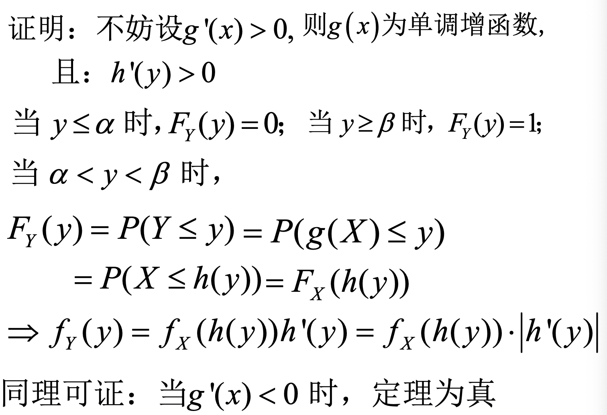
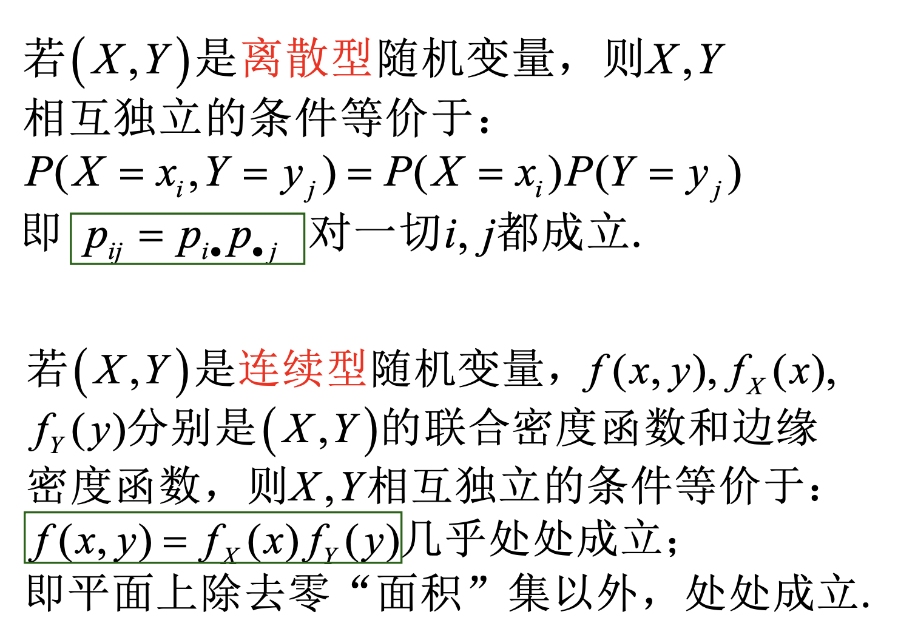
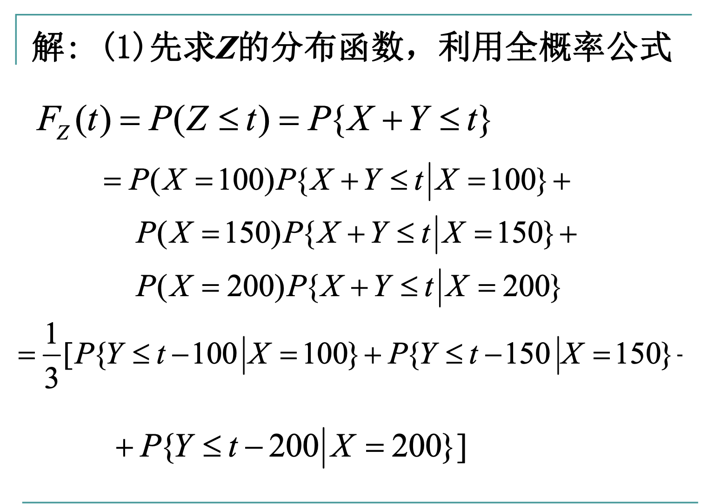

# 概率论与数理统计

## 第一章与第二章

|符号|分布|
|---|---|
|$N(\mu,\sigma)$|正态分布(**Normal**)|
|$U(a,b)$|均匀分布(**Uniform)**|
|$E(\lambda)$|指数分布(**Exponent**)|
|$P(\lambda)$|泊松分布(**Poisson**)|
|$B(n,p)$|二项分布(**Binomial**)|
|$H(n,a,N)$|超几何分布(**Hypergeometric**)|

<embed src="../笔记.pdf" width="600" height="800" type="application/pdf">

----

### 2.4 连续型随机变量及其密度函数

#### 2.4.3 正态分布

!!! note "标准正态分布"
    

    

    !!! warning "注意"
        - $\Phi(0) = 0.5, \Phi(x)+\Phi(-x)=1$

----

- 当我们用变量代换 $t = \frac{x-\mu}{\sigma}$时，得到的就是标准正态函数$\phi(t)$的积分，只不过变换了上下限

- $Y = \frac{x-\mu}{\sigma} \sim N(0,1)$

- $F(x) = \Phi(\frac{x-\mu}{\sigma})$

    

    

----

### 2.5 随机变量函数的分布

!!! abstract
    - 我们想要研究：当已知X的分布情况时，来求**Y=f(X)的分布情况**

    - 对于Y是离散量，则非常易求，列举即可

    - 对于Y是连续值，则先求**分布函数**，再求**密度函数**

---

!!! tip "Example-- $Y = X^2$"
    

    ??? note "答案"
        - 这个题我们已知X的密度函数和分布函数，对于Y来说，分布函数是易求的，密度函数可以由分布函数求导得到

        - 把Y的分布函数，改写成有关X的概率分布，然后结合X的分布函数得到具体的值

        
        

!!! tip "Example--不给出具体的密度函数"
    - 思路和上题是一样的，只不过用函数字母表示而已

    
    
    

----

!!! tip "由Y=g(X)间存在单调关系，来求Y的密度函数，存在**简易方法**"
    - $y=g(x)$在x的取值范围内严格单调，则存在反函数$h(y)=x$

    - 那么Y有密度函数 $f_Y(y)=f_X(h(y))\in|h'(y)|,y\belong (\alpha,\beta)$

    
    ??? note "证明"
        

    ??? note "在正态分布中的应用"
        
        

        - 这个挺好理解，均值肯定是**线性变化**的，而标准差**只与斜率有关**

-----

## 第三章

### 3.1 二元离散型随机变量

!!! abstract "三个概念"
    - **联合分布律，边际分布律，条件分布律**

=== "3.1.1 联合分布"
    

=== "3.1.2 边际分布"

    
    

=== "3.1.3 条件分布"

    
    

----

!!! tip "Example--用实际含义去理解三种分布"
    

    ??? note "答案"
        - 联合分布律的求法有点像二次分布，第X次和最后一次是击中，其余全是未击中

        - 边际分布律的求法可以说就是只考虑一个量，不去管另一个量

        - $P(X=m)$那就是第$m$次命中，前$(m-1)$次未中

        - $P(Y=n)$那就是第$n$次命中，然后前面的$(n-1)$次任选一次命中，然后余下的$(n-2)$次都没命中

        

### 3.2 二元随机变量的分布函数

=== "联合分布函数"

    

    

=== "边际分布函数"

    

=== "条件分布函数"

    
    

---

### 3.3 二元连续型随机变量

#### 联合概率密度函数

- 这是两个积分，**而非二重积分**

??? tip "几何意义"  
    - 分布函数就是，平面上给定f(x,y)函数，在约束条件里的二重积分面积

!!! tip "Example--$P(Y\leq X)$"
    

    - 求系数的时候，从负无穷积分到正无穷，结果为1，然后求解

    - 求分布函数，则从负无穷积分到(x,y)

    - 有两种切法，横着或者竖着切，

    ??? note "答案"
        

        

        ---

        
        
        $$
        \int_0^{\infty}dx\int_0^x f(x,y)dy
        $$

        
        
        $$
        \int_0^{\infty}dy\int_y^{\infty}f(x,y)dx
        $$
        
    
!!! tip "Example--与二重积分的几何意义联系"
    

    - 第一问就是红色区域的积分，有两种积法（横着或者竖着）

    - 第二问就是在x=0.5处划分，求右半面积

    - 第三问就是在y=0.5处划分，求下半面积

    - 第四问同理

    ??? note "答案"

        1. $\int_0^1dx\int_{x^2}^x f(x,y)dy$
        
        2和3略
        
        4. $\int_{1/2}^{\frac{\sqrt{2}}{2}}dx\int_{x^2}^{1/2}f(x,y)dy$

        
    
---

#### 边际概率密度函数

??? tip "续上例"    
    
    

#### 条件概率密度函数

??? note "证明"
    

!!! tip "性质"
    

!!! tip "Example--极致的例题"
    

    1. 根据两个均匀分布，可以写出x的密度函数$f_X(x)$，以及条件密度函数$f_{Y|X}(y|x)$，然后就能求出联合密度函数，最后求另一个条件密度函数

    2. 利用第一问求的条件密度函数，将Y=25代入，然后积分上下限就是0~10

    ??? note "答案"
        
        
        

---

#### 二元均匀分布

!!! tip "Example"
    

    

        

    - 在Y条件下, $X \sim U(|y|,1)$

#### 二元正态分布

？？？这一块要掌握吗？

### 3.4 随机变量的独立性

!!! tip "判断是否相互独立的定理"
    

??? note "Example--判断二维正态随机变量独立"    
    - 证明：对于二维正态随机变量（X,Y）,X与Y相互独立的充要条件是参数$\rho=0$

    - 必要条件特别简单

    - 充分条件的情况，由于这几个函数都是连续函数，连续函数相等，说明必须处处**相等**

    - 于是代入特殊点$f(\mu_1,\mu_2)=f_X(\mu_1)f_Y(\mu_2)$，得到$\rho=0$

---

!!! tip "多元随机变量相互独立"
    

    - 例子：$(X_1,X_2)与(Y_1,Y_2,Y_3)独立，那么根据定理可以得到(X_1+X_2)与(2Y_1+3Y_3)独立$

---

### 3.5 二元随机变量的函数的分布 

#### 3.5.1 Z=X+Y的分布

!!! tip "Example--泊松分布"
    - 设随机变量$X\sim P(\lambda_1),Y\sim P(\lambda_2)$，且X，Y相互独立，若$Z=X+Y$，求Z的概率分布律

    - 思路：把$Z=K$拆分成给定每个X，对应Y情况下的概率，再求和

    - 对于最后的求和结果，要敏锐观察，**提取无关的因数**，再考虑剩下的级数

    ??? tip "答案"
        $$
        \Sigma_{i=0}^k\frac{\lambda_i^i\lambda_2^i}{i!(k-i)!}
        $$

        - 注意这个式子极似**二项展开式**
        
        

---

**密度函数**

!!! tip "Example--正态分布的函数的密度函数"
    - 设X和Y都是相互独立的标准正态随机变量，求Z=X+Y的概率密度函数

    - 直接用卷积公式，注意计算过程中**凑正态分布的巧妙思想**

    ??? note "答案"
        

        - 我们先进行指数的配方，然后挪出常数$e^{-z^2/4}$

        - 对于剩下的部分$\int_Re^{-(x-z/2)^2}dx$，我们要去凑对应的正态分布！！！，因为凑出来后，整个定积分就是1

        - 分析出来$\mu=\frac{z}{2},\sigma=\frac{1}{2}$

        - 然后我们在前面添加$\frac{1}{\sqrt{2\pi}\times \sigma}$

!!! tip "Example--分段讨论的密度函数"
    === "题1"

        - 设X,Y独立，同服从[0,1]上的均匀分布，求Z=X+Y的概率密度函数

        ??? note "答案"
            === "方法一"
                

                - 注意：x同时满足两个不等式！！！，必须对z进行分段讨论！！！

                - 可以拿x-z图像来理解！！

            === "方法二"
                

                - 这里用x-y图像来理解，相当于画不同的直线

                - 从无->三角形->三角形+梯形（总面积扣去右上角的三角形）-> 1

    === "题2"
        

        

---

!!! tip "Example--X离散，Y连续"
    

    ??? note "答案"
        
        

---

#### 3.5.2 M=max{X,Y},N=min{X,Y}的分布

!!! tip "Example--综合"
    

    ??? note "答案"
        
        
        
        

---

## 第四章 随机变量的数字特征

### 4.1 数学期望

=== "离散型"
    !!! warning "E(X)必须收敛"

    $$
    E(X) = \Sigma_{k=1}^{\infty}x_kp_k
    $$

=== "连续型"
    !!! warning
        只有$\int_{-\infty}^{\infty}|x|f(x)dx < \infty$，则才有期望！！

    $$
    E(X) = \int_{-\infty}^{\infty}xf(x)dx
    $$

---

