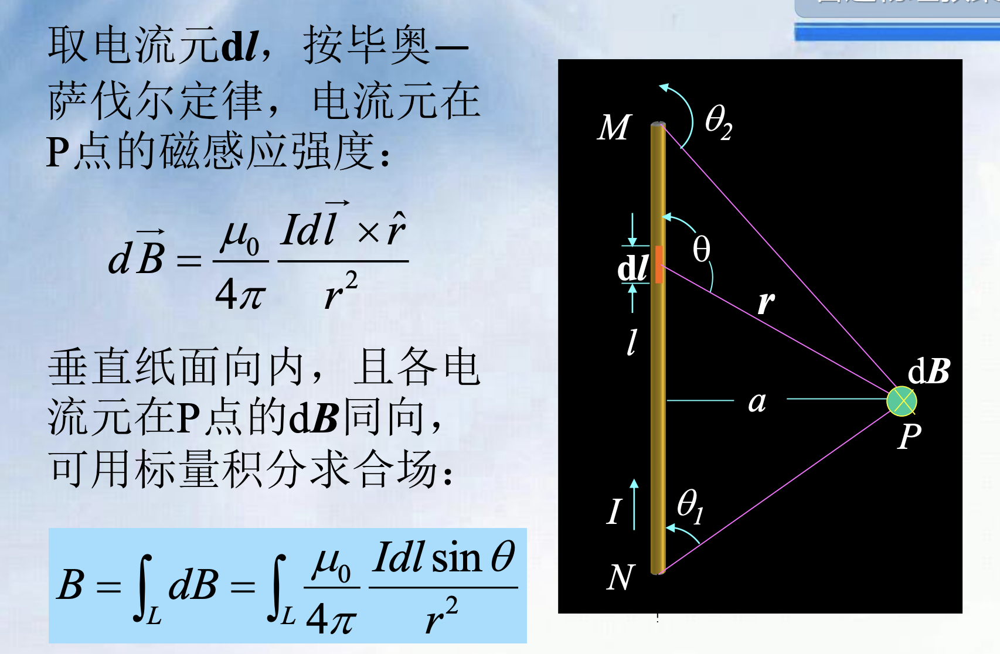

# 大学物理乙

## 静电场

### 电势

---

---

---

---

---

### 静电平衡

- （5）**球壳接地是一个完备的静电屏蔽系统**，内部带电体相当于不存在、不受力；或者理解成外表面的+q2都跑路了，然后外表面就变成了个干净球壳，于是又复刻了（4）的情况  

---

- （6）在（5）的基础上，这个系统已经平衡，此时拔不拔线都是**一样**的；此时再移去B球，那么壳**内部肯定是场强为0**，内表面负电荷-q2都跑到外表面，于是得到-q'-q2

----

- 先用电荷守恒，然后在对表面A，B点进行分析

----

  

- 先用**静电感应**，分析**内外表面**各自的带电量，然后再代入电势公式

---

### 电容

|类型|场强|电容|
|---|---|----|
|平行板电容器|$E=\frac{\sigma}{\epsilon_0}$|$C=\frac{\epsilon_0S}{d}$|
|球|$E=\frac{q}{4\pi\epsilon_0r^2}$|$U=\int_{R_A}^{R_B}Edr=\frac{q}{4\pi\epsilon_0}(\frac{1}{R_A}-\frac{1}{R_B})$ -> $C=\frac{q}{U}$|
|圆柱|$E=\frac{\lambda}{2\pi \epsilon_0 r}$|$U=\int_{R_A}^{R_B}Edr=\frac{\lambda}{2\pi\epsilon_0}ln\frac{R_B}{R_A}$ -> $C=\frac{q}{U}$|

  

- 第二小问，我们取同一θ角的圆环，这样环上的束缚电荷面密度相同，然后求出一个环对球心的场强，最后再积分得到整体

---

--

- 利用前面那道题的场强结论，直接得到极化电荷的E'，然后代入电极化强度

### 介质中的高斯定理&电位移矢量

$D = \epsilon_0\epsilon_r E=\epsilon E$
$P=D-\epsilon_0 E$

|两种高斯定理|公式|
|---|----|
|真空|$\oint E\cdot dS=\frac{1}{\epsilon_0}\Sigma q$|
|电介质|$\oint D\cdot dS=\Sigma q$|

!!! info
    涉及电介质就采用D和对应高斯定理，真空中就采用E和对应高斯定理
    
    

- 原理还是利用高斯定理，尝试去求出q'  

---

### 静电能

#### 点电荷

- 点电荷系统的静电能，两两之间计算再相加，$$W = \frac{1}{2}\sum_{i=1}^n q_iU_i $

- U是电势

#### 电荷连续分布（面/体）

- 还是运用上面的公式，之前是给定的$n$，现在变成了微元 -> 体/面

- $dq$ 再用体密度或者面密度代换为$\rho dV 或 \sigma dS$

- U是电势

#### 电容器的静电能

- 利用$W = Uq$ 推出每个微元$dq$的功，得到$dA = (U_A-U_B)dq = \frac{q}{C}dq$

- 再从0积分到Q

- $A = \frac{1}{2}\frac{Q^2}{C} = \frac{1}{2}CU^2$

#### 静电场的能量

- 把静电场看作匀强电场，然后电容就是等效于**对应电容器（平行板，球）**的电容

- $U = Ed$, $C = \epsilon \frac{S}{d}$, $W = \frac{1}{2}CU^2$

- 然后引入电场能量密度（单位体积）

- 常用 $\w_e=\frac{1}{2}DE$

-----

!!! note "球体的静电能"
    - 计算均匀带电**球体**的静电能，设球的半径为R，所带电量为q，球外为真空。

    ??? note "答案"
    - 先明确思路，用带体密度的静电场公式计算  

    - 然后$\rho$是易知的，下面就要计算电势U

    - 要计算球的各处的电势，就要知道电场分布，就用**高斯定理来求电场**

    - 然后用积分来求出电势（分球壳内、球壳外两段）

    - 最后代入静电能公式，进行积分
    
    
    
    

!!! note "通过静电能来分析电场力"
    

    ??? note "答案"
        - 通过静电能来分析电场力 -> 虽然不懂，但是记住
        
        - 这是个电容器，所以要求静电能的话，我们在已知Q的情况下，只需要求C就行了

        - 然后根据插入的位置不同，整个电容器的C是不同的，然后这还是一个**并联**的电容器，所以可以直接把左右两部分相加

        - 最后求出静电能 W关于x的函数，求导取负便是电场力的函数

        
        
        

!!! note "电介质中利用D、E求能量密度，再求静电能"
    
    

## 稳恒电流

- 载流子里特殊的类型：电子空穴对 -> **半导体P型（空穴）带正电**，**N型（电子）带负电**，在**霍尔效应**中会考察

- $I = \frac{dq}{dt}$是电流强度

- 电流在导体内部分布可能是不均匀的，再进行微观细分，引入电流密度$j = \frac{dI}{dS}$ （取**垂直于电流方向的面**）

- 和电子数的关系

## 磁场

### 洛伦兹力

- $F = qv \times B$，同高中

### 毕奥-萨伐尔定律

- $dB = \frac{\mu_0}{4\pi}\frac{Idlsin\theta}{r^2}$

#### 直导线的磁场

- 利用角度的一个积分

- 直接上结论，a是垂直距离

$$
B = \frac{\mu_0 I}{4\pi a}(cos\theta_1 - cos\theta_2)
$$

#### 载流圆线圈轴线上的磁场

!!! abstact
    $B=\frac{\mu_0 I R^2}{2(R^2+x^2)^{3/2}}$

- 先取微分，得到 $dB = \frac{\mu_0 Idl}{4 \pi r^2}$

- 然后这个dB还会分在垂直方向和水平方向上，垂直方向上的dB最后互相抵消了，剩下了水平方向上

- 最后进行一个积分

!!! tip "特殊地："
    - 圆心处
    
    $$
    B = \frac{\mu_0 I \theta}{4 \pi R}
    $$

    - 在轴线上远离圆线圈时

    $$
    B = \frac{\mu_0IR^2}{2x^3} = \frac{\mu_0IS}{2\pi x^3}
    $$

-----

!!! tip "利用二级结论后，继续微元积分的题目"
    - 第一步的dB微元，是因为这相当于一个电流大小为dI的无线长导线在P处产生的磁场

    - 复习：直导线$B=\frac{\mu_0I}{4\pi a}(cos\theta_1-cos\theta_2)$

    
    

####  磁偶极子的磁矩

- 引入磁矩$p_m$来描述载流线圈的磁性质

- $\vec{p_m}=NIS\vec{n}$，n是个单位矢量，n的方向与电流环绕方向呈右手螺旋关系；引入这个量其实就是后面方便表示电生磁的一些东西

- 于是在上一小节中得到的，有关载流圆线圈在轴线上远离线圈的磁场 $B = \frac{\mu_0IS}{2\pi x^3} = \frac{\mu_0p_m}{2\pi x^3}$

#### 载流直螺线管内部的磁场

- 螺线管可以看做是很多个载流圆线圈组成

- 于是我们在螺线管上取$dl$，相当于电流强度$Indl$的圆电流，$n$是单位长度上的匝数

- $dB = \frac{\mu_0IndlR^2}{2(R^2+l^2)^{3/2}}$

- 然后从引入角度量$\beta$，然后神奇地转化掉了很多量，得到最终微分$dB = -\frac{\mu_0}{2}Insin\beta d\beta$

- 最后从$\beta_1$积分到$\beta_2$，得到$B = \frac{\mu_0}{2}In(cos\beta_2 - cos\beta_1)$

----

### 磁场的高斯定理

!!! info "概念"
    - 磁通量 $d\Phi = Bcos\theta dS$

!!! note "磁场中的高斯定理"
    - 闭合曲面内的磁通量为0

    $$
    \oint B\cdot dS = 0 \\
    此处为闭合曲面积分，只是latex暂时打不出来
    $$

!!! tip "同一平面内**矩形框内的磁通量**的简单积分"
    - 求出距离r时的，dr宽度的矩形内的磁通量大小，然后再对距离积分

    
    

----

### 安培环路定理

!!! info
    
    $$
    \oint_L B\cdot dl = \mu_0 \Sigma I
    $$

    在磁场中，沿任何**闭合曲线**，B矢量的线积分（或B矢量的环流），等于$\mu_0$乘以穿过这个闭合曲线为边界所张任意**曲面的各恒定电流的代数和**。

 
#### 长直圆柱形载流导线内外的磁场

- 环路定理左边$\oint B\cdot dl = B\cdot 2\pi r$

- 然后分为三种情况

=== "当r > R"
    - 这种情况最简单，直接右边就是$\mu_0I$

    - 即$B = \frac{\mu_0I}{2\pi r}$

=== "当r < R且电流分布在导体表面"
    - 那么取得内部曲面也就没有电流，安培定理右边为0，B也就是0

=== "当r < R且电流均匀分布在导体的**截面**上"
    - 那么其实就是涉及到面密度了

    - 实际的I为$I\cdot \frac{\pi r^2}{\pi R^2}$

    - 所得磁场强度$B = \frac{\mu_0 I r}{2\pi R^2}$

----

-----

#### 载流螺旋环内的磁场

- 把一个载流螺旋管首尾相连，就得到了这么一个载流螺旋环；这里面有N个同心圆，r1是中心到圆内端的距离，r2是中心到圆外端的距离

- 于是，对于其中的一个点P，由环路定理可以得到$B\cdot 2\pi r = \mu_0NI$，即$B=\frac{\mu_0NI}{2\pi r}$

!!! tip "当r2-r1远小于r时"
    - 令$l=2\pi r$，则$B=\frac{\mu_0NI}{l}=\mu_0nI$

---

#### 载流长直螺线管内的磁场

---

### 磁场对电流的作用

#### 安培力

- $F=BILsin\theta$

!!! tip "平行长直载流导线间的相互作用力"
    - 相距为d的无限长直导线，电流分别为$I_1$，$I_2$

    - 那么他们产生的磁场大小作用在对方时 分别为$B_{12}=\frac{\mu_0I_1}{2\pi d}$，$B_{21}=\frac{\mu_0I_2}{2\pi d}$

    - 于是有导线2上的电流元受力$dF_{21} = B_{12}I_2dl \cdot sin(90°)$

---

#### 磁场对平面载流线圈的作用

- 我们容易发现作用在AD和BC上的安培力大小相等，方向相反，相互抵消；

- 但是对于在CD和AB上的力，$F_2=F_2'=BIl_2$；这两个力大小相等，方向相反，但是**不在同一直线上**，形成一**力偶**，力臂$l_1cos\theta$

- 力偶矩为:$M=F_2l_1cos\theta=BIl1l2cos\theta=BIScos\theta$

- 然后闲着蛋疼，非要拿磁矩表示

- $p_m = NIS$得到$\vec{M}=\vec{p_m}\times \vec{B}$

---

### 带电粒子在磁场中的运动

- 把带电粒子在磁场中的速度分解为两部分，一部分平行磁场，一部分垂直磁场

- 平行的部分匀速运动，垂直的速度导致作匀速圆周运动，二者叠加得到螺旋线

- $R = \frac{mv_{0n}}{qB}$

- 螺距$h=v_{0x}T = v_{0x}\frac{2\pi m}{qB}$

----

#### 质谱仪

- $qvB=qE, v=\frac{E}{B}$，速度是一定的

- 进入感应区，做圆周运动 $R=\frac{mv}{qB'}$ 便能得出质荷比

#### 回旋加速器

- 一直在缝隙间加速，最后最大动能和回旋半径有关 $E_k=\frac{1}{2}mv^2=\frac{1}{2m}q^2B^2R^2$

#### 同步回旋加速器

- 由于速度接近光速时，质量发生改变，那么运动时间会发生变化

- 最后就需要调整电压变化的频率

#### 霍耳效应

- 实验结果表明，霍尔电势差与I、B成正比，与厚度d成反比

- $U = V_1-V_2 = R_H\frac{IB}{d}$，$R_H$被称为霍尔系数

!!! warning "正负电荷的霍尔系数不同"
    - 对于负电荷（电子）：$R_H=-\frac{1}{ne}$，$n$是单位体积内的电子数量
    
    - 对于正电荷：$R_H=\frac{1}{nq}$

----

## 磁场中的磁介质

### 磁介质的分类

- 磁场中放一个介质，介质内的磁感应强度$B$为原来真空中的磁感应强度$B_0$和附加磁感应强度$B'$之和

- $B=B_0+B'$

- 分为三类

- 顺磁质：$B > B_0$ 抗磁质：$B < B_0$ 铁磁质：$B >> B_0$

---

### 顺磁质合抗磁质的磁化

- 深入到原子层面

- 电子绕核运动的回旋周期为：$T=\frac{2\pi r}{v}$

- 等效电流为：$I=dq/dt=e/T=\frac{ve}{2\pi r}$

- 又引入类似于载流线圈中的磁矩，轨道磁矩$\mu = IS=\frac{1}{2}ver$

- 同时，电子有做轨道运动的角动量$\vec{L}=\vec{r}\times\vec{p}=mvr\vec{n}$

- 又电子的角动量与磁矩反向，最终得到$\vec{\mu}=-\frac{e}{2m}\vec{L}$
